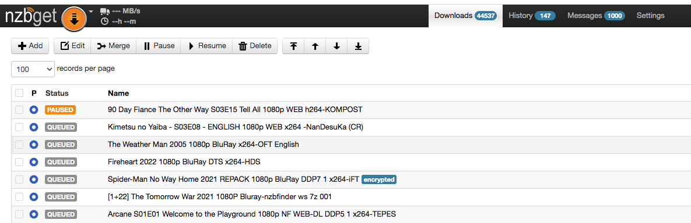
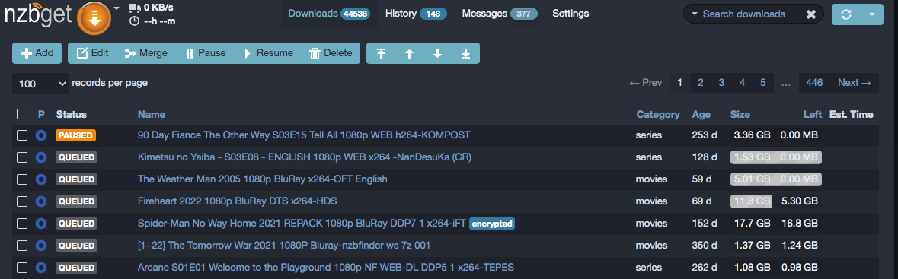
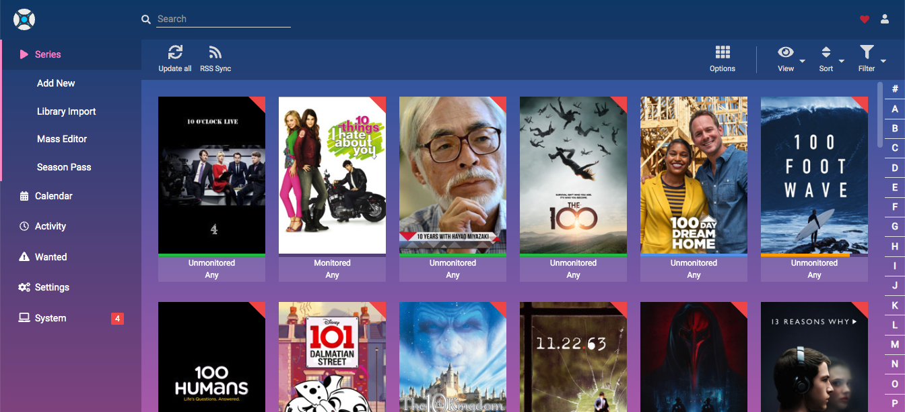

# Themepark Styles

Saltbox can apply themes from [ThemePark](https://docs.theme-park.dev/theme-options/) to supported applications through the inventory. Applications that can support `cont-init.d` scripts will utilize scripts that modify the CSS within the source files. Support is also available for additional apps via the [Traefik Plugin](https://github.com/packruler/traefik-themepark) which performs CSS replacement at the reverse proxy (rather than application) level.

Plugin note: You must run `sb install traefik` once after setting `global_themepark_plugin_enabled: "true"` in order to provision the theme middlewares.

For example:

NZBGet default appearance:




NZBGet with the "nord" theme:




Sonarr with the "hotline" theme:




Choose the theme and apply it to containers in in inventory:

```yaml
# global theme
global_themepark_theme: "nord"

# enable Traefik plugin
global_themepark_plugin_enabled: true

# apps using global theme:
container_name_themepark_enabled: true

# different theme for an app:
container_name_themepark_theme: hotline
container_name_themepark_enabled: true

```
for example, in `/srv/git/saltbox/inventories/host_vars/localhost.yml`:

```yaml
# Instructions on how to utilize this file can be found here https://docs.saltbox.dev/saltbox/inventory/

# global theme
global_themepark_theme: "nord"

# apps using global theme:
nzbget_themepark_enabled: true

# different theme for an app:
sonarr_themepark_theme: "hotline"
sonarr_themepark_enabled: true

# enable Traefik plugin
global_themepark_plugin_enabled: true

# apps using Traefik plugin
plex_themepark_enabled: true
nzbhydra2_themepark_enabled: true
```

Available themes can be found [here](https://docs.theme-park.dev/theme-options/).  Refer to them in the inventory file by name:

```
organizr
dark
dracula
aquamarine
space gray
plex
hotline
hotpink
overseerr
nord
maroon
```

Note: If you are utilizing Theme.Park on any roles, you must run `sb install traefik` after changing any themes via inventory variables.
