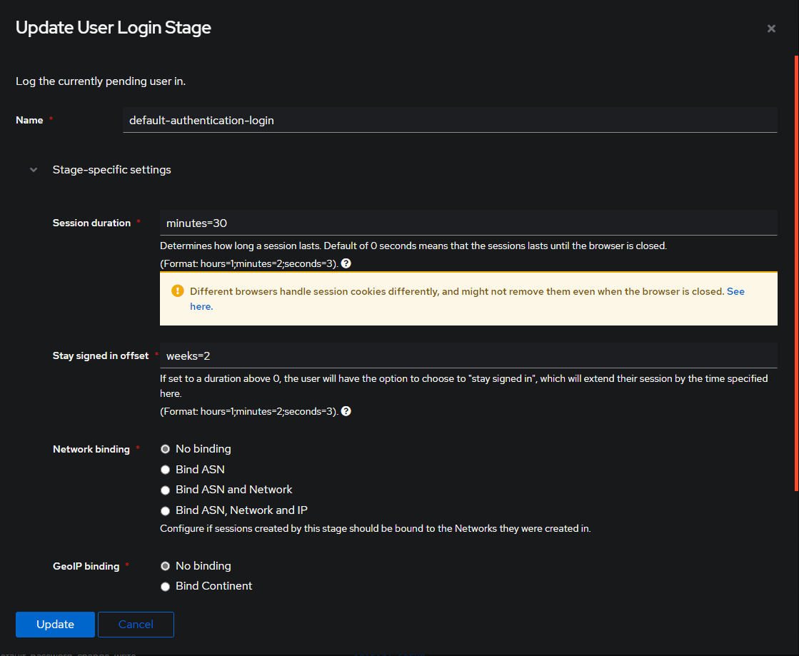
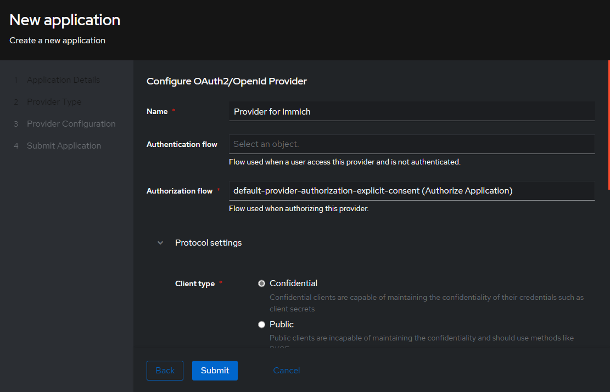
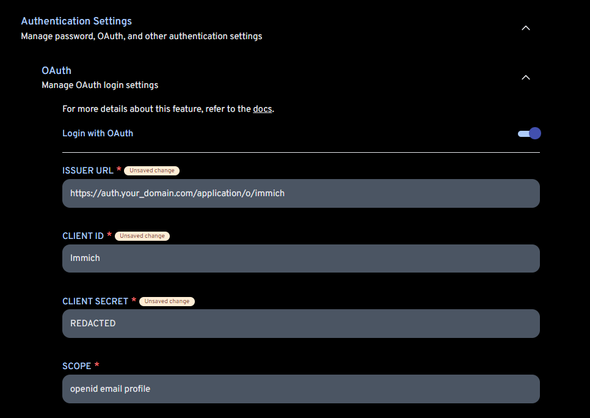

---
hide:
  - tags
tags:
  - authentik
---

# Authentik

## What is it?

[Authentik](https://goauthentik.io/) is an IdP (Identity Provider) and SSO (single sign on) that is built with security at the forefront of every piece of code, every feature, with an emphasis on flexibility and versatility. It supports all of the major providers, such as OAuth2, SAML, LDAP, and SCIM, so you can pick the protocol that you need for each application.

| Details     |             |             |             |
|-------------|-------------|-------------|-------------|
| [:material-home: Project home](https://goauthentik.io/){: .header-icons } | [:octicons-link-16: Docs](https://docs.goauthentik.io/docs/){: .header-icons } | [:octicons-mark-github-16: Github](https://github.com/goauthentik/authentik){: .header-icons } | [:material-docker: Docker](https://hub.docker.com/r/beryju/authentik){: .header-icons }|

### 1. Installation

``` shell

sb install authentik

```

### 2. URL

- To access Authentik, visit `https://auth._yourdomain.com_`

### 3. Setup

!!! info

    ``` yaml title="Default Login"

        user: saltbox_user # (1)!
        password: saltbox_password # (2)!

    ```

    1. Replace `saltbox_user` with the username you set when installing Saltbox.
    2. Replace `saltbox_password` with the password you set when installing Saltbox.

To enable Authentik with a single container, or on a per role basis, set the following [inventory](../saltbox/inventory/index.md) entry:

``` yaml title="Authentik Single Container Toggle"

radarr_traefik_sso_middleware: "authentik@docker"

```

To enable Authentik globally, set the following [inventory](../saltbox/inventory/index.md) entry:

``` yaml title="Authentik Global Toggle"

traefik_default_sso_middleware: "authentik@docker"

```

You would use one or the other, the global toggle will install Authentik together with Traefik when it is being installed, the role toggle requires manually installing Authentik. Traefik needs to be reinstalled at least once after updating to deploy the Authentik middleware to enable use of it. If you are using the global toggle, you will need to reinstall all of the other roles you use to enable Authentik.

To set up Authentik similarly to how we have [Authelia](../apps/authelia.md) set up, follow these steps:

After logging in, you will be greeted with the dashboard. Click on the `Admin Interface` button in the top right corner.

Click on the `Flows and Stages` drop down and select `Stages`.

Locate the `default-authentication-login` stage and click the `Edit` button. (Far right)

- Below you will see the default User Login Stage info.

    

You can change these values to anything you want, but for this example, we will change the `Session Duration` to `minutes=30` and the `Stay Signed in Offset` to `weeks=2`.

- Below you will see the updated User Login Stage info.

    

### 4. Additional Settings

To enable email notifications, set these [inventory](../saltbox/inventory/index.md) entries to your desired values:

``` yaml title="Authentik Email Settings"

authentik_email_host: "localhost" # (1)!
authentik_email_port: "25" # (2)!
authentik_email_username: "" # (3)!
authentik_email_password: "" # (4)!
authentik_email_tls: "false"
authentik_email_ssl: "false"
authentik_email_timeout: "10" # (5)!
authentik_email_from: "authentik@localhost" # (6)!

```

1. Replace `localhost` with your email host. IE: `smtp-relay.gmail.com`
2. Replace `25` with your email port. IE: `587`
3. Replace `""` with your email username if necessary.
4. Replace `""` with your email password if necessary.
5. Replace `10` with your email timeout in seconds.
6. Replace `authentik@localhost` with your email from email address. IE: `Authentik <noreply@your_domain.com>`

Redeploy the Authentik role to apply these changes.

### 5. IDP/OIDC Configuration

To configure Authentik as an IDP (Identity Provider) or OIDC (OpenID Connect) provider, follow these steps:

Click on the `Admin Interface` button in the top right corner.

Locate the `Applications` tab on the left panel and click on it.

Near the center of the screen select the blue `Create With Wizard` button.

- Below you will see the `Create Application` screen.

    

On the next screen select the `Oauth2/OIDC` option. (This will be the first option)

In this example, on the `Configure OAuth2/OpenId Provider` screen, only the required fields will be filled.

- Below you will see the `Configure OAuth2` screen.

    

Under the `Protocol Settings` section, fill in the following fields:

- `Client ID`: `immich` (This can be anything you want, and is auto filled in. You can change it if you want)
- `Client Secret`: Its probably best to leave this as is, but you can change it if you want.
- `Redirect URI/Origins`:
  - `https://immich.your_domain.com/auth/login`
  - `https://immich.your_domain.com/user-settings`
  - `app.immich:/`

#### OIDC Configuration Example

In the screenshot below, you can see how the [Immich](../sandbox/apps/immich.md) application is configured to use Authentik as an OIDC provider.



The only other field you need to concern yourself with is the `Mobile Redirect URI`, which is `https://immich.your_domain.com/api/oauth/mobile-redirect`.

- [:octicons-link-16: Authentik Docs](https://docs.goauthentik.io/docs/){: .header-icons }

## Inventory
<!-- BEGIN SALTBOX MANAGED VARIABLES SECTION -->
<!-- This section is managed by saltbox/test.py - DO NOT EDIT MANUALLY -->
!!! info
    Variables can be overridden in `/srv/git/saltbox/inventories/host_vars/localhost.yml`.


    === "Example"

        ```yaml
        authentik_name: "custom_value"
        ```

!!! warning
    **Avoid overriding variables ending in `_default`**

    When overriding variables that end in `_default` (like `{role}_docker_envs_default`), you replace the entire default configuration. Future updates that add new default values will not be applied to your setup, potentially breaking functionality.

    Instead, use the corresponding `_custom` variable (like `{role}_docker_envs_custom`) to add your changes. Custom values are merged with defaults, ensuring you receive updates.

??? example "Basics"

    ```yaml
    # Type: string
    authentik_name: authentik

    ```

??? example "Settings"

    ```yaml
    # Type: string
    authentik_role_email_host: "localhost"

    # Type: string
    authentik_role_email_port: "25"

    # Type: string
    authentik_role_email_username: ""

    # Type: string
    authentik_role_email_password: ""

    # Type: string
    authentik_role_email_tls: "false"

    # Type: string
    authentik_role_email_ssl: "false"

    # Type: string
    authentik_role_email_timeout: "10"

    # Type: string
    authentik_role_email_from: "authentik@localhost"

    # Type: string
    authentik_role_access_token_validity: "24" # Hours, only fresh installs use this

    ```

??? example "Redis"

    ```yaml
    # Type: string
    authentik_role_redis_name: "{{ authentik_name }}-redis"

    # Type: dict
    authentik_role_redis_docker_healthcheck: 
      interval: 30s
      retries: 5
      start_period: 20s
      test: ["CMD-SHELL", "redis-cli ping | grep PONG"]
      timeout: 3s

    ```

??? example "Postgres"

    ```yaml
    # Authentik will always require postgres, this just allows you to skip the one Saltbox deploys
    # Type: bool (true/false)
    authentik_role_postgres_deploy: true

    # Type: string
    authentik_role_postgres_name: "{{ authentik_name }}-postgres"

    # Type: string
    authentik_role_postgres_user: "{{ postgres_role_docker_env_user }}"

    # Type: string
    authentik_role_postgres_password: "{{ postgres_role_docker_env_password }}"

    # Type: string
    authentik_role_postgres_docker_env_db: "authentik"

    # Type: string
    authentik_role_postgres_docker_image_tag: "16-alpine"

    # Type: string
    authentik_role_postgres_docker_image_repo: "postgres"

    # Type: dict
    authentik_role_postgres_docker_healthcheck: 
      test: ["CMD-SHELL", "pg_isready -d {{ lookup('role_var', '_postgres_docker_env_db', role='authentik') }} -U {{ postgres_role_docker_env_user }}"]
      start_period: 20s
      interval: 30s
      retries: 5
      timeout: 5s

    ```

??? example "Paths"

    ```yaml
    # Type: string
    authentik_role_paths_folder: "{{ authentik_name }}"

    # Type: string
    authentik_role_paths_location: "{{ server_appdata_path }}/{{ authentik_role_paths_folder }}"

    ```

??? example "Web"

    ```yaml
    # Type: string
    authentik_role_web_subdomain: "auth"

    # Type: string
    authentik_role_web_domain: "{{ user.domain }}"

    # Type: string
    authentik_role_web_port: "9000"

    # Type: string
    authentik_role_web_url: "{{ 'https://' + (lookup('role_var', '_web_subdomain', role='authentik') + '.' + lookup('role_var', '_web_domain', role='authentik')
                             if (lookup('role_var', '_web_subdomain', role='authentik') | length > 0)
                             else lookup('role_var', '_web_domain', role='authentik')) }}"

    # Type: string
    authentik_role_web_host: "{{ (lookup('role_var', '_web_subdomain', role='authentik') + '.' + lookup('role_var', '_web_domain', role='authentik')
                              if (lookup('role_var', '_web_subdomain', role='authentik') | length > 0)
                              else lookup('role_var', '_web_domain', role='authentik')) }}"

    ```

??? example "DNS"

    ```yaml
    # Type: string
    authentik_role_dns_record: "{{ lookup('role_var', '_web_subdomain', role='authentik') }}"

    # Type: string
    authentik_role_dns_zone: "{{ lookup('role_var', '_web_domain', role='authentik') }}"

    # Type: bool (true/false)
    authentik_role_dns_proxy: "{{ dns_proxied }}"

    ```

??? example "Traefik"

    ```yaml
    # Type: string
    authentik_role_traefik_sso_middleware: ""

    # Type: string
    authentik_role_traefik_middleware_default: "{{ traefik_default_middleware }}"

    # Type: string
    authentik_role_traefik_middleware_custom: ""

    # Type: string
    authentik_role_traefik_certresolver: "{{ traefik_default_certresolver }}"

    # Type: bool (true/false)
    authentik_role_traefik_enabled: true

    # Type: bool (true/false)
    authentik_role_traefik_api_enabled: false

    # Type: string
    authentik_role_traefik_api_endpoint: ""

    # Type: bool (true/false)
    authentik_role_traefik_outpost_catch_all: false

    ```

??? example "Setup"

    ```yaml
    # Type: string
    authentik_role_host: "http://{{ authentik_name }}:{{ lookup('role_var', '_web_port', role='authentik') }}"

    # Type: string
    authentik_role_default_user: "akadmin"

    # Type: list
    authentik_role_response_headers: 
      - "X-authentik-username"
      - "X-authentik-groups"
      - "X-authentik-entitlements"
      - "X-authentik-email"
      - "X-authentik-name"
      - "X-authentik-uid"
      - "X-authentik-jwt"
      - "X-authentik-meta-jwks"
      - "X-authentik-meta-outpost"
      - "X-authentik-meta-provider"
      - "X-authentik-meta-app"
      - "X-authentik-meta-version"

    ```

??? example "Docker"

    ```yaml
    # Container
    # Type: string
    authentik_role_docker_container: "{{ authentik_name }}"

    # Image
    # Type: bool (true/false)
    authentik_role_docker_image_pull: true

    # Type: string
    authentik_role_docker_image_repo: "ghcr.io/goauthentik/server"

    # Type: string
    authentik_role_docker_image_tag: "2025.8"

    # Type: string
    authentik_role_docker_image: "{{ lookup('role_var', '_docker_image_repo', role='authentik') }}:{{ lookup('role_var', '_docker_image_tag', role='authentik') }}"

    # Envs
    # Type: dict
    authentik_role_docker_envs_default: 
      AUTHENTIK_REDIS__HOST: authentik-redis
      AUTHENTIK_POSTGRESQL__HOST: "{{ lookup('role_var', '_postgres_name', role='authentik') }}"
      AUTHENTIK_POSTGRESQL__USER: "{{ lookup('role_var', '_postgres_user', role='authentik') }}"
      AUTHENTIK_POSTGRESQL__NAME: "{{ lookup('role_var', '_postgres_docker_env_db', role='authentik') }}"
      AUTHENTIK_POSTGRESQL__PASSWORD: "{{ lookup('role_var', '_postgres_password', role='authentik') }}"
      AUTHENTIK_SECRET_KEY: "{{ authentik_saltbox_facts.facts.secret_key }}"
      AUTHENTIK_BOOTSTRAP_TOKEN: "{{ omit if authentik_data_folder.stat.exists else authentik_bootstrap_token }}"
      AUTHENTIK_EMAIL__HOST: "{{ lookup('role_var', '_email_host', role='authentik') }}"
      AUTHENTIK_EMAIL__PORT: "{{ lookup('role_var', '_email_port', role='authentik') }}"
      AUTHENTIK_EMAIL__USERNAME: "{{ lookup('role_var', '_email_username', role='authentik') }}"
      AUTHENTIK_EMAIL__PASSWORD: "{{ lookup('role_var', '_email_password', role='authentik') }}"
      AUTHENTIK_EMAIL__USE_TLS: "{{ lookup('role_var', '_email_tls', role='authentik') }}"
      AUTHENTIK_EMAIL__USE_SSL: "{{ lookup('role_var', '_email_ssl', role='authentik') }}"
      AUTHENTIK_EMAIL__TIMEOUT: "{{ lookup('role_var', '_email_timeout', role='authentik') }}"
      AUTHENTIK_EMAIL__FROM: "{{ lookup('role_var', '_email_from', role='authentik') }}"
      AUTHENTIK_LISTEN__TRUSTED_PROXY_CIDRS: "172.19.0.0/16"

    # Type: dict
    authentik_role_docker_envs_custom: {}

    # Commands
    # Type: list
    authentik_role_docker_commands_default: 
      - "server"

    # Type: list
    authentik_role_docker_commands_custom: []

    # Volumes
    # Type: list
    authentik_role_docker_volumes_default: 
      - "{{ authentik_role_paths_location }}/media:/media"
      - "{{ authentik_role_paths_location }}/custom-templates:/templates"

    # Type: list
    authentik_role_docker_volumes_custom: []

    # Labels
    # Type: dict
    authentik_role_docker_labels_default: 
      traefik.http.routers.authentik-outpost-http.entrypoints: "web"
      traefik.http.routers.authentik-outpost-http.service: "authentik-outpost-http"
      traefik.http.routers.authentik-outpost-http.rule: "PathPrefix(`/outpost.goauthentik.io/`)"
      traefik.http.routers.authentik-outpost-http.middlewares: "{{ traefik_default_middleware_http }}"
      traefik.http.routers.authentik-outpost-http.priority: "99"
      traefik.http.routers.authentik-outpost.entrypoints: "websecure"
      traefik.http.routers.authentik-outpost.service: "authentik-outpost"
      traefik.http.routers.authentik-outpost.rule: "PathPrefix(`/outpost.goauthentik.io/`)"
      traefik.http.routers.authentik-outpost.tls.options: "securetls@file"
      traefik.http.routers.authentik-outpost.tls.certresolver: "{{ authentik_role_traefik_certresolver }}"
      traefik.http.routers.authentik-outpost.middlewares: "{{ traefik_default_middleware }}"
      traefik.http.routers.authentik-outpost.priority: "99"
      traefik.http.services.authentik-outpost-http.loadbalancer.server.port: "{{ lookup('role_var', '_web_port', role='authentik') }}"
      traefik.http.services.authentik-outpost.loadbalancer.server.port: "{{ lookup('role_var', '_web_port', role='authentik') }}"

    # Type: dict
    authentik_role_docker_labels_custom: {}

    # Hostname
    # Type: string
    authentik_role_docker_hostname: "{{ authentik_name }}"

    # Networks
    # Type: string
    authentik_role_docker_networks_alias: "{{ authentik_name }}"

    # Type: list
    authentik_role_docker_networks_default: []

    # Type: list
    authentik_role_docker_networks_custom: []

    # Restart Policy
    # Type: string
    authentik_role_docker_restart_policy: unless-stopped

    # State
    # Type: string
    authentik_role_docker_state: started

    # Dependencies
    # Type: string
    authentik_role_depends_on: "{{ authentik_name }}-redis,{{ lookup('role_var', '_postgres_name', role='authentik') }}"

    # Type: string
    authentik_role_depends_on_delay: "0"

    # Type: string
    authentik_role_depends_on_healthchecks: "true"


    # ---- Additional Docker Options ----
    # The following advanced options are available via create_docker_container
    # but are not defined in the role. See:
    # https://docs.ansible.com/ansible/latest/collections/community/docker/docker_container_module.html

    # Resource Limits
    # Type: int
    authentik_role_docker_blkio_weight:

    # Type: int
    authentik_role_docker_cpu_period:

    # Type: int
    authentik_role_docker_cpu_quota:

    # Type: int
    authentik_role_docker_cpu_shares:

    # Type: string
    authentik_role_docker_cpus:

    # Type: string
    authentik_role_docker_cpuset_cpus:

    # Type: string
    authentik_role_docker_cpuset_mems:

    # Type: string
    authentik_role_docker_kernel_memory:

    # Type: string
    authentik_role_docker_memory:

    # Type: string
    authentik_role_docker_memory_reservation:

    # Type: string
    authentik_role_docker_memory_swap:

    # Type: int
    authentik_role_docker_memory_swappiness:


    # Security & Devices
    # Type: list
    authentik_role_docker_cap_drop:

    # Type: list
    authentik_role_docker_device_cgroup_rules:

    # Type: list
    authentik_role_docker_device_read_bps:

    # Type: list
    authentik_role_docker_device_read_iops:

    # Type: list
    authentik_role_docker_device_requests:

    # Type: list
    authentik_role_docker_device_write_bps:

    # Type: list
    authentik_role_docker_device_write_iops:

    # Type: list
    authentik_role_docker_devices:

    # Type: string
    authentik_role_docker_devices_default:

    # Type: bool (true/false)
    authentik_role_docker_privileged:

    # Type: list
    authentik_role_docker_security_opts:


    # Networking
    # Type: list
    authentik_role_docker_dns_opts:

    # Type: list
    authentik_role_docker_dns_search_domains:

    # Type: list
    authentik_role_docker_dns_servers:

    # Type: dict
    authentik_role_docker_hosts:

    # Type: string
    authentik_role_docker_hosts_use_common:

    # Type: string
    authentik_role_docker_network_mode:


    # Storage
    # Type: bool (true/false)
    authentik_role_docker_keep_volumes:

    # Type: list
    authentik_role_docker_mounts:

    # Type: string
    authentik_role_docker_volume_driver:

    # Type: list
    authentik_role_docker_volumes_from:

    # Type: string
    authentik_role_docker_volumes_global:

    # Type: string
    authentik_role_docker_working_dir:


    # Monitoring & Lifecycle
    # Type: dict
    authentik_role_docker_healthcheck:

    # Type: bool (true/false)
    authentik_role_docker_init:

    # Type: string
    authentik_role_docker_log_driver:

    # Type: dict
    authentik_role_docker_log_options:

    # Type: bool (true/false)
    authentik_role_docker_output_logs:


    # Other Options
    # Type: bool (true/false)
    authentik_role_docker_auto_remove:

    # Type: list
    authentik_role_docker_capabilities:

    # Type: string
    authentik_role_docker_cgroup_parent:

    # Type: string
    authentik_role_docker_cgroupns_mode:

    # Type: bool (true/false)
    authentik_role_docker_cleanup:

    # Type: string
    authentik_role_docker_create_timeout:

    # Type: string
    authentik_role_docker_domainname:

    # Type: string
    authentik_role_docker_entrypoint:

    # Type: string
    authentik_role_docker_env_file:

    # Type: list
    authentik_role_docker_exposed_ports:

    # Type: string
    authentik_role_docker_force_kill:

    # Type: list
    authentik_role_docker_groups:

    # Type: int
    authentik_role_docker_healthy_wait_timeout:

    # Type: string
    authentik_role_docker_ipc_mode:

    # Type: string
    authentik_role_docker_kill_signal:

    # Type: string
    authentik_role_docker_labels_use_common:

    # Type: list
    authentik_role_docker_links:

    # Type: bool (true/false)
    authentik_role_docker_oom_killer:

    # Type: int
    authentik_role_docker_oom_score_adj:

    # Type: bool (true/false)
    authentik_role_docker_paused:

    # Type: string
    authentik_role_docker_pid_mode:

    # Type: list
    authentik_role_docker_ports:

    # Type: bool (true/false)
    authentik_role_docker_read_only:

    # Type: bool (true/false)
    authentik_role_docker_recreate:

    # Type: int
    authentik_role_docker_restart_retries:

    # Type: string
    authentik_role_docker_runtime:

    # Type: string
    authentik_role_docker_shm_size:

    # Type: int
    authentik_role_docker_stop_timeout:

    # Type: dict
    authentik_role_docker_storage_opts:

    # Type: list
    authentik_role_docker_sysctls:

    # Type: list
    authentik_role_docker_tmpfs:

    # Type: list
    authentik_role_docker_ulimits:

    # Type: string
    authentik_role_docker_user:

    # Type: string
    authentik_role_docker_userns_mode:

    # Type: string
    authentik_role_docker_uts:

    ```

??? example "Global Override Options"

    ```yaml
    # Enable or disable Autoheal monitoring for the container created when deploying
    # Type: bool (true/false)
    authentik_role_autoheal_enabled: true

    # List of container dependencies that must be running before the container start
    # Type: string
    authentik_role_depends_on: ""

    # Delay in seconds before starting the container after dependencies are ready
    # Type: string (quoted number)
    authentik_role_depends_on_delay: "0"

    # Enable healthcheck waiting for container dependencies
    # Type: string ("true"/"false")
    authentik_role_depends_on_healthchecks:

    # Enable or disable Diun update notifications for the container created when deploying
    # Type: bool (true/false)
    authentik_role_diun_enabled: true

    # Enable or disable automatic DNS record creation for the container
    # Type: bool (true/false)
    authentik_role_dns_enabled: true

    # Enable or disable Saltbox Docker Controller management for the container
    # Type: bool (true/false)
    authentik_role_docker_controller: true

    # Enable Traefik autodetect middleware for the container
    # Type: bool (true/false)
    authentik_role_traefik_autodetect_enabled: false

    # Enable CrowdSec middleware for the container
    # Type: bool (true/false)
    authentik_role_traefik_crowdsec_enabled: false

    # Enable custom error pages middleware for the container
    # Type: bool (true/false)
    authentik_role_traefik_error_pages_enabled: false

    # Enable gzip compression middleware for the container
    # Type: bool (true/false)
    authentik_role_traefik_gzip_enabled: false

    # Enable robots.txt middleware for the container
    # Type: bool (true/false)
    authentik_role_traefik_robot_enabled: true

    # Enable Tailscale-specific Traefik configuration for the container
    # Type: bool (true/false)
    authentik_role_traefik_tailscale_enabled: false

    # Enable wildcard certificate for the container
    # Type: bool (true/false)
    authentik_role_traefik_wildcard_enabled: true

    # Override the Traefik fully qualified domain name (FQDN) for the container
    # Type: string
    authentik_role_web_fqdn_override:

    # Override the Traefik web host configuration for the container
    # Type: string
    authentik_role_web_host_override:

    # URL scheme to use for web access to the container
    # Type: string ("http"/"https")
    authentik_role_web_scheme:

    ```

<!-- END SALTBOX MANAGED VARIABLES SECTION -->
