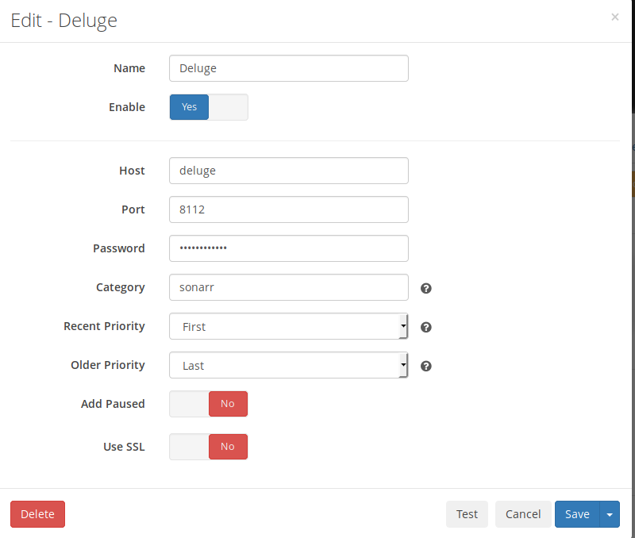

# Deluge

## What is it?

[Deluge](https://deluge-torrent.org/){: target=_blank rel="noopener noreferrer" } is a torrent client that can be used as an alternative to qbittorrent.

| Details     |             |             |             |
|-------------|-------------|-------------|-------------|
| [:material-home: Project home](https://deluge-torrent.org/){: .header-icons target=_blank rel="noopener noreferrer" } | [:octicons-link-16: Docs](https://dev.deluge-torrent.org/wiki/UserGuide){: .header-icons target=_blank rel="noopener noreferrer" } | [:octicons-mark-github-16: Github](https://git.deluge-torrent.org/deluge){: .header-icons target=_blank rel="noopener noreferrer" } | [:material-docker: Docker](https://registry.hub.docker.com/r/linuxserver/deluge){: .header-icons target=_blank rel="noopener noreferrer" }|

### 1. Installation

``` { .shell }

sb install deluge

```

### 2. URL

- To access Deluge, visit `https://deluge._yourdomain.com_`

!!! info
    **default login**

```yaml
        user: admin
    password: deluge
```

### 3. Setup

- Change login password.

- Click Preferences in the top bar and on the Downloads section enter the following paths: <br />
  - Download to: <br />
    `/mnt/unionfs/downloads/torrents/deluge/incoming`
  - Move completed to: <br />
    `/mnt/unionfs/downloads/torrents/deluge/completed`
  - Autoadd `.torrent files` from: <br />
    `/mnt/unionfs/downloads/torrents/deluge/watched`

- Select Network section, uncheck `Use Random Ports` under Incoming Ports and set both input fields to `58112`.

- Click the `Plugins` section
  - enable the `labels` plugin.
  - enable and the `Extractor` plugin. <br />
      In order for Sonarr or Radarr to import media packaged within .rar files, they will have to be extracted.
  - After clicking `"Apply"`, select the `Extractor`  plugin on the left. <br />
      Make sure the directory points to the `completed` folder within your Deluge data directory.  <br />
      `/mnt/unionfs/downloads/torrents/deluge/completed` <br />
      Also, make sure that the Create torrent name sub-folder setting is checked.

### 4. Adding to Sonarr/Radarr

To add Deluge as a download client in Sonarr/Radarr use the following settings. Both are able to remove completed torrents after they have finished seeding.

  

- [:octicons-link-16: Documentation](https://dev.deluge-torrent.org/wiki/UserGuide){: .header-icons target=_blank rel="noopener noreferrer" }
