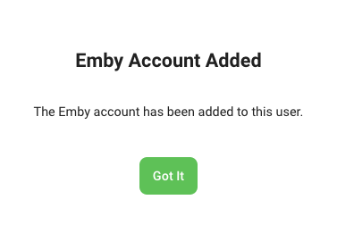
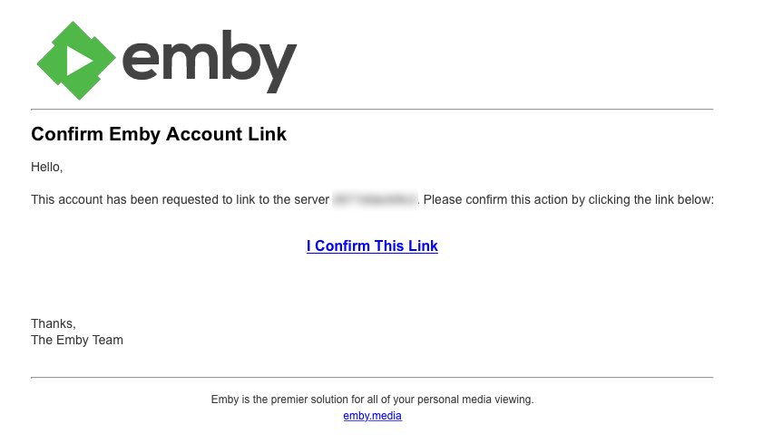
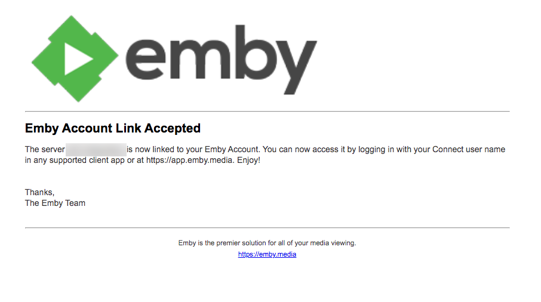
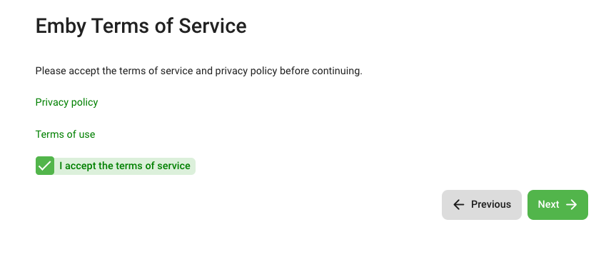
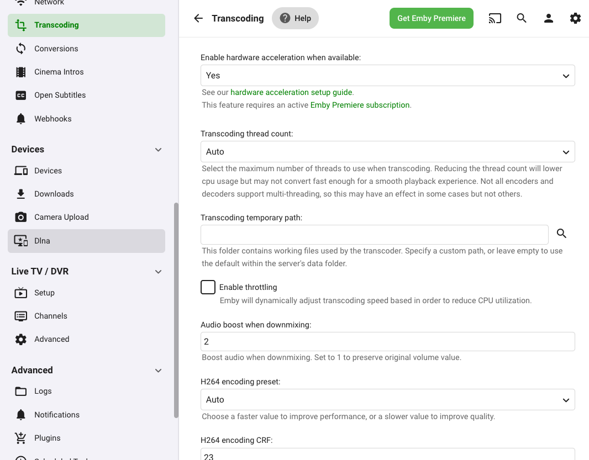
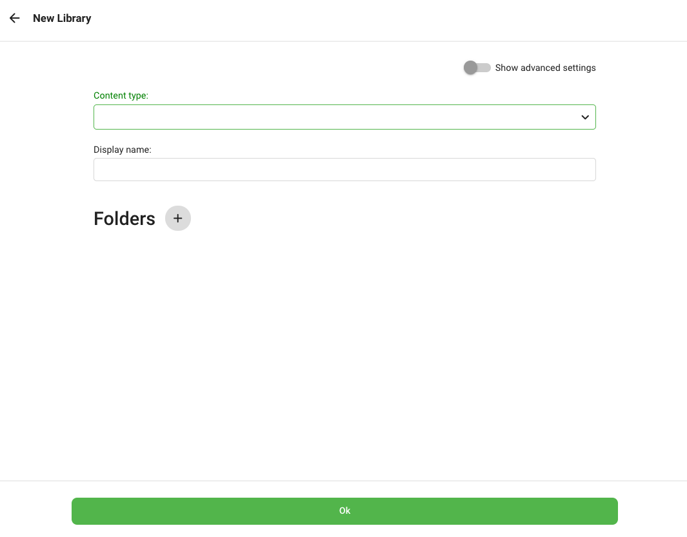
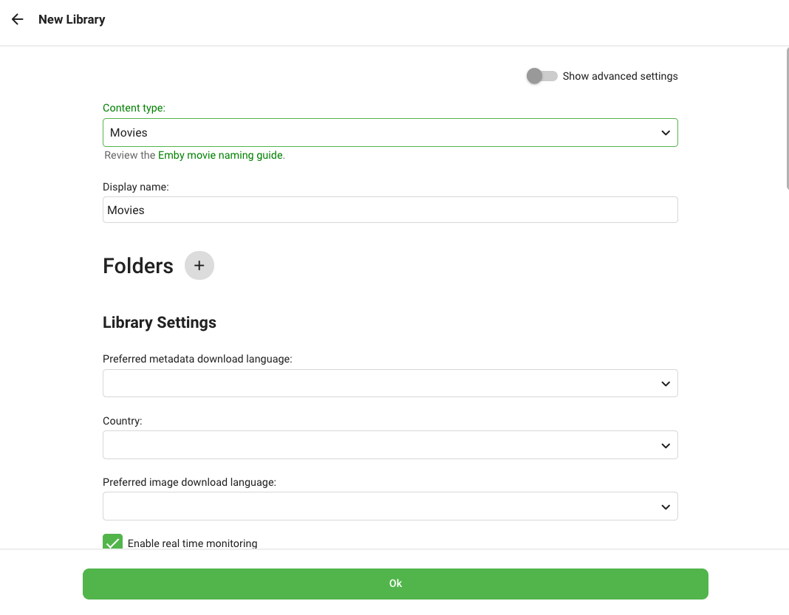
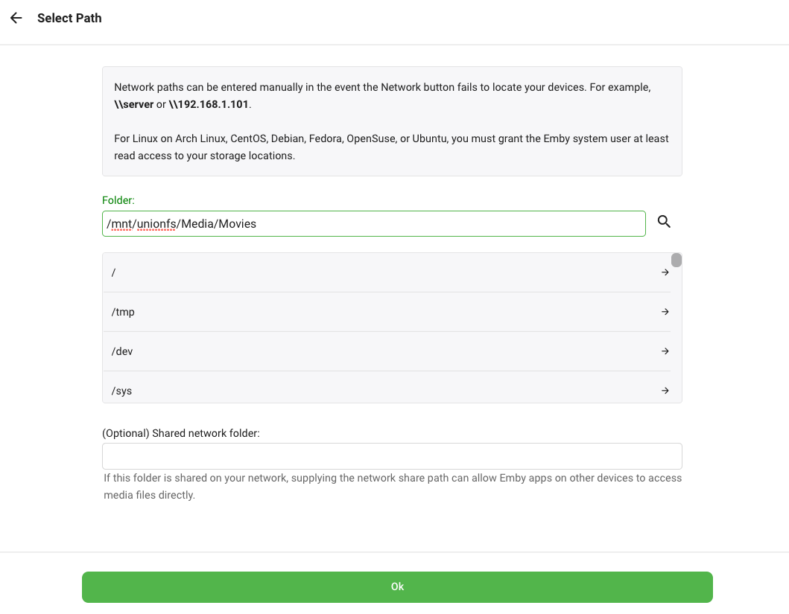
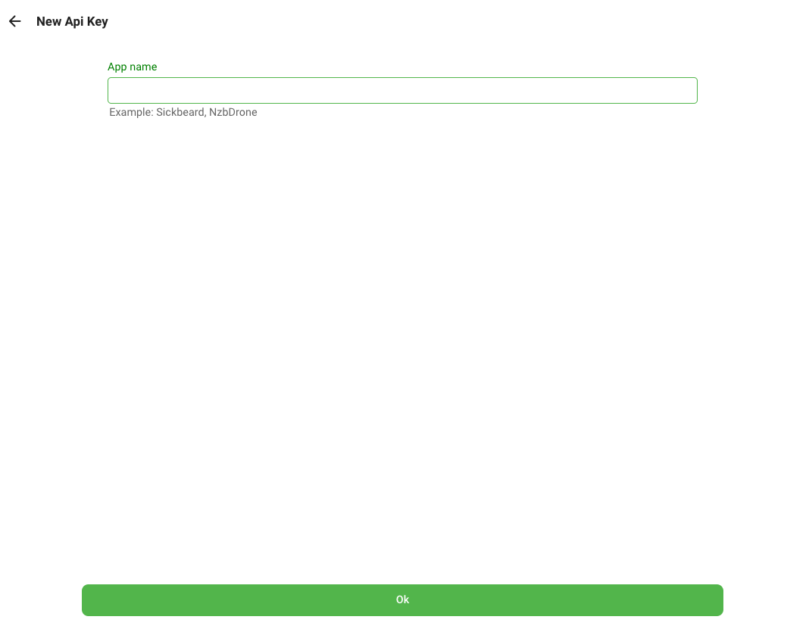
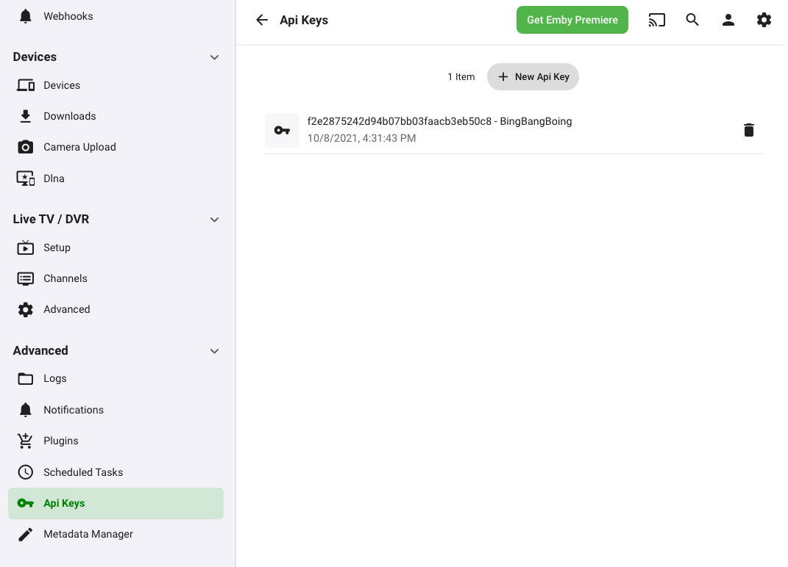

---
hide:
  - tags
tags:
  - emby
---

# Emby

# What is it?

[Emby](https://emby.media) is a media server designed to organize, play, and stream audio and video to a variety of devices

| Details     |             |             |             |
|-------------|-------------|-------------|-------------|
| [:material-home: Project home](https://emby.media){: .header-icons } | [:octicons-link-16: Docs](https://support.emby.media/support/home){: .header-icons } | [:octicons-mark-github-16: Github](https://github.com/MediaBrowser/Emby){: .header-icons } | [:material-docker: Docker](https://hub.docker.com/r/emby/embyserver){: .header-icons }|

## 1. Introduction


## 2. URL

- To access Emby, visit `https://emby._yourdomain.com_`

## 3. Initial Setup

## i. Domain

- See [Adding a Subdomain](../reference/subdomain.md) on how to add the subdomain `emby` to your DNS provider.

- _Note: You can skip this step if you are using [Cloudflare](../reference/domain.md#__tabbed_1_3) with Saltbox._

## ii. Install

- Run the following command:

    ```shell
    sb install emby
    ```

## 4. Setup Wizard

1. Visit `https://emby._yourdomain.com_`.

1. Select your **preferred display language**. Click **Next**.

   )

1. **Type** the following and click **Next**:

    - **Username:** _The username you wwant to use to log into Emby_

    - **New Password:** _A strong password you'll use to log into Emby_

    - **New Password Confirm:** _That same password again_

    - **Emby connect username or email address**: _your [Emby Connect username](https://emby.media/connect)_ (important)

   

1. Confirm the message by clicking **Got It**.

   

1. **Confirm** the link in your email.

   

   

2. Skip the adding of the libraries. Click **Next**.

   

3. Select your **Preferred Metadata Language** and **Country** (_`English` and `United States` are recommended_) and click **Next**.

   

4. Uncheck **Enable automatic port mapping**. Click **Next**.

   

5. **Check** to accept the terms. Click **Next**.

   

6. Click **Finish**.

   

7. You will now be taken to the **Dashboard** view.

## 5. Settings

## i. Transcoding

1. Go to **Settings**.

1. Go to **Transcoding**.

   

1. Under **Enable hardware acceleration when available**, select **Advanced**.

   

2. Under **Transcoding temporary path**, type in or choose `/transcode`.

   

3. Click **Save**.

## iii. Libraries

In this section, we will add two libraries: one for Movies and one for TV Shows.

### Add Movie Library

1. Go to **Settings**.

1. Go to **Library**.

   

1. Click **+ New Library**.

1. Under **Content type**, select **Movies**.

   

   

1. Click **+** next to **Folders**.

1. Type in or choose `/mnt/unionfs/Media/Movies`. Click **OK**.

   _Note: These [paths](../saltbox/basics/paths.md) are for the standard library setup. If you have [customized](../reference/customizing-plex-libs.md) it, use those paths instead._

   

2. Click **OK** once more.

### Add TV Shows Library

1. Go to **Settings**.

1. Go to **Library**.

   

1. Click **+ New Library**.

1. Under **Content type**, select **TV shows**.

   

   

1. Click **+** next to **Folders**.

1. Type in or choose `/mnt/unionfs/Media/TV`. Click **OK**.

   _Note: These [paths](../saltbox/basics/paths.md) are for the standard library setup. If you have [customized](../reference/customizing-plex-libs.md) it, use those paths instead._

   

2. Click **OK** once more.

## 6. API Key

Instructions below will guide you through creating an API Key for a specific app.

1. Click the **Settings** icon.

2. Under **Advanced**, click **API Keys**.

   

3. Click **+ New API Key**.

   

4. Fill in an **App name** (e.g. Ombi) and click **OK**.

5. You have now have created an **Api Key** for your app.

   

<!-- BEGIN SALTBOX MANAGED VARIABLES SECTION -->
<!-- This section is managed by saltbox/test.py - DO NOT EDIT MANUALLY -->
## Role Defaults

!!! info
    Variables can be overridden in `/srv/git/saltbox/inventories/host_vars/localhost.yml`.

    This role supports multiple instances via `emby_instances`.

    === "Role-level Override"

        Applies to all instances of emby:

        ```yaml
        emby_role_web_subdomain: "custom"
        ```

    === "Instance-level Override"

        Applies to a specific instance (e.g., `emby2`):

        ```yaml
        emby2_web_subdomain: "custom2"
        ```

!!! warning
    **Avoid overriding variables ending in `_default`**

    When overriding variables that end in `_default` (like `emby_docker_envs_default`), you replace the entire default configuration. Future updates that add new default values will not be applied to your setup, potentially breaking functionality.

    Instead, use the corresponding `_custom` variable (like `emby_docker_envs_custom`) to add your changes. Custom values are merged with defaults, ensuring you receive updates.

=== "Basics"

    ??? variable list "`emby_instances`"

        ```yaml
        # Type: list
        emby_instances: ["emby"]
        ```

        !!! example

            ```yaml
            # Type: list
            emby_instances: ["emby", "emby2"]
            ```

=== "Settings"

    === "Role-level"

        ??? variable int "`emby_role_config_cache_size`"

            ```yaml
            # Type: int
            emby_role_config_cache_size: 1024
            ```

    === "Instance-level"

        ??? variable int "`emby2_config_cache_size`"

            ```yaml
            # Type: int
            emby2_config_cache_size: 1024
            ```

=== "Paths"

    === "Role-level"

        ??? variable string "`emby_role_paths_folder`"

            ```yaml
            # Type: string
            emby_role_paths_folder: "{{ emby_name }}"
            ```

        ??? variable string "`emby_role_paths_location`"

            ```yaml
            # Type: string
            emby_role_paths_location: "{{ server_appdata_path }}/{{ emby_role_paths_folder }}"
            ```

        ??? variable string "`emby_role_paths_transcodes_location`"

            ```yaml
            # Type: string
            emby_role_paths_transcodes_location: "{{ transcodes_path }}/{{ emby_role_paths_folder }}"
            ```

        ??? variable string "`emby_role_paths_config_location`"

            ```yaml
            # Type: string
            emby_role_paths_config_location: "{{ emby_role_paths_location }}/config/system.xml"
            ```

        ??? variable string "`emby_role_paths_dlna_xml_location`"

            ```yaml
            # Type: string
            emby_role_paths_dlna_xml_location: "{{ emby_role_paths_location }}/config/dlna.xml"
            ```

    === "Instance-level"

        ??? variable string "`emby2_paths_folder`"

            ```yaml
            # Type: string
            emby2_paths_folder: "{{ emby_name }}"
            ```

        ??? variable string "`emby2_paths_location`"

            ```yaml
            # Type: string
            emby2_paths_location: "{{ server_appdata_path }}/{{ emby_role_paths_folder }}"
            ```

        ??? variable string "`emby2_paths_transcodes_location`"

            ```yaml
            # Type: string
            emby2_paths_transcodes_location: "{{ transcodes_path }}/{{ emby_role_paths_folder }}"
            ```

        ??? variable string "`emby2_paths_config_location`"

            ```yaml
            # Type: string
            emby2_paths_config_location: "{{ emby_role_paths_location }}/config/system.xml"
            ```

        ??? variable string "`emby2_paths_dlna_xml_location`"

            ```yaml
            # Type: string
            emby2_paths_dlna_xml_location: "{{ emby_role_paths_location }}/config/dlna.xml"
            ```

=== "Web"

    === "Role-level"

        ??? variable string "`emby_role_web_subdomain`"

            ```yaml
            # Type: string
            emby_role_web_subdomain: "{{ emby_name }}"
            ```

        ??? variable string "`emby_role_web_domain`"

            ```yaml
            # Type: string
            emby_role_web_domain: "{{ user.domain }}"
            ```

        ??? variable string "`emby_role_web_port`"

            ```yaml
            # Type: string
            emby_role_web_port: "8096"
            ```

        ??? variable string "`emby_role_web_url`"

            ```yaml
            # Type: string
            emby_role_web_url: "{{ 'https://' + (lookup('role_var', '_web_subdomain', role='emby') + '.' + lookup('role_var', '_web_domain', role='emby')
                                if (lookup('role_var', '_web_subdomain', role='emby') | length > 0)
                                else lookup('role_var', '_web_domain', role='emby')) }}"
            ```

    === "Instance-level"

        ??? variable string "`emby2_web_subdomain`"

            ```yaml
            # Type: string
            emby2_web_subdomain: "{{ emby_name }}"
            ```

        ??? variable string "`emby2_web_domain`"

            ```yaml
            # Type: string
            emby2_web_domain: "{{ user.domain }}"
            ```

        ??? variable string "`emby2_web_port`"

            ```yaml
            # Type: string
            emby2_web_port: "8096"
            ```

        ??? variable string "`emby2_web_url`"

            ```yaml
            # Type: string
                    emby2_web_url: "{{ 'https://' + (lookup('role_var', '_web_subdomain', role='emby') + '.' + lookup('role_var', '_web_domain', role='emby')
                                    if (lookup('role_var', '_web_subdomain', role='emby') | length > 0)
                                    else lookup('role_var', '_web_domain', role='emby')) }}"
            ```

=== "DNS"

    === "Role-level"

        ??? variable string "`emby_role_dns_record`"

            ```yaml
            # Type: string
            emby_role_dns_record: "{{ lookup('role_var', '_web_subdomain', role='emby') }}"
            ```

        ??? variable string "`emby_role_dns_zone`"

            ```yaml
            # Type: string
            emby_role_dns_zone: "{{ lookup('role_var', '_web_domain', role='emby') }}"
            ```

        ??? variable bool "`emby_role_dns_proxy`"

            ```yaml
            # Type: bool (true/false)
            emby_role_dns_proxy: "{{ dns_proxied }}"
            ```

    === "Instance-level"

        ??? variable string "`emby2_dns_record`"

            ```yaml
            # Type: string
            emby2_dns_record: "{{ lookup('role_var', '_web_subdomain', role='emby') }}"
            ```

        ??? variable string "`emby2_dns_zone`"

            ```yaml
            # Type: string
            emby2_dns_zone: "{{ lookup('role_var', '_web_domain', role='emby') }}"
            ```

        ??? variable bool "`emby2_dns_proxy`"

            ```yaml
            # Type: bool (true/false)
            emby2_dns_proxy: "{{ dns_proxied }}"
            ```

=== "Traefik"

    === "Role-level"

        ??? variable string "`emby_role_traefik_sso_middleware`"

            ```yaml
            # Type: string
            emby_role_traefik_sso_middleware: ""
            ```

        ??? variable string "`emby_role_traefik_middleware_default`"

            ```yaml
            # Type: string
            emby_role_traefik_middleware_default: "{{ traefik_default_middleware
                                                      + (',themepark-' + emby_name
                                                        if (lookup('role_var', '_themepark_enabled', role='emby') and global_themepark_plugin_enabled)
                                                        else '') }}"
            ```

        ??? variable string "`emby_role_traefik_middleware_custom`"

            ```yaml
            # Type: string
            emby_role_traefik_middleware_custom: ""
            ```

        ??? variable string "`emby_role_traefik_certresolver`"

            ```yaml
            # Type: string
            emby_role_traefik_certresolver: "{{ traefik_default_certresolver }}"
            ```

        ??? variable bool "`emby_role_traefik_enabled`"

            ```yaml
            # Type: bool (true/false)
            emby_role_traefik_enabled: true
            ```

        ??? variable bool "`emby_role_traefik_gzip_enabled`"

            ```yaml
            # Type: bool (true/false)
            emby_role_traefik_gzip_enabled: false
            ```

        ??? variable bool "`emby_role_traefik_api_enabled`"

            ```yaml
            # Type: bool (true/false)
            emby_role_traefik_api_enabled: false
            ```

        ??? variable string "`emby_role_traefik_api_endpoint`"

            ```yaml
            # Type: string
            emby_role_traefik_api_endpoint: ""
            ```

    === "Instance-level"

        ??? variable string "`emby2_traefik_sso_middleware`"

            ```yaml
            # Type: string
            emby2_traefik_sso_middleware: ""
            ```

        ??? variable string "`emby2_traefik_middleware_default`"

            ```yaml
            # Type: string
                    emby2_traefik_middleware_default: "{{ traefik_default_middleware
                                                          + (',themepark-' + emby_name
                                                            if (lookup('role_var', '_themepark_enabled', role='emby') and global_themepark_plugin_enabled)
                                                            else '') }}"
            ```

        ??? variable string "`emby2_traefik_middleware_custom`"

            ```yaml
            # Type: string
            emby2_traefik_middleware_custom: ""
            ```

        ??? variable string "`emby2_traefik_certresolver`"

            ```yaml
            # Type: string
            emby2_traefik_certresolver: "{{ traefik_default_certresolver }}"
            ```

        ??? variable bool "`emby2_traefik_enabled`"

            ```yaml
            # Type: bool (true/false)
            emby2_traefik_enabled: true
            ```

        ??? variable bool "`emby2_traefik_gzip_enabled`"

            ```yaml
            # Type: bool (true/false)
            emby2_traefik_gzip_enabled: false
            ```

        ??? variable bool "`emby2_traefik_api_enabled`"

            ```yaml
            # Type: bool (true/false)
            emby2_traefik_api_enabled: false
            ```

        ??? variable string "`emby2_traefik_api_endpoint`"

            ```yaml
            # Type: string
            emby2_traefik_api_endpoint: ""
            ```

=== "Theme"

    === "Role-level"

        ??? variable bool "`emby_role_themepark_enabled`"

            ```yaml
            # Options can be found at https://github.com/themepark-dev/theme.park
            # Type: bool (true/false)
            emby_role_themepark_enabled: false
            ```

        ??? variable string "`emby_role_themepark_app`"

            ```yaml
            # Type: string
            emby_role_themepark_app: "emby"
            ```

        ??? variable string "`emby_role_themepark_theme`"

            ```yaml
            # Type: string
            emby_role_themepark_theme: "{{ global_themepark_theme }}"
            ```

        ??? variable string "`emby_role_themepark_domain`"

            ```yaml
            # Type: string
            emby_role_themepark_domain: "{{ global_themepark_domain }}"
            ```

        ??? variable list "`emby_role_themepark_addons`"

            ```yaml
            # Type: list
            emby_role_themepark_addons: []
            ```

    === "Instance-level"

        ??? variable bool "`emby2_themepark_enabled`"

            # Options can be found at https://github.com/themepark-dev/theme.park

            ```yaml
            # Type: bool (true/false)
            emby2_themepark_enabled: false
            ```

        ??? variable string "`emby2_themepark_app`"

            ```yaml
            # Type: string
            emby2_themepark_app: "emby"
            ```

        ??? variable string "`emby2_themepark_theme`"

            ```yaml
            # Type: string
            emby2_themepark_theme: "{{ global_themepark_theme }}"
            ```

        ??? variable string "`emby2_themepark_domain`"

            ```yaml
            # Type: string
            emby2_themepark_domain: "{{ global_themepark_domain }}"
            ```

        ??? variable list "`emby2_themepark_addons`"

            ```yaml
            # Type: list
            emby2_themepark_addons: []
            ```

=== "Config"

    === "Role-level"

        ??? variable list "`emby_role_config_settings_default`"

            ```yaml
            # Type: list
            emby_role_config_settings_default: 
              - { xpath: 'IsBehindProxy', value: 'true' }
              - { xpath: 'WanDdns', value: '{{ lookup("role_var", "_web_subdomain", role="emby") }}.{{ lookup("role_var", "_web_domain", role="emby") }}' }
              - { xpath: 'PublicPort', value: '80' }
              - { xpath: 'PublicHttpsPort', value: '443' }
              - { xpath: 'EnableHttps', value: 'true' }
              - { xpath: 'RequireHttps', value: 'false' }
              - { xpath: 'EnableUPnP', value: 'false' }
              - { xpath: 'DatabaseCacheSizeMB', value: '{{ lookup("role_var", "_config_cache_size", role="emby") | string }}' }
            ```

        ??? variable list "`emby_role_config_settings_custom`"

            ```yaml
            # Type: list
            emby_role_config_settings_custom: []
            ```

        ??? variable string "`emby_role_config_settings_list`"

            ```yaml
            # Type: string
            emby_role_config_settings_list: "{{ lookup('role_var', '_config_settings_default', role='emby') + lookup('role_var', '_config_settings_custom', role='emby') }}"
            ```

    === "Instance-level"

        ??? variable list "`emby2_config_settings_default`"

            ```yaml
            # Type: list
                    emby2_config_settings_default: 
                      - { xpath: 'IsBehindProxy', value: 'true' }
                      - { xpath: 'WanDdns', value: '{{ lookup("role_var", "_web_subdomain", role="emby") }}.{{ lookup("role_var", "_web_domain", role="emby") }}' }
                      - { xpath: 'PublicPort', value: '80' }
                      - { xpath: 'PublicHttpsPort', value: '443' }
                      - { xpath: 'EnableHttps', value: 'true' }
                      - { xpath: 'RequireHttps', value: 'false' }
                      - { xpath: 'EnableUPnP', value: 'false' }
                      - { xpath: 'DatabaseCacheSizeMB', value: '{{ lookup("role_var", "_config_cache_size", role="emby") | string }}' }
            ```

        ??? variable list "`emby2_config_settings_custom`"

            ```yaml
            # Type: list
            emby2_config_settings_custom: []
            ```

        ??? variable string "`emby2_config_settings_list`"

            ```yaml
            # Type: string
            emby2_config_settings_list: "{{ lookup('role_var', '_config_settings_default', role='emby') + lookup('role_var', '_config_settings_custom', role='emby') }}"
            ```

=== "Docker"

    === "Role-level"

        ##### Container

        ??? variable string "`emby_role_docker_container`"

            ```yaml
            # Type: string
            emby_role_docker_container: "{{ emby_name }}"
            ```

        ##### Image

        ??? variable bool "`emby_role_docker_image_pull`"

            ```yaml
            # Type: bool (true/false)
            emby_role_docker_image_pull: true
            ```

        ??? variable string "`emby_role_docker_image_repo`"

            ```yaml
            # Type: string
            emby_role_docker_image_repo: "lscr.io/linuxserver/emby"
            ```

        ??? variable string "`emby_role_docker_image_tag`"

            ```yaml
            # Type: string
            emby_role_docker_image_tag: "latest"
            ```

        ??? variable string "`emby_role_docker_image`"

            ```yaml
            # Type: string
            emby_role_docker_image: "{{ lookup('role_var', '_docker_image_repo', role='emby') }}:{{ lookup('role_var', '_docker_image_tag', role='emby') }}"
            ```

        ##### Envs

        ??? variable dict "`emby_role_docker_envs_default`"

            ```yaml
            # Type: dict
            emby_role_docker_envs_default: 
              PUID: "{{ uid }}"
              PGID: "{{ gid }}"
              TZ: "{{ tz }}"
            ```

        ??? variable dict "`emby_role_docker_envs_custom`"

            ```yaml
            # Type: dict
            emby_role_docker_envs_custom: {}
            ```

        ##### Volumes

        ??? variable list "`emby_role_docker_volumes_default`"

            ```yaml
            # Type: list
            emby_role_docker_volumes_default: 
              - "{{ emby_role_paths_location }}:/config"
              - "{{ server_appdata_path }}/scripts:/scripts"
              - "/dev/shm:/dev/shm"
              - "{{ emby_role_paths_transcodes_location }}:/transcode"
            ```

        ??? variable list "`emby_role_docker_volumes_legacy`"

            ```yaml
            # Type: list
            emby_role_docker_volumes_legacy: 
              - "/mnt/unionfs/Media:/data"
            ```

        ??? variable list "`emby_role_docker_volumes_custom`"

            ```yaml
            # Type: list
            emby_role_docker_volumes_custom: []
            ```

        ##### Mounts

        ??? variable list "`emby_role_docker_mounts_default`"

            ```yaml
            # Type: list
            emby_role_docker_mounts_default: 
              - target: /tmp
                type: tmpfs
            ```

        ??? variable list "`emby_role_docker_mounts_custom`"

            ```yaml
            # Type: list
            emby_role_docker_mounts_custom: []
            ```

        ##### Labels

        ??? variable dict "`emby_role_docker_labels_default`"

            ```yaml
            # Type: dict
            emby_role_docker_labels_default: {}
            ```

        ??? variable dict "`emby_role_docker_labels_custom`"

            ```yaml
            # Type: dict
            emby_role_docker_labels_custom: {}
            ```

        ##### Hostname

        ??? variable string "`emby_role_docker_hostname`"

            ```yaml
            # Type: string
            emby_role_docker_hostname: "{{ emby_name }}"
            ```

        ##### Networks

        ??? variable string "`emby_role_docker_networks_alias`"

            ```yaml
            # Type: string
            emby_role_docker_networks_alias: "{{ emby_name }}"
            ```

        ??? variable list "`emby_role_docker_networks_default`"

            ```yaml
            # Type: list
            emby_role_docker_networks_default: []
            ```

        ??? variable list "`emby_role_docker_networks_custom`"

            ```yaml
            # Type: list
            emby_role_docker_networks_custom: []
            ```

        ##### Restart Policy

        ??? variable string "`emby_role_docker_restart_policy`"

            ```yaml
            # Type: string
            emby_role_docker_restart_policy: unless-stopped
            ```

        ##### State

        ??? variable string "`emby_role_docker_state`"

            ```yaml
            # Type: string
            emby_role_docker_state: started
            ```

    === "Instance-level"

        ##### Container

        ??? variable string "`emby2_docker_container`"

            ```yaml
            # Type: string
            emby2_docker_container: "{{ emby_name }}"
            ```

        ##### Image

        ??? variable bool "`emby2_docker_image_pull`"

            ```yaml
            # Type: bool (true/false)
            emby2_docker_image_pull: true
            ```

        ??? variable string "`emby2_docker_image_repo`"

            ```yaml
            # Type: string
            emby2_docker_image_repo: "lscr.io/linuxserver/emby"
            ```

        ??? variable string "`emby2_docker_image_tag`"

            ```yaml
            # Type: string
            emby2_docker_image_tag: "latest"
            ```

        ??? variable string "`emby2_docker_image`"

            ```yaml
            # Type: string
            emby2_docker_image: "{{ lookup('role_var', '_docker_image_repo', role='emby') }}:{{ lookup('role_var', '_docker_image_tag', role='emby') }}"
            ```

        ##### Envs

        ??? variable dict "`emby2_docker_envs_default`"

            ```yaml
            # Type: dict
                    emby2_docker_envs_default: 
                      PUID: "{{ uid }}"
                      PGID: "{{ gid }}"
                      TZ: "{{ tz }}"
            ```

        ??? variable dict "`emby2_docker_envs_custom`"

            ```yaml
            # Type: dict
            emby2_docker_envs_custom: {}
            ```

        ##### Volumes

        ??? variable list "`emby2_docker_volumes_default`"

            ```yaml
            # Type: list
                    emby2_docker_volumes_default: 
                      - "{{ emby_role_paths_location }}:/config"
                      - "{{ server_appdata_path }}/scripts:/scripts"
                      - "/dev/shm:/dev/shm"
                      - "{{ emby_role_paths_transcodes_location }}:/transcode"
            ```

        ??? variable list "`emby2_docker_volumes_legacy`"

            ```yaml
            # Type: list
                    emby2_docker_volumes_legacy: 
                      - "/mnt/unionfs/Media:/data"
            ```

        ??? variable list "`emby2_docker_volumes_custom`"

            ```yaml
            # Type: list
            emby2_docker_volumes_custom: []
            ```

        ##### Mounts

        ??? variable list "`emby2_docker_mounts_default`"

            ```yaml
            # Type: list
                    emby2_docker_mounts_default: 
                      - target: /tmp
                        type: tmpfs
            ```

        ??? variable list "`emby2_docker_mounts_custom`"

            ```yaml
            # Type: list
            emby2_docker_mounts_custom: []
            ```

        ##### Labels

        ??? variable dict "`emby2_docker_labels_default`"

            ```yaml
            # Type: dict
            emby2_docker_labels_default: {}
            ```

        ??? variable dict "`emby2_docker_labels_custom`"

            ```yaml
            # Type: dict
            emby2_docker_labels_custom: {}
            ```

        ##### Hostname

        ??? variable string "`emby2_docker_hostname`"

            ```yaml
            # Type: string
            emby2_docker_hostname: "{{ emby_name }}"
            ```

        ##### Networks

        ??? variable string "`emby2_docker_networks_alias`"

            ```yaml
            # Type: string
            emby2_docker_networks_alias: "{{ emby_name }}"
            ```

        ??? variable list "`emby2_docker_networks_default`"

            ```yaml
            # Type: list
            emby2_docker_networks_default: []
            ```

        ??? variable list "`emby2_docker_networks_custom`"

            ```yaml
            # Type: list
            emby2_docker_networks_custom: []
            ```

        ##### Restart Policy

        ??? variable string "`emby2_docker_restart_policy`"

            ```yaml
            # Type: string
            emby2_docker_restart_policy: unless-stopped
            ```

        ##### State

        ??? variable string "`emby2_docker_state`"

            ```yaml
            # Type: string
            emby2_docker_state: started
            ```

=== "Docker+"

    #### Additional Docker Options

    The following advanced options are available via create_docker_container but are not defined in the role. See: https://docs.ansible.com/ansible/latest/collections/community/docker/docker_container_module.html

    === "Role-level"

        ##### Resource Limits

        ??? variable int "`emby_role_docker_blkio_weight`"

            ```yaml
            # Type: int
            emby_role_docker_blkio_weight:
            ```

        ??? variable int "`emby_role_docker_cpu_period`"

            ```yaml
            # Type: int
            emby_role_docker_cpu_period:
            ```

        ??? variable int "`emby_role_docker_cpu_quota`"

            ```yaml
            # Type: int
            emby_role_docker_cpu_quota:
            ```

        ??? variable int "`emby_role_docker_cpu_shares`"

            ```yaml
            # Type: int
            emby_role_docker_cpu_shares:
            ```

        ??? variable string "`emby_role_docker_cpus`"

            ```yaml
            # Type: string
            emby_role_docker_cpus:
            ```

        ??? variable string "`emby_role_docker_cpuset_cpus`"

            ```yaml
            # Type: string
            emby_role_docker_cpuset_cpus:
            ```

        ??? variable string "`emby_role_docker_cpuset_mems`"

            ```yaml
            # Type: string
            emby_role_docker_cpuset_mems:
            ```

        ??? variable string "`emby_role_docker_kernel_memory`"

            ```yaml
            # Type: string
            emby_role_docker_kernel_memory:
            ```

        ??? variable string "`emby_role_docker_memory`"

            ```yaml
            # Type: string
            emby_role_docker_memory:
            ```

        ??? variable string "`emby_role_docker_memory_reservation`"

            ```yaml
            # Type: string
            emby_role_docker_memory_reservation:
            ```

        ??? variable string "`emby_role_docker_memory_swap`"

            ```yaml
            # Type: string
            emby_role_docker_memory_swap:
            ```

        ??? variable int "`emby_role_docker_memory_swappiness`"

            ```yaml
            # Type: int
            emby_role_docker_memory_swappiness:
            ```

        ##### Security & Devices

        ??? variable list "`emby_role_docker_cap_drop`"

            ```yaml
            # Type: list
            emby_role_docker_cap_drop:
            ```

        ??? variable list "`emby_role_docker_device_cgroup_rules`"

            ```yaml
            # Type: list
            emby_role_docker_device_cgroup_rules:
            ```

        ??? variable list "`emby_role_docker_device_read_bps`"

            ```yaml
            # Type: list
            emby_role_docker_device_read_bps:
            ```

        ??? variable list "`emby_role_docker_device_read_iops`"

            ```yaml
            # Type: list
            emby_role_docker_device_read_iops:
            ```

        ??? variable list "`emby_role_docker_device_requests`"

            ```yaml
            # Type: list
            emby_role_docker_device_requests:
            ```

        ??? variable list "`emby_role_docker_device_write_bps`"

            ```yaml
            # Type: list
            emby_role_docker_device_write_bps:
            ```

        ??? variable list "`emby_role_docker_device_write_iops`"

            ```yaml
            # Type: list
            emby_role_docker_device_write_iops:
            ```

        ??? variable list "`emby_role_docker_devices`"

            ```yaml
            # Type: list
            emby_role_docker_devices:
            ```

        ??? variable string "`emby_role_docker_devices_default`"

            ```yaml
            # Type: string
            emby_role_docker_devices_default:
            ```

        ??? variable bool "`emby_role_docker_privileged`"

            ```yaml
            # Type: bool (true/false)
            emby_role_docker_privileged:
            ```

        ??? variable list "`emby_role_docker_security_opts`"

            ```yaml
            # Type: list
            emby_role_docker_security_opts:
            ```

        ##### Networking

        ??? variable list "`emby_role_docker_dns_opts`"

            ```yaml
            # Type: list
            emby_role_docker_dns_opts:
            ```

        ??? variable list "`emby_role_docker_dns_search_domains`"

            ```yaml
            # Type: list
            emby_role_docker_dns_search_domains:
            ```

        ??? variable list "`emby_role_docker_dns_servers`"

            ```yaml
            # Type: list
            emby_role_docker_dns_servers:
            ```

        ??? variable dict "`emby_role_docker_hosts`"

            ```yaml
            # Type: dict
            emby_role_docker_hosts:
            ```

        ??? variable string "`emby_role_docker_hosts_use_common`"

            ```yaml
            # Type: string
            emby_role_docker_hosts_use_common:
            ```

        ??? variable string "`emby_role_docker_network_mode`"

            ```yaml
            # Type: string
            emby_role_docker_network_mode:
            ```

        ##### Storage

        ??? variable bool "`emby_role_docker_keep_volumes`"

            ```yaml
            # Type: bool (true/false)
            emby_role_docker_keep_volumes:
            ```

        ??? variable string "`emby_role_docker_volume_driver`"

            ```yaml
            # Type: string
            emby_role_docker_volume_driver:
            ```

        ??? variable list "`emby_role_docker_volumes_from`"

            ```yaml
            # Type: list
            emby_role_docker_volumes_from:
            ```

        ??? variable string "`emby_role_docker_volumes_global`"

            ```yaml
            # Type: string
            emby_role_docker_volumes_global:
            ```

        ??? variable string "`emby_role_docker_working_dir`"

            ```yaml
            # Type: string
            emby_role_docker_working_dir:
            ```

        ##### Monitoring & Lifecycle

        ??? variable dict "`emby_role_docker_healthcheck`"

            ```yaml
            # Type: dict
            emby_role_docker_healthcheck:
            ```

        ??? variable bool "`emby_role_docker_init`"

            ```yaml
            # Type: bool (true/false)
            emby_role_docker_init:
            ```

        ??? variable string "`emby_role_docker_log_driver`"

            ```yaml
            # Type: string
            emby_role_docker_log_driver:
            ```

        ??? variable dict "`emby_role_docker_log_options`"

            ```yaml
            # Type: dict
            emby_role_docker_log_options:
            ```

        ??? variable bool "`emby_role_docker_output_logs`"

            ```yaml
            # Type: bool (true/false)
            emby_role_docker_output_logs:
            ```

        ##### Other Options

        ??? variable bool "`emby_role_docker_auto_remove`"

            ```yaml
            # Type: bool (true/false)
            emby_role_docker_auto_remove:
            ```

        ??? variable list "`emby_role_docker_capabilities`"

            ```yaml
            # Type: list
            emby_role_docker_capabilities:
            ```

        ??? variable string "`emby_role_docker_cgroup_parent`"

            ```yaml
            # Type: string
            emby_role_docker_cgroup_parent:
            ```

        ??? variable string "`emby_role_docker_cgroupns_mode`"

            ```yaml
            # Type: string
            emby_role_docker_cgroupns_mode:
            ```

        ??? variable bool "`emby_role_docker_cleanup`"

            ```yaml
            # Type: bool (true/false)
            emby_role_docker_cleanup:
            ```

        ??? variable list "`emby_role_docker_commands`"

            ```yaml
            # Type: list
            emby_role_docker_commands:
            ```

        ??? variable string "`emby_role_docker_create_timeout`"

            ```yaml
            # Type: string
            emby_role_docker_create_timeout:
            ```

        ??? variable string "`emby_role_docker_domainname`"

            ```yaml
            # Type: string
            emby_role_docker_domainname:
            ```

        ??? variable string "`emby_role_docker_entrypoint`"

            ```yaml
            # Type: string
            emby_role_docker_entrypoint:
            ```

        ??? variable string "`emby_role_docker_env_file`"

            ```yaml
            # Type: string
            emby_role_docker_env_file:
            ```

        ??? variable list "`emby_role_docker_exposed_ports`"

            ```yaml
            # Type: list
            emby_role_docker_exposed_ports:
            ```

        ??? variable string "`emby_role_docker_force_kill`"

            ```yaml
            # Type: string
            emby_role_docker_force_kill:
            ```

        ??? variable list "`emby_role_docker_groups`"

            ```yaml
            # Type: list
            emby_role_docker_groups:
            ```

        ??? variable int "`emby_role_docker_healthy_wait_timeout`"

            ```yaml
            # Type: int
            emby_role_docker_healthy_wait_timeout:
            ```

        ??? variable string "`emby_role_docker_ipc_mode`"

            ```yaml
            # Type: string
            emby_role_docker_ipc_mode:
            ```

        ??? variable string "`emby_role_docker_kill_signal`"

            ```yaml
            # Type: string
            emby_role_docker_kill_signal:
            ```

        ??? variable string "`emby_role_docker_labels_use_common`"

            ```yaml
            # Type: string
            emby_role_docker_labels_use_common:
            ```

        ??? variable list "`emby_role_docker_links`"

            ```yaml
            # Type: list
            emby_role_docker_links:
            ```

        ??? variable bool "`emby_role_docker_oom_killer`"

            ```yaml
            # Type: bool (true/false)
            emby_role_docker_oom_killer:
            ```

        ??? variable int "`emby_role_docker_oom_score_adj`"

            ```yaml
            # Type: int
            emby_role_docker_oom_score_adj:
            ```

        ??? variable bool "`emby_role_docker_paused`"

            ```yaml
            # Type: bool (true/false)
            emby_role_docker_paused:
            ```

        ??? variable string "`emby_role_docker_pid_mode`"

            ```yaml
            # Type: string
            emby_role_docker_pid_mode:
            ```

        ??? variable list "`emby_role_docker_ports`"

            ```yaml
            # Type: list
            emby_role_docker_ports:
            ```

        ??? variable bool "`emby_role_docker_read_only`"

            ```yaml
            # Type: bool (true/false)
            emby_role_docker_read_only:
            ```

        ??? variable bool "`emby_role_docker_recreate`"

            ```yaml
            # Type: bool (true/false)
            emby_role_docker_recreate:
            ```

        ??? variable int "`emby_role_docker_restart_retries`"

            ```yaml
            # Type: int
            emby_role_docker_restart_retries:
            ```

        ??? variable string "`emby_role_docker_runtime`"

            ```yaml
            # Type: string
            emby_role_docker_runtime:
            ```

        ??? variable string "`emby_role_docker_shm_size`"

            ```yaml
            # Type: string
            emby_role_docker_shm_size:
            ```

        ??? variable int "`emby_role_docker_stop_timeout`"

            ```yaml
            # Type: int
            emby_role_docker_stop_timeout:
            ```

        ??? variable dict "`emby_role_docker_storage_opts`"

            ```yaml
            # Type: dict
            emby_role_docker_storage_opts:
            ```

        ??? variable list "`emby_role_docker_sysctls`"

            ```yaml
            # Type: list
            emby_role_docker_sysctls:
            ```

        ??? variable list "`emby_role_docker_tmpfs`"

            ```yaml
            # Type: list
            emby_role_docker_tmpfs:
            ```

        ??? variable list "`emby_role_docker_ulimits`"

            ```yaml
            # Type: list
            emby_role_docker_ulimits:
            ```

        ??? variable string "`emby_role_docker_user`"

            ```yaml
            # Type: string
            emby_role_docker_user:
            ```

        ??? variable string "`emby_role_docker_userns_mode`"

            ```yaml
            # Type: string
            emby_role_docker_userns_mode:
            ```

        ??? variable string "`emby_role_docker_uts`"

            ```yaml
            # Type: string
            emby_role_docker_uts:
            ```

    === "Instance-level"

        ##### Resource Limits

        ??? variable int "`emby2_docker_blkio_weight`"

            ```yaml
            # Type: int
            emby2_docker_blkio_weight:
            ```

        ??? variable int "`emby2_docker_cpu_period`"

            ```yaml
            # Type: int
            emby2_docker_cpu_period:
            ```

        ??? variable int "`emby2_docker_cpu_quota`"

            ```yaml
            # Type: int
            emby2_docker_cpu_quota:
            ```

        ??? variable int "`emby2_docker_cpu_shares`"

            ```yaml
            # Type: int
            emby2_docker_cpu_shares:
            ```

        ??? variable string "`emby2_docker_cpus`"

            ```yaml
            # Type: string
            emby2_docker_cpus:
            ```

        ??? variable string "`emby2_docker_cpuset_cpus`"

            ```yaml
            # Type: string
            emby2_docker_cpuset_cpus:
            ```

        ??? variable string "`emby2_docker_cpuset_mems`"

            ```yaml
            # Type: string
            emby2_docker_cpuset_mems:
            ```

        ??? variable string "`emby2_docker_kernel_memory`"

            ```yaml
            # Type: string
            emby2_docker_kernel_memory:
            ```

        ??? variable string "`emby2_docker_memory`"

            ```yaml
            # Type: string
            emby2_docker_memory:
            ```

        ??? variable string "`emby2_docker_memory_reservation`"

            ```yaml
            # Type: string
            emby2_docker_memory_reservation:
            ```

        ??? variable string "`emby2_docker_memory_swap`"

            ```yaml
            # Type: string
            emby2_docker_memory_swap:
            ```

        ??? variable int "`emby2_docker_memory_swappiness`"

            ```yaml
            # Type: int
            emby2_docker_memory_swappiness:
            ```

        ##### Security & Devices

        ??? variable list "`emby2_docker_cap_drop`"

            ```yaml
            # Type: list
            emby2_docker_cap_drop:
            ```

        ??? variable list "`emby2_docker_device_cgroup_rules`"

            ```yaml
            # Type: list
            emby2_docker_device_cgroup_rules:
            ```

        ??? variable list "`emby2_docker_device_read_bps`"

            ```yaml
            # Type: list
            emby2_docker_device_read_bps:
            ```

        ??? variable list "`emby2_docker_device_read_iops`"

            ```yaml
            # Type: list
            emby2_docker_device_read_iops:
            ```

        ??? variable list "`emby2_docker_device_requests`"

            ```yaml
            # Type: list
            emby2_docker_device_requests:
            ```

        ??? variable list "`emby2_docker_device_write_bps`"

            ```yaml
            # Type: list
            emby2_docker_device_write_bps:
            ```

        ??? variable list "`emby2_docker_device_write_iops`"

            ```yaml
            # Type: list
            emby2_docker_device_write_iops:
            ```

        ??? variable list "`emby2_docker_devices`"

            ```yaml
            # Type: list
            emby2_docker_devices:
            ```

        ??? variable string "`emby2_docker_devices_default`"

            ```yaml
            # Type: string
            emby2_docker_devices_default:
            ```

        ??? variable bool "`emby2_docker_privileged`"

            ```yaml
            # Type: bool (true/false)
            emby2_docker_privileged:
            ```

        ??? variable list "`emby2_docker_security_opts`"

            ```yaml
            # Type: list
            emby2_docker_security_opts:
            ```

        ##### Networking

        ??? variable list "`emby2_docker_dns_opts`"

            ```yaml
            # Type: list
            emby2_docker_dns_opts:
            ```

        ??? variable list "`emby2_docker_dns_search_domains`"

            ```yaml
            # Type: list
            emby2_docker_dns_search_domains:
            ```

        ??? variable list "`emby2_docker_dns_servers`"

            ```yaml
            # Type: list
            emby2_docker_dns_servers:
            ```

        ??? variable dict "`emby2_docker_hosts`"

            ```yaml
            # Type: dict
            emby2_docker_hosts:
            ```

        ??? variable string "`emby2_docker_hosts_use_common`"

            ```yaml
            # Type: string
            emby2_docker_hosts_use_common:
            ```

        ??? variable string "`emby2_docker_network_mode`"

            ```yaml
            # Type: string
            emby2_docker_network_mode:
            ```

        ##### Storage

        ??? variable bool "`emby2_docker_keep_volumes`"

            ```yaml
            # Type: bool (true/false)
            emby2_docker_keep_volumes:
            ```

        ??? variable string "`emby2_docker_volume_driver`"

            ```yaml
            # Type: string
            emby2_docker_volume_driver:
            ```

        ??? variable list "`emby2_docker_volumes_from`"

            ```yaml
            # Type: list
            emby2_docker_volumes_from:
            ```

        ??? variable string "`emby2_docker_volumes_global`"

            ```yaml
            # Type: string
            emby2_docker_volumes_global:
            ```

        ??? variable string "`emby2_docker_working_dir`"

            ```yaml
            # Type: string
            emby2_docker_working_dir:
            ```

        ##### Monitoring & Lifecycle

        ??? variable dict "`emby2_docker_healthcheck`"

            ```yaml
            # Type: dict
            emby2_docker_healthcheck:
            ```

        ??? variable bool "`emby2_docker_init`"

            ```yaml
            # Type: bool (true/false)
            emby2_docker_init:
            ```

        ??? variable string "`emby2_docker_log_driver`"

            ```yaml
            # Type: string
            emby2_docker_log_driver:
            ```

        ??? variable dict "`emby2_docker_log_options`"

            ```yaml
            # Type: dict
            emby2_docker_log_options:
            ```

        ??? variable bool "`emby2_docker_output_logs`"

            ```yaml
            # Type: bool (true/false)
            emby2_docker_output_logs:
            ```

        ##### Other Options

        ??? variable bool "`emby2_docker_auto_remove`"

            ```yaml
            # Type: bool (true/false)
            emby2_docker_auto_remove:
            ```

        ??? variable list "`emby2_docker_capabilities`"

            ```yaml
            # Type: list
            emby2_docker_capabilities:
            ```

        ??? variable string "`emby2_docker_cgroup_parent`"

            ```yaml
            # Type: string
            emby2_docker_cgroup_parent:
            ```

        ??? variable string "`emby2_docker_cgroupns_mode`"

            ```yaml
            # Type: string
            emby2_docker_cgroupns_mode:
            ```

        ??? variable bool "`emby2_docker_cleanup`"

            ```yaml
            # Type: bool (true/false)
            emby2_docker_cleanup:
            ```

        ??? variable list "`emby2_docker_commands`"

            ```yaml
            # Type: list
            emby2_docker_commands:
            ```

        ??? variable string "`emby2_docker_create_timeout`"

            ```yaml
            # Type: string
            emby2_docker_create_timeout:
            ```

        ??? variable string "`emby2_docker_domainname`"

            ```yaml
            # Type: string
            emby2_docker_domainname:
            ```

        ??? variable string "`emby2_docker_entrypoint`"

            ```yaml
            # Type: string
            emby2_docker_entrypoint:
            ```

        ??? variable string "`emby2_docker_env_file`"

            ```yaml
            # Type: string
            emby2_docker_env_file:
            ```

        ??? variable list "`emby2_docker_exposed_ports`"

            ```yaml
            # Type: list
            emby2_docker_exposed_ports:
            ```

        ??? variable string "`emby2_docker_force_kill`"

            ```yaml
            # Type: string
            emby2_docker_force_kill:
            ```

        ??? variable list "`emby2_docker_groups`"

            ```yaml
            # Type: list
            emby2_docker_groups:
            ```

        ??? variable int "`emby2_docker_healthy_wait_timeout`"

            ```yaml
            # Type: int
            emby2_docker_healthy_wait_timeout:
            ```

        ??? variable string "`emby2_docker_ipc_mode`"

            ```yaml
            # Type: string
            emby2_docker_ipc_mode:
            ```

        ??? variable string "`emby2_docker_kill_signal`"

            ```yaml
            # Type: string
            emby2_docker_kill_signal:
            ```

        ??? variable string "`emby2_docker_labels_use_common`"

            ```yaml
            # Type: string
            emby2_docker_labels_use_common:
            ```

        ??? variable list "`emby2_docker_links`"

            ```yaml
            # Type: list
            emby2_docker_links:
            ```

        ??? variable bool "`emby2_docker_oom_killer`"

            ```yaml
            # Type: bool (true/false)
            emby2_docker_oom_killer:
            ```

        ??? variable int "`emby2_docker_oom_score_adj`"

            ```yaml
            # Type: int
            emby2_docker_oom_score_adj:
            ```

        ??? variable bool "`emby2_docker_paused`"

            ```yaml
            # Type: bool (true/false)
            emby2_docker_paused:
            ```

        ??? variable string "`emby2_docker_pid_mode`"

            ```yaml
            # Type: string
            emby2_docker_pid_mode:
            ```

        ??? variable list "`emby2_docker_ports`"

            ```yaml
            # Type: list
            emby2_docker_ports:
            ```

        ??? variable bool "`emby2_docker_read_only`"

            ```yaml
            # Type: bool (true/false)
            emby2_docker_read_only:
            ```

        ??? variable bool "`emby2_docker_recreate`"

            ```yaml
            # Type: bool (true/false)
            emby2_docker_recreate:
            ```

        ??? variable int "`emby2_docker_restart_retries`"

            ```yaml
            # Type: int
            emby2_docker_restart_retries:
            ```

        ??? variable string "`emby2_docker_runtime`"

            ```yaml
            # Type: string
            emby2_docker_runtime:
            ```

        ??? variable string "`emby2_docker_shm_size`"

            ```yaml
            # Type: string
            emby2_docker_shm_size:
            ```

        ??? variable int "`emby2_docker_stop_timeout`"

            ```yaml
            # Type: int
            emby2_docker_stop_timeout:
            ```

        ??? variable dict "`emby2_docker_storage_opts`"

            ```yaml
            # Type: dict
            emby2_docker_storage_opts:
            ```

        ??? variable list "`emby2_docker_sysctls`"

            ```yaml
            # Type: list
            emby2_docker_sysctls:
            ```

        ??? variable list "`emby2_docker_tmpfs`"

            ```yaml
            # Type: list
            emby2_docker_tmpfs:
            ```

        ??? variable list "`emby2_docker_ulimits`"

            ```yaml
            # Type: list
            emby2_docker_ulimits:
            ```

        ??? variable string "`emby2_docker_user`"

            ```yaml
            # Type: string
            emby2_docker_user:
            ```

        ??? variable string "`emby2_docker_userns_mode`"

            ```yaml
            # Type: string
            emby2_docker_userns_mode:
            ```

        ??? variable string "`emby2_docker_uts`"

            ```yaml
            # Type: string
            emby2_docker_uts:
            ```

=== "Global Override Options"

    === "Role-level"

        Override for all instances:

        ??? variable bool "`emby_role_autoheal_enabled`"

            ```yaml
            # Enable or disable Autoheal monitoring for containers created when deploying
            # Type: bool (true/false)
            emby_role_autoheal_enabled: true
            ```

        ??? variable string "`emby_role_depends_on`"

            ```yaml
            # List of container dependencies that must be running before containers start
            # Type: string
            emby_role_depends_on: ""
            ```

        ??? variable string "`emby_role_depends_on_delay`"

            ```yaml
            # Delay in seconds before starting containers after dependencies are ready
            # Type: string (quoted number)
            emby_role_depends_on_delay: "0"
            ```

        ??? variable string "`emby_role_depends_on_healthchecks`"

            ```yaml
            # Enable healthcheck waiting for container dependencies
            # Type: string ("true"/"false")
            emby_role_depends_on_healthchecks:
            ```

        ??? variable bool "`emby_role_diun_enabled`"

            ```yaml
            # Enable or disable Diun update notifications for containers created when deploying
            # Type: bool (true/false)
            emby_role_diun_enabled: true
            ```

        ??? variable bool "`emby_role_dns_enabled`"

            ```yaml
            # Enable or disable automatic DNS record creation for containers
            # Type: bool (true/false)
            emby_role_dns_enabled: true
            ```

        ??? variable bool "`emby_role_docker_controller`"

            ```yaml
            # Enable or disable Saltbox Docker Controller management for containers
            # Type: bool (true/false)
            emby_role_docker_controller: true
            ```

        ??? variable bool "`emby_role_traefik_autodetect_enabled`"

            ```yaml
            # Enable Traefik autodetect middleware for containers
            # Type: bool (true/false)
            emby_role_traefik_autodetect_enabled: false
            ```

        ??? variable bool "`emby_role_traefik_crowdsec_enabled`"

            ```yaml
            # Enable CrowdSec middleware for containers
            # Type: bool (true/false)
            emby_role_traefik_crowdsec_enabled: false
            ```

        ??? variable bool "`emby_role_traefik_error_pages_enabled`"

            ```yaml
            # Enable custom error pages middleware for containers
            # Type: bool (true/false)
            emby_role_traefik_error_pages_enabled: false
            ```

        ??? variable bool "`emby_role_traefik_gzip_enabled`"

            ```yaml
            # Enable gzip compression middleware for containers
            # Type: bool (true/false)
            emby_role_traefik_gzip_enabled: false
            ```

        ??? variable bool "`emby_role_traefik_robot_enabled`"

            ```yaml
            # Enable robots.txt middleware for containers
            # Type: bool (true/false)
            emby_role_traefik_robot_enabled: true
            ```

        ??? variable bool "`emby_role_traefik_tailscale_enabled`"

            ```yaml
            # Enable Tailscale-specific Traefik configuration for containers
            # Type: bool (true/false)
            emby_role_traefik_tailscale_enabled: false
            ```

        ??? variable bool "`emby_role_traefik_wildcard_enabled`"

            ```yaml
            # Enable wildcard certificate for containers
            # Type: bool (true/false)
            emby_role_traefik_wildcard_enabled: true
            ```

        ??? variable list "`emby_role_web_fqdn_override`"

            ```yaml
            # Override the Traefik fully qualified domain name (FQDN) for containers
            # Type: list
            emby_role_web_fqdn_override: # (1)!
            ```

            1.  Example:

                ```yaml
                emby_role_web_fqdn_override:
                  - "{{ traefik_host }}"
                  - "emby2.{{ user.domain }}"
                  - "emby.otherdomain.tld"
                ```

                Note: Include `{{ traefik_host }}` to preserve the default FQDN alongside your custom entries

        ??? variable string "`emby_role_web_host_override`"

            ```yaml
            # Override the Traefik web host configuration for containers
            # Type: string
            emby_role_web_host_override: # (1)!
            ```

            1.  Example:

                ```yaml
                emby_role_web_host_override: "Host(`{{ traefik_host }}`) || Host(`{{ 'emby2.' + user.domain }}`)"
                ```

                Note: Use `{{ traefik_host }}` to include the default host configuration in your custom rule

        ??? variable string "`emby_role_web_scheme`"

            ```yaml
            # URL scheme to use for web access to containers
            # Type: string ("http"/"https")
            emby_role_web_scheme:
            ```

    === "Instance-level"

        Override for a specific instance (e.g., `emby2`):

        ??? variable bool "`emby2_autoheal_enabled`"

            ```yaml
            # Enable or disable Autoheal monitoring for containers created when deploying
            # Type: bool (true/false)
            emby2_autoheal_enabled: true
            ```

        ??? variable string "`emby2_depends_on`"

            ```yaml
            # List of container dependencies that must be running before containers start
            # Type: string
            emby2_depends_on: ""
            ```

        ??? variable string "`emby2_depends_on_delay`"

            ```yaml
            # Delay in seconds before starting containers after dependencies are ready
            # Type: string (quoted number)
            emby2_depends_on_delay: "0"
            ```

        ??? variable string "`emby2_depends_on_healthchecks`"

            ```yaml
            # Enable healthcheck waiting for container dependencies
            # Type: string ("true"/"false")
            emby2_depends_on_healthchecks:
            ```

        ??? variable bool "`emby2_diun_enabled`"

            ```yaml
            # Enable or disable Diun update notifications for containers created when deploying
            # Type: bool (true/false)
            emby2_diun_enabled: true
            ```

        ??? variable bool "`emby2_dns_enabled`"

            ```yaml
            # Enable or disable automatic DNS record creation for containers
            # Type: bool (true/false)
            emby2_dns_enabled: true
            ```

        ??? variable bool "`emby2_docker_controller`"

            ```yaml
            # Enable or disable Saltbox Docker Controller management for containers
            # Type: bool (true/false)
            emby2_docker_controller: true
            ```

        ??? variable bool "`emby2_traefik_autodetect_enabled`"

            ```yaml
            # Enable Traefik autodetect middleware for containers
            # Type: bool (true/false)
            emby2_traefik_autodetect_enabled: false
            ```

        ??? variable bool "`emby2_traefik_crowdsec_enabled`"

            ```yaml
            # Enable CrowdSec middleware for containers
            # Type: bool (true/false)
            emby2_traefik_crowdsec_enabled: false
            ```

        ??? variable bool "`emby2_traefik_error_pages_enabled`"

            ```yaml
            # Enable custom error pages middleware for containers
            # Type: bool (true/false)
            emby2_traefik_error_pages_enabled: false
            ```

        ??? variable bool "`emby2_traefik_gzip_enabled`"

            ```yaml
            # Enable gzip compression middleware for containers
            # Type: bool (true/false)
            emby2_traefik_gzip_enabled: false
            ```

        ??? variable bool "`emby2_traefik_robot_enabled`"

            ```yaml
            # Enable robots.txt middleware for containers
            # Type: bool (true/false)
            emby2_traefik_robot_enabled: true
            ```

        ??? variable bool "`emby2_traefik_tailscale_enabled`"

            ```yaml
            # Enable Tailscale-specific Traefik configuration for containers
            # Type: bool (true/false)
            emby2_traefik_tailscale_enabled: false
            ```

        ??? variable bool "`emby2_traefik_wildcard_enabled`"

            ```yaml
            # Enable wildcard certificate for containers
            # Type: bool (true/false)
            emby2_traefik_wildcard_enabled: true
            ```

        ??? variable list "`emby2_web_fqdn_override`"

            ```yaml
            # Override the Traefik fully qualified domain name (FQDN) for containers
            # Type: list
            emby2_web_fqdn_override: # (1)!
            ```

            1.  Example:

                ```yaml
                emby2_web_fqdn_override:
                  - "{{ traefik_host }}"
                  - "emby2.{{ user.domain }}"
                  - "emby.otherdomain.tld"
                ```

                Note: Include `{{ traefik_host }}` to preserve the default FQDN alongside your custom entries

        ??? variable string "`emby2_web_host_override`"

            ```yaml
            # Override the Traefik web host configuration for containers
            # Type: string
            emby2_web_host_override: # (1)!
            ```

            1.  Example:

                ```yaml
                emby2_web_host_override: "Host(`{{ traefik_host }}`) || Host(`{{ 'emby2.' + user.domain }}`)"
                ```

                Note: Use `{{ traefik_host }}` to include the default host configuration in your custom rule

        ??? variable string "`emby2_web_scheme`"

            ```yaml
            # URL scheme to use for web access to containers
            # Type: string ("http"/"https")
            emby2_web_scheme:
            ```

<!-- END SALTBOX MANAGED VARIABLES SECTION -->