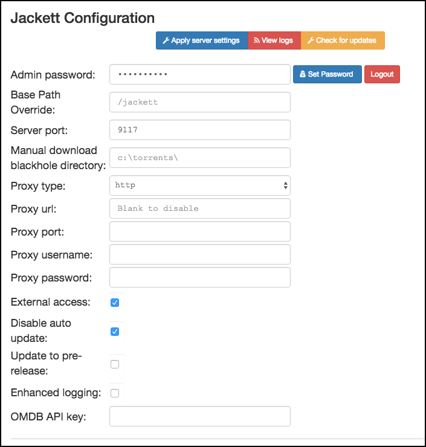

# What is it?

[Jackett](https://github.com/Jackett/Jackett) (based on the original work of Matthew Little aka _zone117x_) is a web-based app that acts like a proxy server, directing search queries from download clients (e.g. Sonarr) to torrent tracker sites and sending the results back. Download clients can also use Jackett to fetch RSS feeds from tracker sites. Finally, it can be used as a meta search tool to find torrents, right from within the app.

| Details     |             |             |             |
|-------------|-------------|-------------|-------------|
| :material-home: Project home | [:octicons-link-16: Docs](https://github.com/Jackett/Jackett/wiki){: .header-icons target=_blank rel="noopener noreferrer" } | [:octicons-mark-github-16: Github](https://github.com/Jackett/Jackett){: .header-icons target=_blank rel="noopener noreferrer" } | [:material-docker: Docker](https://hub.docker.com/r/hotio/jackett){: .header-icons target=_blank rel="noopener noreferrer" }|

_Note: If you don't use torrents, you may just skip this page._

## 1. URL

- To access Jackett, visit `http://jackett._yourdomain.com_`

## 2. Settings

   

### Disabling Auto Update

Under "Jackett Configuration":

1. Check "Disable auto update".

1. Check "External access".

1. Click "Apply server settings".

1. The page will now reload.

## 3. Adding Indexers to Sonarr/Radarr

Under "Configured Indexers":

1. Click "Add Indexer" to add your favorite indexers (i.e. [torrent trackers](../reference/usenet-torrent.md)).

2. When adding indexers into [Sonarr](../apps/sonarr.md#jackett)/[Radarr](../apps/radarr.md#jackett), you will need:

    1. Indexer's Torznab Feed

         - Copy this by clicking on "Copy Torznab Feed" button next to the Indexer.

         - You will need to replace...

           - `https` with `http`

           - `jackett.yourdomain.com` with `jackett:9117`

    2. Jacket API Key

## 4. Next

Are you setting Saltbox up for the first time?  Continue to [Plex Media Server](plex.md).
