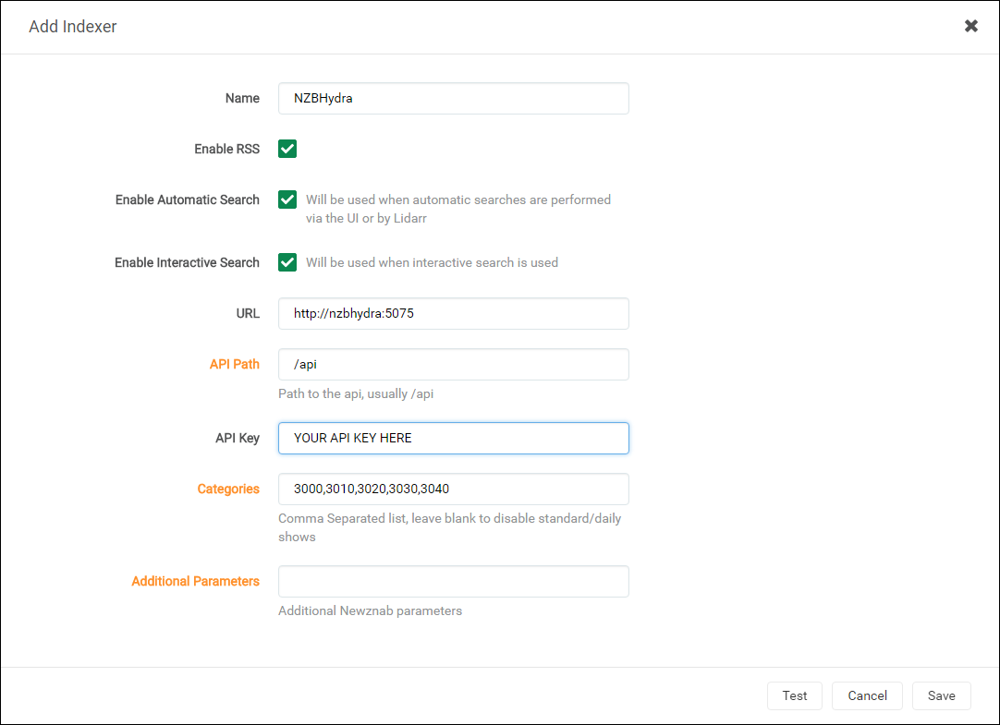
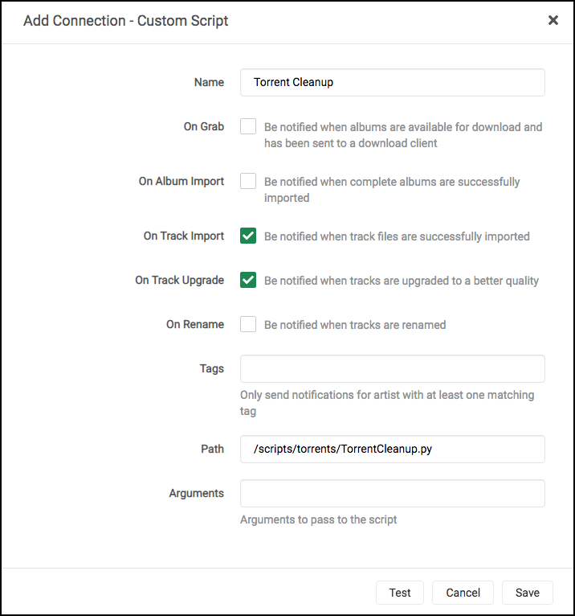
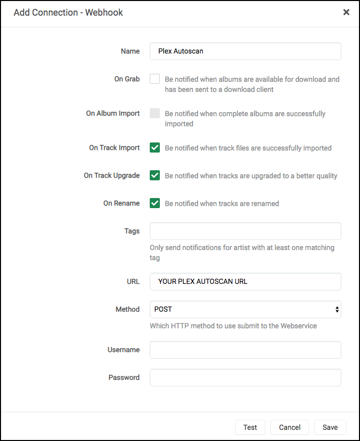

## What is it?

[Lidarr](https://lidarr.audio) is basically Sonarr for music. It functions as a music collection manager for Usenet and BitTorrent users. It can monitor multiple RSS feeds from Bittorrent trackers and Usenet Indexers, looking for new tracks from your favorite artists and will grab, sort and rename them. It can also be configured to automatically upgrade the quality of files already downloaded when a better quality format becomes available.

| Details     |             |             |             |
|-------------|-------------|-------------|-------------|
| [:material-home: Project home ](https://lidarr.audio){: .header-icons target=_blank rel="noopener noreferrer" } | [:octicons-link-16: Docs](https://wiki.servarr.com/){: .header-icons target=_blank rel="noopener noreferrer" } | [:octicons-mark-github-16: Github:](https://github.com/Lidarr/Lidarr){: .header-icons target=_blank rel="noopener noreferrer" } | [:material-docker: Docker ](https://hub.docker.com/r/hotio/lidarr){: .header-icons target=_blank rel="noopener noreferrer" }|

# URL

- To access Lidarr, visit https://lidarr._yourdomain.com_

# Settings

## General

1. Go to "Settings" -> "General".

1. Set "Advanced Settings": `Shown`

### Host

- "Bind Address: `*`

- "Port Number": `8686`

- "URL Base": _blank_

- "Enable SSL": `No` (_SSL is handled by Traefik_)

- "Open browser on start": `No`

### Proxy Settings

- "Use Proxy": `No`

### Logging

- "Log Level": `Debug`

### Analytics

- "Send Anonymous Usage Data": `No` (_your preference_)

### Updates

- "Branch": `develop`

- "Automatic": `Off`

### Save

- Click "Save".

## Media Management

1. Click "Settings" -> "Media Management".

1. Enable "Rename Tracks".

1. Enable "Replace Illegal Characters".

1. Set your preferred naming format (you can use the ones mentioned below).

   

   
Plex's Naming Preference
  

      Example:  
      `01 - Shine On You Crazy Diamond (Parts I-V).m4a`

      Standard Track Format:  
      `{track:00} - {Track Title}`

      Artist Folder Format:  
      `{Artist Name}`

      Album Folder Format:  
      `{Artist Name} - {Album Title}`

      Ref: https://support.plex.tv/articles/categories/media-preparation/naming-and-organizing-music-media/   
   

1. Disable "Analyse audio files".

1. Click "Save".

## Download Client

1. Click "Settings" -> "Download Client".

1. "Completed Download Handling": `Enabled` Selected (_your preference_)

1. "Failed Download Handling": `Redownload` Selected.

### NZBGet

1. Add a new "NZBGet" download client.

1. Add the following:

   1. Name: NZBGet

   1. Enable: `Yes`

   1. Host: `nzbget`

   1. Port: `6789`

   2. Username:  [Your NZBGet Username](nzbget.md#security)

   3. Password:  [Your NZBGet Password](nzbget.md#security)

   4. Category: `lidarr`

   5. Use SSL: `No`

   6. Add Paused: `No`

2. Your settings will now look like this:

    

3. Click "Save" to add NZBGet.

### ruTorrent

1. Add a new "rTorrent" download client.

1. Add the following:

   1. Name: ruTorrent

   1. Enable: `Yes`

   1. Host: `rutorrent`

   1. Port: `80`

   1. URL Path: `RPC2`

   1. Use SSL: `No`

   2. Username: [Your ruTorrent Username](rutorrent.md#login)

   3. Password: [Your ruTorrent Password](rutorrent.md#login)

   4. Category: `lidarr`

   5. Directory: _Leave Blank_

2. Your settings will look like this:

   

3. Click "Save" to add ruTorrent.

## Indexers

1. Go to "Settings" -> "Indexers".

1. Set "Advanced Settings": `Shown`

1. Add in your your favorite [indexers](../saltbox/prerequisites/prerequisites.md#usenet-vs-bittorrent).

### NZBHydra2

1. Click "Settings" -> "Indexers".

2. Click Add Indexer (`+`).

3. Select "Newznab".

4. Add the following:

   1. Name: NZBHydra2

   1. Enable RSS Sync: _Your Preference_

   1. Enable Search: _Your Preference_

   1. URL: `http://nzbhydra2:5076`

   1. API Path: `/api`

   2. API Key: [Your NZBHydra2 API Key](nzbhydra2.md#7-api-key)

   3. Additional Parameters: _Leave Blank_

5. Your settings will look like this:

    

6. Click "Save" to add NZBHydra2.

Note: The "Test" will keep failing until you add an indexer in [NZBHydra2](nzbhydra2.md).

### Jackett

Note: Each Indexer will need to be added separately.

1. Click "Settings" -> "Indexers".

1. Click Add Indexer (`+`)

1. Select "Torznab".

1. Add the following:

   1. Name: Indexer's Name

   1. Enable RSS Sync: _Your Preference_

   1. Enable Search: _Your Preference_

   2. URL: [Indexer's Torznab Feed](jackett.md#3-adding-indexers-to-sonarrradarr)

   3. API Path: `/api`

   4. API Key: [Your Jackett API Key](jackett.md#3-adding-indexers-to-sonarrradarr)

   5. Additional Parameters: _Leave Blank_

2. Your settings will look like this:

    

3. Click "Save" to add the indexer.

## Connect

### Torrent Cleanup

Torrent Cleanup Script is a custom script that will cleanup torrents from ruTorrent that were auto-extracted, but still being seeded. So if the script detects that `.rar` files are in the folder that Lidarr just imported from, it will delete the imported video file(s), leaving just the `.rar` files for seeding.

1. Click "Settings" -> "Connect".

1. Add a new "Custom Script".

1. Add the following:

   1. Name: Torrent Cleanup

   1. On Grab: `No`

   1. On Download: `Yes`

   1. On Upgrade:  `Yes`

   1. On Rename:`No`

   1. Path: `/scripts/torrents/TorrentCleanup.py`

1. The settings will look like this:

   

2. Click "Save" to add the Torrent Cleanup script.

### Plex Autoscan
**Plex Autoscan no longers work with music libraries as of version 1.18, so this feature will not work.**
1. Click "Settings" -> "Connect".

1. Add a new "Webhook".

1. Add the following:

   1. Name: Plex Autoscan

   1. On Grab: `No`

   1. On Download: `Yes`

   1. On Upgrade:  `Yes`

   1. On Rename: `Yes`

   2. URL: [Your Plex Autoscan URL](plex-autoscan.md#4-obtaining-the-plex-autoscan-url)

   3. Method:`POST`

   4. Username: _Leave Blank_

   5. Password: _Leave Blank_

2. The settings will look like this:

    

3. Click "Save" to add Plex Autoscan.

## Music Path

1. When you are ready to add your first artist to Lidarr, click the "Path" drop-down and select "Add a different path".

1. Click the blue "Browse" button, navigate to `/mnt/unionfs/Media/Music`, scroll to the bottom, and select "OK".

1. Click the green "check" button to add the path.

1. All artist added now will have that path set.

## API Key

This is used during the setup of [Organizr](organizr.md).

* Go to "Settings" -> "General" -> "Security" -> "API Key".
