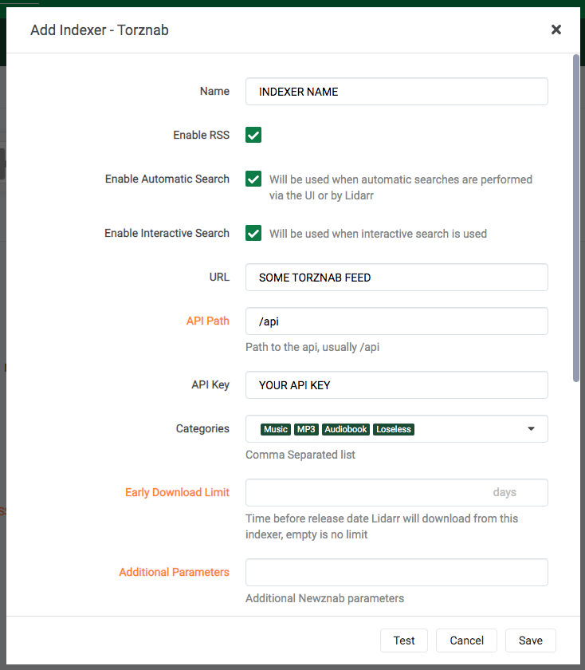
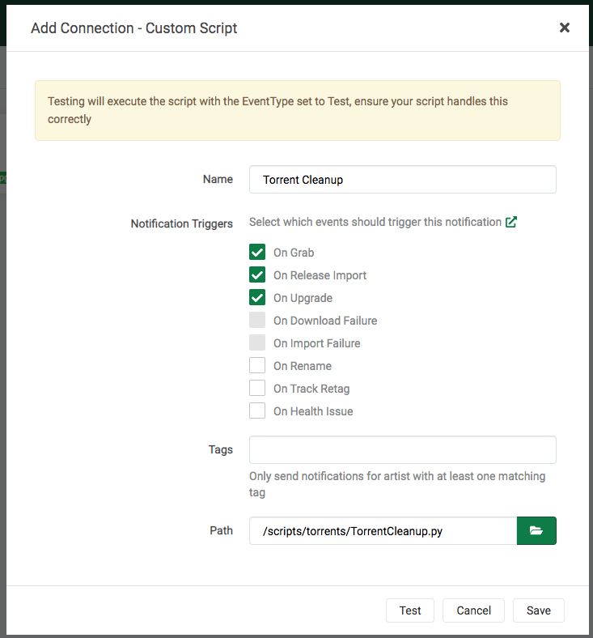
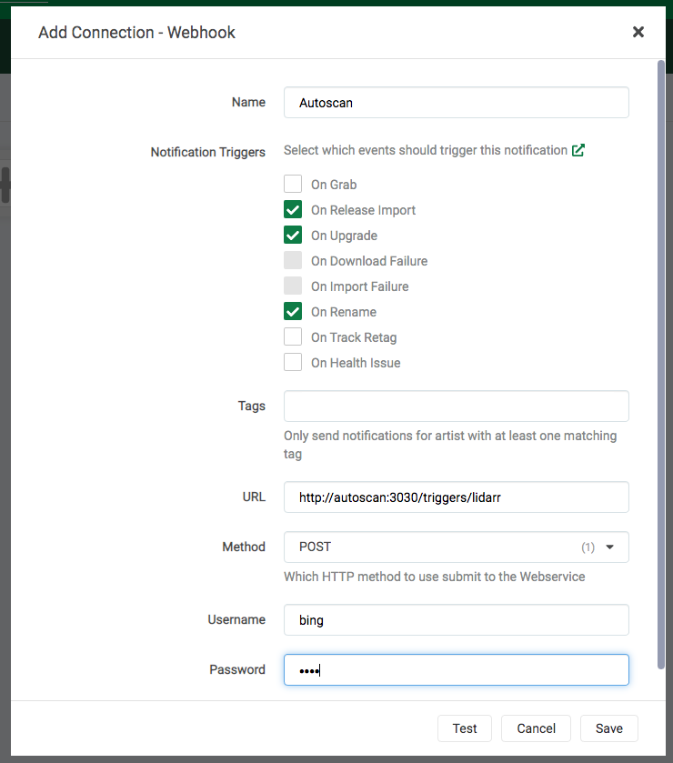

# What is it?

[Lidarr](https://lidarr.audio) is basically Sonarr for music. It functions as a music collection manager for Usenet and BitTorrent users. It can monitor multiple RSS feeds from Bittorrent trackers and Usenet Indexers, looking for new tracks from your favorite artists and will grab, sort and rename them. It can also be configured to automatically upgrade the quality of files already downloaded when a better quality format becomes available.

| Details     |             |             |             |
|-------------|-------------|-------------|-------------|
| [:material-home: Project home](https://lidarr.audio){: .header-icons target=_blank rel="noopener noreferrer" } | [:octicons-link-16: Docs](https://wiki.servarr.com/){: .header-icons target=_blank rel="noopener noreferrer" } | [:octicons-mark-github-16: Github](https://github.com/Lidarr/Lidarr){: .header-icons target=_blank rel="noopener noreferrer" } | [:material-docker: Docker](https://hub.docker.com/r/hotio/lidarr){: .header-icons target=_blank rel="noopener noreferrer" }|

## URL

- To access Lidarr, visit `https://lidarr._yourdomain.com_`

## Settings

Click on "Settings" in the sidebar.  Click "Show Advanced" at the top of the Settings pane.

Make changes in the following sections:

!!! Settings

    === "Media Management"

        These settings control management of media files.

        === "Movie Naming"

            - "Rename Tracks": `Yes`

            - "Replace Illegal Characters": `Yes`

            - Set your preferred naming format; here are some examples.

            <details>
            <summary>Plex's Naming Preference</summary> <br />

            Example: <br />
            ```
            01 - Shine On You Crazy Diamond (Parts I-V).m4a
            ```

            Standard Track Format: <br />
            ```
            {track:00} - {Track Title}
            ```

            Artist Folder Format: <br />
            ```
            {Artist Name}
            ```

            Album Folder Format: <br />
            ```
            {Artist Name} - {Album Title}
            ```

            Reference: https://support.plex.tv/articles/categories/media-preparation/naming-and-organizing-music-media/
            </details>

        === "Folders"

            - "Create empty artist folders": `No`

            - "Delete empty folders": `No`

        === "Importing"

            - "Skip Free Space Check": `No`

            - "Minimum Free Space": `100` (_can be your preference so long as you use a reasonable value_)

            - "Use Hardlinks instead of Copy": `Yes`

            - "Import Extra Files": `Yes` (_can be your preference_)

            - "Extra File Extensions": `srt` (_can be your preference_)

        === "File Management"

            - "Ignore Deleted Tracks": `No` (_can be your preference_)

            - "Propers and Repacks": `Prefer and Upgrade` (_can be your preference_)

            - "Watch Root Folders for file changes": 'Yes'

            - "Rescan Artist Folder after Refresh": `Never`

            - "Allow Fingerprinting": `For new imports only`

            - "Change File Date": `Album Release Date` (_can be your preference_)

            - "Recycle Bin": _blank_ (Rclone deletes are sent to Gdrive trash folder, anyway)

            - "Recycling Bin Cleanup": '0'

        === "Permissions"

            - Set Permissions: `No`

        === "Save"

            - Click "Save".

    === "Indexers"

        These settings control [indexers](../saltbox/prerequisites/prerequisites.md#usenet-or-bittorrent-sources) and related behavior.

        === "NZBHydra2"

            1. Click Add Indexer (`+`).

            2. Select "Newznab".

            3. Add the following:

                Name: NZBHydra2

                Enable RSS Sync: _Your Preference_

                Enable Automatic Search: _Your Preference_

                Enable Interactive Search: _Your Preference_

                URL: `http://nzbhydra2:5076`

                API Key: [Your NZBHydra2 API Key](../apps/nzbhydra2.md)

                Early Download Limit: _Your Preference_

                Additional Parameters: _Leave Blank_

            4. Your settings will look like this:

                

            5. Click "Save" to add NZBHydra2.

            Note: The "Test" will keep failing until you add an indexer in [NZBHydra2](../apps/nzbhydra2.md).

        === "Jackett"

            Note: Each Indexer you have defined in Jackett will need to be added separately.

            1. Click Add Indexer (`+`)

            2. Select "Torznab".

            3. Add the following:

                Name: Indexer Name

                Enable RSS Sync: _Your Preference_

                Enable Automatic Search: _Your Preference_

                Enable Interactive Search: _Your Preference_

                URL: [Indexer's Torznab Feed](../apps/jackett.md)

                API Key: [Your Jackett API Key](../apps/jackett.md)

                Early Download Limit: _Your Preference_

                Additional Parameters: _Leave Blank_

            4. Your settings will look like this:

                

            5. Click "Save" to add the indexer.


    === "Download Clients"

        These settings control downloading behavior and clients.

        === "Completed Download Handling"

            - "Enable": `Yes`

            - "Remove": `Yes` (_can be your preference_)

        === "Failed Download Handling"

            - "Redownload": `Yes`

            - "Remove": `Yes`

        === "NZBGet"

            1. Click Add (`+`)

            2. Add a new "NZBGet" download client.

            3. Add the following:

                Name: NZBGet

                Enable: `Yes`

                Host: `nzbget`

                Port: `6789`

                Username:  [Your NZBGet Username](../apps/nzbget.md)

                Password:  [Your NZBGet Password](../apps/nzbget.md)

                Category: `lidarr`

                Use SSL: `No`

                Add Paused: `No`

            4. Your settings will look like this:

                

            5. Click "Save" to add NZBGet.

        === "ruTorrent"

            1. Click Add (`+`)

            2. Add a new "rTorrent" download client.

            3. Add the following:

                Name: ruTorrent

                Enable: `Yes`

                Host: `rutorrent`

                Port: `80`

                URL Path: `RPC2`

                Use SSL: `No`

                Username: [Your ruTorrent Username](../apps/rutorrent.md)

                Password: [Your ruTorrent Password](../apps/rutorrent.md)

                Category: `lidarr`

                Directory: _Leave Blank_

            4.  Your settings will now look like this:

                

            5. Click "Save" to add ruTorrent.

        === "qBittorrent"

            1. Click Add ('+')

            2. Add a new "qBittorrent" download client.

            3. Add the following:

                Name: qBittorrent

                Enable: 'Yes'

                Host: 'qBittorrent'

                Port: '8080'

                Username: [Your qBittorrent Username](../apps/qbittorrent.md)

                Password: [Your qBittorrent Password](../apps/qbittorrent.md)

                Category: 'lidarr'

            4.  Your settings will now look like this:

                

            5.  Click "Save" to add qBittorrent qb

    === "Connect"

        These settings control connections to other applications or systems.

        === "Torrent Cleanup"

            Torrent Cleanup Script is a custom script that will clean up torrents from ruTorrent that were auto-extracted, but still being seeded. So if the script detects that `.rar` files are in the folder that Radarr just imported from, it will delete the imported audio file(s), leaving just the `.rar` files for seeding.

            1. Click "Settings" -> "Connect".

            2. Add a new "Custom Script".

            3. Add the following:

                Name: Torrent Cleanup

                On Grab: `No`

                On Release Import: `Yes`

                On Upgrade:  `Yes`

                On Rename:`No`

                Path: `/scripts/torrents/TorrentCleanup.py`

            4. The settings will look like this:

                

            5. Click "Save" to add the Torrent Cleanup script.

        === "Autoscan"

            1. Click "Settings" -> "Connect".

            2. Add a new "Webhook".

            3. Add the following:

                Name: Autoscan

                On Grab: `No`

                On Release Import: `Yes`

                On Upgrade:  `Yes`

                On Rename: `Yes`

                On Track Retag: `No`

                On Health Issue: `No`

                Tags: _Leave Blank_

                URL: `http://autoscan:3030/triggers/lidarr`

                Method:`POST`

                Username: AS SET IN AUTOSCAN CONFIG [defaults to Saltbox Username]

                Password: AS SET IN AUTOSCAN CONFIG [defaults to Saltbox Password]

            4. The settings will look like this:

                

            5. Click "Save" to add Autoscan.

    === "General"

        These settings control general aspects of Radarr.

        === "Start-Up"

            - "Bind Address: `*`

            - "Port Number": `8686`

            - "URL Base": _blank_

            - "Enable SSL": `No` (_SSL is handled by Traefik_)

            - "Open browser on start": `No`

        === "Proxy Settings"

            - "Use Proxy": `No`

        === "Logging"

            - "Log Level": `Debug`

        === "Analytics"

            - "Send Anonymous Usage Data": `No` (_your preference_)

        === "Updates"

            - "Branch": `develop`

            - "Automatic": `Off`

        === "Save"

            - Click "Save".

## Music Path

1. When you are ready to add your first artist to Lidarr, click the "Path" drop-down and select "Add a different path".

1. Click the blue "Browse" button, navigate to `/mnt/unionfs/Media/Music`, scroll to the bottom, and select "OK".

1. Click the green "check" button to add the path.

1. All artists added now will have that path set.

## API Key

This is used during the setup of [Organizr](organizr.md).

- Go to "Settings" -> "General" -> "Security" -> "API Key".

## Next

Are you setting Saltbox up for the first time?  Continue to [Tautulli](tautulli.md).
