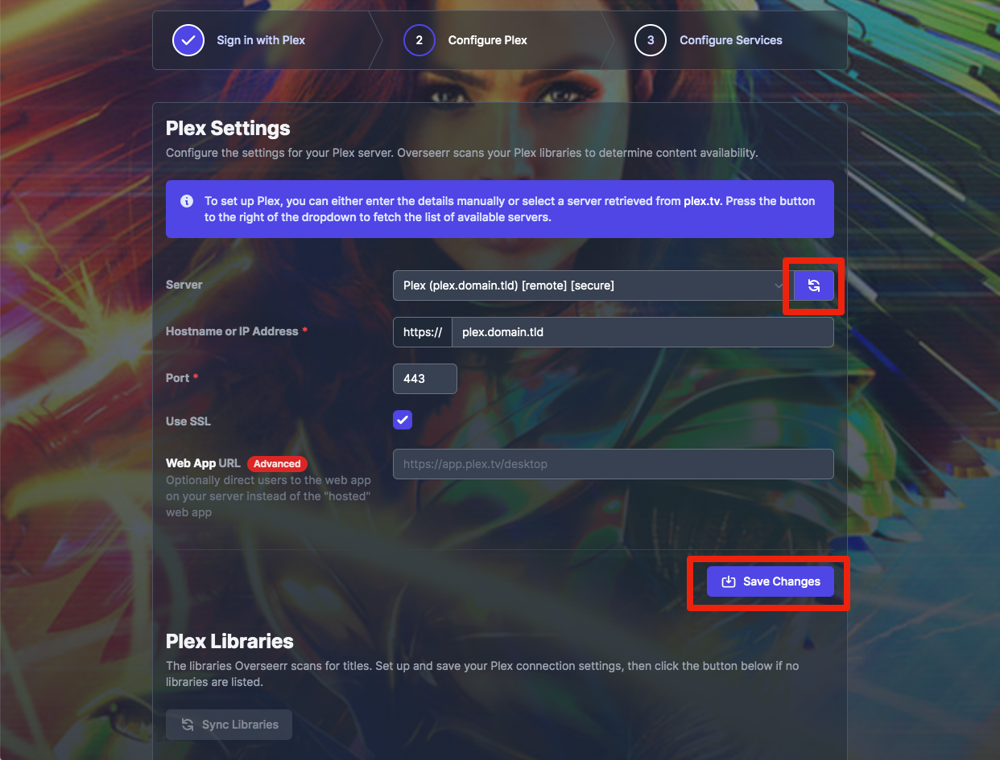
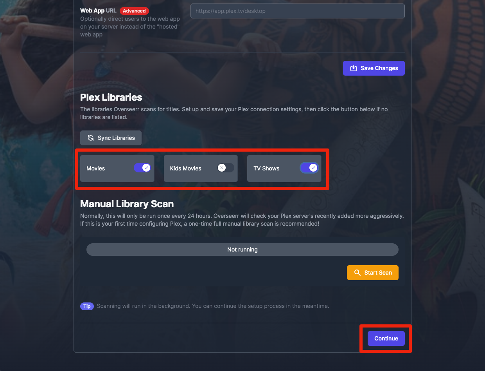
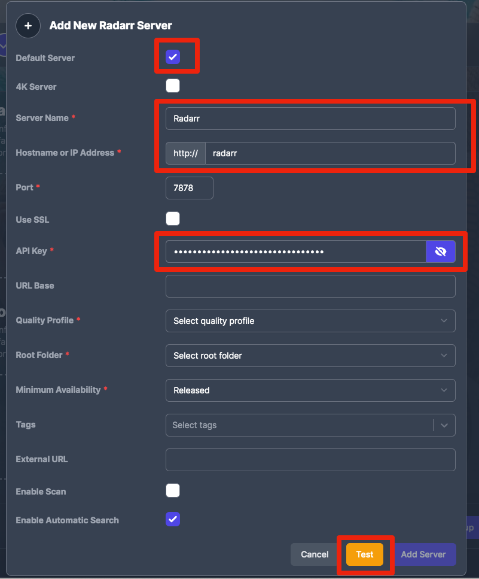
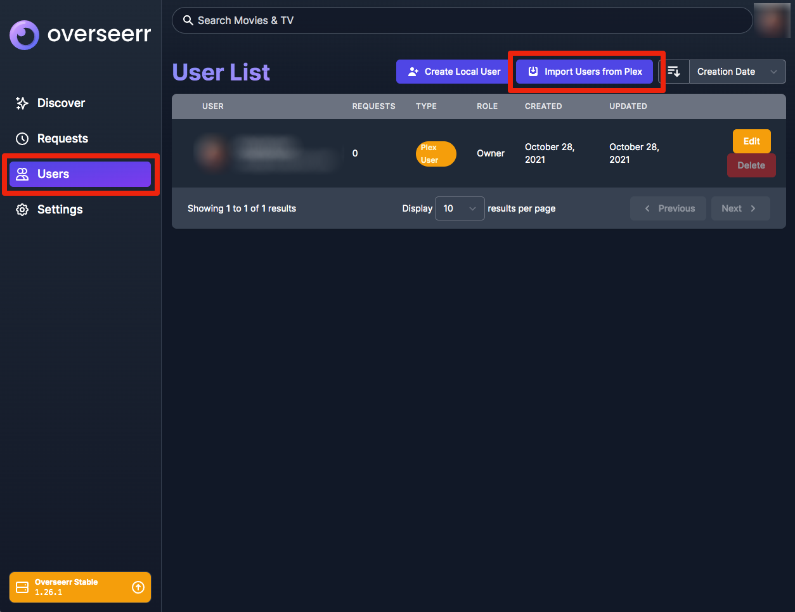
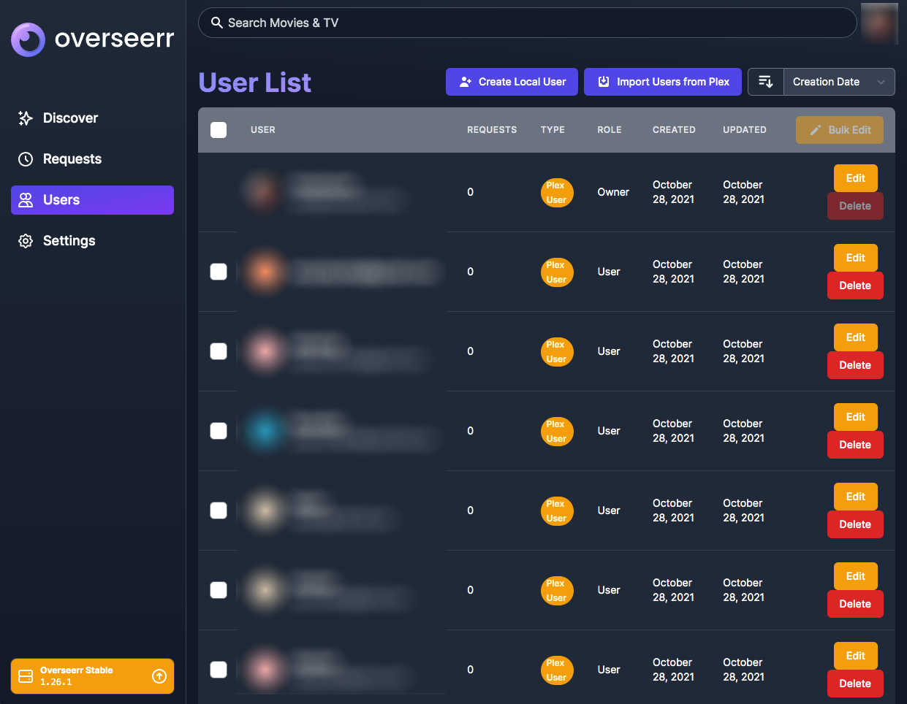

# What is it?

[Overseerr](https://overseerr.dev/) is a request management and media discovery tool built to work with your existing Plex ecosystem.

| Details     |             |             |             |
|-------------|-------------|-------------|-------------|
| [:material-home: Project home](https://overseerr.dev/){: .header-icons target=_blank rel="noopener noreferrer" } | [:octicons-link-16: Docs](https://docs.overseerr.dev/){: .header-icons target=_blank rel="noopener noreferrer" } | [:octicons-mark-github-16: Github](https://github.com/sct/overseerr){: .header-icons target=_blank rel="noopener noreferrer" } | [:material-docker: Docker](https://hub.docker.com/r/sctx/overseerr){: .header-icons target=_blank rel="noopener noreferrer" }|

## 1. URL

- To access Overseerr, visit `https://overseerr._yourdomain.com_`

## 2. Settings

This setup needs to take place **AFTER** you've set up Plex, Radarr, and Sonarr, since it involves connections to all three of those.

You will need your API Keys from both Radarr and Sonarr.

1. Click "Sign In" and sign into your Plex account.

1. Click the "refresh" icon, then select your Plex server from the dropdown.  Click "Save Changes" to retrieve the libraries from Plex.

1. Scroll down and flip the switch on the libraries you want to expose for requests and discovery.  Click "Continue".

1. Click "Add Radarr Server".

1. On this screen:
    1. Check "Default server"
    2. Enter a name
    3. Enter `radarr` as the hostname
    4. Enter your Radarr API Key
    5. Click "Test" to connect to Radarr and retrieve Quality Profiles, etc.

1. Select a Quality, Root Folder, and Minimum Availability, then click "Add Server".  This will return you to the screen from the previous step. Click "Add Sonarr Server"

1. On this screen:
    1. Check "Default server"
    2. Enter a name
    3. Enter `sonarr` as the hostname
    4. Enter your Sonarr API Key
    5. Scroll down and click "Test" to connect to Sonarr and retrieve Quality Profiles, etc.

1. Select a Quality, Root Folder, and Minimum Availability for standard and Anime series.  Click  "Add Server".

1. Click "Finish Setup"

1. Click "Settings" over on the left.

1. Click "Users" on the left, then "Import Users From Plex"

1. Setup is complete.

## 3. Next

Are you setting Saltbox up for the first time?  Continue to [Portainer](portainer.md).
