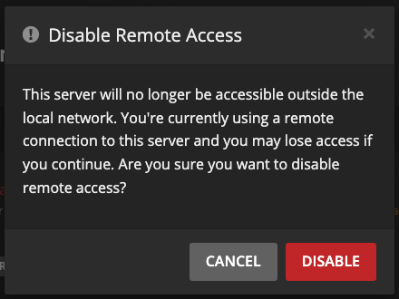

<!-- BEGIN SALTBOX MANAGED OVERVIEW SECTION -->
<!-- This section is managed by sb-docs - DO NOT EDIT MANUALLY -->
# Plex Media Server

## Overview

[Plex Media Server](https://www.plex.tv/personal-media-server) is a software application that allows you to organize and stream your collection of movies, TV shows, music, and photos, from a central location to various devices.


<div class="grid grid--buttons" markdown data-search-exclude>

[:material-bookshelf:**Manual**](https://support.plex.tv/articles/categories/plex-media-server){ .md-button .md-button--stretch }

[:fontawesome-brands-docker:**Releases**](https://hub.docker.com/r/plexinc/pms-docker/tags){ .md-button .md-button--stretch }

[:material-plex:**Community**](https://forums.plex.tv){ .md-button .md-button--stretch }

</div>

---
<!-- END SALTBOX MANAGED OVERVIEW SECTION -->

!!! abstract cta "Saltbox Setup Process"

    <div data-search-exclude>

    <div>

    Opting for another media server solution?

    <div>

    [**Explore alternatives**:material-shuffle-variant:](index.md#media-server){ .md-button }

    [**Skip to Autoscan**:material-fast-forward:](autoscan.md){ .md-button }

    </div>

    </div>

    </div>

## Deployment

```shell
sb install plex
```

## Usage

Visit <https://plex.iYOUR_DOMAIN_NAMEi>.

2.  Login with your Plex account

    

## Basics

### Setup Wizard

1.  First time you log in, you will be presented with a welcome screen. Click "GOT IT!" to continue.

    

2.  Next screen will show you your server, with a randomly generated name. Give it a friendly name and click "NEXT".

    

3.  On the next screen, click "NEXT" (we will add Libraries later).

    

4.  Click "DONE".

    

!!! info "Settings"

    === "Library"

        1. Click the Settings icon (top right) &rightarrow; "Server" (top) &rightarrow; "Library" (left). Click "SHOW ADVANCED" in the upper right.

        2. Set the following:

            - "Empty trash automatically after every scan": `enabled`

                - THIS IS A CHANGE FROM WHEN _Plex Autoscan_ WAS THE DEFAULT

                - Autoscan is now the default scan app, and it does not empty trash

            - "Allow media deletion": `enabled`

            - "Generate video preview thumbnails": `never`

            - "Generate intro video markers": `never`

            - "Generate chapter thumbnails": `never`

            - "Analyze audio tracks for loudness": `never`

            - "Analyze audio tracks for sonic features": `never`

                > The reasoning behind disabling these things is mostly related to Google Drive API usage, data transfer, and disk space. Accessing large portions of a given video file to generate thumbnails *may* generate large numbers of Google Drive API calls, and large amounts of data transfer. Either of these things *may* result in your account suffering one of the various types of 24-hour bans Google hands out, which *may* prevent your server from playing media at all. Also, storing these images *will* greatly inflate the size of `/opt/plex`, which can affect the speed of backups, your ability to download, and anything else related to disk space usage. These are generally considered Bad Things, so the recommendation is to avoid the possibility by turning these options off.

         1. Click "SAVE CHANGES".

            

    === "Network"

        1. Click the Settings icon (top right) &rightarrow; "Server" (top) &rightarrow; "Network" (left).

        2. Set the following:

            - "Secure Connections": `Preferred`.

            - "Enable local network discovery (GDM)": `disabled`.

            - "Remote streams allowed per user": _your preference_.

            - "Custom server access URLs" will be prefilled; do not edit this field as it will be overwritten.

         1. Click "SAVE CHANGES".

            

    === "Transcoder"

        1. Click the Settings icon (top right) &rightarrow; "Server" (top) &rightarrow; "Transcoder" (left).

        2. Set the following:

            - "Transcoder temporary directory": `/transcode`

            - "Transcoder default throttle buffer": `150`

            - "Use hardware acceleration when available": `enabled`

            - "Maximum simultaneous video transcode": `unlimited`

        3. Click "SAVE CHANGES".

            

    === "DLNA"

        1. Click the Settings icon (top right) &rightarrow; "Server" (top) &rightarrow; "DLNA" (left).

        2. Set the following:

            - "Enable the DLNA server": `disabled`

            - "DLNA server timeline reporting": `disabled`

        3. Click "SAVE CHANGES".

            

    === "Scheduled Tasks"

        1. Click the Settings icon (top right) &rightarrow; "Server" (top) &rightarrow; "Scheduled Tasks" (left).

        2. Set the following:

            - "Update all libraries during maintenance": `disabled`

            - "Upgrade media analysis during maintenance": `disabled`

            - "Perform extensive media analysis during maintenance": `disabled`

        3. Click "SAVE CHANGES".

            

    === "Remote Access"

        1. Click the Settings icon (top right) &rightarrow; "Server" (top) &rightarrow; "Remote Access" (left).

        2. Click the grey button labelled "Disable Remote Access"

            - You will see a scary warning. You are sure, so click the red "Disable" button.

            

### Add Media Libraries

In this section, we will add two libraries: one for Movies and one for TV.

_Note: If you would like to have custom Plex libraries (more than just a Movies and TV one), see [Customizing Plex Libraries](../reference/customizing-plex-libs.md)._

!!! info "Libraries"

    === "Add the Movie Library"

        1. In the main Plex screen (Home icon on the top left), click "+" next to "LIBRARIES".

            

        2. In the "Add Library" window, select "Movies" and click "NEXT".

            

        3. Click "BROWSE FOR MEDIA FOLDER".

            

        4. Navigate to `/mnt/unionfs/Media/Movies`, and then click the "ADD" button.

            

        5. You will now see `/mnt/unionfs/Media/Movies` in the text box (don't click "ADD LIBRARY" yet).

            

        6. Click "Advanced" on the left.

        7. Set the following:

            - "Enable Cinema Trailers": `disabled` (optional)

            - "Enable video preview thumbnails": `disabled`

            - "Find trailers and extras automatically (Plex Pass required)": `disabled` (optional)

        8. Click "ADD LIBRARY".

            

    === "Add the TV Library"

        1. In the main Plex screen (Home icon on the top left), click "+" next to "LIBRARIES".

            

        2. In the "Add Library" window, select "TV Shows" and click "NEXT".

            

        3. Click "BROWSE FOR MEDIA FOLDER".

            

        4. Navigate to `/mnt/unionfs/Media/TV`, and then click the "ADD" button.

            

        5. You will now see `/mnt/unionfs/Media/TV` in the text box (don't click "ADD LIBRARY" yet).

            

        6. Click "Advanced" on the left.

        7. Set the following:

            - "Enable video preview thumbnails": `disabled`

            - "Find trailers and extras automatically (Plex Pass required)": `disabled` (optional)

        8. Click "ADD LIBRARY".

            

### Scan Media libraries

As mentioned in the [Introduction](../saltbox/basics/basics.md) page, [Autoscan](autoscan.md) will automatically scan the media files into Plex as they are downloaded, but this will require the Plex database to not be completely empty. So for every new library that is added, a one-time, manual scan is required.

To do so:

1.  Click the 3 dots next to a Plex library.

2.  Select "Scan Library Files".

    

3.  Repeat steps 1-2 for each library.

## Next

<div class="sb-cta" markdown>

Are you Setting Saltbox up for the first time?

<div markdown>

[**Continue to Tautulli**:material-forward:](tautulli.md){ .md-button }

</div>

</div>

<!-- BEGIN SALTBOX MANAGED VARIABLES SECTION -->
<!-- This section is managed by sb-docs - DO NOT EDIT MANUALLY -->
## Role Defaults

!!! info
    Variables can be overridden in `/srv/git/saltbox/inventories/host_vars/localhost.yml`.

    This role supports multiple instances via `plex_instances`.

    ```yaml { .sb-show-on-unchecked title="Applies to all instances of plex:" }
    plex_role_web_subdomain: "custom"
    ```

    ```yaml { .sb-show-on-checked title="Applies to a specific instance (e.g., `plex2`):" }
    plex2_web_subdomain: "custom2"
    ```

<label class="md-button md-button--stretch" for="sb-checkbox--var-level">
   <input type="checkbox" id="sb-checkbox--var-level"><span class="sb-show-on-unchecked">Show instance-level variables</span><span class="sb-show-on-checked">Show role-level variables</span>
</label>

??? warning "Avoid overriding variables ending in `_default`"

    When overriding variables that end in `_default` (like `plex_docker_envs_default`), you replace the entire default configuration. Future updates that add new default values will not be applied to your setup, potentially breaking functionality.

    Instead, use the corresponding `_custom` variable (like `plex_docker_envs_custom`) to add your changes. Custom values are merged with defaults, ensuring you receive updates.

=== "Basics"

    ??? variable list "`plex_instances`"

        ```yaml
        # Type: list
        plex_instances: ["plex"]
        ```

        !!! example "Example Override"

            ```yaml
            # Type: list
            plex_instances: ["plex", "plex2"]
            ```

=== "Settings"

    ??? variable bool "`plex_role_open_main_ports`{ .sb-show-on-unchecked }`plex2_open_main_ports`{ .sb-show-on-checked }"

        ```yaml { .sb-show-on-unchecked }
        # Do not enable globally if deploying multiple instances
        # Type: bool (true/false)
        plex_role_open_main_ports: false
        ```

        ```yaml { .sb-show-on-checked }
        # Do not enable globally if deploying multiple instances
        # Type: bool (true/false)
        plex2_open_main_ports: false
        ```

    ??? variable bool "`plex_role_open_local_ports`{ .sb-show-on-unchecked }`plex2_open_local_ports`{ .sb-show-on-checked }"

        ```yaml { .sb-show-on-unchecked }
        # Do not enable globally if deploying multiple instances
        # Type: bool (true/false)
        plex_role_open_local_ports: false
        ```

        ```yaml { .sb-show-on-checked }
        # Do not enable globally if deploying multiple instances
        # Type: bool (true/false)
        plex2_open_local_ports: false
        ```

    ??? variable bool "`plex_role_insecure`{ .sb-show-on-unchecked }`plex2_insecure`{ .sb-show-on-checked }"

        ```yaml { .sb-show-on-unchecked }
        # Disables Traefik's HTTP to HTTPS redirect for Plex
        # Allows older clients with certificate issues to connect insecurely
        # Type: bool (true/false)
        plex_role_insecure: false
        ```

        ```yaml { .sb-show-on-checked }
        # Disables Traefik's HTTP to HTTPS redirect for Plex
        # Allows older clients with certificate issues to connect insecurely
        # Type: bool (true/false)
        plex2_insecure: false
        ```

    ??? variable string "`plex_role_lan_ip`{ .sb-show-on-unchecked }`plex2_lan_ip`{ .sb-show-on-checked }"

        ```yaml { .sb-show-on-unchecked }
        # Adds the IP specified here to the advertised URLs Plex broadcasts to clients
        # Useful to avoid traffic going through your WAN when hairpin NAT is not available
        # Type: string
        plex_role_lan_ip: ""
        ```

        ```yaml { .sb-show-on-checked }
        # Adds the IP specified here to the advertised URLs Plex broadcasts to clients
        # Useful to avoid traffic going through your WAN when hairpin NAT is not available
        # Type: string
        plex2_lan_ip: ""
        ```

    ??? variable string "`plex_role_auth_token_proxy`{ .sb-show-on-unchecked }`plex2_auth_token_proxy`{ .sb-show-on-checked }"

        ```yaml { .sb-show-on-unchecked }
        # Example value "http://gluetun:8888"
        # Type: string
        plex_role_auth_token_proxy: ""
        ```

        ```yaml { .sb-show-on-checked }
        # Example value "http://gluetun:8888"
        # Type: string
        plex2_auth_token_proxy: ""
        ```

=== "Web"

    ??? variable string "`plex_role_web_subdomain`{ .sb-show-on-unchecked }`plex2_web_subdomain`{ .sb-show-on-checked }"

        ```yaml { .sb-show-on-unchecked }
        # Type: string
        plex_role_web_subdomain: "{{ plex_name }}"
        ```

        ```yaml { .sb-show-on-checked }
        # Type: string
        plex2_web_subdomain: "{{ plex_name }}"
        ```

    ??? variable string "`plex_role_web_domain`{ .sb-show-on-unchecked }`plex2_web_domain`{ .sb-show-on-checked }"

        ```yaml { .sb-show-on-unchecked }
        # Type: string
        plex_role_web_domain: "{{ user.domain }}"
        ```

        ```yaml { .sb-show-on-checked }
        # Type: string
        plex2_web_domain: "{{ user.domain }}"
        ```

    ??? variable string "`plex_role_web_port`{ .sb-show-on-unchecked }`plex2_web_port`{ .sb-show-on-checked }"

        ```yaml { .sb-show-on-unchecked }
        # Type: string
        plex_role_web_port: "32400"
        ```

        ```yaml { .sb-show-on-checked }
        # Type: string
        plex2_web_port: "32400"
        ```

    ??? variable string "`plex_role_web_http_port`{ .sb-show-on-unchecked }`plex2_web_http_port`{ .sb-show-on-checked }"

        ```yaml { .sb-show-on-unchecked }
        # Type: string
        plex_role_web_http_port: "32400"
        ```

        ```yaml { .sb-show-on-checked }
        # Type: string
        plex2_web_http_port: "32400"
        ```

    ??? variable string "`plex_role_web_url`{ .sb-show-on-unchecked }`plex2_web_url`{ .sb-show-on-checked }"

        ```yaml { .sb-show-on-unchecked }
        # Type: string
        plex_role_web_url: "{{ 'https://' + (lookup('role_var', '_web_subdomain', role='plex') + '.' + lookup('role_var', '_web_domain', role='plex')
                            if (lookup('role_var', '_web_subdomain', role='plex') | length > 0)
                            else lookup('role_var', '_web_domain', role='plex')) }}"
        ```

        ```yaml { .sb-show-on-checked }
        # Type: string
        plex2_web_url: "{{ 'https://' + (lookup('role_var', '_web_subdomain', role='plex') + '.' + lookup('role_var', '_web_domain', role='plex')
                        if (lookup('role_var', '_web_subdomain', role='plex') | length > 0)
                        else lookup('role_var', '_web_domain', role='plex')) }}"
        ```

    ??? variable string "`plex_role_web_insecure_url`{ .sb-show-on-unchecked }`plex2_web_insecure_url`{ .sb-show-on-checked }"

        ```yaml { .sb-show-on-unchecked }
        # Type: string
        plex_role_web_insecure_url: "{{ 'http://' + (lookup('role_var', '_web_subdomain', role='plex') + '.' + lookup('role_var', '_web_domain', role='plex')
                                     if (lookup('role_var', '_web_subdomain', role='plex') | length > 0)
                                     else lookup('role_var', '_web_domain', role='plex')) }}"
        ```

        ```yaml { .sb-show-on-checked }
        # Type: string
        plex2_web_insecure_url: "{{ 'http://' + (lookup('role_var', '_web_subdomain', role='plex') + '.' + lookup('role_var', '_web_domain', role='plex')
                                 if (lookup('role_var', '_web_subdomain', role='plex') | length > 0)
                                 else lookup('role_var', '_web_domain', role='plex')) }}"
        ```

=== "DNS"

    ??? variable string "`plex_role_dns_record`{ .sb-show-on-unchecked }`plex2_dns_record`{ .sb-show-on-checked }"

        ```yaml { .sb-show-on-unchecked }
        # Type: string
        plex_role_dns_record: "{{ lookup('role_var', '_web_subdomain', role='plex') }}"
        ```

        ```yaml { .sb-show-on-checked }
        # Type: string
        plex2_dns_record: "{{ lookup('role_var', '_web_subdomain', role='plex') }}"
        ```

    ??? variable string "`plex_role_dns_zone`{ .sb-show-on-unchecked }`plex2_dns_zone`{ .sb-show-on-checked }"

        ```yaml { .sb-show-on-unchecked }
        # Type: string
        plex_role_dns_zone: "{{ lookup('role_var', '_web_domain', role='plex') }}"
        ```

        ```yaml { .sb-show-on-checked }
        # Type: string
        plex2_dns_zone: "{{ lookup('role_var', '_web_domain', role='plex') }}"
        ```

    ??? variable bool "`plex_role_dns_proxy`{ .sb-show-on-unchecked }`plex2_dns_proxy`{ .sb-show-on-checked }"

        ```yaml { .sb-show-on-unchecked }
        # Type: bool (true/false)
        plex_role_dns_proxy: "{{ dns_proxied }}"
        ```

        ```yaml { .sb-show-on-checked }
        # Type: bool (true/false)
        plex2_dns_proxy: "{{ dns_proxied }}"
        ```

=== "Traefik"

    ??? variable string "`plex_role_traefik_sso_middleware`{ .sb-show-on-unchecked }`plex2_traefik_sso_middleware`{ .sb-show-on-checked }"

        ```yaml { .sb-show-on-unchecked }
        # Type: string
        plex_role_traefik_sso_middleware: ""
        ```

        ```yaml { .sb-show-on-checked }
        # Type: string
        plex2_traefik_sso_middleware: ""
        ```

    ??? variable string "`plex_role_traefik_middleware_default`{ .sb-show-on-unchecked }`plex2_traefik_middleware_default`{ .sb-show-on-checked }"

        ```yaml { .sb-show-on-unchecked }
        # Type: string
        plex_role_traefik_middleware_default: "{{ traefik_default_middleware
                                                  + (',themepark-' + plex_name
                                                    if (lookup('role_var', '_themepark_enabled', role='plex') and global_themepark_plugin_enabled)
                                                    else '') }}"
        ```

        ```yaml { .sb-show-on-checked }
        # Type: string
        plex2_traefik_middleware_default: "{{ traefik_default_middleware
                                              + (',themepark-' + plex_name
                                                if (lookup('role_var', '_themepark_enabled', role='plex') and global_themepark_plugin_enabled)
                                                else '') }}"
        ```

    ??? variable string "`plex_role_traefik_middleware_custom`{ .sb-show-on-unchecked }`plex2_traefik_middleware_custom`{ .sb-show-on-checked }"

        ```yaml { .sb-show-on-unchecked }
        # Type: string
        plex_role_traefik_middleware_custom: ""
        ```

        ```yaml { .sb-show-on-checked }
        # Type: string
        plex2_traefik_middleware_custom: ""
        ```

    ??? variable string "`plex_role_traefik_certresolver`{ .sb-show-on-unchecked }`plex2_traefik_certresolver`{ .sb-show-on-checked }"

        ```yaml { .sb-show-on-unchecked }
        # Type: string
        plex_role_traefik_certresolver: "{{ traefik_default_certresolver }}"
        ```

        ```yaml { .sb-show-on-checked }
        # Type: string
        plex2_traefik_certresolver: "{{ traefik_default_certresolver }}"
        ```

    ??? variable bool "`plex_role_traefik_enabled`{ .sb-show-on-unchecked }`plex2_traefik_enabled`{ .sb-show-on-checked }"

        ```yaml { .sb-show-on-unchecked }
        # Type: bool (true/false)
        plex_role_traefik_enabled: true
        ```

        ```yaml { .sb-show-on-checked }
        # Type: bool (true/false)
        plex2_traefik_enabled: true
        ```

    ??? variable bool "`plex_role_traefik_api_enabled`{ .sb-show-on-unchecked }`plex2_traefik_api_enabled`{ .sb-show-on-checked }"

        ```yaml { .sb-show-on-unchecked }
        # Type: bool (true/false)
        plex_role_traefik_api_enabled: false
        ```

        ```yaml { .sb-show-on-checked }
        # Type: bool (true/false)
        plex2_traefik_api_enabled: false
        ```

    ??? variable string "`plex_role_traefik_api_endpoint`{ .sb-show-on-unchecked }`plex2_traefik_api_endpoint`{ .sb-show-on-checked }"

        ```yaml { .sb-show-on-unchecked }
        # Type: string
        plex_role_traefik_api_endpoint: ""
        ```

        ```yaml { .sb-show-on-checked }
        # Type: string
        plex2_traefik_api_endpoint: ""
        ```

    ??? variable bool "`plex_role_traefik_error_pages_enabled`{ .sb-show-on-unchecked }`plex2_traefik_error_pages_enabled`{ .sb-show-on-checked }"

        ```yaml { .sb-show-on-unchecked }
        # Type: bool (true/false)
        plex_role_traefik_error_pages_enabled: false
        ```

        ```yaml { .sb-show-on-checked }
        # Type: bool (true/false)
        plex2_traefik_error_pages_enabled: false
        ```

    ??? variable bool "`plex_role_traefik_gzip_enabled`{ .sb-show-on-unchecked }`plex2_traefik_gzip_enabled`{ .sb-show-on-checked }"

        ```yaml { .sb-show-on-unchecked }
        # Type: bool (true/false)
        plex_role_traefik_gzip_enabled: false
        ```

        ```yaml { .sb-show-on-checked }
        # Type: bool (true/false)
        plex2_traefik_gzip_enabled: false
        ```

    ??? variable string "`plex_role_traefik_middleware_http_insecure`{ .sb-show-on-unchecked }`plex2_traefik_middleware_http_insecure`{ .sb-show-on-checked }"

        ```yaml { .sb-show-on-unchecked }
        # Type: string
        plex_role_traefik_middleware_http_insecure: "{{ lookup('role_var', '_insecure', role='plex') | bool }}"
        ```

        ```yaml { .sb-show-on-checked }
        # Type: string
        plex2_traefik_middleware_http_insecure: "{{ lookup('role_var', '_insecure', role='plex') | bool }}"
        ```

    ??? variable string "`plex_role_web_serverstransport`{ .sb-show-on-unchecked }`plex2_web_serverstransport`{ .sb-show-on-checked }"

        ```yaml { .sb-show-on-unchecked }
        # Type: string
        plex_role_web_serverstransport: "skipverify@file"
        ```

        ```yaml { .sb-show-on-checked }
        # Type: string
        plex2_web_serverstransport: "skipverify@file"
        ```

=== "Theme"

    ??? variable bool "`plex_role_themepark_enabled`{ .sb-show-on-unchecked }`plex2_themepark_enabled`{ .sb-show-on-checked }"

        ```yaml { .sb-show-on-unchecked }
        # Type: bool (true/false)
        plex_role_themepark_enabled: false
        ```

        ```yaml { .sb-show-on-checked }
        # Type: bool (true/false)
        plex2_themepark_enabled: false
        ```

    ??? variable string "`plex_role_themepark_theme`{ .sb-show-on-unchecked }`plex2_themepark_theme`{ .sb-show-on-checked }"

        ```yaml { .sb-show-on-unchecked }
        # Options can be found at https://docs.theme-park.dev/themes/plex/
        # Type: string
        plex_role_themepark_theme: "{{ global_themepark_theme }}"
        ```

        ```yaml { .sb-show-on-checked }
        # Options can be found at https://docs.theme-park.dev/themes/plex/
        # Type: string
        plex2_themepark_theme: "{{ global_themepark_theme }}"
        ```

    ??? variable string "`plex_role_themepark_domain`{ .sb-show-on-unchecked }`plex2_themepark_domain`{ .sb-show-on-checked }"

        ```yaml { .sb-show-on-unchecked }
        # Allows you to override the url where CSS files can be found
        # Type: string
        plex_role_themepark_domain: "{{ global_themepark_domain }}"
        ```

        ```yaml { .sb-show-on-checked }
        # Allows you to override the url where CSS files can be found
        # Type: string
        plex2_themepark_domain: "{{ global_themepark_domain }}"
        ```

    ??? variable list "`plex_role_themepark_addons`{ .sb-show-on-unchecked }`plex2_themepark_addons`{ .sb-show-on-checked }"

        ```yaml { .sb-show-on-unchecked }
        # Options can be found at https://docs.theme-park.dev/themes/addons/
        # Type: list
        plex_role_themepark_addons: []
        ```

        ```yaml { .sb-show-on-checked }
        # Options can be found at https://docs.theme-park.dev/themes/addons/
        # Type: list
        plex2_themepark_addons: []
        ```

=== "Docker"

    <h5>Container</h5>

    ??? variable string "`plex_role_docker_container`{ .sb-show-on-unchecked }`plex2_docker_container`{ .sb-show-on-checked }"

        ```yaml { .sb-show-on-unchecked }
        # Type: string
        plex_role_docker_container: "{{ plex_name }}"
        ```

        ```yaml { .sb-show-on-checked }
        # Type: string
        plex2_docker_container: "{{ plex_name }}"
        ```

    <h5>Image</h5>

    ??? variable bool "`plex_role_docker_image_pull`{ .sb-show-on-unchecked }`plex2_docker_image_pull`{ .sb-show-on-checked }"

        ```yaml { .sb-show-on-unchecked }
        # Type: bool (true/false)
        plex_role_docker_image_pull: true
        ```

        ```yaml { .sb-show-on-checked }
        # Type: bool (true/false)
        plex2_docker_image_pull: true
        ```

    ??? variable string "`plex_role_docker_image_repo`{ .sb-show-on-unchecked }`plex2_docker_image_repo`{ .sb-show-on-checked }"

        ```yaml { .sb-show-on-unchecked }
        # Type: string
        plex_role_docker_image_repo: "plexinc/pms-docker"
        ```

        ```yaml { .sb-show-on-checked }
        # Type: string
        plex2_docker_image_repo: "plexinc/pms-docker"
        ```

    ??? variable string "`plex_role_docker_image_tag`{ .sb-show-on-unchecked }`plex2_docker_image_tag`{ .sb-show-on-checked }"

        ```yaml { .sb-show-on-unchecked }
        # Type: string
        plex_role_docker_image_tag: "latest"
        ```

        ```yaml { .sb-show-on-checked }
        # Type: string
        plex2_docker_image_tag: "latest"
        ```

    ??? variable string "`plex_role_docker_image`{ .sb-show-on-unchecked }`plex2_docker_image`{ .sb-show-on-checked }"

        ```yaml { .sb-show-on-unchecked }
        # Type: string
        plex_role_docker_image: "{{ lookup('role_var', '_docker_image_repo', role='plex') }}:{{ lookup('role_var', '_docker_image_tag', role='plex') }}"
        ```

        ```yaml { .sb-show-on-checked }
        # Type: string
        plex2_docker_image: "{{ lookup('role_var', '_docker_image_repo', role='plex') }}:{{ lookup('role_var', '_docker_image_tag', role='plex') }}"
        ```

    <h5>Ports</h5>

    ??? variable string "`plex_role_docker_ports_32400`{ .sb-show-on-unchecked }`plex2_docker_ports_32400`{ .sb-show-on-checked }"

        ```yaml { .sb-show-on-unchecked }
        # Type: string
        plex_role_docker_ports_32400: "{{ port_lookup_32400.meta.port
                                       if (port_lookup_32400.meta.port is defined) and (port_lookup_32400.meta.port | trim | length > 0)
                                       else '32400' }}"
        ```

        ```yaml { .sb-show-on-checked }
        # Type: string
        plex2_docker_ports_32400: "{{ port_lookup_32400.meta.port
                                   if (port_lookup_32400.meta.port is defined) and (port_lookup_32400.meta.port | trim | length > 0)
                                   else '32400' }}"
        ```

    ??? variable list "`plex_role_docker_ports_default`{ .sb-show-on-unchecked }`plex2_docker_ports_default`{ .sb-show-on-checked }"

        ```yaml { .sb-show-on-unchecked }
        # Type: list
        plex_role_docker_ports_default: []
        ```

        ```yaml { .sb-show-on-checked }
        # Type: list
        plex2_docker_ports_default: []
        ```

    ??? variable list "`plex_role_docker_ports_custom`{ .sb-show-on-unchecked }`plex2_docker_ports_custom`{ .sb-show-on-checked }"

        ```yaml { .sb-show-on-unchecked }
        # Type: list
        plex_role_docker_ports_custom: []
        ```

        ```yaml { .sb-show-on-checked }
        # Type: list
        plex2_docker_ports_custom: []
        ```

    <h5>Envs</h5>

    ??? variable string "`plex_role_docker_envs_advertise_ip_url`{ .sb-show-on-unchecked }`plex2_docker_envs_advertise_ip_url`{ .sb-show-on-checked }"

        ```yaml { .sb-show-on-unchecked }
        # Type: string
        plex_role_docker_envs_advertise_ip_url: "{{ lookup('role_var', '_web_url', role='plex') + ':443,' + lookup('role_var', '_web_insecure_url', role='plex') + ':80'
                                                 if lookup('role_var', '_insecure', role='plex')
                                                 else lookup('role_var', '_web_url', role='plex') + ':443' }}"
        ```

        ```yaml { .sb-show-on-checked }
        # Type: string
        plex2_docker_envs_advertise_ip_url: "{{ lookup('role_var', '_web_url', role='plex') + ':443,' + lookup('role_var', '_web_insecure_url', role='plex') + ':80'
                                             if lookup('role_var', '_insecure', role='plex')
                                             else lookup('role_var', '_web_url', role='plex') + ':443' }}"
        ```

    ??? variable string "`plex_role_docker_envs_advertise_ip`{ .sb-show-on-unchecked }`plex2_docker_envs_advertise_ip`{ .sb-show-on-checked }"

        ```yaml { .sb-show-on-unchecked }
        # Type: string
        plex_role_docker_envs_advertise_ip: "{{ 'http://' + lookup('role_var', '_lan_ip', role='plex') + ':32400,' + lookup('role_var', '_docker_envs_advertise_ip_url', role='plex')
                                             if (lookup('role_var', '_lan_ip', role='plex') | length > 0) and lookup('role_var', '_open_main_ports', role='plex')
                                             else lookup('role_var', '_docker_envs_advertise_ip_url', role='plex') }}"
        ```

        ```yaml { .sb-show-on-checked }
        # Type: string
        plex2_docker_envs_advertise_ip: "{{ 'http://' + lookup('role_var', '_lan_ip', role='plex') + ':32400,' + lookup('role_var', '_docker_envs_advertise_ip_url', role='plex')
                                         if (lookup('role_var', '_lan_ip', role='plex') | length > 0) and lookup('role_var', '_open_main_ports', role='plex')
                                         else lookup('role_var', '_docker_envs_advertise_ip_url', role='plex') }}"
        ```

    ??? variable dict "`plex_role_docker_envs_default`{ .sb-show-on-unchecked }`plex2_docker_envs_default`{ .sb-show-on-checked }"

        ```yaml { .sb-show-on-unchecked }
        # Type: dict
        plex_role_docker_envs_default:
          PLEX_UID: "{{ uid }}"
          PLEX_GID: "{{ gid }}"
          PLEX_CLAIM: "{{ (plex_claim_code) | default(omit) }}"
          CHANGE_CONFIG_DIR_OWNERSHIP: "false"
          TZ: "{{ tz }}"
          ADVERTISE_IP: "{{ lookup('role_var', '_docker_envs_advertise_ip', role='plex') }}"
        ```

        ```yaml { .sb-show-on-checked }
        # Type: dict
        plex2_docker_envs_default:
          PLEX_UID: "{{ uid }}"
          PLEX_GID: "{{ gid }}"
          PLEX_CLAIM: "{{ (plex_claim_code) | default(omit) }}"
          CHANGE_CONFIG_DIR_OWNERSHIP: "false"
          TZ: "{{ tz }}"
          ADVERTISE_IP: "{{ lookup('role_var', '_docker_envs_advertise_ip', role='plex') }}"
        ```

    ??? variable dict "`plex_role_docker_envs_custom`{ .sb-show-on-unchecked }`plex2_docker_envs_custom`{ .sb-show-on-checked }"

        ```yaml { .sb-show-on-unchecked }
        # Type: dict
        plex_role_docker_envs_custom: {}
        ```

        ```yaml { .sb-show-on-checked }
        # Type: dict
        plex2_docker_envs_custom: {}
        ```

    <h5>Volumes</h5>

    ??? variable list "`plex_role_docker_volumes_default`{ .sb-show-on-unchecked }`plex2_docker_volumes_default`{ .sb-show-on-checked }"

        ```yaml { .sb-show-on-unchecked }
        # Type: list
        plex_role_docker_volumes_default:
          - "{{ plex_role_paths_location }}:/config"
          - "{{ server_appdata_path }}/scripts:/scripts"
          - "/dev/shm:/dev/shm"
          - "{{ plex_role_paths_transcodes_location }}:/transcode"
        ```

        ```yaml { .sb-show-on-checked }
        # Type: list
        plex2_docker_volumes_default:
          - "{{ plex_role_paths_location }}:/config"
          - "{{ server_appdata_path }}/scripts:/scripts"
          - "/dev/shm:/dev/shm"
          - "{{ plex_role_paths_transcodes_location }}:/transcode"
        ```

    ??? variable list "`plex_role_docker_volumes_legacy`{ .sb-show-on-unchecked }`plex2_docker_volumes_legacy`{ .sb-show-on-checked }"

        ```yaml { .sb-show-on-unchecked }
        # Type: list
        plex_role_docker_volumes_legacy:
          - "/mnt/unionfs/Media:/data"
        ```

        ```yaml { .sb-show-on-checked }
        # Type: list
        plex2_docker_volumes_legacy:
          - "/mnt/unionfs/Media:/data"
        ```

    ??? variable list "`plex_role_docker_volumes_custom`{ .sb-show-on-unchecked }`plex2_docker_volumes_custom`{ .sb-show-on-checked }"

        ```yaml { .sb-show-on-unchecked }
        # Type: list
        plex_role_docker_volumes_custom: []
        ```

        ```yaml { .sb-show-on-checked }
        # Type: list
        plex2_docker_volumes_custom: []
        ```

    <h5>Mounts</h5>

    ??? variable list "`plex_role_docker_mounts_default`{ .sb-show-on-unchecked }`plex2_docker_mounts_default`{ .sb-show-on-checked }"

        ```yaml { .sb-show-on-unchecked }
        # Type: list
        plex_role_docker_mounts_default:
          - target: /tmp
            type: tmpfs
        ```

        ```yaml { .sb-show-on-checked }
        # Type: list
        plex2_docker_mounts_default:
          - target: /tmp
            type: tmpfs
        ```

    ??? variable list "`plex_role_docker_mounts_custom`{ .sb-show-on-unchecked }`plex2_docker_mounts_custom`{ .sb-show-on-checked }"

        ```yaml { .sb-show-on-unchecked }
        # Type: list
        plex_role_docker_mounts_custom: []
        ```

        ```yaml { .sb-show-on-checked }
        # Type: list
        plex2_docker_mounts_custom: []
        ```

    <h5>Hosts</h5>

    ??? variable dict "`plex_role_docker_hosts_default`{ .sb-show-on-unchecked }`plex2_docker_hosts_default`{ .sb-show-on-checked }"

        ```yaml { .sb-show-on-unchecked }
        # Type: dict
        plex_role_docker_hosts_default:
          metric.plex.tv: "{{ ip_address_localhost }}"
          metrics.plex.tv: "{{ ip_address_localhost }}"
          analytics.plex.tv: "{{ ip_address_localhost }}"
        ```

        ```yaml { .sb-show-on-checked }
        # Type: dict
        plex2_docker_hosts_default:
          metric.plex.tv: "{{ ip_address_localhost }}"
          metrics.plex.tv: "{{ ip_address_localhost }}"
          analytics.plex.tv: "{{ ip_address_localhost }}"
        ```

    ??? variable dict "`plex_role_docker_hosts_custom`{ .sb-show-on-unchecked }`plex2_docker_hosts_custom`{ .sb-show-on-checked }"

        ```yaml { .sb-show-on-unchecked }
        # Type: dict
        plex_role_docker_hosts_custom: {}
        ```

        ```yaml { .sb-show-on-checked }
        # Type: dict
        plex2_docker_hosts_custom: {}
        ```

    <h5>Labels</h5>

    ??? variable dict "`plex_role_docker_labels_custom`{ .sb-show-on-unchecked }`plex2_docker_labels_custom`{ .sb-show-on-checked }"

        ```yaml { .sb-show-on-unchecked }
        # Type: dict
        plex_role_docker_labels_custom: {}
        ```

        ```yaml { .sb-show-on-checked }
        # Type: dict
        plex2_docker_labels_custom: {}
        ```

    <h5>Hostname</h5>

    ??? variable string "`plex_role_docker_hostname`{ .sb-show-on-unchecked }`plex2_docker_hostname`{ .sb-show-on-checked }"

        ```yaml { .sb-show-on-unchecked }
        # Type: string
        plex_role_docker_hostname: "{{ plex_name }}"
        ```

        ```yaml { .sb-show-on-checked }
        # Type: string
        plex2_docker_hostname: "{{ plex_name }}"
        ```

    <h5>Networks</h5>

    ??? variable string "`plex_role_docker_networks_alias`{ .sb-show-on-unchecked }`plex2_docker_networks_alias`{ .sb-show-on-checked }"

        ```yaml { .sb-show-on-unchecked }
        # Type: string
        plex_role_docker_networks_alias: "{{ plex_name }}"
        ```

        ```yaml { .sb-show-on-checked }
        # Type: string
        plex2_docker_networks_alias: "{{ plex_name }}"
        ```

    ??? variable list "`plex_role_docker_networks_default`{ .sb-show-on-unchecked }`plex2_docker_networks_default`{ .sb-show-on-checked }"

        ```yaml { .sb-show-on-unchecked }
        # Type: list
        plex_role_docker_networks_default: []
        ```

        ```yaml { .sb-show-on-checked }
        # Type: list
        plex2_docker_networks_default: []
        ```

    ??? variable list "`plex_role_docker_networks_custom`{ .sb-show-on-unchecked }`plex2_docker_networks_custom`{ .sb-show-on-checked }"

        ```yaml { .sb-show-on-unchecked }
        # Type: list
        plex_role_docker_networks_custom: []
        ```

        ```yaml { .sb-show-on-checked }
        # Type: list
        plex2_docker_networks_custom: []
        ```

    <h5>Restart Policy</h5>

    ??? variable string "`plex_role_docker_restart_policy`{ .sb-show-on-unchecked }`plex2_docker_restart_policy`{ .sb-show-on-checked }"

        ```yaml { .sb-show-on-unchecked }
        # Type: string
        plex_role_docker_restart_policy: unless-stopped
        ```

        ```yaml { .sb-show-on-checked }
        # Type: string
        plex2_docker_restart_policy: unless-stopped
        ```

    <h5>State</h5>

    ??? variable string "`plex_role_docker_state`{ .sb-show-on-unchecked }`plex2_docker_state`{ .sb-show-on-checked }"

        ```yaml { .sb-show-on-unchecked }
        # Type: string
        plex_role_docker_state: started
        ```

        ```yaml { .sb-show-on-checked }
        # Type: string
        plex2_docker_state: started
        ```

=== "Docker+"

    The following advanced options are available via create_docker_container but are not defined in the role. See: [docker_container module](https://docs.ansible.com/ansible/latest/collections/community/docker/docker_container_module.html)

    <h5>Resource Limits</h5>

    ??? variable int "`plex_role_docker_blkio_weight`{ .sb-show-on-unchecked }`plex2_docker_blkio_weight`{ .sb-show-on-checked }"

        ```yaml { .sb-show-on-unchecked }
        # Type: int
        plex_role_docker_blkio_weight:
        ```

        ```yaml { .sb-show-on-checked }
        # Type: int
        plex2_docker_blkio_weight:
        ```

    ??? variable int "`plex_role_docker_cpu_period`{ .sb-show-on-unchecked }`plex2_docker_cpu_period`{ .sb-show-on-checked }"

        ```yaml { .sb-show-on-unchecked }
        # Type: int
        plex_role_docker_cpu_period:
        ```

        ```yaml { .sb-show-on-checked }
        # Type: int
        plex2_docker_cpu_period:
        ```

    ??? variable int "`plex_role_docker_cpu_quota`{ .sb-show-on-unchecked }`plex2_docker_cpu_quota`{ .sb-show-on-checked }"

        ```yaml { .sb-show-on-unchecked }
        # Type: int
        plex_role_docker_cpu_quota:
        ```

        ```yaml { .sb-show-on-checked }
        # Type: int
        plex2_docker_cpu_quota:
        ```

    ??? variable int "`plex_role_docker_cpu_shares`{ .sb-show-on-unchecked }`plex2_docker_cpu_shares`{ .sb-show-on-checked }"

        ```yaml { .sb-show-on-unchecked }
        # Type: int
        plex_role_docker_cpu_shares:
        ```

        ```yaml { .sb-show-on-checked }
        # Type: int
        plex2_docker_cpu_shares:
        ```

    ??? variable string "`plex_role_docker_cpus`{ .sb-show-on-unchecked }`plex2_docker_cpus`{ .sb-show-on-checked }"

        ```yaml { .sb-show-on-unchecked }
        # Type: string
        plex_role_docker_cpus:
        ```

        ```yaml { .sb-show-on-checked }
        # Type: string
        plex2_docker_cpus:
        ```

    ??? variable string "`plex_role_docker_cpuset_cpus`{ .sb-show-on-unchecked }`plex2_docker_cpuset_cpus`{ .sb-show-on-checked }"

        ```yaml { .sb-show-on-unchecked }
        # Type: string
        plex_role_docker_cpuset_cpus:
        ```

        ```yaml { .sb-show-on-checked }
        # Type: string
        plex2_docker_cpuset_cpus:
        ```

    ??? variable string "`plex_role_docker_cpuset_mems`{ .sb-show-on-unchecked }`plex2_docker_cpuset_mems`{ .sb-show-on-checked }"

        ```yaml { .sb-show-on-unchecked }
        # Type: string
        plex_role_docker_cpuset_mems:
        ```

        ```yaml { .sb-show-on-checked }
        # Type: string
        plex2_docker_cpuset_mems:
        ```

    ??? variable string "`plex_role_docker_kernel_memory`{ .sb-show-on-unchecked }`plex2_docker_kernel_memory`{ .sb-show-on-checked }"

        ```yaml { .sb-show-on-unchecked }
        # Type: string
        plex_role_docker_kernel_memory:
        ```

        ```yaml { .sb-show-on-checked }
        # Type: string
        plex2_docker_kernel_memory:
        ```

    ??? variable string "`plex_role_docker_memory`{ .sb-show-on-unchecked }`plex2_docker_memory`{ .sb-show-on-checked }"

        ```yaml { .sb-show-on-unchecked }
        # Type: string
        plex_role_docker_memory:
        ```

        ```yaml { .sb-show-on-checked }
        # Type: string
        plex2_docker_memory:
        ```

    ??? variable string "`plex_role_docker_memory_reservation`{ .sb-show-on-unchecked }`plex2_docker_memory_reservation`{ .sb-show-on-checked }"

        ```yaml { .sb-show-on-unchecked }
        # Type: string
        plex_role_docker_memory_reservation:
        ```

        ```yaml { .sb-show-on-checked }
        # Type: string
        plex2_docker_memory_reservation:
        ```

    ??? variable string "`plex_role_docker_memory_swap`{ .sb-show-on-unchecked }`plex2_docker_memory_swap`{ .sb-show-on-checked }"

        ```yaml { .sb-show-on-unchecked }
        # Type: string
        plex_role_docker_memory_swap:
        ```

        ```yaml { .sb-show-on-checked }
        # Type: string
        plex2_docker_memory_swap:
        ```

    ??? variable int "`plex_role_docker_memory_swappiness`{ .sb-show-on-unchecked }`plex2_docker_memory_swappiness`{ .sb-show-on-checked }"

        ```yaml { .sb-show-on-unchecked }
        # Type: int
        plex_role_docker_memory_swappiness:
        ```

        ```yaml { .sb-show-on-checked }
        # Type: int
        plex2_docker_memory_swappiness:
        ```

    ??? variable string "`plex_role_docker_shm_size`{ .sb-show-on-unchecked }`plex2_docker_shm_size`{ .sb-show-on-checked }"

        ```yaml { .sb-show-on-unchecked }
        # Type: string
        plex_role_docker_shm_size:
        ```

        ```yaml { .sb-show-on-checked }
        # Type: string
        plex2_docker_shm_size:
        ```

    <h5>Security & Devices</h5>

    ??? variable list "`plex_role_docker_cap_drop`{ .sb-show-on-unchecked }`plex2_docker_cap_drop`{ .sb-show-on-checked }"

        ```yaml { .sb-show-on-unchecked }
        # Type: list
        plex_role_docker_cap_drop:
        ```

        ```yaml { .sb-show-on-checked }
        # Type: list
        plex2_docker_cap_drop:
        ```

    ??? variable string "`plex_role_docker_cgroupns_mode`{ .sb-show-on-unchecked }`plex2_docker_cgroupns_mode`{ .sb-show-on-checked }"

        ```yaml { .sb-show-on-unchecked }
        # Type: string
        plex_role_docker_cgroupns_mode:
        ```

        ```yaml { .sb-show-on-checked }
        # Type: string
        plex2_docker_cgroupns_mode:
        ```

    ??? variable list "`plex_role_docker_device_cgroup_rules`{ .sb-show-on-unchecked }`plex2_docker_device_cgroup_rules`{ .sb-show-on-checked }"

        ```yaml { .sb-show-on-unchecked }
        # Type: list
        plex_role_docker_device_cgroup_rules:
        ```

        ```yaml { .sb-show-on-checked }
        # Type: list
        plex2_docker_device_cgroup_rules:
        ```

    ??? variable list "`plex_role_docker_device_read_bps`{ .sb-show-on-unchecked }`plex2_docker_device_read_bps`{ .sb-show-on-checked }"

        ```yaml { .sb-show-on-unchecked }
        # Type: list
        plex_role_docker_device_read_bps:
        ```

        ```yaml { .sb-show-on-checked }
        # Type: list
        plex2_docker_device_read_bps:
        ```

    ??? variable list "`plex_role_docker_device_read_iops`{ .sb-show-on-unchecked }`plex2_docker_device_read_iops`{ .sb-show-on-checked }"

        ```yaml { .sb-show-on-unchecked }
        # Type: list
        plex_role_docker_device_read_iops:
        ```

        ```yaml { .sb-show-on-checked }
        # Type: list
        plex2_docker_device_read_iops:
        ```

    ??? variable list "`plex_role_docker_device_requests`{ .sb-show-on-unchecked }`plex2_docker_device_requests`{ .sb-show-on-checked }"

        ```yaml { .sb-show-on-unchecked }
        # Type: list
        plex_role_docker_device_requests:
        ```

        ```yaml { .sb-show-on-checked }
        # Type: list
        plex2_docker_device_requests:
        ```

    ??? variable list "`plex_role_docker_device_write_bps`{ .sb-show-on-unchecked }`plex2_docker_device_write_bps`{ .sb-show-on-checked }"

        ```yaml { .sb-show-on-unchecked }
        # Type: list
        plex_role_docker_device_write_bps:
        ```

        ```yaml { .sb-show-on-checked }
        # Type: list
        plex2_docker_device_write_bps:
        ```

    ??? variable list "`plex_role_docker_device_write_iops`{ .sb-show-on-unchecked }`plex2_docker_device_write_iops`{ .sb-show-on-checked }"

        ```yaml { .sb-show-on-unchecked }
        # Type: list
        plex_role_docker_device_write_iops:
        ```

        ```yaml { .sb-show-on-checked }
        # Type: list
        plex2_docker_device_write_iops:
        ```

    ??? variable list "`plex_role_docker_devices`{ .sb-show-on-unchecked }`plex2_docker_devices`{ .sb-show-on-checked }"

        ```yaml { .sb-show-on-unchecked }
        # Type: list
        plex_role_docker_devices:
        ```

        ```yaml { .sb-show-on-checked }
        # Type: list
        plex2_docker_devices:
        ```

    ??? variable string "`plex_role_docker_devices_default`{ .sb-show-on-unchecked }`plex2_docker_devices_default`{ .sb-show-on-checked }"

        ```yaml { .sb-show-on-unchecked }
        # Type: string
        plex_role_docker_devices_default:
        ```

        ```yaml { .sb-show-on-checked }
        # Type: string
        plex2_docker_devices_default:
        ```

    ??? variable list "`plex_role_docker_groups`{ .sb-show-on-unchecked }`plex2_docker_groups`{ .sb-show-on-checked }"

        ```yaml { .sb-show-on-unchecked }
        # Type: list
        plex_role_docker_groups:
        ```

        ```yaml { .sb-show-on-checked }
        # Type: list
        plex2_docker_groups:
        ```

    ??? variable bool "`plex_role_docker_privileged`{ .sb-show-on-unchecked }`plex2_docker_privileged`{ .sb-show-on-checked }"

        ```yaml { .sb-show-on-unchecked }
        # Type: bool (true/false)
        plex_role_docker_privileged:
        ```

        ```yaml { .sb-show-on-checked }
        # Type: bool (true/false)
        plex2_docker_privileged:
        ```

    ??? variable list "`plex_role_docker_security_opts`{ .sb-show-on-unchecked }`plex2_docker_security_opts`{ .sb-show-on-checked }"

        ```yaml { .sb-show-on-unchecked }
        # Type: list
        plex_role_docker_security_opts:
        ```

        ```yaml { .sb-show-on-checked }
        # Type: list
        plex2_docker_security_opts:
        ```

    ??? variable string "`plex_role_docker_user`{ .sb-show-on-unchecked }`plex2_docker_user`{ .sb-show-on-checked }"

        ```yaml { .sb-show-on-unchecked }
        # Type: string
        plex_role_docker_user:
        ```

        ```yaml { .sb-show-on-checked }
        # Type: string
        plex2_docker_user:
        ```

    ??? variable string "`plex_role_docker_userns_mode`{ .sb-show-on-unchecked }`plex2_docker_userns_mode`{ .sb-show-on-checked }"

        ```yaml { .sb-show-on-unchecked }
        # Type: string
        plex_role_docker_userns_mode:
        ```

        ```yaml { .sb-show-on-checked }
        # Type: string
        plex2_docker_userns_mode:
        ```

    <h5>Networking</h5>

    ??? variable list "`plex_role_docker_dns_opts`{ .sb-show-on-unchecked }`plex2_docker_dns_opts`{ .sb-show-on-checked }"

        ```yaml { .sb-show-on-unchecked }
        # Type: list
        plex_role_docker_dns_opts:
        ```

        ```yaml { .sb-show-on-checked }
        # Type: list
        plex2_docker_dns_opts:
        ```

    ??? variable list "`plex_role_docker_dns_search_domains`{ .sb-show-on-unchecked }`plex2_docker_dns_search_domains`{ .sb-show-on-checked }"

        ```yaml { .sb-show-on-unchecked }
        # Type: list
        plex_role_docker_dns_search_domains:
        ```

        ```yaml { .sb-show-on-checked }
        # Type: list
        plex2_docker_dns_search_domains:
        ```

    ??? variable list "`plex_role_docker_dns_servers`{ .sb-show-on-unchecked }`plex2_docker_dns_servers`{ .sb-show-on-checked }"

        ```yaml { .sb-show-on-unchecked }
        # Type: list
        plex_role_docker_dns_servers:
        ```

        ```yaml { .sb-show-on-checked }
        # Type: list
        plex2_docker_dns_servers:
        ```

    ??? variable string "`plex_role_docker_domainname`{ .sb-show-on-unchecked }`plex2_docker_domainname`{ .sb-show-on-checked }"

        ```yaml { .sb-show-on-unchecked }
        # Type: string
        plex_role_docker_domainname:
        ```

        ```yaml { .sb-show-on-checked }
        # Type: string
        plex2_docker_domainname:
        ```

    ??? variable list "`plex_role_docker_exposed_ports`{ .sb-show-on-unchecked }`plex2_docker_exposed_ports`{ .sb-show-on-checked }"

        ```yaml { .sb-show-on-unchecked }
        # Type: list
        plex_role_docker_exposed_ports:
        ```

        ```yaml { .sb-show-on-checked }
        # Type: list
        plex2_docker_exposed_ports:
        ```

    ??? variable bool "`plex_role_docker_hosts_use_common`{ .sb-show-on-unchecked }`plex2_docker_hosts_use_common`{ .sb-show-on-checked }"

        ```yaml { .sb-show-on-unchecked }
        # Type: bool (true/false)
        plex_role_docker_hosts_use_common:
        ```

        ```yaml { .sb-show-on-checked }
        # Type: bool (true/false)
        plex2_docker_hosts_use_common:
        ```

    ??? variable string "`plex_role_docker_ipc_mode`{ .sb-show-on-unchecked }`plex2_docker_ipc_mode`{ .sb-show-on-checked }"

        ```yaml { .sb-show-on-unchecked }
        # Type: string
        plex_role_docker_ipc_mode:
        ```

        ```yaml { .sb-show-on-checked }
        # Type: string
        plex2_docker_ipc_mode:
        ```

    ??? variable list "`plex_role_docker_links`{ .sb-show-on-unchecked }`plex2_docker_links`{ .sb-show-on-checked }"

        ```yaml { .sb-show-on-unchecked }
        # Type: list
        plex_role_docker_links:
        ```

        ```yaml { .sb-show-on-checked }
        # Type: list
        plex2_docker_links:
        ```

    ??? variable string "`plex_role_docker_network_mode`{ .sb-show-on-unchecked }`plex2_docker_network_mode`{ .sb-show-on-checked }"

        ```yaml { .sb-show-on-unchecked }
        # Type: string
        plex_role_docker_network_mode:
        ```

        ```yaml { .sb-show-on-checked }
        # Type: string
        plex2_docker_network_mode:
        ```

    ??? variable string "`plex_role_docker_pid_mode`{ .sb-show-on-unchecked }`plex2_docker_pid_mode`{ .sb-show-on-checked }"

        ```yaml { .sb-show-on-unchecked }
        # Type: string
        plex_role_docker_pid_mode:
        ```

        ```yaml { .sb-show-on-checked }
        # Type: string
        plex2_docker_pid_mode:
        ```

    ??? variable string "`plex_role_docker_uts`{ .sb-show-on-unchecked }`plex2_docker_uts`{ .sb-show-on-checked }"

        ```yaml { .sb-show-on-unchecked }
        # Type: string
        plex_role_docker_uts:
        ```

        ```yaml { .sb-show-on-checked }
        # Type: string
        plex2_docker_uts:
        ```

    <h5>Storage</h5>

    ??? variable bool "`plex_role_docker_keep_volumes`{ .sb-show-on-unchecked }`plex2_docker_keep_volumes`{ .sb-show-on-checked }"

        ```yaml { .sb-show-on-unchecked }
        # Type: bool (true/false)
        plex_role_docker_keep_volumes:
        ```

        ```yaml { .sb-show-on-checked }
        # Type: bool (true/false)
        plex2_docker_keep_volumes:
        ```

    ??? variable dict "`plex_role_docker_storage_opts`{ .sb-show-on-unchecked }`plex2_docker_storage_opts`{ .sb-show-on-checked }"

        ```yaml { .sb-show-on-unchecked }
        # Type: dict
        plex_role_docker_storage_opts:
        ```

        ```yaml { .sb-show-on-checked }
        # Type: dict
        plex2_docker_storage_opts:
        ```

    ??? variable list "`plex_role_docker_tmpfs`{ .sb-show-on-unchecked }`plex2_docker_tmpfs`{ .sb-show-on-checked }"

        ```yaml { .sb-show-on-unchecked }
        # Type: list
        plex_role_docker_tmpfs:
        ```

        ```yaml { .sb-show-on-checked }
        # Type: list
        plex2_docker_tmpfs:
        ```

    ??? variable string "`plex_role_docker_volume_driver`{ .sb-show-on-unchecked }`plex2_docker_volume_driver`{ .sb-show-on-checked }"

        ```yaml { .sb-show-on-unchecked }
        # Type: string
        plex_role_docker_volume_driver:
        ```

        ```yaml { .sb-show-on-checked }
        # Type: string
        plex2_docker_volume_driver:
        ```

    ??? variable list "`plex_role_docker_volumes_from`{ .sb-show-on-unchecked }`plex2_docker_volumes_from`{ .sb-show-on-checked }"

        ```yaml { .sb-show-on-unchecked }
        # Type: list
        plex_role_docker_volumes_from:
        ```

        ```yaml { .sb-show-on-checked }
        # Type: list
        plex2_docker_volumes_from:
        ```

    ??? variable bool "`plex_role_docker_volumes_global`{ .sb-show-on-unchecked }`plex2_docker_volumes_global`{ .sb-show-on-checked }"

        ```yaml { .sb-show-on-unchecked }
        # Type: bool (true/false)
        plex_role_docker_volumes_global:
        ```

        ```yaml { .sb-show-on-checked }
        # Type: bool (true/false)
        plex2_docker_volumes_global:
        ```

    ??? variable string "`plex_role_docker_working_dir`{ .sb-show-on-unchecked }`plex2_docker_working_dir`{ .sb-show-on-checked }"

        ```yaml { .sb-show-on-unchecked }
        # Type: string
        plex_role_docker_working_dir:
        ```

        ```yaml { .sb-show-on-checked }
        # Type: string
        plex2_docker_working_dir:
        ```

    <h5>Monitoring & Lifecycle</h5>

    ??? variable bool "`plex_role_docker_auto_remove`{ .sb-show-on-unchecked }`plex2_docker_auto_remove`{ .sb-show-on-checked }"

        ```yaml { .sb-show-on-unchecked }
        # Type: bool (true/false)
        plex_role_docker_auto_remove:
        ```

        ```yaml { .sb-show-on-checked }
        # Type: bool (true/false)
        plex2_docker_auto_remove:
        ```

    ??? variable bool "`plex_role_docker_cleanup`{ .sb-show-on-unchecked }`plex2_docker_cleanup`{ .sb-show-on-checked }"

        ```yaml { .sb-show-on-unchecked }
        # Type: bool (true/false)
        plex_role_docker_cleanup:
        ```

        ```yaml { .sb-show-on-checked }
        # Type: bool (true/false)
        plex2_docker_cleanup:
        ```

    ??? variable string "`plex_role_docker_force_kill`{ .sb-show-on-unchecked }`plex2_docker_force_kill`{ .sb-show-on-checked }"

        ```yaml { .sb-show-on-unchecked }
        # Type: string
        plex_role_docker_force_kill:
        ```

        ```yaml { .sb-show-on-checked }
        # Type: string
        plex2_docker_force_kill:
        ```

    ??? variable dict "`plex_role_docker_healthcheck`{ .sb-show-on-unchecked }`plex2_docker_healthcheck`{ .sb-show-on-checked }"

        ```yaml { .sb-show-on-unchecked }
        # Type: dict
        plex_role_docker_healthcheck:
        ```

        ```yaml { .sb-show-on-checked }
        # Type: dict
        plex2_docker_healthcheck:
        ```

    ??? variable int "`plex_role_docker_healthy_wait_timeout`{ .sb-show-on-unchecked }`plex2_docker_healthy_wait_timeout`{ .sb-show-on-checked }"

        ```yaml { .sb-show-on-unchecked }
        # Type: int
        plex_role_docker_healthy_wait_timeout:
        ```

        ```yaml { .sb-show-on-checked }
        # Type: int
        plex2_docker_healthy_wait_timeout:
        ```

    ??? variable bool "`plex_role_docker_init`{ .sb-show-on-unchecked }`plex2_docker_init`{ .sb-show-on-checked }"

        ```yaml { .sb-show-on-unchecked }
        # Type: bool (true/false)
        plex_role_docker_init:
        ```

        ```yaml { .sb-show-on-checked }
        # Type: bool (true/false)
        plex2_docker_init:
        ```

    ??? variable string "`plex_role_docker_kill_signal`{ .sb-show-on-unchecked }`plex2_docker_kill_signal`{ .sb-show-on-checked }"

        ```yaml { .sb-show-on-unchecked }
        # Type: string
        plex_role_docker_kill_signal:
        ```

        ```yaml { .sb-show-on-checked }
        # Type: string
        plex2_docker_kill_signal:
        ```

    ??? variable string "`plex_role_docker_log_driver`{ .sb-show-on-unchecked }`plex2_docker_log_driver`{ .sb-show-on-checked }"

        ```yaml { .sb-show-on-unchecked }
        # Type: string
        plex_role_docker_log_driver:
        ```

        ```yaml { .sb-show-on-checked }
        # Type: string
        plex2_docker_log_driver:
        ```

    ??? variable dict "`plex_role_docker_log_options`{ .sb-show-on-unchecked }`plex2_docker_log_options`{ .sb-show-on-checked }"

        ```yaml { .sb-show-on-unchecked }
        # Type: dict
        plex_role_docker_log_options:
        ```

        ```yaml { .sb-show-on-checked }
        # Type: dict
        plex2_docker_log_options:
        ```

    ??? variable bool "`plex_role_docker_oom_killer`{ .sb-show-on-unchecked }`plex2_docker_oom_killer`{ .sb-show-on-checked }"

        ```yaml { .sb-show-on-unchecked }
        # Type: bool (true/false)
        plex_role_docker_oom_killer:
        ```

        ```yaml { .sb-show-on-checked }
        # Type: bool (true/false)
        plex2_docker_oom_killer:
        ```

    ??? variable int "`plex_role_docker_oom_score_adj`{ .sb-show-on-unchecked }`plex2_docker_oom_score_adj`{ .sb-show-on-checked }"

        ```yaml { .sb-show-on-unchecked }
        # Type: int
        plex_role_docker_oom_score_adj:
        ```

        ```yaml { .sb-show-on-checked }
        # Type: int
        plex2_docker_oom_score_adj:
        ```

    ??? variable bool "`plex_role_docker_output_logs`{ .sb-show-on-unchecked }`plex2_docker_output_logs`{ .sb-show-on-checked }"

        ```yaml { .sb-show-on-unchecked }
        # Type: bool (true/false)
        plex_role_docker_output_logs:
        ```

        ```yaml { .sb-show-on-checked }
        # Type: bool (true/false)
        plex2_docker_output_logs:
        ```

    ??? variable bool "`plex_role_docker_paused`{ .sb-show-on-unchecked }`plex2_docker_paused`{ .sb-show-on-checked }"

        ```yaml { .sb-show-on-unchecked }
        # Type: bool (true/false)
        plex_role_docker_paused:
        ```

        ```yaml { .sb-show-on-checked }
        # Type: bool (true/false)
        plex2_docker_paused:
        ```

    ??? variable bool "`plex_role_docker_recreate`{ .sb-show-on-unchecked }`plex2_docker_recreate`{ .sb-show-on-checked }"

        ```yaml { .sb-show-on-unchecked }
        # Type: bool (true/false)
        plex_role_docker_recreate:
        ```

        ```yaml { .sb-show-on-checked }
        # Type: bool (true/false)
        plex2_docker_recreate:
        ```

    ??? variable int "`plex_role_docker_restart_retries`{ .sb-show-on-unchecked }`plex2_docker_restart_retries`{ .sb-show-on-checked }"

        ```yaml { .sb-show-on-unchecked }
        # Type: int
        plex_role_docker_restart_retries:
        ```

        ```yaml { .sb-show-on-checked }
        # Type: int
        plex2_docker_restart_retries:
        ```

    ??? variable int "`plex_role_docker_stop_timeout`{ .sb-show-on-unchecked }`plex2_docker_stop_timeout`{ .sb-show-on-checked }"

        ```yaml { .sb-show-on-unchecked }
        # Type: int
        plex_role_docker_stop_timeout:
        ```

        ```yaml { .sb-show-on-checked }
        # Type: int
        plex2_docker_stop_timeout:
        ```

    <h5>Other Options</h5>

    ??? variable list "`plex_role_docker_capabilities`{ .sb-show-on-unchecked }`plex2_docker_capabilities`{ .sb-show-on-checked }"

        ```yaml { .sb-show-on-unchecked }
        # Type: list
        plex_role_docker_capabilities:
        ```

        ```yaml { .sb-show-on-checked }
        # Type: list
        plex2_docker_capabilities:
        ```

    ??? variable string "`plex_role_docker_cgroup_parent`{ .sb-show-on-unchecked }`plex2_docker_cgroup_parent`{ .sb-show-on-checked }"

        ```yaml { .sb-show-on-unchecked }
        # Type: string
        plex_role_docker_cgroup_parent:
        ```

        ```yaml { .sb-show-on-checked }
        # Type: string
        plex2_docker_cgroup_parent:
        ```

    ??? variable list "`plex_role_docker_commands`{ .sb-show-on-unchecked }`plex2_docker_commands`{ .sb-show-on-checked }"

        ```yaml { .sb-show-on-unchecked }
        # Type: list
        plex_role_docker_commands:
        ```

        ```yaml { .sb-show-on-checked }
        # Type: list
        plex2_docker_commands:
        ```

    ??? variable int "`plex_role_docker_create_timeout`{ .sb-show-on-unchecked }`plex2_docker_create_timeout`{ .sb-show-on-checked }"

        ```yaml { .sb-show-on-unchecked }
        # Type: int
        plex_role_docker_create_timeout:
        ```

        ```yaml { .sb-show-on-checked }
        # Type: int
        plex2_docker_create_timeout:
        ```

    ??? variable string "`plex_role_docker_entrypoint`{ .sb-show-on-unchecked }`plex2_docker_entrypoint`{ .sb-show-on-checked }"

        ```yaml { .sb-show-on-unchecked }
        # Type: string
        plex_role_docker_entrypoint:
        ```

        ```yaml { .sb-show-on-checked }
        # Type: string
        plex2_docker_entrypoint:
        ```

    ??? variable string "`plex_role_docker_env_file`{ .sb-show-on-unchecked }`plex2_docker_env_file`{ .sb-show-on-checked }"

        ```yaml { .sb-show-on-unchecked }
        # Type: string
        plex_role_docker_env_file:
        ```

        ```yaml { .sb-show-on-checked }
        # Type: string
        plex2_docker_env_file:
        ```

    ??? variable bool "`plex_role_docker_labels_use_common`{ .sb-show-on-unchecked }`plex2_docker_labels_use_common`{ .sb-show-on-checked }"

        ```yaml { .sb-show-on-unchecked }
        # Type: bool (true/false)
        plex_role_docker_labels_use_common:
        ```

        ```yaml { .sb-show-on-checked }
        # Type: bool (true/false)
        plex2_docker_labels_use_common:
        ```

    ??? variable bool "`plex_role_docker_read_only`{ .sb-show-on-unchecked }`plex2_docker_read_only`{ .sb-show-on-checked }"

        ```yaml { .sb-show-on-unchecked }
        # Type: bool (true/false)
        plex_role_docker_read_only:
        ```

        ```yaml { .sb-show-on-checked }
        # Type: bool (true/false)
        plex2_docker_read_only:
        ```

    ??? variable string "`plex_role_docker_runtime`{ .sb-show-on-unchecked }`plex2_docker_runtime`{ .sb-show-on-checked }"

        ```yaml { .sb-show-on-unchecked }
        # Type: string
        plex_role_docker_runtime:
        ```

        ```yaml { .sb-show-on-checked }
        # Type: string
        plex2_docker_runtime:
        ```

    ??? variable list "`plex_role_docker_sysctls`{ .sb-show-on-unchecked }`plex2_docker_sysctls`{ .sb-show-on-checked }"

        ```yaml { .sb-show-on-unchecked }
        # Type: list
        plex_role_docker_sysctls:
        ```

        ```yaml { .sb-show-on-checked }
        # Type: list
        plex2_docker_sysctls:
        ```

    ??? variable list "`plex_role_docker_ulimits`{ .sb-show-on-unchecked }`plex2_docker_ulimits`{ .sb-show-on-checked }"

        ```yaml { .sb-show-on-unchecked }
        # Type: list
        plex_role_docker_ulimits:
        ```

        ```yaml { .sb-show-on-checked }
        # Type: list
        plex2_docker_ulimits:
        ```

=== "Global Override Options"

    ??? variable bool "`plex_role_autoheal_enabled`{ .sb-show-on-unchecked }`plex2_autoheal_enabled`{ .sb-show-on-checked }"

        ```yaml { .sb-show-on-unchecked }
        # Enable or disable Autoheal monitoring for containers created when deploying
        # Type: bool (true/false)
        plex_role_autoheal_enabled: true
        ```

        ```yaml { .sb-show-on-checked }
        # Enable or disable Autoheal monitoring for containers created when deploying
        # Type: bool (true/false)
        plex2_autoheal_enabled: true
        ```

    ??? variable string "`plex_role_depends_on`{ .sb-show-on-unchecked }`plex2_depends_on`{ .sb-show-on-checked }"

        ```yaml { .sb-show-on-unchecked }
        # List of container dependencies that must be running before containers start
        # Type: string
        plex_role_depends_on: ""
        ```

        ```yaml { .sb-show-on-checked }
        # List of container dependencies that must be running before containers start
        # Type: string
        plex2_depends_on: ""
        ```

    ??? variable string "`plex_role_depends_on_delay`{ .sb-show-on-unchecked }`plex2_depends_on_delay`{ .sb-show-on-checked }"

        ```yaml { .sb-show-on-unchecked }
        # Delay in seconds before starting containers after dependencies are ready
        # Type: string (quoted number)
        plex_role_depends_on_delay: "0"
        ```

        ```yaml { .sb-show-on-checked }
        # Delay in seconds before starting containers after dependencies are ready
        # Type: string (quoted number)
        plex2_depends_on_delay: "0"
        ```

    ??? variable string "`plex_role_depends_on_healthchecks`{ .sb-show-on-unchecked }`plex2_depends_on_healthchecks`{ .sb-show-on-checked }"

        ```yaml { .sb-show-on-unchecked }
        # Enable healthcheck waiting for container dependencies
        # Type: string ("true"/"false")
        plex_role_depends_on_healthchecks:
        ```

        ```yaml { .sb-show-on-checked }
        # Enable healthcheck waiting for container dependencies
        # Type: string ("true"/"false")
        plex2_depends_on_healthchecks:
        ```

    ??? variable bool "`plex_role_diun_enabled`{ .sb-show-on-unchecked }`plex2_diun_enabled`{ .sb-show-on-checked }"

        ```yaml { .sb-show-on-unchecked }
        # Enable or disable Diun update notifications for containers created when deploying
        # Type: bool (true/false)
        plex_role_diun_enabled: true
        ```

        ```yaml { .sb-show-on-checked }
        # Enable or disable Diun update notifications for containers created when deploying
        # Type: bool (true/false)
        plex2_diun_enabled: true
        ```

    ??? variable bool "`plex_role_dns_enabled`{ .sb-show-on-unchecked }`plex2_dns_enabled`{ .sb-show-on-checked }"

        ```yaml { .sb-show-on-unchecked }
        # Enable or disable automatic DNS record creation for containers
        # Type: bool (true/false)
        plex_role_dns_enabled: true
        ```

        ```yaml { .sb-show-on-checked }
        # Enable or disable automatic DNS record creation for containers
        # Type: bool (true/false)
        plex2_dns_enabled: true
        ```

    ??? variable bool "`plex_role_docker_controller`{ .sb-show-on-unchecked }`plex2_docker_controller`{ .sb-show-on-checked }"

        ```yaml { .sb-show-on-unchecked }
        # Enable or disable Saltbox Docker Controller management for containers
        # Type: bool (true/false)
        plex_role_docker_controller: true
        ```

        ```yaml { .sb-show-on-checked }
        # Enable or disable Saltbox Docker Controller management for containers
        # Type: bool (true/false)
        plex2_docker_controller: true
        ```

    ??? variable string "`plex_role_docker_envs_advertise_ip`{ .sb-show-on-unchecked }`plex2_docker_envs_advertise_ip`{ .sb-show-on-checked }"

        ```yaml { .sb-show-on-unchecked }
        # Type: string
        plex_role_docker_envs_advertise_ip:
        ```

        ```yaml { .sb-show-on-checked }
        # Type: string
        plex2_docker_envs_advertise_ip:
        ```

    ??? variable string "`plex_role_docker_envs_advertise_ip_url`{ .sb-show-on-unchecked }`plex2_docker_envs_advertise_ip_url`{ .sb-show-on-checked }"

        ```yaml { .sb-show-on-unchecked }
        # Type: string
        plex_role_docker_envs_advertise_ip_url:
        ```

        ```yaml { .sb-show-on-checked }
        # Type: string
        plex2_docker_envs_advertise_ip_url:
        ```

    ??? variable string "`plex_role_docker_image_repo`{ .sb-show-on-unchecked }`plex2_docker_image_repo`{ .sb-show-on-checked }"

        ```yaml { .sb-show-on-unchecked }
        # Type: string
        plex_role_docker_image_repo:
        ```

        ```yaml { .sb-show-on-checked }
        # Type: string
        plex2_docker_image_repo:
        ```

    ??? variable string "`plex_role_docker_image_tag`{ .sb-show-on-unchecked }`plex2_docker_image_tag`{ .sb-show-on-checked }"

        ```yaml { .sb-show-on-unchecked }
        # Type: string
        plex_role_docker_image_tag:
        ```

        ```yaml { .sb-show-on-checked }
        # Type: string
        plex2_docker_image_tag:
        ```

    ??? variable bool "`plex_role_docker_volumes_download`{ .sb-show-on-unchecked }`plex2_docker_volumes_download`{ .sb-show-on-checked }"

        ```yaml { .sb-show-on-unchecked }
        # Type: bool (true/false)
        plex_role_docker_volumes_download:
        ```

        ```yaml { .sb-show-on-checked }
        # Type: bool (true/false)
        plex2_docker_volumes_download:
        ```

    ??? variable bool "`plex_role_insecure`{ .sb-show-on-unchecked }`plex2_insecure`{ .sb-show-on-checked }"

        ```yaml { .sb-show-on-unchecked }
        # Type: bool (true/false)
        plex_role_insecure:
        ```

        ```yaml { .sb-show-on-checked }
        # Type: bool (true/false)
        plex2_insecure:
        ```

    ??? variable string "`plex_role_lan_ip`{ .sb-show-on-unchecked }`plex2_lan_ip`{ .sb-show-on-checked }"

        ```yaml { .sb-show-on-unchecked }
        # Type: string
        plex_role_lan_ip:
        ```

        ```yaml { .sb-show-on-checked }
        # Type: string
        plex2_lan_ip:
        ```

    ??? variable string "`plex_role_open_main_ports`{ .sb-show-on-unchecked }`plex2_open_main_ports`{ .sb-show-on-checked }"

        ```yaml { .sb-show-on-unchecked }
        # Type: string (quoted number)
        plex_role_open_main_ports:
        ```

        ```yaml { .sb-show-on-checked }
        # Type: string (quoted number)
        plex2_open_main_ports:
        ```

    ??? variable string "`plex_role_themepark_addons`{ .sb-show-on-unchecked }`plex2_themepark_addons`{ .sb-show-on-checked }"

        ```yaml { .sb-show-on-unchecked }
        # Type: string
        plex_role_themepark_addons:
        ```

        ```yaml { .sb-show-on-checked }
        # Type: string
        plex2_themepark_addons:
        ```

    ??? variable string "`plex_role_themepark_app`{ .sb-show-on-unchecked }`plex2_themepark_app`{ .sb-show-on-checked }"

        ```yaml { .sb-show-on-unchecked }
        # Type: string
        plex_role_themepark_app:
        ```

        ```yaml { .sb-show-on-checked }
        # Type: string
        plex2_themepark_app:
        ```

    ??? variable bool "`plex_role_themepark_enabled`{ .sb-show-on-unchecked }`plex2_themepark_enabled`{ .sb-show-on-checked }"

        ```yaml { .sb-show-on-unchecked }
        # Type: bool (true/false)
        plex_role_themepark_enabled:
        ```

        ```yaml { .sb-show-on-checked }
        # Type: bool (true/false)
        plex2_themepark_enabled:
        ```

    ??? variable string "`plex_role_themepark_theme`{ .sb-show-on-unchecked }`plex2_themepark_theme`{ .sb-show-on-checked }"

        ```yaml { .sb-show-on-unchecked }
        # Type: string
        plex_role_themepark_theme:
        ```

        ```yaml { .sb-show-on-checked }
        # Type: string
        plex2_themepark_theme:
        ```

    ??? variable dict "`plex_role_traefik_api_endpoint`{ .sb-show-on-unchecked }`plex2_traefik_api_endpoint`{ .sb-show-on-checked }"

        ```yaml { .sb-show-on-unchecked }
        # Type: dict/omit
        plex_role_traefik_api_endpoint:
        ```

        ```yaml { .sb-show-on-checked }
        # Type: dict/omit
        plex2_traefik_api_endpoint:
        ```

    ??? variable string "`plex_role_traefik_api_middleware`{ .sb-show-on-unchecked }`plex2_traefik_api_middleware`{ .sb-show-on-checked }"

        ```yaml { .sb-show-on-unchecked }
        # Type: string
        plex_role_traefik_api_middleware:
        ```

        ```yaml { .sb-show-on-checked }
        # Type: string
        plex2_traefik_api_middleware:
        ```

    ??? variable string "`plex_role_traefik_api_middleware_http`{ .sb-show-on-unchecked }`plex2_traefik_api_middleware_http`{ .sb-show-on-checked }"

        ```yaml { .sb-show-on-unchecked }
        # Type: string
        plex_role_traefik_api_middleware_http:
        ```

        ```yaml { .sb-show-on-checked }
        # Type: string
        plex2_traefik_api_middleware_http:
        ```

    ??? variable bool "`plex_role_traefik_autodetect_enabled`{ .sb-show-on-unchecked }`plex2_traefik_autodetect_enabled`{ .sb-show-on-checked }"

        ```yaml { .sb-show-on-unchecked }
        # Enable Traefik autodetect middleware for containers
        # Type: bool (true/false)
        plex_role_traefik_autodetect_enabled: false
        ```

        ```yaml { .sb-show-on-checked }
        # Enable Traefik autodetect middleware for containers
        # Type: bool (true/false)
        plex2_traefik_autodetect_enabled: false
        ```

    ??? variable string "`plex_role_traefik_certresolver`{ .sb-show-on-unchecked }`plex2_traefik_certresolver`{ .sb-show-on-checked }"

        ```yaml { .sb-show-on-unchecked }
        # Type: string
        plex_role_traefik_certresolver:
        ```

        ```yaml { .sb-show-on-checked }
        # Type: string
        plex2_traefik_certresolver:
        ```

    ??? variable bool "`plex_role_traefik_crowdsec_enabled`{ .sb-show-on-unchecked }`plex2_traefik_crowdsec_enabled`{ .sb-show-on-checked }"

        ```yaml { .sb-show-on-unchecked }
        # Enable CrowdSec middleware for containers
        # Type: bool (true/false)
        plex_role_traefik_crowdsec_enabled: false
        ```

        ```yaml { .sb-show-on-checked }
        # Enable CrowdSec middleware for containers
        # Type: bool (true/false)
        plex2_traefik_crowdsec_enabled: false
        ```

    ??? variable bool "`plex_role_traefik_error_pages_enabled`{ .sb-show-on-unchecked }`plex2_traefik_error_pages_enabled`{ .sb-show-on-checked }"

        ```yaml { .sb-show-on-unchecked }
        # Enable custom error pages middleware for containers
        # Type: bool (true/false)
        plex_role_traefik_error_pages_enabled: false
        ```

        ```yaml { .sb-show-on-checked }
        # Enable custom error pages middleware for containers
        # Type: bool (true/false)
        plex2_traefik_error_pages_enabled: false
        ```

    ??? variable bool "`plex_role_traefik_gzip_enabled`{ .sb-show-on-unchecked }`plex2_traefik_gzip_enabled`{ .sb-show-on-checked }"

        ```yaml { .sb-show-on-unchecked }
        # Enable gzip compression middleware for containers
        # Type: bool (true/false)
        plex_role_traefik_gzip_enabled: false
        ```

        ```yaml { .sb-show-on-checked }
        # Enable gzip compression middleware for containers
        # Type: bool (true/false)
        plex2_traefik_gzip_enabled: false
        ```

    ??? variable string "`plex_role_traefik_middleware_http`{ .sb-show-on-unchecked }`plex2_traefik_middleware_http`{ .sb-show-on-checked }"

        ```yaml { .sb-show-on-unchecked }
        # Type: string
        plex_role_traefik_middleware_http:
        ```

        ```yaml { .sb-show-on-checked }
        # Type: string
        plex2_traefik_middleware_http:
        ```

    ??? variable bool "`plex_role_traefik_middleware_http_api_insecure`{ .sb-show-on-unchecked }`plex2_traefik_middleware_http_api_insecure`{ .sb-show-on-checked }"

        ```yaml { .sb-show-on-unchecked }
        # Type: bool (true/false)
        plex_role_traefik_middleware_http_api_insecure:
        ```

        ```yaml { .sb-show-on-checked }
        # Type: bool (true/false)
        plex2_traefik_middleware_http_api_insecure:
        ```

    ??? variable bool "`plex_role_traefik_middleware_http_insecure`{ .sb-show-on-unchecked }`plex2_traefik_middleware_http_insecure`{ .sb-show-on-checked }"

        ```yaml { .sb-show-on-unchecked }
        # Type: bool (true/false)
        plex_role_traefik_middleware_http_insecure:
        ```

        ```yaml { .sb-show-on-checked }
        # Type: bool (true/false)
        plex2_traefik_middleware_http_insecure:
        ```

    ??? variable string "`plex_role_traefik_priority`{ .sb-show-on-unchecked }`plex2_traefik_priority`{ .sb-show-on-checked }"

        ```yaml { .sb-show-on-unchecked }
        # Type: string
        plex_role_traefik_priority:
        ```

        ```yaml { .sb-show-on-checked }
        # Type: string
        plex2_traefik_priority:
        ```

    ??? variable bool "`plex_role_traefik_robot_enabled`{ .sb-show-on-unchecked }`plex2_traefik_robot_enabled`{ .sb-show-on-checked }"

        ```yaml { .sb-show-on-unchecked }
        # Enable robots.txt middleware for containers
        # Type: bool (true/false)
        plex_role_traefik_robot_enabled: true
        ```

        ```yaml { .sb-show-on-checked }
        # Enable robots.txt middleware for containers
        # Type: bool (true/false)
        plex2_traefik_robot_enabled: true
        ```

    ??? variable bool "`plex_role_traefik_tailscale_enabled`{ .sb-show-on-unchecked }`plex2_traefik_tailscale_enabled`{ .sb-show-on-checked }"

        ```yaml { .sb-show-on-unchecked }
        # Enable Tailscale-specific Traefik configuration for containers
        # Type: bool (true/false)
        plex_role_traefik_tailscale_enabled: false
        ```

        ```yaml { .sb-show-on-checked }
        # Enable Tailscale-specific Traefik configuration for containers
        # Type: bool (true/false)
        plex2_traefik_tailscale_enabled: false
        ```

    ??? variable bool "`plex_role_traefik_wildcard_enabled`{ .sb-show-on-unchecked }`plex2_traefik_wildcard_enabled`{ .sb-show-on-checked }"

        ```yaml { .sb-show-on-unchecked }
        # Enable wildcard certificate for containers
        # Type: bool (true/false)
        plex_role_traefik_wildcard_enabled: true
        ```

        ```yaml { .sb-show-on-checked }
        # Enable wildcard certificate for containers
        # Type: bool (true/false)
        plex2_traefik_wildcard_enabled: true
        ```

    ??? variable string "`plex_role_web_domain`{ .sb-show-on-unchecked }`plex2_web_domain`{ .sb-show-on-checked }"

        ```yaml { .sb-show-on-unchecked }
        # Type: string
        plex_role_web_domain:
        ```

        ```yaml { .sb-show-on-checked }
        # Type: string
        plex2_web_domain:
        ```

    ??? variable list "`plex_role_web_fqdn_override`{ .sb-show-on-unchecked }`plex2_web_fqdn_override`{ .sb-show-on-checked }"

        ```yaml { .sb-show-on-unchecked }
        # Override the Traefik fully qualified domain name (FQDN) for containers
        # Type: list
        plex_role_web_fqdn_override:
        ```

        ```yaml { .sb-show-on-checked }
        # Override the Traefik fully qualified domain name (FQDN) for containers
        # Type: list
        plex2_web_fqdn_override:
        ```

        !!! example sb-show-on-unchecked "Example Override"

            ```yaml
            plex_role_web_fqdn_override:
              - "{{ traefik_host }}"
              - "plex2.{{ user.domain }}"
              - "plex.otherdomain.tld"
            ```

            Note: Include `{{ traefik_host }}` to preserve the default FQDN alongside your custom entries


        !!! example sb-show-on-checked "Example Override"

            ```yaml
            plex2_web_fqdn_override:
              - "{{ traefik_host }}"
              - "plex2.{{ user.domain }}"
              - "plex.otherdomain.tld"
            ```

            Note: Include `{{ traefik_host }}` to preserve the default FQDN alongside your custom entries


    ??? variable string "`plex_role_web_host_override`{ .sb-show-on-unchecked }`plex2_web_host_override`{ .sb-show-on-checked }"

        ```yaml { .sb-show-on-unchecked }
        # Override the Traefik web host configuration for containers
        # Type: string
        plex_role_web_host_override:
        ```

        ```yaml { .sb-show-on-checked }
        # Override the Traefik web host configuration for containers
        # Type: string
        plex2_web_host_override:
        ```

        !!! example sb-show-on-unchecked "Example Override"

            ```yaml
            plex_role_web_host_override: "Host(`{{ traefik_host }}`) || Host(`{{ 'plex2.' + user.domain }}`)"
            ```

            Note: Use `{{ traefik_host }}` to include the default host configuration in your custom rule


        !!! example sb-show-on-checked "Example Override"

            ```yaml
            plex2_web_host_override: "Host(`{{ traefik_host }}`) || Host(`{{ 'plex2.' + user.domain }}`)"
            ```

            Note: Use `{{ traefik_host }}` to include the default host configuration in your custom rule


    ??? variable string "`plex_role_web_http_port`{ .sb-show-on-unchecked }`plex2_web_http_port`{ .sb-show-on-checked }"

        ```yaml { .sb-show-on-unchecked }
        # Type: string (quoted number)
        plex_role_web_http_port:
        ```

        ```yaml { .sb-show-on-checked }
        # Type: string (quoted number)
        plex2_web_http_port:
        ```

    ??? variable string "`plex_role_web_http_scheme`{ .sb-show-on-unchecked }`plex2_web_http_scheme`{ .sb-show-on-checked }"

        ```yaml { .sb-show-on-unchecked }
        # Type: string ("http"/"https")
        plex_role_web_http_scheme:
        ```

        ```yaml { .sb-show-on-checked }
        # Type: string ("http"/"https")
        plex2_web_http_scheme:
        ```

    ??? variable dict "`plex_role_web_http_serverstransport`{ .sb-show-on-unchecked }`plex2_web_http_serverstransport`{ .sb-show-on-checked }"

        ```yaml { .sb-show-on-unchecked }
        # Type: dict/omit
        plex_role_web_http_serverstransport:
        ```

        ```yaml { .sb-show-on-checked }
        # Type: dict/omit
        plex2_web_http_serverstransport:
        ```

    ??? variable string "`plex_role_web_insecure_url`{ .sb-show-on-unchecked }`plex2_web_insecure_url`{ .sb-show-on-checked }"

        ```yaml { .sb-show-on-unchecked }
        # Type: string
        plex_role_web_insecure_url:
        ```

        ```yaml { .sb-show-on-checked }
        # Type: string
        plex2_web_insecure_url:
        ```

    ??? variable string "`plex_role_web_scheme`{ .sb-show-on-unchecked }`plex2_web_scheme`{ .sb-show-on-checked }"

        ```yaml { .sb-show-on-unchecked }
        # URL scheme to use for web access to containers
        # Type: string ("http"/"https")
        plex_role_web_scheme:
        ```

        ```yaml { .sb-show-on-checked }
        # URL scheme to use for web access to containers
        # Type: string ("http"/"https")
        plex2_web_scheme:
        ```

    ??? variable dict "`plex_role_web_serverstransport`{ .sb-show-on-unchecked }`plex2_web_serverstransport`{ .sb-show-on-checked }"

        ```yaml { .sb-show-on-unchecked }
        # Type: dict/omit
        plex_role_web_serverstransport:
        ```

        ```yaml { .sb-show-on-checked }
        # Type: dict/omit
        plex2_web_serverstransport:
        ```

    ??? variable string "`plex_role_web_subdomain`{ .sb-show-on-unchecked }`plex2_web_subdomain`{ .sb-show-on-checked }"

        ```yaml { .sb-show-on-unchecked }
        # Type: string
        plex_role_web_subdomain:
        ```

        ```yaml { .sb-show-on-checked }
        # Type: string
        plex2_web_subdomain:
        ```

    ??? variable string "`plex_role_web_url`{ .sb-show-on-unchecked }`plex2_web_url`{ .sb-show-on-checked }"

        ```yaml { .sb-show-on-unchecked }
        # Type: string
        plex_role_web_url:
        ```

        ```yaml { .sb-show-on-checked }
        # Type: string
        plex2_web_url:
        ```
<!-- END SALTBOX MANAGED VARIABLES SECTION -->