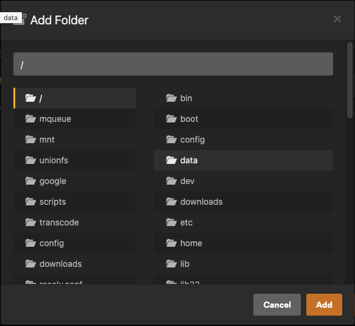

## What is it?

[Plex](https://plex.tv/) brings together all the media that matters to you. Your personal collection will look beautiful alongside stellar streaming content. Enjoy Live TV & DVR, a growing catalog of great web shows, news, and podcasts. It's finally possible to enjoy all the media you love in a single app, on any device, no matter where you are.

## Project Information

|         |             |             |             |
|-------------|-------------|-------------|-------------|
| [:material-home: Project home ](https://plex.tv/){: .header-icons target=_blank rel="noopener noreferrer" } | [:octicons-link-16: Docs](https://support.plex.tv/articles/){: .header-icons target=_blank rel="noopener noreferrer" } | :octicons-mark-github-16: Github | [:material-docker: Docker ](https://hub.docker.com/r/plexinc/pms-docker){: .header-icons target=_blank rel="noopener noreferrer" }|

## URL

1. To access Plex, visit https://plex._yourdomain.com_

2. Login with your Plex account

    

## Setup Wizard

1. First time you log in, you will be presented with a welcome screen. Click "GOT IT!" to continue.

    

2. Next screen will show you your server, with a randomly generated name. Give it a friendly name and click "NEXT".

    

3. On the next screen, click "NEXT" (we will add Libraries later).

    

4. Click "DONE".

    

!!! Settings

    === "Library"

        1. Click the Settings icon (top right) &rightarrow; "Server" (top) &rightarrow; "Library" (left).

        2. Set the following:

            - "Empty trash automatically after every scan": `disabled`

                - _Plex Autoscan will take care of this._

            - "Allow media deletion": `enabled`

            - "Generate video preview thumbnails": `never`

            - "Generate chapter thumbnails": `never`

                > The reasoning behind disabling these thumbnails is related to Google Drive API usage, data transfer, and disk space.  Accessing large portions of a given video file to generate thumbnails *may* generate large numbers of Google Drive API calls, and large amounts of data transfer.  Either of these things *may* result in your account suffering one of the various types of 24-hour bans Google hands out, which *may* prevent your server from playing media at all.  Also, storing these images *will* greatly inflate the size of `/opt/plex`, which can affect the speed of backups, your ability to download, and anything else related to disk space usage.  These are generally considered Bad Things, so the recommendation is to avoid the possibility by turning these options off.

         1. Click "SAVE CHANGES".

            

    === "Network"

        1. Click the Settings icon (top right) &rightarrow; "Server" (top) &rightarrow; "Network" (left).

        2. Set the following:

            - "Secure Connections": `Preferred`.

            - "Enable local network discovery (GDM)": `disabled`.

            - "Remote streams allowed per user": _your preference_.

            - "Custom server access URLs": `http://plex.yourdomain.com:80/,https://plex.yourdomain.com:443/` (pre-filled)

                - NOTE: Enter your domain as you have it configured in accounts.yml, not literally "yourdomain.com".

         1. Click "SAVE CHANGES".

            

    === "Transcoder"

        1. Click the Settings icon (top right) &rightarrow; "Server" (top) &rightarrow; "Transcoder" (left).

        2. Set the following:

            - "Transcoder temporary directory": `/transcode`

            - "Transcoder default throttle buffer": `150`

            - "Use hardware acceleration when available": `enabled`

            - "Maximum simultaneous video transcode": `unlimited`

        3. Click "SAVE CHANGES".

            

    === "DLNA"

        1. Click the Settings icon (top right) &rightarrow; "Server" (top) &rightarrow; "DLNA" (left).

        2. Set the following:

            - "Enable the DLNA server": `disabled`

            - "DLNA server timeline reporting": `disabled`

        3. Click "SAVE CHANGES".

            

    === "Scheduled Tasks"

        1. Click the Settings icon (top right) &rightarrow; "Server" (top) &rightarrow; "Scheduled Tasks" (left).

        1. Set the following:

            - "Update all libraries during maintenance": `disabled`

            - "Upgrade media analysis during maintenance": `disabled`

            - "Perform extensive media analysis during maintenance": `disabled`

        2. Click "SAVE CHANGES".

            

## Add Media Libraries

In this section, we will add two libraries: one for Movies and one for TV.

_Note: If you would like to have custom Plex libraries (more than just a Movies and TV one), see [Customizing Plex Libraries](../reference/customizing-plex-libs.md)._

!!! Libraries

    === "Add the Movie Library"

        1. In the main Plex screen (Home icon on the top left), click "+" next to "LIBRARIES".

            

        2. In the "Add Library" window, select "Movies" and click "NEXT".

            

        3. Click "BROWSE FOR MEDIA FOLDER".

            

        4. Navigate to `/mnt/unionfs/Media/Movies`, and then click the "ADD" button.

            

        5. You will now see `/mnt/unionfs/Media/Movies` in the text box (don't click "ADD LIBRARY" yet).

            

        6. Click "Advanced" on the left.

        7. Set the following:

            - "Enable Cinema Trailers": `disabled` (optional)

            - "Enable video preview thumbnails": `disabled`

            - "Find trailers and extras automatically (Plex Pass required)": `disabled` (optional) 

        8. Click "ADD LIBRARY".

            

    === "Add the TV Library"

        1. In the main Plex screen (Home icon on the top left), click "+" next to "LIBRARIES".

            

        2. In the "Add Library" window, select "TV Shows" and click "NEXT".

            

        3. Click "BROWSE FOR MEDIA FOLDER".

            

        4. Navigate to `/mnt/unionfs/Media/TV`, and then click the "ADD" button.

            

        5. You will now see `/mnt/unionfs/Media/TV` in the text box (don't click "ADD LIBRARY" yet).

            

        6. Click "Advanced" on the left.

        7. Set the following:

            - "Enable video preview thumbnails": `disabled`

            - "Find trailers and extras automatically (Plex Pass required)": `disabled` (optional)

        8. Click "ADD LIBRARY".

            

## Scan Media libraries

As mentioned in the [Introduction](../saltbox/basics/basics.md) page, [Plex Autoscan](../apps/plex-autoscan.md) will automatically scan the media files into Plex as they are downloaded, but this will require the Plex database to not be completely empty. So for every new library that is added, a one-time, manual scan is required. 

To do so:

1. Click the 3 dots next to a Plex library.

2. Select "Scan Library Files". 

   

3. Repeat steps 1-2 for each library. 

## Webtools

Webtools for Plex comes preinstalled. If you wish to setup Webtools and install 3rd party add-ons, you can go to https://plex-webtools._yourdomain.com_ and log in with your Plex account.