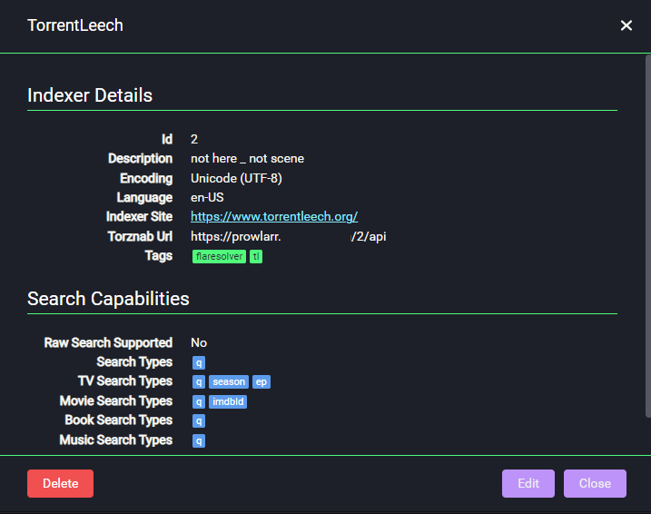

# Prowlarr

## What is it?

[Prowlarr](https://prowlarr.com/){: target=_blank rel="noopener noreferrer" } is an indexer manager/proxy built on the popular arr .net/reactjs base stack to integrate with your various PVR apps. Prowlarr supports management of both Torrent Trackers and Usenet Indexers. It integrates seamlessly with Lidarr, Mylar3, Radarr, Readarr, and Sonarr offering complete management of your indexers with no per app Indexer setup required (we do it all).

!!!info
    You should set up sonarr/radarr before setting up prowlarr.

| Details     |             |             |             |
|-------------|-------------|-------------|-------------|
| [:material-home: Project home](https://prowlarr.com/){: .header-icons target=_blank rel="noopener noreferrer" } | [:octicons-link-16: Docs](https://wiki.servarr.com/prowlarr){: .header-icons target=_blank rel="noopener noreferrer" } | [:octicons-mark-github-16: Github](https://github.com/Prowlarr/Prowlarr/){: .header-icons target=_blank rel="noopener noreferrer" } | [:material-docker: Docker](https://hub.docker.com/r/hotio/prowlarr){: .header-icons target=_blank rel="noopener noreferrer" }|

### 1. Installation

``` shell

sb install prowlarr

```

### 2. URL

- To access Prowlarr, visit `https://prowlarr._yourdomain.com_`

### 3. Setup

***Adding Indexers to Sonarr/Radarr via Prowlarr***

#### Under **Settings >> Apps**

1. Click the big `+` sign to add an App.
2. Provide a "Name", ie Sonarranime if you have multiple instances.

3. Provide the url for Prowlarr, this should be `http://prowlarr:9696`
4. Provide the *local* url for [Sonarr](../apps/sonarr.md)/[Radarr](../apps/radarr.md), ie `http://sonarr:8989` or `http://radarr:7878`
5. Provide your [Api Key](../apps/sonarr.md#api-key)

#### Under **Indexers**

1. Click `+ Add Indexer`
2. Search for and filter out the indexers you want added.
3. Follow the prompts on screen to add the indexer.
    - If set up correctly, prowlarr will add each indexer you add to your clients as appropriate.

#### Other

Its probably a good idea to also install **[Flaresolverr](../sandbox/apps/flaresolverr.md)**

Some indexers won't work without it.

To use Prowlarr for torznab feeds, you will need to click on the **Indexer Name** and find the **Torznab URL**.


Depending on your usecase, you will need to convert it to a local url, ie `http://prowlarr:9696/2/api`

*Note: For example, to add a tracker to [Autobrr](..sandbox/apps/autobrr.md) that isn't supported natively (for example, a tracker without IRC announcing) you can use the above url, then provide your api key in the **API Key** field.*

- [:octicons-link-16: Documentation](https://wiki.servarr.com/prowlarr){: .header-icons target=_blank rel="noopener noreferrer" }
