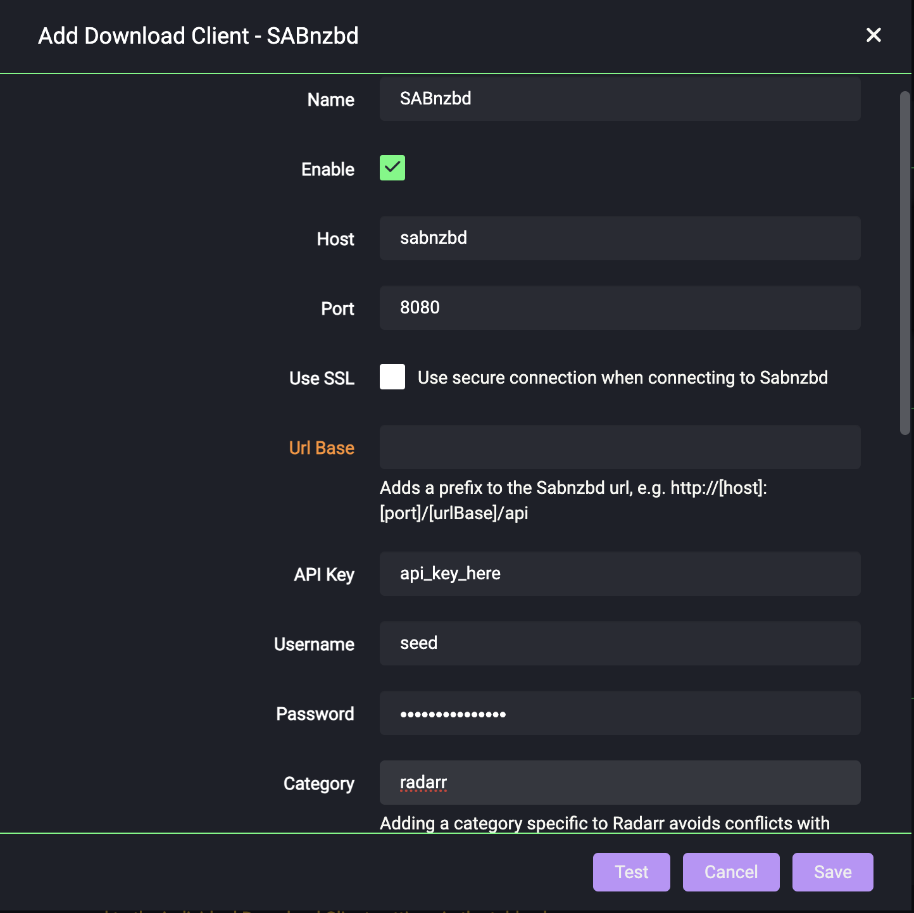

---
hide:
  - tags
tags:
  - radarr
---

# Radarr

# What is it?

[Radarr](https://radarr.video/) is a movie collection manager for Usenet and BitTorrent users. It can monitor multiple RSS feeds for new movies and will interface with clients and indexers to grab, sort, and rename them. It can also be configured to automatically upgrade the quality of existing files in the library when a better quality format becomes available.

| Details     |             |             |             |
|-------------|-------------|-------------|-------------|
| [:material-home: Project home](https://radarr.video/){: .header-icons } | [:octicons-link-16: Docs](https://wiki.servarr.com/radarr/){: .header-icons } | [:octicons-mark-github-16: Github](https://github.com/Radarr/Radarr){: .header-icons } | [:material-docker: Docker](https://hub.docker.com/r/hotio/radarr){: .header-icons }|

## URL

- To access Radarr, visit `https://radarr._yourdomain.com_`

## Settings

Click on "Settings" in the sidebar.  Click "Show Advanced" at the top of the Settings pane.

Make changes in the following sections:

!!! info "Settings"

    === "Media Management"

        These settings control management of media files.

        === "Movie Naming"

            - "Rename Movies": `Yes`

            - "Replace Illegal Characters": `Yes`

            - Colon Replacement Format: `Delete`

            _Note: You could use `Replace with Space Dash` but only if your file naming format is not using spaces (e.g. using dots) to separate words._

            - Set your preferred naming format; here are some examples.

            <details>
            <summary>TRaSH' naming guide [Recommended]</summary> <br />

            Go to the [TRaSH Guides Radarr naming scheme](https://trash-guides.info/Radarr/Radarr-recommended-naming-scheme/) for the latest updates.  These examples may be out of date.

            Example:  <br />
            ```
            The Movie Title (2010) Ultimate Extended Edition [imdb-tt0066921][Surround Sound x264][Bluray-1080p Proper][3D][HDR][10bit][x264][DTS 5.1]-EVOLVE.mkv
            ```

            Standard Movie Format: <br />
            ```
            {Movie CleanTitle} {(Release Year)} {Edition Tags} [imdb-{ImdbId}]{[Custom Formats]}{[Quality Full]}{[MediaInfo 3D]}{[MediaInfo VideoDynamicRange]}[{Mediainfo VideoBitDepth}bit][{Mediainfo VideoCodec}]{[Mediainfo AudioCodec}{ Mediainfo AudioChannels}]{-Release Group}
            ```

            Reference: https://trash-guides.info/Radarr/Radarr-recommended-naming-scheme/
            </details>

            The TRaSH naming guide is recommended since some other tools, notably Kometa, expect it in their default setup.

            <details>
            <summary>Plex's Naming Preference</summary> <br />
            Example: <br />
            ```
            /Guardians of the Galaxy (2014)/Guardians of the Galaxy (2014).mkv
            ```

            Standard Movie Format: <br />
            ```
            {Movie Title} ({Release Year})
            ```

            Movie Folder Format: <br />
            ```
            {Movie Title} ({Release Year})
            ```

            Reference: https://support.plex.tv/articles/200381023-naming-movie-files/
            </details>

            <details>
            <summary>Radarr's Wiki Example</summary> <br />
            Example:  <br />
            ```
            The Movie Title (2010) - [ULTIMATE EXTENDED EDITION][BLURAY-1080P PROPER][DTS 5.1][X264]-EVOLVE.mkv
            ```

            Standard Movie Format: <br />
            ```
            {Movie Title} ({Release Year}) - {[EDITION TAGS]}{[QUALITY FULL]}{[MEDIAINFO AUDIOCODEC}{ MEDIAINFO AUDIOCHANNELS]}{[MEDIAINFO VIDEOCODEC]}{-RELEASE GROUP}
            ```

            Reference: https://github.com/Radarr/Radarr/wiki/Sorting-and-Renaming
            </details>

        === "Folders"

            - "Create empty movie folders": `No`

            - "Automatically Rename Folders": `No`

            - "Movie Paths Default to Static": `No`

        === "Importing"

            - "Skip Free Space Check": `No`

            - "Use Hardlinks instead of Copy": `Yes`

            - "Import Extra Files": `Yes` (_can be your preference_)

            - "Extra File Extensions": `srt, sub, idx`

        === "File Management"

            - "Ignore Deleted Movies": `No` (_can be your preference_)

            - "Download Propers": `No` (_can be your preference_)

            - "Analyse video files": `No`

            - "Change File Date": `None`

            - "Recycle Bin": _blank_ (Rclone deletes are sent to Gdrive trash folder, anyway)

        === "Permissions"

            - Set Permissions: `No`

        === "Save"

            - Click "Save".

    === "Indexers"

        These settings control [indexers](../saltbox/prerequisites/prerequisites.md#usenet-or-bittorrent-sources) and related behavior.

        === "NZBHydra2"

            1. Click Add Indexer (`+`).

            2. Select "Newznab".

            3. Add the following:

                Name: NZBHydra2

                Enable RSS Sync: _Your Preference_

                Enable Search: _Your Preference_

                URL: `http://nzbhydra2:5076`

                API Key: [Your NZBHydra2 API Key](../apps/nzbhydra2.md)

                Additional Parameters: _Leave Blank_

            4. Your settings will look like this:

                

            5. Click "Save" to add NZBHydra2.

            Note: The "Test" will keep failing until you add an indexer in [NZBHydra2](../apps/nzbhydra2.md).

        === "Jackett"

            Note: Each Indexer you have defined in Jackett will need to be added separately.

            1. Click Add Indexer (`+`)

            2. Select "Torznab".

            3. Add the following:

                Name: Indexer Name

                Enable RSS Sync: _Your Preference_

                Enable Search: _Your Preference_

                URL: [Indexer's Torznab Feed](../apps/jackett.md)

                API Key: [Your Jackett API Key](../apps/jackett.md)

                Additional Parameters: _Leave Blank_

            4. Your settings will look like this:

                

            5. Click "Save" to add the indexer.


    === "Download Clients"

        These settings control downloading behavior and clients.

        === "Completed Download Handling"

            - "Enable": `Yes`

            - "Remove": `Yes` (_can be your preference_)

        === "Failed Download Handling"

            - "Redownload": `Yes`

            - "Remove": `Yes`

        === "NZBGet"

            1. Click Add (`+`)

            2. Add a new "NZBGet" download client.

            3. Add the following:

                Name: NZBGet

                Enable: `Yes`

                Host: `nzbget`

                Port: `6789`

                Username:  [Your NZBGet Username](../apps/nzbget.md)

                Password:  [Your NZBGet Password](../apps/nzbget.md)

                Category: `radarr`

                Use SSL: `No`

                Add Paused: `No`

            4. Your settings will look like this:

                

            5. Click "Save" to add NZBGet.

        === "SABNzbd"

            1. Click Add (`+`)

            2. Add a new "SABNzbd" download client.

            3. Add the following:

                Name: SABNzbd

                Enable: `Yes`

                Host: `sabnzbd`

                Port: `8080`

                For authentication, you can use either an API key or a username/password.

                === "API Key"

                    API Key:  [Your SABNzbd API Key](../apps/sabnzbd.md)

                === "Username/password"

                    Username:  [Your SABNzbd Username](../apps/sabnzbd.md)

                    Password:  [Your SABNzbd Password](../apps/sabnzbd.md)

                Category: `radarr`

                Use SSL: `No`

                Add Paused: `No`

            4. Your settings will look like this:

                Either API Key **OR** Username/Password should be filled in, **not both**

                

            5. Click "Save" to add SABNzbd.

        === "ruTorrent"

            1. Click Add (`+`)

            2. Add a new "rTorrent" download client.

            3. Add the following:

                Name: ruTorrent

                Enable: `Yes`

                Host: `rutorrent`

                Port: `80`

                URL Path: `RPC2`

                Use SSL: `No`

                Username: [Your ruTorrent Username](../apps/rutorrent.md)

                Password: [Your ruTorrent Password](../apps/rutorrent.md)

                Category: `radarr`

                Directory: _Leave Blank_

            4.  Your settings will now look like this:

                

            5. Click "Save" to add ruTorrent.

        === "qBittorrent"

            1. Click Add ('+')

            2. Add a new "qBittorrent" download client.

            3. Add the following:

                Name: qBittorrent

                Enable: 'Yes'

                Host: 'qBittorrent'

                Port: '8080'

                Username: [Your qBittorrent Username](../apps/qbittorrent.md)

                Password: [Your qBittorrent Password](../apps/qbittorrent.md)

                Category: 'radarr'

            4.  Your settings will now look like this:

                

            5.  Click "Save" to add qBittorrent

    === "Connect"

        These settings control connections to other applications or systems.

        === "Torrent Cleanup"

            Torrent Cleanup Script is a custom script that will cleanup torrents from ruTorrent that were auto-extracted, but still being seeded. So if the script detects that `.rar` files are in the folder that Radarr just imported from, it will delete the imported video file(s), leaving just the `.rar` files for seeding.

            1. Click "Settings" -> "Connect".

            2. Add a new "Custom Script".

            3. Add the following:

                Name: Torrent Cleanup

                On Grab: `No`

                On Download: `Yes`

                On Upgrade:  `Yes`

                On Rename:`No`

                Path: `/scripts/torrents/TorrentCleanup.py`

            4. The settings will look like this:

                

            5. Click "Save" to add the Torrent Cleanup script.


        === "Autoscan"
            IMPORTANT:  The Radarr UI may differ from what is shown here; there may be additional events listed in the UI.  

            GENERALLY SPEAKING, if you have events listed that are not explicitly listed below, LEAVE THEM UNCHECKED.  Such events will generate errors in the autoscan logs; those errors can be ignored, but they are errors and can cause panic and confusion.

            MORE SPECIFICALLY, Autoscan is expecting a request that points to an individual file that is ready for Plex. so any event you may have that refers to a movie being added, manual intervention, or anything else that is not "this specific video file ON DISK was imported/upgraded/deleted/etc", LEAVE IT UNCHECKED.

            1. Click "Settings" -> "Connect".

            2. Add a new "Webhook".

            3. Add the following:

                Name: Autoscan

                On Grab: `No`

                On Import: `Yes`

                On Upgrade:  `Yes`

                On Rename: `Yes`

                On Movie Added: `No`

                On Movie Delete: `Yes`

                On Movie File Delete: `Yes`

                On Movie File Delete For Upgrade: `Yes`

                On Health Issue: `No`

                On Health Restored: `No`

                Include Health Warnings: `No`

                On Application Update: `No`

                On Manual Intervention Required: `No`

                Tags: _Leave Blank_

                URL: `http://autoscan:3030/triggers/radarr`

                Method:`POST`

                Username: AS SET IN AUTOSCAN CONFIG [defaults to Saltbox Username]

                Password: AS SET IN AUTOSCAN CONFIG [defaults to Saltbox Password]

                THERE MAY BE OTHER CHECKBOXES AVAILABLE: UNCHECK THEM ALL LEAVING ONLY THE ONES SPECIFICALLY LISTED ABOVE ENABLED.

            4. The settings will look like this:

                


            5. Click "Save" to add Autoscan.

    === "General"

        These settings control general aspects of Radarr.

        === "Start-Up"

            - "Bind Address: `*`

            - "Port Number": `7878`

            - "URL Base": _blank_

            - "Enable SSL": `No` (_SSL is handled by Traefik_)

        === "Proxy Settings"

            - "Use Proxy": `No`

        === "Logging"

            - "Log Level": `Debug`

        === "Analytics"

            - "Enable": `No` (_your preference_)

        === "Updates"

            These settings may be grayed out or unavailable; skip this if that's the case.

            - "Branch": `nightly` or `develop`

            - "Automatic": `Off`

        === "Save"

            - Click "Save".

## Movies Path

1. When you are ready to add your first movie to Radarr, click the "Path" drop-down and select "Add a new path".

2. Click the blue "Browse" button, navigate to `/mnt/unionfs/Media/Movies`, scroll to the bottom, and select "OK".

3. Click the green "check" button to add the path.

4. All movies added now will have that path set.


## API Key

This is used during the setup of [Overseerr](overseerr.md) and [Organizr](organizr.md).

- Go to "Settings" -> "General" -> "Security" -> "API Key".

## Guide

[TraSH Guides](https://trash-guides.info/Radarr/)

## Inventory
<!-- BEGIN SALTBOX MANAGED VARIABLES SECTION -->
<!-- This section is managed by saltbox/test.py - DO NOT EDIT MANUALLY -->
!!! info
    Variables can be overridden in `/srv/git/saltbox/inventories/host_vars/localhost.yml`.


    This role supports multiple instances via `radarr_instances`.

    === "Role-level Override"

        Applies to all instances of radarr:

        ```yaml
        radarr_role_web_subdomain: "custom"
        ```

    === "Instance-level Override"

        Applies to a specific instance (e.g., `radarr2`):

        ```yaml
        radarr2_web_subdomain: "custom2"
        ```

!!! warning
    **Avoid overriding variables ending in `_default`**

    When overriding variables that end in `_default` (like `{role}_docker_envs_default`), you replace the entire default configuration. Future updates that add new default values will not be applied to your setup, potentially breaking functionality.

    Instead, use the corresponding `_custom` variable (like `{role}_docker_envs_custom`) to add your changes. Custom values are merged with defaults, ensuring you receive updates.

??? example "Basics"

    === "Default"

        ```yaml
        # Type: list
        radarr_instances: ["radarr"]

        ```

    === "Example"

        ```yaml
        # Type: list
        radarr_instances: ["radarr", "radarr2"]

        ```

??? example "Settings"

    === "Role-level"

        ```yaml
        # Type: bool (true/false)
        radarr_role_external_auth: true

        ```

    === "Instance-level"

        ```yaml
        # Type: bool (true/false)
        radarr2_external_auth: true

        ```

??? example "Paths"

    === "Role-level"

        ```yaml
        # Type: string
        radarr_role_paths_folder: "{{ radarr_name }}"

        # Type: string
        radarr_role_paths_location: "{{ server_appdata_path }}/{{ radarr_role_paths_folder }}"

        # Type: string
        radarr_role_paths_config_location: "{{ radarr_role_paths_location }}/config.xml"

        ```

    === "Instance-level"

        ```yaml
        # Type: string
        radarr2_paths_folder: "{{ radarr_name }}"

        # Type: string
        radarr2_paths_location: "{{ server_appdata_path }}/{{ radarr_role_paths_folder }}"

        # Type: string
        radarr2_paths_config_location: "{{ radarr_role_paths_location }}/config.xml"

        ```

??? example "Web"

    === "Role-level"

        ```yaml
        # Type: string
        radarr_role_web_subdomain: "{{ radarr_name }}"

        # Type: string
        radarr_role_web_domain: "{{ user.domain }}"

        # Type: string
        radarr_role_web_port: "7878"

        # Type: string
        radarr_role_web_url: "{{ 'https://' + (lookup('role_var', '_web_subdomain', role='radarr') + '.' + lookup('role_var', '_web_domain', role='radarr')
                              if (lookup('role_var', '_web_subdomain', role='radarr') | length > 0)
                              else lookup('role_var', '_web_domain', role='radarr')) }}"

        ```

    === "Instance-level"

        ```yaml
        # Type: string
        radarr2_web_subdomain: "{{ radarr_name }}"

        # Type: string
        radarr2_web_domain: "{{ user.domain }}"

        # Type: string
        radarr2_web_port: "7878"

        # Type: string
        radarr2_web_url: "{{ 'https://' + (lookup('role_var', '_web_subdomain', role='radarr') + '.' + lookup('role_var', '_web_domain', role='radarr')
                          if (lookup('role_var', '_web_subdomain', role='radarr') | length > 0)
                          else lookup('role_var', '_web_domain', role='radarr')) }}"

        ```

??? example "DNS"

    === "Role-level"

        ```yaml
        # Type: string
        radarr_role_dns_record: "{{ lookup('role_var', '_web_subdomain', role='radarr') }}"

        # Type: string
        radarr_role_dns_zone: "{{ lookup('role_var', '_web_domain', role='radarr') }}"

        # Type: bool (true/false)
        radarr_role_dns_proxy: "{{ dns_proxied }}"

        ```

    === "Instance-level"

        ```yaml
        # Type: string
        radarr2_dns_record: "{{ lookup('role_var', '_web_subdomain', role='radarr') }}"

        # Type: string
        radarr2_dns_zone: "{{ lookup('role_var', '_web_domain', role='radarr') }}"

        # Type: bool (true/false)
        radarr2_dns_proxy: "{{ dns_proxied }}"

        ```

??? example "Traefik"

    === "Role-level"

        ```yaml
        # Type: string
        radarr_role_traefik_sso_middleware: "{{ traefik_default_sso_middleware }}"

        # Type: string
        radarr_role_traefik_middleware_default: "{{ traefik_default_middleware
                                                    + (',themepark-' + radarr_name
                                                      if (lookup('role_var', '_themepark_enabled', role='radarr') and global_themepark_plugin_enabled)
                                                      else '') }}"

        # Type: string
        radarr_role_traefik_middleware_custom: ""

        # Type: string
        radarr_role_traefik_certresolver: "{{ traefik_default_certresolver }}"

        # Type: bool (true/false)
        radarr_role_traefik_enabled: true

        # Type: bool (true/false)
        radarr_role_traefik_api_enabled: true

        # Type: string
        radarr_role_traefik_api_endpoint: "PathPrefix(`/api`) || PathPrefix(`/feed`) || PathPrefix(`/ping`)"

        ```

    === "Instance-level"

        ```yaml
        # Type: string
        radarr2_traefik_sso_middleware: "{{ traefik_default_sso_middleware }}"

        # Type: string
        radarr2_traefik_middleware_default: "{{ traefik_default_middleware
                                                + (',themepark-' + radarr_name
                                                  if (lookup('role_var', '_themepark_enabled', role='radarr') and global_themepark_plugin_enabled)
                                                  else '') }}"

        # Type: string
        radarr2_traefik_middleware_custom: ""

        # Type: string
        radarr2_traefik_certresolver: "{{ traefik_default_certresolver }}"

        # Type: bool (true/false)
        radarr2_traefik_enabled: true

        # Type: bool (true/false)
        radarr2_traefik_api_enabled: true

        # Type: string
        radarr2_traefik_api_endpoint: "PathPrefix(`/api`) || PathPrefix(`/feed`) || PathPrefix(`/ping`)"

        ```

??? example "Theme"

    === "Role-level"

        ```yaml
        # Options can be found at https://github.com/themepark-dev/theme.park
        # Type: bool (true/false)
        radarr_role_themepark_enabled: false

        # Type: string
        radarr_role_themepark_app: "radarr"

        # Type: string
        radarr_role_themepark_theme: "{{ global_themepark_theme }}"

        # Type: string
        radarr_role_themepark_domain: "{{ global_themepark_domain }}"

        # Type: list
        radarr_role_themepark_addons: []

        ```

    === "Instance-level"

        ```yaml
        # Options can be found at https://github.com/themepark-dev/theme.park
        # Type: bool (true/false)
        radarr2_themepark_enabled: false

        # Type: string
        radarr2_themepark_app: "radarr"

        # Type: string
        radarr2_themepark_theme: "{{ global_themepark_theme }}"

        # Type: string
        radarr2_themepark_domain: "{{ global_themepark_domain }}"

        # Type: list
        radarr2_themepark_addons: []

        ```

??? example "Docker"

    === "Role-level"

        ```yaml
        # Container
        # Type: string
        radarr_role_docker_container: "{{ radarr_name }}"

        # Image
        # Type: bool (true/false)
        radarr_role_docker_image_pull: true

        # Type: string
        radarr_role_docker_image_repo: "ghcr.io/hotio/radarr"

        # Type: string
        radarr_role_docker_image_tag: "release"

        # Type: string
        radarr_role_docker_image: "{{ lookup('role_var', '_docker_image_repo', role='radarr') }}:{{ lookup('role_var', '_docker_image_tag', role='radarr') }}"

        # Envs
        # Type: dict
        radarr_role_docker_envs_default: 
          PUID: "{{ uid }}"
          PGID: "{{ gid }}"
          UMASK: "002"
          TZ: "{{ tz }}"

        # Type: dict
        radarr_role_docker_envs_custom: {}

        # Volumes
        # Type: list
        radarr_role_docker_volumes_default: 
          - "{{ radarr_role_paths_location }}:/config"
          - "{{ server_appdata_path }}/scripts:/scripts"

        # Type: list
        radarr_role_docker_volumes_legacy: 
          - "/mnt/unionfs/Media/Movies:/movies"

        # Type: list
        radarr_role_docker_volumes_custom: []

        # Labels
        # Type: dict
        radarr_role_docker_labels_default: {}

        # Type: dict
        radarr_role_docker_labels_custom: {}

        # Hostname
        # Type: string
        radarr_role_docker_hostname: "{{ radarr_name }}"

        # Networks
        # Type: string
        radarr_role_docker_networks_alias: "{{ radarr_name }}"

        # Type: list
        radarr_role_docker_networks_default: []

        # Type: list
        radarr_role_docker_networks_custom: []

        # Restart Policy
        # Type: string
        radarr_role_docker_restart_policy: unless-stopped

        # State
        # Type: string
        radarr_role_docker_state: started


        # ---- Additional Docker Options ----
        # The following advanced options are available via create_docker_container
        # but are not defined in the role. See:
        # https://docs.ansible.com/ansible/latest/collections/community/docker/docker_container_module.html

        # Resource Limits
        # Type: int
        radarr_role_docker_blkio_weight:

        # Type: int
        radarr_role_docker_cpu_period:

        # Type: int
        radarr_role_docker_cpu_quota:

        # Type: int
        radarr_role_docker_cpu_shares:

        # Type: string
        radarr_role_docker_cpus:

        # Type: string
        radarr_role_docker_cpuset_cpus:

        # Type: string
        radarr_role_docker_cpuset_mems:

        # Type: string
        radarr_role_docker_kernel_memory:

        # Type: string
        radarr_role_docker_memory:

        # Type: string
        radarr_role_docker_memory_reservation:

        # Type: string
        radarr_role_docker_memory_swap:

        # Type: int
        radarr_role_docker_memory_swappiness:

        # Security & Devices
        # Type: list
        radarr_role_docker_cap_drop:

        # Type: list
        radarr_role_docker_device_cgroup_rules:

        # Type: list
        radarr_role_docker_device_read_bps:

        # Type: list
        radarr_role_docker_device_read_iops:

        # Type: list
        radarr_role_docker_device_requests:

        # Type: list
        radarr_role_docker_device_write_bps:

        # Type: list
        radarr_role_docker_device_write_iops:

        # Type: list
        radarr_role_docker_devices:

        # Type: string
        radarr_role_docker_devices_default:

        # Type: bool (true/false)
        radarr_role_docker_privileged:

        # Type: list
        radarr_role_docker_security_opts:

        # Networking
        # Type: list
        radarr_role_docker_dns_opts:

        # Type: list
        radarr_role_docker_dns_search_domains:

        # Type: list
        radarr_role_docker_dns_servers:

        # Type: dict
        radarr_role_docker_hosts:

        # Type: string
        radarr_role_docker_hosts_use_common:

        # Type: string
        radarr_role_docker_network_mode:

        # Storage
        # Type: bool (true/false)
        radarr_role_docker_keep_volumes:

        # Type: list
        radarr_role_docker_mounts:

        # Type: string
        radarr_role_docker_volume_driver:

        # Type: list
        radarr_role_docker_volumes_from:

        # Type: string
        radarr_role_docker_volumes_global:

        # Type: string
        radarr_role_docker_working_dir:

        # Monitoring & Lifecycle
        # Type: dict
        radarr_role_docker_healthcheck:

        # Type: bool (true/false)
        radarr_role_docker_init:

        # Type: string
        radarr_role_docker_log_driver:

        # Type: dict
        radarr_role_docker_log_options:

        # Type: bool (true/false)
        radarr_role_docker_output_logs:

        # Other Options
        # Type: bool (true/false)
        radarr_role_docker_auto_remove:

        # Type: list
        radarr_role_docker_capabilities:

        # Type: string
        radarr_role_docker_cgroup_parent:

        # Type: string
        radarr_role_docker_cgroupns_mode:

        # Type: bool (true/false)
        radarr_role_docker_cleanup:

        # Type: list
        radarr_role_docker_commands:

        # Type: string
        radarr_role_docker_create_timeout:

        # Type: string
        radarr_role_docker_domainname:

        # Type: string
        radarr_role_docker_entrypoint:

        # Type: string
        radarr_role_docker_env_file:

        # Type: list
        radarr_role_docker_exposed_ports:

        # Type: string
        radarr_role_docker_force_kill:

        # Type: list
        radarr_role_docker_groups:

        # Type: int
        radarr_role_docker_healthy_wait_timeout:

        # Type: string
        radarr_role_docker_ipc_mode:

        # Type: string
        radarr_role_docker_kill_signal:

        # Type: string
        radarr_role_docker_labels_use_common:

        # Type: list
        radarr_role_docker_links:

        # Type: bool (true/false)
        radarr_role_docker_oom_killer:

        # Type: int
        radarr_role_docker_oom_score_adj:

        # Type: bool (true/false)
        radarr_role_docker_paused:

        # Type: string
        radarr_role_docker_pid_mode:

        # Type: list
        radarr_role_docker_ports:

        # Type: bool (true/false)
        radarr_role_docker_read_only:

        # Type: bool (true/false)
        radarr_role_docker_recreate:

        # Type: int
        radarr_role_docker_restart_retries:

        # Type: string
        radarr_role_docker_runtime:

        # Type: string
        radarr_role_docker_shm_size:

        # Type: int
        radarr_role_docker_stop_timeout:

        # Type: dict
        radarr_role_docker_storage_opts:

        # Type: list
        radarr_role_docker_sysctls:

        # Type: list
        radarr_role_docker_tmpfs:

        # Type: list
        radarr_role_docker_ulimits:

        # Type: string
        radarr_role_docker_user:

        # Type: string
        radarr_role_docker_userns_mode:

        # Type: string
        radarr_role_docker_uts:

        ```

    === "Instance-level"

        ```yaml
        # Container
        # Type: string
        radarr2_docker_container: "{{ radarr_name }}"

        # Image
        # Type: bool (true/false)
        radarr2_docker_image_pull: true

        # Type: string
        radarr2_docker_image_repo: "ghcr.io/hotio/radarr"

        # Type: string
        radarr2_docker_image_tag: "release"

        # Type: string
        radarr2_docker_image: "{{ lookup('role_var', '_docker_image_repo', role='radarr') }}:{{ lookup('role_var', '_docker_image_tag', role='radarr') }}"

        # Envs
        # Type: dict
        radarr2_docker_envs_default: 
          PUID: "{{ uid }}"
          PGID: "{{ gid }}"
          UMASK: "002"
          TZ: "{{ tz }}"

        # Type: dict
        radarr2_docker_envs_custom: {}

        # Volumes
        # Type: list
        radarr2_docker_volumes_default: 
          - "{{ radarr_role_paths_location }}:/config"
          - "{{ server_appdata_path }}/scripts:/scripts"

        # Type: list
        radarr2_docker_volumes_legacy: 
          - "/mnt/unionfs/Media/Movies:/movies"

        # Type: list
        radarr2_docker_volumes_custom: []

        # Labels
        # Type: dict
        radarr2_docker_labels_default: {}

        # Type: dict
        radarr2_docker_labels_custom: {}

        # Hostname
        # Type: string
        radarr2_docker_hostname: "{{ radarr_name }}"

        # Networks
        # Type: string
        radarr2_docker_networks_alias: "{{ radarr_name }}"

        # Type: list
        radarr2_docker_networks_default: []

        # Type: list
        radarr2_docker_networks_custom: []

        # Restart Policy
        # Type: string
        radarr2_docker_restart_policy: unless-stopped

        # State
        # Type: string
        radarr2_docker_state: started


        # ---- Additional Docker Options ----
        # The following advanced options are available via lookup('docker_var', ...)
        # but are not defined in the role. See:
        # https://docs.ansible.com/ansible/latest/collections/community/docker/docker_container_module.html

        # Resource Limits
        # Type: int
        radarr2_docker_blkio_weight:
        # Type: int
        radarr2_docker_cpu_period:
        # Type: int
        radarr2_docker_cpu_quota:
        # Type: int
        radarr2_docker_cpu_shares:
        # Type: string
        radarr2_docker_cpus:
        # Type: string
        radarr2_docker_cpuset_cpus:
        # Type: string
        radarr2_docker_cpuset_mems:
        # Type: string
        radarr2_docker_kernel_memory:
        # Type: string
        radarr2_docker_memory:
        # Type: string
        radarr2_docker_memory_reservation:
        # Type: string
        radarr2_docker_memory_swap:
        # Type: int
        radarr2_docker_memory_swappiness:

        # Security & Devices
        # Type: list
        radarr2_docker_cap_drop:
        # Type: list
        radarr2_docker_device_cgroup_rules:
        # Type: list
        radarr2_docker_device_read_bps:
        # Type: list
        radarr2_docker_device_read_iops:
        # Type: list
        radarr2_docker_device_requests:
        # Type: list
        radarr2_docker_device_write_bps:
        # Type: list
        radarr2_docker_device_write_iops:
        # Type: list
        radarr2_docker_devices:
        # Type: string
        radarr2_docker_devices_default:
        # Type: bool (true/false)
        radarr2_docker_privileged:
        # Type: list
        radarr2_docker_security_opts:

        # Networking
        # Type: list
        radarr2_docker_dns_opts:
        # Type: list
        radarr2_docker_dns_search_domains:
        # Type: list
        radarr2_docker_dns_servers:
        # Type: dict
        radarr2_docker_hosts:
        # Type: string
        radarr2_docker_hosts_use_common:
        # Type: string
        radarr2_docker_network_mode:

        # Storage
        # Type: bool (true/false)
        radarr2_docker_keep_volumes:
        # Type: list
        radarr2_docker_mounts:
        # Type: string
        radarr2_docker_volume_driver:
        # Type: list
        radarr2_docker_volumes_from:
        # Type: string
        radarr2_docker_volumes_global:
        # Type: string
        radarr2_docker_working_dir:

        # Monitoring & Lifecycle
        # Type: dict
        radarr2_docker_healthcheck:
        # Type: bool (true/false)
        radarr2_docker_init:
        # Type: string
        radarr2_docker_log_driver:
        # Type: dict
        radarr2_docker_log_options:
        # Type: bool (true/false)
        radarr2_docker_output_logs:

        # Other Options
        # Type: bool (true/false)
        radarr2_docker_auto_remove:
        # Type: list
        radarr2_docker_capabilities:
        # Type: string
        radarr2_docker_cgroup_parent:
        # Type: string
        radarr2_docker_cgroupns_mode:
        # Type: bool (true/false)
        radarr2_docker_cleanup:
        # Type: list
        radarr2_docker_commands:
        # Type: string
        radarr2_docker_create_timeout:
        # Type: string
        radarr2_docker_domainname:
        # Type: string
        radarr2_docker_entrypoint:
        # Type: string
        radarr2_docker_env_file:
        # Type: list
        radarr2_docker_exposed_ports:
        # Type: string
        radarr2_docker_force_kill:
        # Type: list
        radarr2_docker_groups:
        # Type: int
        radarr2_docker_healthy_wait_timeout:
        # Type: string
        radarr2_docker_ipc_mode:
        # Type: string
        radarr2_docker_kill_signal:
        # Type: string
        radarr2_docker_labels_use_common:
        # Type: list
        radarr2_docker_links:
        # Type: bool (true/false)
        radarr2_docker_oom_killer:
        # Type: int
        radarr2_docker_oom_score_adj:
        # Type: bool (true/false)
        radarr2_docker_paused:
        # Type: string
        radarr2_docker_pid_mode:
        # Type: list
        radarr2_docker_ports:
        # Type: bool (true/false)
        radarr2_docker_read_only:
        # Type: bool (true/false)
        radarr2_docker_recreate:
        # Type: int
        radarr2_docker_restart_retries:
        # Type: string
        radarr2_docker_runtime:
        # Type: string
        radarr2_docker_shm_size:
        # Type: int
        radarr2_docker_stop_timeout:
        # Type: dict
        radarr2_docker_storage_opts:
        # Type: list
        radarr2_docker_sysctls:
        # Type: list
        radarr2_docker_tmpfs:
        # Type: list
        radarr2_docker_ulimits:
        # Type: string
        radarr2_docker_user:
        # Type: string
        radarr2_docker_userns_mode:
        # Type: string
        radarr2_docker_uts:

        ```

??? example "Global Override Options"

    === "Role-level"

        Override for all instances:

        ```yaml
        # Enable or disable Autoheal monitoring for containers created when deploying
        # Type: bool (true/false)
        radarr_role_autoheal_enabled: true

        # List of container dependencies that must be running before containers start
        # Type: string
        radarr_role_depends_on: ""

        # Delay in seconds before starting containers after dependencies are ready
        # Type: string (quoted number)
        radarr_role_depends_on_delay: "0"

        # Enable healthcheck waiting for container dependencies
        # Type: string ("true"/"false")
        radarr_role_depends_on_healthchecks:

        # Enable or disable Diun update notifications for containers created when deploying
        # Type: bool (true/false)
        radarr_role_diun_enabled: true

        # Enable or disable automatic DNS record creation for containers
        # Type: bool (true/false)
        radarr_role_dns_enabled: true

        # Enable or disable Saltbox Docker Controller management for containers
        # Type: bool (true/false)
        radarr_role_docker_controller: true

        # Enable Traefik autodetect middleware for containers
        # Type: bool (true/false)
        radarr_role_traefik_autodetect_enabled: false

        # Enable CrowdSec middleware for containers
        # Type: bool (true/false)
        radarr_role_traefik_crowdsec_enabled: false

        # Enable custom error pages middleware for containers
        # Type: bool (true/false)
        radarr_role_traefik_error_pages_enabled: false

        # Enable gzip compression middleware for containers
        # Type: bool (true/false)
        radarr_role_traefik_gzip_enabled: false

        # Enable robots.txt middleware for containers
        # Type: bool (true/false)
        radarr_role_traefik_robot_enabled: true

        # Enable Tailscale-specific Traefik configuration for containers
        # Type: bool (true/false)
        radarr_role_traefik_tailscale_enabled: false

        # Enable wildcard certificate for containers
        # Type: bool (true/false)
        radarr_role_traefik_wildcard_enabled: true

        # Override the Traefik fully qualified domain name (FQDN) for containers
        # Type: list
        radarr_role_web_fqdn_override: # (1)!

        # Override the Traefik web host configuration for containers
        # Type: string
        radarr_role_web_host_override: # (2)!

        # URL scheme to use for web access to containers
        # Type: string ("http"/"https")
        radarr_role_web_scheme:

        ```

        1.  Example:

            ```yaml
            radarr_role_web_fqdn_override:
              - "{{ traefik_host }}"
              - "radarr2.{{ user.domain }}"
              - "radarr.otherdomain.tld"
            ```

            Note: Include `{{ traefik_host }}` to preserve the default FQDN alongside your custom entries

        2.  Example:

            ```yaml
            radarr_role_web_host_override: "Host(`{{ traefik_host }}`) || Host(`{{ 'radarr2.' + user.domain }}`)"
            ```

            Note: Use `{{ traefik_host }}` to include the default host configuration in your custom rule

    === "Instance-level"

        Override for a specific instance (e.g., `radarr2`):

        ```yaml
        # Enable or disable Autoheal monitoring for the container created when deploying
        # Type: bool (true/false)
        radarr2_autoheal_enabled: true

        # List of container dependencies that must be running before the container start
        # Type: string
        radarr2_depends_on: ""

        # Delay in seconds before starting the container after dependencies are ready
        # Type: string (quoted number)
        radarr2_depends_on_delay: "0"

        # Enable healthcheck waiting for container dependencies
        # Type: string ("true"/"false")
        radarr2_depends_on_healthchecks:

        # Enable or disable Diun update notifications for the container created when deploying
        # Type: bool (true/false)
        radarr2_diun_enabled: true

        # Enable or disable automatic DNS record creation for the container
        # Type: bool (true/false)
        radarr2_dns_enabled: true

        # Enable or disable Saltbox Docker Controller management for the container
        # Type: bool (true/false)
        radarr2_docker_controller: true

        # Enable Traefik autodetect middleware for the container
        # Type: bool (true/false)
        radarr2_traefik_autodetect_enabled: false

        # Enable CrowdSec middleware for the container
        # Type: bool (true/false)
        radarr2_traefik_crowdsec_enabled: false

        # Enable custom error pages middleware for the container
        # Type: bool (true/false)
        radarr2_traefik_error_pages_enabled: false

        # Enable gzip compression middleware for the container
        # Type: bool (true/false)
        radarr2_traefik_gzip_enabled: false

        # Enable robots.txt middleware for the container
        # Type: bool (true/false)
        radarr2_traefik_robot_enabled: true

        # Enable Tailscale-specific Traefik configuration for the container
        # Type: bool (true/false)
        radarr2_traefik_tailscale_enabled: false

        # Enable wildcard certificate for the container
        # Type: bool (true/false)
        radarr2_traefik_wildcard_enabled: true

        # Override the Traefik fully qualified domain name (FQDN) for the container
        # Type: list
        radarr2_web_fqdn_override: # (1)!

        # Override the Traefik web host configuration for the container
        # Type: string
        radarr2_web_host_override: # (2)!

        # URL scheme to use for web access to the container
        # Type: string ("http"/"https")
        radarr2_web_scheme:

        ```

        1.  Example:

            ```yaml
            radarr2_web_fqdn_override:
              - "{{ traefik_host }}"
              - "radarr2.{{ user.domain }}"
              - "radarr.otherdomain.tld"
            ```

            Note: Include `{{ traefik_host }}` to preserve the default FQDN alongside your custom entries

        2.  Example:

            ```yaml
            radarr2_web_host_override: "Host(`{{ traefik_host }}`) || Host(`{{ 'radarr2.' + user.domain }}`)"
            ```

            Note: Use `{{ traefik_host }}` to include the default host configuration in your custom rule

<!-- END SALTBOX MANAGED VARIABLES SECTION -->

## Next

Are you setting Saltbox up for the first time?  Continue to [Lidarr](lidarr.md).
