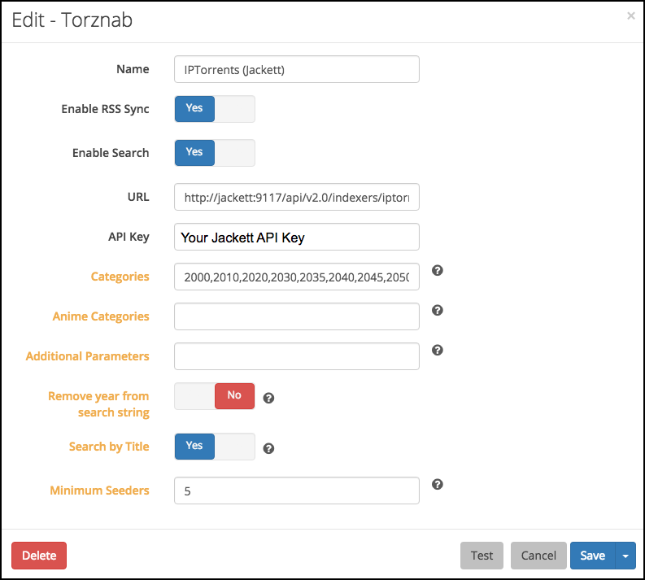
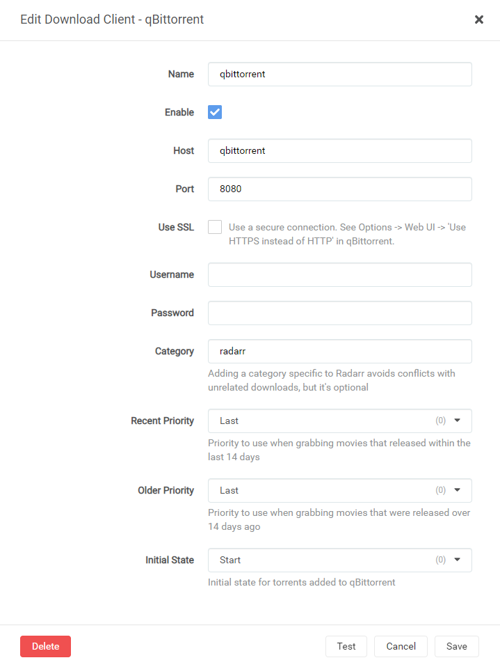
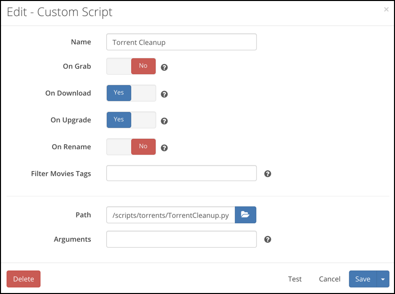
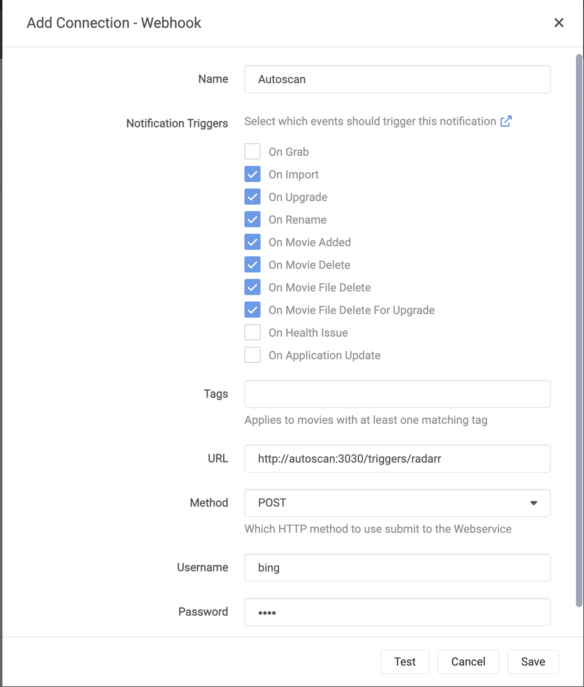
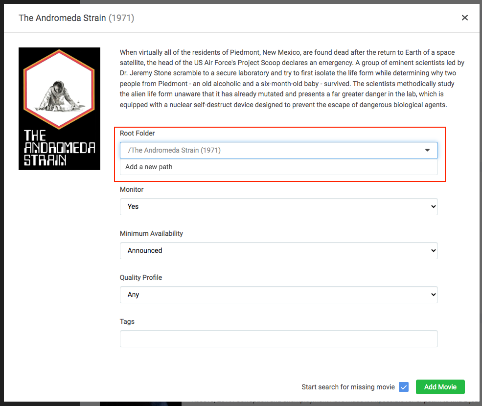

# What is it?

[Radarr](https://radarr.video/) is a movie collection manager for Usenet and BitTorrent users. It can monitor multiple RSS feeds for new movies and will interface with clients and indexers to grab, sort, and rename them. It can also be configured to automatically upgrade the quality of existing files in the library when a better quality format becomes available.

| Details     |             |             |             |
|-------------|-------------|-------------|-------------|
| [:material-home: Project home](https://radarr.video/){: .header-icons target=_blank rel="noopener noreferrer" } | [:octicons-link-16: Docs](https://wiki.servarr.com/radarr/){: .header-icons target=_blank rel="noopener noreferrer" } | [:octicons-mark-github-16: Github](https://github.com/Radarr/Radarr){: .header-icons target=_blank rel="noopener noreferrer" } | [:material-docker: Docker](https://hub.docker.com/r/hotio/radarr){: .header-icons target=_blank rel="noopener noreferrer" }|

## URL

- To access Radarr, visit `https://radarr._yourdomain.com_`

## Settings

Click on "Settings" in the sidebar.  Click "Show Advanced" at the top of the Settings pane.

Make changes in the following sections:

!!! Settings

    === "Media Management"

        These settings control management of media files.

        === "Movie Naming"

            - "Rename Movies": `Yes`

            - "Replace Illegal Characters": `Yes`

            - Colon Replacement Format: `Delete`

            _Note: You could use `Replace with Space Dash` but only if your file naming format is not using spaces (e.g. using dots) to separate words._

            - Set your preferred naming format; here are some examples.

            <details>
            <summary>TRaSH' naming guide [Recommended]</summary> <br />

            Go [here](https://trash-guides.info/Radarr/Radarr-recommended-naming-scheme/) for the latest updates.  These examples may be out of date.

            Example:  <br />
            ```
            The Movie Title (2010) Ultimate Extended Edition [imdb-tt0066921][Surround Sound x264][Bluray-1080p Proper][3D][HDR][10bit][x264][DTS 5.1]-EVOLVE.mkv
            ```

            Standard Movie Format: <br />
            ```
            {Movie CleanTitle} {(Release Year)} {Edition Tags} [imdb-{ImdbId}]{[Custom Formats]}{[Quality Full]}{[MediaInfo 3D]}{[MediaInfo VideoDynamicRange]}[{Mediainfo VideoBitDepth}bit][{Mediainfo VideoCodec}]{[Mediainfo AudioCodec}{ Mediainfo AudioChannels}]{-Release Group}
            ```

            Reference: https://trash-guides.info/Radarr/Radarr-recommended-naming-scheme/
            </details>

            The TRaSH naming guide is recommended since some other tools, notably Plex Meta Manager, expect it in their default setup.

            <details>
            <summary>Plex's Naming Preference</summary> <br />
            Example: <br />
            ```
            /Guardians of the Galaxy (2014)/Guardians of the Galaxy (2014).mkv
            ```

            Standard Movie Format: <br />
            ```
            {Movie Title} ({Release Year})
            ```

            Movie Folder Format: <br />
            ```
            {Movie Title} ({Release Year})
            ```

            Reference: https://support.plex.tv/articles/200381023-naming-movie-files/
            </details>

            <details>
            <summary>Radarr's Wiki Example</summary> <br />
            Example:  <br />
            ```
            The Movie Title (2010) - [ULTIMATE EXTENDED EDITION][BLURAY-1080P PROPER][DTS 5.1][X264]-EVOLVE.mkv
            ```

            Standard Movie Format: <br />
            ```
            {Movie Title} ({Release Year}) - {[EDITION TAGS]}{[QUALITY FULL]}{[MEDIAINFO AUDIOCODEC}{ MEDIAINFO AUDIOCHANNELS]}{[MEDIAINFO VIDEOCODEC]}{-RELEASE GROUP}
            ```

            Reference: https://github.com/Radarr/Radarr/wiki/Sorting-and-Renaming
            </details>

        === "Folders"

            - "Create empty movie folders": `No`

            - "Automatically Rename Folders": `No`

            - "Movie Paths Default to Static": `No`

        === "Importing"

            - "Skip Free Space Check": `No`

            - "Use Hardlinks instead of Copy": `Yes`

            - "Import Extra Files": `Yes` (_can be your preference_)

            - "Extra File Extensions": `srt, sub, idx`

        === "File Management"

            - "Ignore Deleted Movies": `No` (_can be your preference_)

            - "Download Propers": `No` (_can be your preference_)

            - "Analyse video files": `No`

            - "Change File Date": `None`

            - "Recycle Bin": _blank_ (Rclone deletes are sent to Gdrive trash folder, anyway)

        === "Permissions"

            - Set Permissions: `No`

        === "Save"

            - Click "Save".

    === "Indexers"

        These settings control [indexers](../saltbox/prerequisites/prerequisites.md#usenet-or-bittorrent-sources) and related behavior.

        === "NZBHydra2"

            1. Click Add Indexer (`+`).

            2. Select "Newznab".

            3. Add the following:

                Name: NZBHydra2

                Enable RSS Sync: _Your Preference_

                Enable Search: _Your Preference_

                URL: `http://nzbhydra2:5076`

                API Key: [Your NZBHydra2 API Key](../apps/nzbhydra2.md)

                Additional Parameters: _Leave Blank_

            4. Your settings will look like this:

                

            5. Click "Save" to add NZBHydra2.

            Note: The "Test" will keep failing until you add an indexer in [NZBHydra2](../apps/nzbhydra2.md).

        === "Jackett"

            Note: Each Indexer you have defined in Jackett will need to be added separately.

            1. Click Add Indexer (`+`)

            2. Select "Torznab".

            3. Add the following:

                Name: Indexer Name

                Enable RSS Sync: _Your Preference_

                Enable Search: _Your Preference_

                URL: [Indexer's Torznab Feed](../apps/jackett.md)

                API Key: [Your Jackett API Key](../apps/jackett.md)

                Additional Parameters: _Leave Blank_

            4. Your settings will look like this:

                

            5. Click "Save" to add the indexer.


    === "Download Clients"

        These settings control downloading behavior and clients.

        === "Completed Download Handling"

            - "Enable": `Yes`

            - "Remove": `Yes` (_can be your preference_)

        === "Failed Download Handling"

            - "Redownload": `Yes`

            - "Remove": `Yes`

        === "NZBGet"

            1. Click Add (`+`)

            2. Add a new "NZBGet" download client.

            3. Add the following:

                Name: NZBGet

                Enable: `Yes`

                Host: `nzbget`

                Port: `6789`

                Username:  [Your NZBGet Username](../apps/nzbget.md)

                Password:  [Your NZBGet Password](../apps/nzbget.md)

                Category: `radarr`

                Use SSL: `No`

                Add Paused: `No`

            4. Your settings will look like this:

                

            5. Click "Save" to add NZBGet.

        === "ruTorrent"

            1. Click Add (`+`)

            2. Add a new "rTorrent" download client.

            3. Add the following:

                Name: ruTorrent

                Enable: `Yes`

                Host: `rutorrent`

                Port: `80`

                URL Path: `RPC2`

                Use SSL: `No`

                Username: [Your ruTorrent Username](../apps/rutorrent.md)

                Password: [Your ruTorrent Password](../apps/rutorrent.md)

                Category: `radarr`

                Directory: _Leave Blank_

            4.  Your settings will now look like this:

                

            5. Click "Save" to add ruTorrent.

        === "qBittorrent"

            1. Click Add ('+')

            2. Add a new "qBittorrent" download client.

            3. Add the following:

                Name: qBittorrent

                Enable: 'Yes'

                Host: 'qBittorrent'

                Port: '8080'

                Username: [Your qBittorrent Username](../apps/qbittorrent.md)

                Password: [Your qBittorrent Password](../apps/qbittorrent.md)

                Category: 'radarr'

            4.  Your settings will now look like this:

                

            5.  Click "Save" to add qBittorrent

    === "Connect"

        These settings control connections to other applications or systems.

        === "Torrent Cleanup"

            Torrent Cleanup Script is a custom script that will cleanup torrents from ruTorrent that were auto-extracted, but still being seeded. So if the script detects that `.rar` files are in the folder that Radarr just imported from, it will delete the imported video file(s), leaving just the `.rar` files for seeding.

            1. Click "Settings" -> "Connect".

            2. Add a new "Custom Script".

            3. Add the following:

                Name: Torrent Cleanup

                On Grab: `No`

                On Download: `Yes`

                On Upgrade:  `Yes`

                On Rename:`No`

                Path: `/scripts/torrents/TorrentCleanup.py`

            4. The settings will look like this:

                

            5. Click "Save" to add the Torrent Cleanup script.


        === "Autoscan"

            1. Click "Settings" -> "Connect".

            2. Add a new "Webhook".

            3. Add the following:

                Name: Autoscan

                On Grab: `No`

                On Import: `Yes`

                On Upgrade:  `Yes`

                On Rename: `Yes`

                On Movie Delete: `Yes`

                On Movie File Delete: `Yes`

                On Movie File Delete For Upgrade: `Yes`

                Tags: _Leave Blank_

                URL: `http://autoscan:3030/triggers/radarr`

                Method:`POST`

                Username: AS SET IN AUTOSCAN CONFIG [defaults to Saltbox Username]

                Password: AS SET IN AUTOSCAN CONFIG [defaults to Saltbox Password]

            4. The settings will look like this:

                


            5. Click "Save" to add Autoscan.

    === "General"

        These settings control general aspects of Radarr.

        === "Start-Up"

            - "Bind Address: `*`

            - "Port Number": `7878`

            - "URL Base": _blank_

            - "Enable SSL": `No` (_SSL is handled by Traefik_)

        === "Proxy Settings"

            - "Use Proxy": `No`

        === "Logging"

            - "Log Level": `Debug`

        === "Analytics"

            - "Enable": `No` (_your preference_)

        === "Updates"

            These settings may be grayed out or unavailable; skip this if that's the case.

            - "Branch": `nightly` or `develop`

            - "Automatic": `Off`

        === "Save"

            - Click "Save".

## Movies Path

1. When you are ready to add your first movie to Radarr, click the "Path" drop-down and select "Add a new path".

2. Click the blue "Browse" button, navigate to `/mnt/unionfs/Media/Movies`, scroll to the bottom, and select "OK".

3. Click the green "check" button to add the path.

4. All movies added now will have that path set.



## API Key

This is used during the setup of [Overseerr](overseerr.md) and [Organizr](organizr.md).

- Go to "Settings" -> "General" -> "Security" -> "API Key".

## Guide

[TraSH Guides](https://trash-guides.info/Radarr/)

## Next

Are you setting Saltbox up for the first time?  Continue to [Lidarr](lidarr.md).
