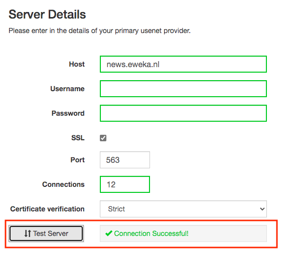
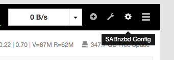

# What is it?

[SABnzbd](https://github.com/sabnzbd/sabnzbd) is an Open Source Binary Newsreader written in Python.

It's totally free, easy to use, and works practically everywhere. SABnzbd makes Usenet as simple and streamlined as possible by automating everything we can. All you have to do is add an .nzb. SABnzbd takes over from there, where it will be automatically downloaded, verified, repaired, extracted and filed away with zero human interaction. SABnzbd offers an easy setup wizard and has self-analysis tools to verify your setup.

| Details     |             |             |             |
|-------------|-------------|-------------|-------------|
| [:material-home: Project home](https://sabnzbd.org/){: .header-icons target=_blank rel="noopener noreferrer" } | [:octicons-link-16: Docs](https://sabnzbd.org/wiki/){: .header-icons target=_blank rel="noopener noreferrer" } | [:octicons-mark-github-16: Github](https://github.com/sabnzbd/sabnzbd){: .header-icons target=_blank rel="noopener noreferrer" } | [:material-docker: Docker](https://hub.docker.com/r/hotio/sabnzbd){: .header-icons target=_blank rel="noopener noreferrer" }|

## 1. Installation

```bash
sb install sabnzbd
```

## 1. URL

- To access SABnzbd, visit `https://sabnzbd._yourdomain.com_`

## 2. Basics

- Go through the setup wizard.  You will need to enter server details:



- When you get to the end of the wizard, click "Go To SABnzbd"


- Go to SABnzbd Config



- You will need to add in categories for `sonarr`, `radarr`, and `lidarr`.

  Set a relative directory name for each category.

  You will need a category for each instance of `sonarr`/`radarr`/`lidarr` [for example, if you have a `radarr` and `radarr4k` you will need a category for each]

  SABnzbd requires the server to be filled in to set categories up.

  **This needs to be done BEFORE adding SABnzbd as a downloader to any of those apps.**


- Direct unpack is disabled by default. Configure this as you prefer.

- Make note of the API Key in the "General" section


- When creating the connection in the arrs, use API Key rather than user/pass.


   Note that the category matches between Radarr and SABnzbd.  The specific category doesn't matter; just that they match.
