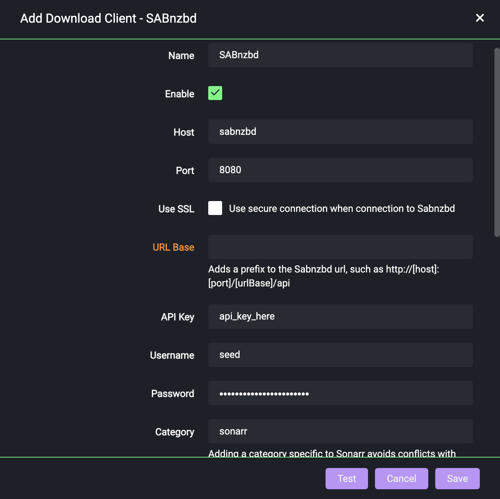

---
hide:
  - tags
tags:
  - sonarr
---

# Sonarr

# What is it?

[Sonarr](https://sonarr.tv/) is a PVR for Usenet and BitTorrent users. It can monitor multiple RSS feeds for new episodes of your favorite shows and will grab, sort and rename them. It can also be configured to automatically upgrade the quality of files already downloaded when a better quality format becomes available.

| Details     |             |             |             |
|-------------|-------------|-------------|-------------|
| [:material-home: Project home](https://sonarr.tv/){: .header-icons } | [:octicons-link-16: Docs](https://wiki.servarr.com/sonarr/){: .header-icons } | [:octicons-mark-github-16: Github](https://github.com/Sonarr/Sonarr){: .header-icons } | [:material-docker: Docker](https://hub.docker.com/r/hotio/sonarr){: .header-icons }|

## URL

- To access Sonarr, visit `https://sonarr._yourdomain.com_`

## Settings

Click on "Settings" in the sidebar.  Click "Show Advanced" at the top of the Settings pane.

Make changes in the following sections:

!!! info "Settings"

    === "Media Management"

        These settings control management of media files.

        === "Episode Naming"

            - "Rename Episodes": `Yes`

            - "Replace Illegal Characters": `Yes`

            - Set your preferred naming format; here are some examples:

                <details>
                <summary>TRaSH' naming guide [Recommended]</summary> <br />

                Go to the [TRaSH Guides Sonarr naming scheme](https://trash-guides.info/Sonarr/Sonarr-recommended-naming-scheme/) for the latest updates.  These examples may be out of date.

                Example:  <br />
                ```
                Single Episode:

                The Series Title! (2010) - S01E01 - Episode Title 1 [AMZN WEBDL-1080p Proper][HDR][10bit][x264][DTS 5.1]-RlsGrp

                Multi Episode:

                The Series Title! (2010) - S01E01-E02-E03 - Episode Title [AMZN WEBDL-1080p Proper][HDR][10bit][x264][DTS 5.1]-RlsGrp
                ```

                Standard Episode Format: <br />
                ```
                {Series TitleYear} - S{season:00}E{episode:00} - {Episode CleanTitle} [{Preferred Words }{Quality Full}]{[MediaInfo VideoDynamicRange]}[{MediaInfo VideoBitDepth}bit]{[MediaInfo VideoCodec]}{[Mediainfo AudioCodec}{ Mediainfo AudioChannels]}{MediaInfo AudioLanguages}{-Release Group}
                ```

                for more examples and discussion see the reference: https://trash-guides.info/Sonarr/Sonarr-recommended-naming-scheme/
                </details>

                The TRaSH naming guide is recommended since some other tools, notably Kometa, expect it in their default setup.


                <details>
                <summary>Plex's Naming Preference</summary>

                Example: <br />
                ```
                /Gotham/Season 01/Gotham - s01e01 - Pilot.mkv
                ```

                Standard Episode Format: <br />
                ```
                {Series Title} - s{season:00}e{episode:00} - {Episode Title}
                ```

                Anime Episode Format: <br />
                ```
                {Series Title} - s{season:00}e{episode:00} - {Episode Title}
                ```

                Daily Episode Format: <br />
                ```
                {Series Title} - {Air-Date} - {Episode Title}
                ```

                Season Folder Format: <br />
                ```
                Season {season:00}
                ```

                Multi-Episode Style: <br />
                ```
                Prefixed Range
                ```

                Reference: https://support.plex.tv/articles/200220687-naming-series-season-based-tv-shows/  <br />
                </details>

        === "Folders"

            - "Create empty series folders": `No`

            - "Delete empty folders": `No`

        === "Importing"

            - "Skip Free Space Check": `No`

            - "Use Hardlinks instead of Copy": `Yes`

            - "Import Extra Files": `Yes` (_can be your preference_)

            - "Extra File Extensions": `srt, sub, idx`

        === "File Management"

            - "Ignore Deleted Episodes": `No` (_can be your preference_)

            - "Download Propers": `No` (_can be your preference_)

            - "Analyse video files": `No`

            - "Change File Date": `None`

            - "Recycle Bin": _blank_ (Rclone deletes are sent to Gdrive trash folder, anyway)

        === "Permissions"

            - Set Permissions: `No`

        === "Save"

            - Click "Save".

    === "Indexers"

        These settings control [indexers](../saltbox/prerequisites/prerequisites.md#usenet-or-bittorrent-sources) and related behavior.

        === "NZBHydra2"

            1. Click Add Indexer (`+`).

            2. Select "Newznab".

            3. Add the following:

                Name: NZBHydra2

                Enable RSS Sync: _Your Preference_

                Enable Search: _Your Preference_

                URL: `http://nzbhydra2:5076`

                API Key: [Your NZBHydra2 API Key](../apps/nzbhydra2.md)

                Additional Parameters: _Leave Blank_

            4. Your settings will look like this:

                

            5. Click "Save" to add NZBHydra2.

            Note: The "Test" will keep failing until you add an indexer in [NZBHydra2](../apps/nzbhydra2.md).

        === "Jackett"

            Note: Each Indexer you have defined in Jackett will need to be added separately.

            1. Click Add Indexer (`+`)

            2. Select "Torznab".

            3. Add the following:

                Name: Indexer Name

                Enable RSS Sync: _Your Preference_

                Enable Search: _Your Preference_

                URL: [Indexer's Torznab Feed](../apps/jackett.md)

                API Key: [Your Jackett API Key](../apps/jackett.md)

                Additional Parameters: _Leave Blank_

            4. Your settings will look like this:

                

            5. Click "Save" to add the indexer.


    === "Download Clients"

        These settings control downloading behavior and clients.

        === "Completed Download Handling"

            - "Enable": `Yes`

            - "Remove": `Yes` (_can be your preference_)

        === "Failed Download Handling"

            - "Redownload": `Yes`

            - "Remove": `Yes`

        === "NZBGet"

            1. Click Add (`+`)

            2. Add a new "NZBGet" download client.

            3. Add the following:

                Name: NZBGet

                Enable: `Yes`

                Host: `nzbget`

                Port: `6789`

                Username:  [Your NZBGet Username](../apps/nzbget.md)

                Password:  [Your NZBGet Password](../apps/nzbget.md)

                Category: `sonarr`

                Use SSL: `No`

                Add Paused: `No`

            4. Your settings will look like this:

                

            5. Click "Save" to add NZBGet.

        === "SABNzbd"

            1. Click Add (`+`)

            2. Add a new "SABNzbd" download client.

            3. Add the following:

                Name: SABNzbd

                Enable: `Yes`

                Host: `sabnzbd`

                Port: `8080`

                For authentication, you can use either an API key or a username/password.

                === "API Key"

                    API Key:  [Your SABNzbd API Key](../apps/sabnzbd.md)

                === "Username/password"

                    Username:  [Your SABNzbd Username](../apps/sabnzbd.md)

                    Password:  [Your SABNzbd Password](../apps/sabnzbd.md)

                Category: `sonarr`

                Use SSL: `No`

                Add Paused: `No`

            4. Your settings will look like this:

                Either API Key **OR** Username/Password should be filled in, **not both**

                

            5. Click "Save" to add SABNzbd.

        === "ruTorrent"

            1. Click Add (`+`)

            2. Add a new "rTorrent" download client.

            3. Add the following:

                Name: ruTorrent

                Enable: `Yes`

                Host: `rutorrent`

                Port: `80`

                URL Path: `RPC2`

                Use SSL: `No`

                Username: [Your ruTorrent Username](../apps/rutorrent.md)

                Password: [Your ruTorrent Password](../apps/rutorrent.md)

                Category: `sonarr`

                Directory: _Leave Blank_

            4.  Your settings will now look like this:

                

            5. Click "Save" to add ruTorrent.

        === "qBittorrent"

            1. Click Add ('+')

            2. Add a new "qBittorrent" download client.

            3. Add the following:

                Name: qBittorrent

                Enable: 'Yes'

                Host: 'qBittorrent'

                Port: '8080'

                Username: [Your qBittorrent Username](../apps/qbittorrent.md)

                Password: [Your qBittorrent Password](../apps/qbittorrent.md)

                Category: 'sonarr'

            4.  Your settings will now look like this:

                

            5.  Click "Save" to add qBittorrent

    === "Connect"

        These settings control connections to other applications or systems.

        === "Torrent Cleanup"

            Torrent Cleanup Script is a custom script that will cleanup torrents from ruTorrent that were auto-extracted, but still being seeded. So if the script detects that `.rar` files are in the folder that Sonarr just imported from, it will delete the imported video file(s), leaving just the `.rar` files for seeding.

            1. Click "Settings" -> "Connect".

            2. Add a new "Custom Script".

            3. Add the following:

                Name: Torrent Cleanup

                On Grab: `No`

                On Download: `Yes`

                On Upgrade:  `Yes`

                On Rename:`No`

                Path: `/scripts/torrents/TorrentCleanup.py`

            4. The settings will look like this:

                

            5. Click "Save" to add the Torrent Cleanup script.


        === "Autoscan"

            IMPORTANT:  The Sonarr UI may differ from what is shown here; there may be additional events listed in the UI.  

            GENERALLY SPEAKING, if you have events listed that are not explicitly listed below, LEAVE THEM UNCHECKED.  Such events will generate errors in the autoscan logs; those errors can be ignored, but they are errors and can cause panic and confusion.

            MORE SPECIFICALLY, Autoscan is expecting a request that points to an individual file that is ready for Plex. so any event you may have that refers to a show being added, manual intervention, or anything else that is not "this specific video file ON DISK was imported/upgraded/deleted/etc", LEAVE IT UNCHECKED.


            1. Click "Settings" -> "Connect".

            2. Add a new "Webhook".

            3. Add the following:

                Name: Autoscan

                On Grab: `No`

                On Import: `Yes`

                On Upgrade:  `Yes`

                On Rename: `Yes`

                On Series Delete: `Yes`

                On Episode File Delete: `Yes`

                On Episode File Delete For Upgrade: `Yes`

                Tags: _Leave Blank_

                URL: `http://autoscan:3030/triggers/sonarr`

                Method:`POST`

                Username: AS SET IN AUTOSCAN CONFIG [defaults to Saltbox Username]

                Password: AS SET IN AUTOSCAN CONFIG [defaults to Saltbox Password]

            4. The settings will look like this:

                


            5. Click "Save" to add Autoscan.


    === "General"

        These settings control general aspects of Sonarr.

        === "Start-Up"

            - "Bind Address: `*`

            - "Port Number": `8989`

            - "URL Base": _blank_

            - "Enable SSL": `No` (_SSL is handled by Traefik_)

        === "Proxy Settings"

            - "Use Proxy": `No`

        === "Logging"

            - "Log Level": `Debug`

        === "Analytics"

            - "Enable": `No` (_your preference_)

        === "Updates"

            These settings may be grayed out or unavailable; skip this if that's the case.

            - "Branch": `main`

            - "Automatic": `Off`

        === "Save"

            - Click "Save".

## TV Path

1. When you are ready to add your first show to Sonarr, click the "Root Path" drop-down and select "Add a different path".

1. Click the blue "Browse" button, navigate to `/mnt/unionfs/Media/TV`, scroll to the bottom, and select "OK".

1. Click the green "check" button to add the path.

1. All TV shows added now will have that path set.


## API Key

This is used during the setup of [Overseer](overseerr.md) and [Organizr](organizr.md).

- Go to "Settings" -> "General" -> "Security" -> "API Key".

## Guides

[TraSH Guides](https://trash-guides.info/Sonarr/)

## Next

Are you setting Saltbox up for the first time?  Continue to [Radarr](radarr.md).

<!-- BEGIN SALTBOX MANAGED VARIABLES SECTION -->
<!-- This section is managed by saltbox/test.py - DO NOT EDIT MANUALLY -->
## Role Defaults

!!! info
    Variables can be overridden in `/srv/git/saltbox/inventories/host_vars/localhost.yml`.

    This role supports multiple instances via `sonarr_instances`.

    === "Role-level Override"

        Applies to all instances of sonarr:

        ```yaml
        sonarr_role_web_subdomain: "custom"
        ```

    === "Instance-level Override"

        Applies to a specific instance (e.g., `sonarr2`):

        ```yaml
        sonarr2_web_subdomain: "custom2"
        ```

!!! warning
    **Avoid overriding variables ending in `_default`**

    When overriding variables that end in `_default` (like `sonarr_docker_envs_default`), you replace the entire default configuration. Future updates that add new default values will not be applied to your setup, potentially breaking functionality.

    Instead, use the corresponding `_custom` variable (like `sonarr_docker_envs_custom`) to add your changes. Custom values are merged with defaults, ensuring you receive updates.

=== "Basics"

    ??? variable list "`sonarr_instances`"

        ```yaml
        # Type: list
        sonarr_instances: ["sonarr"]
        ```

        !!! example

            ```yaml
            # Type: list
            sonarr_instances: ["sonarr", "sonarr2"]
            ```

=== "Settings"

    === "Role-level"

        ??? variable bool "`sonarr_role_external_auth`"

            ```yaml
            # Type: bool (true/false)
            sonarr_role_external_auth: true
            ```

    === "Instance-level"

        ??? variable bool "`sonarr2_external_auth`"

            ```yaml
            # Type: bool (true/false)
            sonarr2_external_auth: true
            ```

=== "Paths"

    === "Role-level"

        ??? variable string "`sonarr_role_paths_folder`"

            ```yaml
            # Type: string
            sonarr_role_paths_folder: "{{ sonarr_name }}"
            ```

        ??? variable string "`sonarr_role_paths_location`"

            ```yaml
            # Type: string
            sonarr_role_paths_location: "{{ server_appdata_path }}/{{ sonarr_role_paths_folder }}"
            ```

        ??? variable string "`sonarr_role_paths_config_location`"

            ```yaml
            # Type: string
            sonarr_role_paths_config_location: "{{ sonarr_role_paths_location }}/config.xml"
            ```

    === "Instance-level"

        ??? variable string "`sonarr2_paths_folder`"

            ```yaml
            # Type: string
            sonarr2_paths_folder: "{{ sonarr_name }}"
            ```

        ??? variable string "`sonarr2_paths_location`"

            ```yaml
            # Type: string
            sonarr2_paths_location: "{{ server_appdata_path }}/{{ sonarr_role_paths_folder }}"
            ```

        ??? variable string "`sonarr2_paths_config_location`"

            ```yaml
            # Type: string
            sonarr2_paths_config_location: "{{ sonarr_role_paths_location }}/config.xml"
            ```

=== "Web"

    === "Role-level"

        ??? variable string "`sonarr_role_web_subdomain`"

            ```yaml
            # Type: string
            sonarr_role_web_subdomain: "{{ sonarr_name }}"
            ```

        ??? variable string "`sonarr_role_web_domain`"

            ```yaml
            # Type: string
            sonarr_role_web_domain: "{{ user.domain }}"
            ```

        ??? variable string "`sonarr_role_web_port`"

            ```yaml
            # Type: string
            sonarr_role_web_port: "8989"
            ```

        ??? variable string "`sonarr_role_web_url`"

            ```yaml
            # Type: string
            sonarr_role_web_url: "{{ 'https://' + (lookup('role_var', '_web_subdomain', role='sonarr') + '.' + lookup('role_var', '_web_domain', role='sonarr')
                                  if (lookup('role_var', '_web_subdomain', role='sonarr') | length > 0)
                                  else lookup('role_var', '_web_domain', role='sonarr')) }}"
            ```

    === "Instance-level"

        ??? variable string "`sonarr2_web_subdomain`"

            ```yaml
            # Type: string
            sonarr2_web_subdomain: "{{ sonarr_name }}"
            ```

        ??? variable string "`sonarr2_web_domain`"

            ```yaml
            # Type: string
            sonarr2_web_domain: "{{ user.domain }}"
            ```

        ??? variable string "`sonarr2_web_port`"

            ```yaml
            # Type: string
            sonarr2_web_port: "8989"
            ```

        ??? variable string "`sonarr2_web_url`"

            ```yaml
            # Type: string
            sonarr2_web_url: "{{ 'https://' + (lookup('role_var', '_web_subdomain', role='sonarr') + '.' + lookup('role_var', '_web_domain', role='sonarr')
                              if (lookup('role_var', '_web_subdomain', role='sonarr') | length > 0)
                              else lookup('role_var', '_web_domain', role='sonarr')) }}"
            ```

=== "DNS"

    === "Role-level"

        ??? variable string "`sonarr_role_dns_record`"

            ```yaml
            # Type: string
            sonarr_role_dns_record: "{{ lookup('role_var', '_web_subdomain', role='sonarr') }}"
            ```

        ??? variable string "`sonarr_role_dns_zone`"

            ```yaml
            # Type: string
            sonarr_role_dns_zone: "{{ lookup('role_var', '_web_domain', role='sonarr') }}"
            ```

        ??? variable bool "`sonarr_role_dns_proxy`"

            ```yaml
            # Type: bool (true/false)
            sonarr_role_dns_proxy: "{{ dns_proxied }}"
            ```

    === "Instance-level"

        ??? variable string "`sonarr2_dns_record`"

            ```yaml
            # Type: string
            sonarr2_dns_record: "{{ lookup('role_var', '_web_subdomain', role='sonarr') }}"
            ```

        ??? variable string "`sonarr2_dns_zone`"

            ```yaml
            # Type: string
            sonarr2_dns_zone: "{{ lookup('role_var', '_web_domain', role='sonarr') }}"
            ```

        ??? variable bool "`sonarr2_dns_proxy`"

            ```yaml
            # Type: bool (true/false)
            sonarr2_dns_proxy: "{{ dns_proxied }}"
            ```

=== "Traefik"

    === "Role-level"

        ??? variable string "`sonarr_role_traefik_sso_middleware`"

            ```yaml
            # Type: string
            sonarr_role_traefik_sso_middleware: "{{ traefik_default_sso_middleware }}"
            ```

        ??? variable string "`sonarr_role_traefik_middleware_default`"

            ```yaml
            # Type: string
            sonarr_role_traefik_middleware_default: "{{ traefik_default_middleware
                                                        + (',themepark-' + sonarr_name
                                                          if (lookup('role_var', '_themepark_enabled', role='sonarr') and global_themepark_plugin_enabled)
                                                          else '') }}"
            ```

        ??? variable string "`sonarr_role_traefik_middleware_custom`"

            ```yaml
            # Type: string
            sonarr_role_traefik_middleware_custom: ""
            ```

        ??? variable string "`sonarr_role_traefik_certresolver`"

            ```yaml
            # Type: string
            sonarr_role_traefik_certresolver: "{{ traefik_default_certresolver }}"
            ```

        ??? variable bool "`sonarr_role_traefik_enabled`"

            ```yaml
            # Type: bool (true/false)
            sonarr_role_traefik_enabled: true
            ```

        ??? variable bool "`sonarr_role_traefik_api_enabled`"

            ```yaml
            # Type: bool (true/false)
            sonarr_role_traefik_api_enabled: true
            ```

        ??? variable string "`sonarr_role_traefik_api_endpoint`"

            ```yaml
            # Type: string
            sonarr_role_traefik_api_endpoint: "PathPrefix(`/api`) || PathPrefix(`/feed`) || PathPrefix(`/ping`)"
            ```

    === "Instance-level"

        ??? variable string "`sonarr2_traefik_sso_middleware`"

            ```yaml
            # Type: string
            sonarr2_traefik_sso_middleware: "{{ traefik_default_sso_middleware }}"
            ```

        ??? variable string "`sonarr2_traefik_middleware_default`"

            ```yaml
            # Type: string
            sonarr2_traefik_middleware_default: "{{ traefik_default_middleware
                                                    + (',themepark-' + sonarr_name
                                                      if (lookup('role_var', '_themepark_enabled', role='sonarr') and global_themepark_plugin_enabled)
                                                      else '') }}"
            ```

        ??? variable string "`sonarr2_traefik_middleware_custom`"

            ```yaml
            # Type: string
            sonarr2_traefik_middleware_custom: ""
            ```

        ??? variable string "`sonarr2_traefik_certresolver`"

            ```yaml
            # Type: string
            sonarr2_traefik_certresolver: "{{ traefik_default_certresolver }}"
            ```

        ??? variable bool "`sonarr2_traefik_enabled`"

            ```yaml
            # Type: bool (true/false)
            sonarr2_traefik_enabled: true
            ```

        ??? variable bool "`sonarr2_traefik_api_enabled`"

            ```yaml
            # Type: bool (true/false)
            sonarr2_traefik_api_enabled: true
            ```

        ??? variable string "`sonarr2_traefik_api_endpoint`"

            ```yaml
            # Type: string
            sonarr2_traefik_api_endpoint: "PathPrefix(`/api`) || PathPrefix(`/feed`) || PathPrefix(`/ping`)"
            ```

=== "Theme"

    === "Role-level"

        ??? variable bool "`sonarr_role_themepark_enabled`"

            ```yaml
            # Options can be found at https://github.com/themepark-dev/theme.park
            # Type: bool (true/false)
            sonarr_role_themepark_enabled: false
            ```

        ??? variable string "`sonarr_role_themepark_app`"

            ```yaml
            # Type: string
            sonarr_role_themepark_app: "sonarr"
            ```

        ??? variable string "`sonarr_role_themepark_theme`"

            ```yaml
            # Type: string
            sonarr_role_themepark_theme: "{{ global_themepark_theme }}"
            ```

        ??? variable string "`sonarr_role_themepark_domain`"

            ```yaml
            # Type: string
            sonarr_role_themepark_domain: "{{ global_themepark_domain }}"
            ```

        ??? variable list "`sonarr_role_themepark_addons`"

            ```yaml
            # Type: list
            sonarr_role_themepark_addons: []
            ```

    === "Instance-level"

        ??? variable bool "`sonarr2_themepark_enabled`"

            ```yaml
            # Options can be found at https://github.com/themepark-dev/theme.park
            # Type: bool (true/false)
            sonarr2_themepark_enabled: false
            ```

        ??? variable string "`sonarr2_themepark_app`"

            ```yaml
            # Type: string
            sonarr2_themepark_app: "sonarr"
            ```

        ??? variable string "`sonarr2_themepark_theme`"

            ```yaml
            # Type: string
            sonarr2_themepark_theme: "{{ global_themepark_theme }}"
            ```

        ??? variable string "`sonarr2_themepark_domain`"

            ```yaml
            # Type: string
            sonarr2_themepark_domain: "{{ global_themepark_domain }}"
            ```

        ??? variable list "`sonarr2_themepark_addons`"

            ```yaml
            # Type: list
            sonarr2_themepark_addons: []
            ```

=== "Docker"

    === "Role-level"

        ##### Container

        ??? variable string "`sonarr_role_docker_container`"

            ```yaml
            # Type: string
            sonarr_role_docker_container: "{{ sonarr_name }}"
            ```

        ##### Image

        ??? variable bool "`sonarr_role_docker_image_pull`"

            ```yaml
            # Type: bool (true/false)
            sonarr_role_docker_image_pull: true
            ```

        ??? variable string "`sonarr_role_docker_image_repo`"

            ```yaml
            # Type: string
            sonarr_role_docker_image_repo: "ghcr.io/hotio/sonarr"
            ```

        ??? variable string "`sonarr_role_docker_image_tag`"

            ```yaml
            # Type: string
            sonarr_role_docker_image_tag: "release"
            ```

        ??? variable string "`sonarr_role_docker_image`"

            ```yaml
            # Type: string
            sonarr_role_docker_image: "{{ lookup('role_var', '_docker_image_repo', role='sonarr') }}:{{ lookup('role_var', '_docker_image_tag', role='sonarr') }}"
            ```

        ##### Envs

        ??? variable dict "`sonarr_role_docker_envs_default`"

            ```yaml
            # Type: dict
            sonarr_role_docker_envs_default: 
              PUID: "{{ uid }}"
              PGID: "{{ gid }}"
              UMASK: "002"
              TZ: "{{ tz }}"
            ```

        ??? variable dict "`sonarr_role_docker_envs_custom`"

            ```yaml
            # Type: dict
            sonarr_role_docker_envs_custom: {}
            ```

        ##### Volumes

        ??? variable list "`sonarr_role_docker_volumes_default`"

            ```yaml
            # Type: list
            sonarr_role_docker_volumes_default: 
              - "{{ sonarr_role_paths_location }}:/config"
              - "{{ server_appdata_path }}/scripts:/scripts"
            ```

        ??? variable list "`sonarr_role_docker_volumes_legacy`"

            ```yaml
            # Type: list
            sonarr_role_docker_volumes_legacy: 
              - "/mnt/unionfs/Media/TV:/tv"
            ```

        ??? variable list "`sonarr_role_docker_volumes_custom`"

            ```yaml
            # Type: list
            sonarr_role_docker_volumes_custom: []
            ```

        ##### Labels

        ??? variable dict "`sonarr_role_docker_labels_default`"

            ```yaml
            # Type: dict
            sonarr_role_docker_labels_default: {}
            ```

        ??? variable dict "`sonarr_role_docker_labels_custom`"

            ```yaml
            # Type: dict
            sonarr_role_docker_labels_custom: {}
            ```

        ##### Hostname

        ??? variable string "`sonarr_role_docker_hostname`"

            ```yaml
            # Type: string
            sonarr_role_docker_hostname: "{{ sonarr_name }}"
            ```

        ##### Networks

        ??? variable string "`sonarr_role_docker_networks_alias`"

            ```yaml
            # Type: string
            sonarr_role_docker_networks_alias: "{{ sonarr_name }}"
            ```

        ??? variable list "`sonarr_role_docker_networks_default`"

            ```yaml
            # Type: list
            sonarr_role_docker_networks_default: []
            ```

        ??? variable list "`sonarr_role_docker_networks_custom`"

            ```yaml
            # Type: list
            sonarr_role_docker_networks_custom: []
            ```

        ##### Restart Policy

        ??? variable string "`sonarr_role_docker_restart_policy`"

            ```yaml
            # Type: string
            sonarr_role_docker_restart_policy: unless-stopped
            ```

        ##### State

        ??? variable string "`sonarr_role_docker_state`"

            ```yaml
            # Type: string
            sonarr_role_docker_state: started
            ```

    === "Instance-level"

        ##### Container

        ??? variable string "`sonarr2_docker_container`"

            ```yaml
            # Type: string
            sonarr2_docker_container: "{{ sonarr_name }}"
            ```

        ##### Image

        ??? variable bool "`sonarr2_docker_image_pull`"

            ```yaml
            # Type: bool (true/false)
            sonarr2_docker_image_pull: true
            ```

        ??? variable string "`sonarr2_docker_image_repo`"

            ```yaml
            # Type: string
            sonarr2_docker_image_repo: "ghcr.io/hotio/sonarr"
            ```

        ??? variable string "`sonarr2_docker_image_tag`"

            ```yaml
            # Type: string
            sonarr2_docker_image_tag: "release"
            ```

        ??? variable string "`sonarr2_docker_image`"

            ```yaml
            # Type: string
            sonarr2_docker_image: "{{ lookup('role_var', '_docker_image_repo', role='sonarr') }}:{{ lookup('role_var', '_docker_image_tag', role='sonarr') }}"
            ```

        ##### Envs

        ??? variable dict "`sonarr2_docker_envs_default`"

            ```yaml
            # Type: dict
            sonarr2_docker_envs_default: 
              PUID: "{{ uid }}"
              PGID: "{{ gid }}"
              UMASK: "002"
              TZ: "{{ tz }}"
            ```

        ??? variable dict "`sonarr2_docker_envs_custom`"

            ```yaml
            # Type: dict
            sonarr2_docker_envs_custom: {}
            ```

        ##### Volumes

        ??? variable list "`sonarr2_docker_volumes_default`"

            ```yaml
            # Type: list
            sonarr2_docker_volumes_default: 
              - "{{ sonarr_role_paths_location }}:/config"
              - "{{ server_appdata_path }}/scripts:/scripts"
            ```

        ??? variable list "`sonarr2_docker_volumes_legacy`"

            ```yaml
            # Type: list
            sonarr2_docker_volumes_legacy: 
              - "/mnt/unionfs/Media/TV:/tv"
            ```

        ??? variable list "`sonarr2_docker_volumes_custom`"

            ```yaml
            # Type: list
            sonarr2_docker_volumes_custom: []
            ```

        ##### Labels

        ??? variable dict "`sonarr2_docker_labels_default`"

            ```yaml
            # Type: dict
            sonarr2_docker_labels_default: {}
            ```

        ??? variable dict "`sonarr2_docker_labels_custom`"

            ```yaml
            # Type: dict
            sonarr2_docker_labels_custom: {}
            ```

        ##### Hostname

        ??? variable string "`sonarr2_docker_hostname`"

            ```yaml
            # Type: string
            sonarr2_docker_hostname: "{{ sonarr_name }}"
            ```

        ##### Networks

        ??? variable string "`sonarr2_docker_networks_alias`"

            ```yaml
            # Type: string
            sonarr2_docker_networks_alias: "{{ sonarr_name }}"
            ```

        ??? variable list "`sonarr2_docker_networks_default`"

            ```yaml
            # Type: list
            sonarr2_docker_networks_default: []
            ```

        ??? variable list "`sonarr2_docker_networks_custom`"

            ```yaml
            # Type: list
            sonarr2_docker_networks_custom: []
            ```

        ##### Restart Policy

        ??? variable string "`sonarr2_docker_restart_policy`"

            ```yaml
            # Type: string
            sonarr2_docker_restart_policy: unless-stopped
            ```

        ##### State

        ??? variable string "`sonarr2_docker_state`"

            ```yaml
            # Type: string
            sonarr2_docker_state: started
            ```

=== "Docker+"

    #### Additional Docker Options

    The following advanced options are available via create_docker_container but are not defined in the role. See: https://docs.ansible.com/ansible/latest/collections/community/docker/docker_container_module.html

    === "Role-level"

        ##### Resource Limits

        ??? variable int "`sonarr_role_docker_blkio_weight`"

            ```yaml
            # Type: int
            sonarr_role_docker_blkio_weight:
            ```

        ??? variable int "`sonarr_role_docker_cpu_period`"

            ```yaml
            # Type: int
            sonarr_role_docker_cpu_period:
            ```

        ??? variable int "`sonarr_role_docker_cpu_quota`"

            ```yaml
            # Type: int
            sonarr_role_docker_cpu_quota:
            ```

        ??? variable int "`sonarr_role_docker_cpu_shares`"

            ```yaml
            # Type: int
            sonarr_role_docker_cpu_shares:
            ```

        ??? variable string "`sonarr_role_docker_cpus`"

            ```yaml
            # Type: string
            sonarr_role_docker_cpus:
            ```

        ??? variable string "`sonarr_role_docker_cpuset_cpus`"

            ```yaml
            # Type: string
            sonarr_role_docker_cpuset_cpus:
            ```

        ??? variable string "`sonarr_role_docker_cpuset_mems`"

            ```yaml
            # Type: string
            sonarr_role_docker_cpuset_mems:
            ```

        ??? variable string "`sonarr_role_docker_kernel_memory`"

            ```yaml
            # Type: string
            sonarr_role_docker_kernel_memory:
            ```

        ??? variable string "`sonarr_role_docker_memory`"

            ```yaml
            # Type: string
            sonarr_role_docker_memory:
            ```

        ??? variable string "`sonarr_role_docker_memory_reservation`"

            ```yaml
            # Type: string
            sonarr_role_docker_memory_reservation:
            ```

        ??? variable string "`sonarr_role_docker_memory_swap`"

            ```yaml
            # Type: string
            sonarr_role_docker_memory_swap:
            ```

        ??? variable int "`sonarr_role_docker_memory_swappiness`"

            ```yaml
            # Type: int
            sonarr_role_docker_memory_swappiness:
            ```

        ##### Security & Devices

        ??? variable list "`sonarr_role_docker_cap_drop`"

            ```yaml
            # Type: list
            sonarr_role_docker_cap_drop:
            ```

        ??? variable list "`sonarr_role_docker_device_cgroup_rules`"

            ```yaml
            # Type: list
            sonarr_role_docker_device_cgroup_rules:
            ```

        ??? variable list "`sonarr_role_docker_device_read_bps`"

            ```yaml
            # Type: list
            sonarr_role_docker_device_read_bps:
            ```

        ??? variable list "`sonarr_role_docker_device_read_iops`"

            ```yaml
            # Type: list
            sonarr_role_docker_device_read_iops:
            ```

        ??? variable list "`sonarr_role_docker_device_requests`"

            ```yaml
            # Type: list
            sonarr_role_docker_device_requests:
            ```

        ??? variable list "`sonarr_role_docker_device_write_bps`"

            ```yaml
            # Type: list
            sonarr_role_docker_device_write_bps:
            ```

        ??? variable list "`sonarr_role_docker_device_write_iops`"

            ```yaml
            # Type: list
            sonarr_role_docker_device_write_iops:
            ```

        ??? variable list "`sonarr_role_docker_devices`"

            ```yaml
            # Type: list
            sonarr_role_docker_devices:
            ```

        ??? variable string "`sonarr_role_docker_devices_default`"

            ```yaml
            # Type: string
            sonarr_role_docker_devices_default:
            ```

        ??? variable bool "`sonarr_role_docker_privileged`"

            ```yaml
            # Type: bool (true/false)
            sonarr_role_docker_privileged:
            ```

        ??? variable list "`sonarr_role_docker_security_opts`"

            ```yaml
            # Type: list
            sonarr_role_docker_security_opts:
            ```

        ##### Networking

        ??? variable list "`sonarr_role_docker_dns_opts`"

            ```yaml
            # Type: list
            sonarr_role_docker_dns_opts:
            ```

        ??? variable list "`sonarr_role_docker_dns_search_domains`"

            ```yaml
            # Type: list
            sonarr_role_docker_dns_search_domains:
            ```

        ??? variable list "`sonarr_role_docker_dns_servers`"

            ```yaml
            # Type: list
            sonarr_role_docker_dns_servers:
            ```

        ??? variable dict "`sonarr_role_docker_hosts`"

            ```yaml
            # Type: dict
            sonarr_role_docker_hosts:
            ```

        ??? variable string "`sonarr_role_docker_hosts_use_common`"

            ```yaml
            # Type: string
            sonarr_role_docker_hosts_use_common:
            ```

        ??? variable string "`sonarr_role_docker_network_mode`"

            ```yaml
            # Type: string
            sonarr_role_docker_network_mode:
            ```

        ##### Storage

        ??? variable bool "`sonarr_role_docker_keep_volumes`"

            ```yaml
            # Type: bool (true/false)
            sonarr_role_docker_keep_volumes:
            ```

        ??? variable list "`sonarr_role_docker_mounts`"

            ```yaml
            # Type: list
            sonarr_role_docker_mounts:
            ```

        ??? variable string "`sonarr_role_docker_volume_driver`"

            ```yaml
            # Type: string
            sonarr_role_docker_volume_driver:
            ```

        ??? variable list "`sonarr_role_docker_volumes_from`"

            ```yaml
            # Type: list
            sonarr_role_docker_volumes_from:
            ```

        ??? variable string "`sonarr_role_docker_volumes_global`"

            ```yaml
            # Type: string
            sonarr_role_docker_volumes_global:
            ```

        ??? variable string "`sonarr_role_docker_working_dir`"

            ```yaml
            # Type: string
            sonarr_role_docker_working_dir:
            ```

        ##### Monitoring & Lifecycle

        ??? variable dict "`sonarr_role_docker_healthcheck`"

            ```yaml
            # Type: dict
            sonarr_role_docker_healthcheck:
            ```

        ??? variable bool "`sonarr_role_docker_init`"

            ```yaml
            # Type: bool (true/false)
            sonarr_role_docker_init:
            ```

        ??? variable string "`sonarr_role_docker_log_driver`"

            ```yaml
            # Type: string
            sonarr_role_docker_log_driver:
            ```

        ??? variable dict "`sonarr_role_docker_log_options`"

            ```yaml
            # Type: dict
            sonarr_role_docker_log_options:
            ```

        ??? variable bool "`sonarr_role_docker_output_logs`"

            ```yaml
            # Type: bool (true/false)
            sonarr_role_docker_output_logs:
            ```

        ##### Other Options

        ??? variable bool "`sonarr_role_docker_auto_remove`"

            ```yaml
            # Type: bool (true/false)
            sonarr_role_docker_auto_remove:
            ```

        ??? variable list "`sonarr_role_docker_capabilities`"

            ```yaml
            # Type: list
            sonarr_role_docker_capabilities:
            ```

        ??? variable string "`sonarr_role_docker_cgroup_parent`"

            ```yaml
            # Type: string
            sonarr_role_docker_cgroup_parent:
            ```

        ??? variable string "`sonarr_role_docker_cgroupns_mode`"

            ```yaml
            # Type: string
            sonarr_role_docker_cgroupns_mode:
            ```

        ??? variable bool "`sonarr_role_docker_cleanup`"

            ```yaml
            # Type: bool (true/false)
            sonarr_role_docker_cleanup:
            ```

        ??? variable list "`sonarr_role_docker_commands`"

            ```yaml
            # Type: list
            sonarr_role_docker_commands:
            ```

        ??? variable string "`sonarr_role_docker_create_timeout`"

            ```yaml
            # Type: string
            sonarr_role_docker_create_timeout:
            ```

        ??? variable string "`sonarr_role_docker_domainname`"

            ```yaml
            # Type: string
            sonarr_role_docker_domainname:
            ```

        ??? variable string "`sonarr_role_docker_entrypoint`"

            ```yaml
            # Type: string
            sonarr_role_docker_entrypoint:
            ```

        ??? variable string "`sonarr_role_docker_env_file`"

            ```yaml
            # Type: string
            sonarr_role_docker_env_file:
            ```

        ??? variable list "`sonarr_role_docker_exposed_ports`"

            ```yaml
            # Type: list
            sonarr_role_docker_exposed_ports:
            ```

        ??? variable string "`sonarr_role_docker_force_kill`"

            ```yaml
            # Type: string
            sonarr_role_docker_force_kill:
            ```

        ??? variable list "`sonarr_role_docker_groups`"

            ```yaml
            # Type: list
            sonarr_role_docker_groups:
            ```

        ??? variable int "`sonarr_role_docker_healthy_wait_timeout`"

            ```yaml
            # Type: int
            sonarr_role_docker_healthy_wait_timeout:
            ```

        ??? variable string "`sonarr_role_docker_ipc_mode`"

            ```yaml
            # Type: string
            sonarr_role_docker_ipc_mode:
            ```

        ??? variable string "`sonarr_role_docker_kill_signal`"

            ```yaml
            # Type: string
            sonarr_role_docker_kill_signal:
            ```

        ??? variable string "`sonarr_role_docker_labels_use_common`"

            ```yaml
            # Type: string
            sonarr_role_docker_labels_use_common:
            ```

        ??? variable list "`sonarr_role_docker_links`"

            ```yaml
            # Type: list
            sonarr_role_docker_links:
            ```

        ??? variable bool "`sonarr_role_docker_oom_killer`"

            ```yaml
            # Type: bool (true/false)
            sonarr_role_docker_oom_killer:
            ```

        ??? variable int "`sonarr_role_docker_oom_score_adj`"

            ```yaml
            # Type: int
            sonarr_role_docker_oom_score_adj:
            ```

        ??? variable bool "`sonarr_role_docker_paused`"

            ```yaml
            # Type: bool (true/false)
            sonarr_role_docker_paused:
            ```

        ??? variable string "`sonarr_role_docker_pid_mode`"

            ```yaml
            # Type: string
            sonarr_role_docker_pid_mode:
            ```

        ??? variable list "`sonarr_role_docker_ports`"

            ```yaml
            # Type: list
            sonarr_role_docker_ports:
            ```

        ??? variable bool "`sonarr_role_docker_read_only`"

            ```yaml
            # Type: bool (true/false)
            sonarr_role_docker_read_only:
            ```

        ??? variable bool "`sonarr_role_docker_recreate`"

            ```yaml
            # Type: bool (true/false)
            sonarr_role_docker_recreate:
            ```

        ??? variable int "`sonarr_role_docker_restart_retries`"

            ```yaml
            # Type: int
            sonarr_role_docker_restart_retries:
            ```

        ??? variable string "`sonarr_role_docker_runtime`"

            ```yaml
            # Type: string
            sonarr_role_docker_runtime:
            ```

        ??? variable string "`sonarr_role_docker_shm_size`"

            ```yaml
            # Type: string
            sonarr_role_docker_shm_size:
            ```

        ??? variable int "`sonarr_role_docker_stop_timeout`"

            ```yaml
            # Type: int
            sonarr_role_docker_stop_timeout:
            ```

        ??? variable dict "`sonarr_role_docker_storage_opts`"

            ```yaml
            # Type: dict
            sonarr_role_docker_storage_opts:
            ```

        ??? variable list "`sonarr_role_docker_sysctls`"

            ```yaml
            # Type: list
            sonarr_role_docker_sysctls:
            ```

        ??? variable list "`sonarr_role_docker_tmpfs`"

            ```yaml
            # Type: list
            sonarr_role_docker_tmpfs:
            ```

        ??? variable list "`sonarr_role_docker_ulimits`"

            ```yaml
            # Type: list
            sonarr_role_docker_ulimits:
            ```

        ??? variable string "`sonarr_role_docker_user`"

            ```yaml
            # Type: string
            sonarr_role_docker_user:
            ```

        ??? variable string "`sonarr_role_docker_userns_mode`"

            ```yaml
            # Type: string
            sonarr_role_docker_userns_mode:
            ```

        ??? variable string "`sonarr_role_docker_uts`"

            ```yaml
            # Type: string
            sonarr_role_docker_uts:
            ```

    === "Instance-level"

        ##### Resource Limits

        ??? variable int "`sonarr2_docker_blkio_weight`"

            ```yaml
            # Type: int
            sonarr2_docker_blkio_weight:
            ```

        ??? variable int "`sonarr2_docker_cpu_period`"

            ```yaml
            # Type: int
            sonarr2_docker_cpu_period:
            ```

        ??? variable int "`sonarr2_docker_cpu_quota`"

            ```yaml
            # Type: int
            sonarr2_docker_cpu_quota:
            ```

        ??? variable int "`sonarr2_docker_cpu_shares`"

            ```yaml
            # Type: int
            sonarr2_docker_cpu_shares:
            ```

        ??? variable string "`sonarr2_docker_cpus`"

            ```yaml
            # Type: string
            sonarr2_docker_cpus:
            ```

        ??? variable string "`sonarr2_docker_cpuset_cpus`"

            ```yaml
            # Type: string
            sonarr2_docker_cpuset_cpus:
            ```

        ??? variable string "`sonarr2_docker_cpuset_mems`"

            ```yaml
            # Type: string
            sonarr2_docker_cpuset_mems:
            ```

        ??? variable string "`sonarr2_docker_kernel_memory`"

            ```yaml
            # Type: string
            sonarr2_docker_kernel_memory:
            ```

        ??? variable string "`sonarr2_docker_memory`"

            ```yaml
            # Type: string
            sonarr2_docker_memory:
            ```

        ??? variable string "`sonarr2_docker_memory_reservation`"

            ```yaml
            # Type: string
            sonarr2_docker_memory_reservation:
            ```

        ??? variable string "`sonarr2_docker_memory_swap`"

            ```yaml
            # Type: string
            sonarr2_docker_memory_swap:
            ```

        ??? variable int "`sonarr2_docker_memory_swappiness`"

            ```yaml
            # Type: int
            sonarr2_docker_memory_swappiness:
            ```

        ##### Security & Devices

        ??? variable list "`sonarr2_docker_cap_drop`"

            ```yaml
            # Type: list
            sonarr2_docker_cap_drop:
            ```

        ??? variable list "`sonarr2_docker_device_cgroup_rules`"

            ```yaml
            # Type: list
            sonarr2_docker_device_cgroup_rules:
            ```

        ??? variable list "`sonarr2_docker_device_read_bps`"

            ```yaml
            # Type: list
            sonarr2_docker_device_read_bps:
            ```

        ??? variable list "`sonarr2_docker_device_read_iops`"

            ```yaml
            # Type: list
            sonarr2_docker_device_read_iops:
            ```

        ??? variable list "`sonarr2_docker_device_requests`"

            ```yaml
            # Type: list
            sonarr2_docker_device_requests:
            ```

        ??? variable list "`sonarr2_docker_device_write_bps`"

            ```yaml
            # Type: list
            sonarr2_docker_device_write_bps:
            ```

        ??? variable list "`sonarr2_docker_device_write_iops`"

            ```yaml
            # Type: list
            sonarr2_docker_device_write_iops:
            ```

        ??? variable list "`sonarr2_docker_devices`"

            ```yaml
            # Type: list
            sonarr2_docker_devices:
            ```

        ??? variable string "`sonarr2_docker_devices_default`"

            ```yaml
            # Type: string
            sonarr2_docker_devices_default:
            ```

        ??? variable bool "`sonarr2_docker_privileged`"

            ```yaml
            # Type: bool (true/false)
            sonarr2_docker_privileged:
            ```

        ??? variable list "`sonarr2_docker_security_opts`"

            ```yaml
            # Type: list
            sonarr2_docker_security_opts:
            ```

        ##### Networking

        ??? variable list "`sonarr2_docker_dns_opts`"

            ```yaml
            # Type: list
            sonarr2_docker_dns_opts:
            ```

        ??? variable list "`sonarr2_docker_dns_search_domains`"

            ```yaml
            # Type: list
            sonarr2_docker_dns_search_domains:
            ```

        ??? variable list "`sonarr2_docker_dns_servers`"

            ```yaml
            # Type: list
            sonarr2_docker_dns_servers:
            ```

        ??? variable dict "`sonarr2_docker_hosts`"

            ```yaml
            # Type: dict
            sonarr2_docker_hosts:
            ```

        ??? variable string "`sonarr2_docker_hosts_use_common`"

            ```yaml
            # Type: string
            sonarr2_docker_hosts_use_common:
            ```

        ??? variable string "`sonarr2_docker_network_mode`"

            ```yaml
            # Type: string
            sonarr2_docker_network_mode:
            ```

        ##### Storage

        ??? variable bool "`sonarr2_docker_keep_volumes`"

            ```yaml
            # Type: bool (true/false)
            sonarr2_docker_keep_volumes:
            ```

        ??? variable list "`sonarr2_docker_mounts`"

            ```yaml
            # Type: list
            sonarr2_docker_mounts:
            ```

        ??? variable string "`sonarr2_docker_volume_driver`"

            ```yaml
            # Type: string
            sonarr2_docker_volume_driver:
            ```

        ??? variable list "`sonarr2_docker_volumes_from`"

            ```yaml
            # Type: list
            sonarr2_docker_volumes_from:
            ```

        ??? variable string "`sonarr2_docker_volumes_global`"

            ```yaml
            # Type: string
            sonarr2_docker_volumes_global:
            ```

        ??? variable string "`sonarr2_docker_working_dir`"

            ```yaml
            # Type: string
            sonarr2_docker_working_dir:
            ```

        ##### Monitoring & Lifecycle

        ??? variable dict "`sonarr2_docker_healthcheck`"

            ```yaml
            # Type: dict
            sonarr2_docker_healthcheck:
            ```

        ??? variable bool "`sonarr2_docker_init`"

            ```yaml
            # Type: bool (true/false)
            sonarr2_docker_init:
            ```

        ??? variable string "`sonarr2_docker_log_driver`"

            ```yaml
            # Type: string
            sonarr2_docker_log_driver:
            ```

        ??? variable dict "`sonarr2_docker_log_options`"

            ```yaml
            # Type: dict
            sonarr2_docker_log_options:
            ```

        ??? variable bool "`sonarr2_docker_output_logs`"

            ```yaml
            # Type: bool (true/false)
            sonarr2_docker_output_logs:
            ```

        ##### Other Options

        ??? variable bool "`sonarr2_docker_auto_remove`"

            ```yaml
            # Type: bool (true/false)
            sonarr2_docker_auto_remove:
            ```

        ??? variable list "`sonarr2_docker_capabilities`"

            ```yaml
            # Type: list
            sonarr2_docker_capabilities:
            ```

        ??? variable string "`sonarr2_docker_cgroup_parent`"

            ```yaml
            # Type: string
            sonarr2_docker_cgroup_parent:
            ```

        ??? variable string "`sonarr2_docker_cgroupns_mode`"

            ```yaml
            # Type: string
            sonarr2_docker_cgroupns_mode:
            ```

        ??? variable bool "`sonarr2_docker_cleanup`"

            ```yaml
            # Type: bool (true/false)
            sonarr2_docker_cleanup:
            ```

        ??? variable list "`sonarr2_docker_commands`"

            ```yaml
            # Type: list
            sonarr2_docker_commands:
            ```

        ??? variable string "`sonarr2_docker_create_timeout`"

            ```yaml
            # Type: string
            sonarr2_docker_create_timeout:
            ```

        ??? variable string "`sonarr2_docker_domainname`"

            ```yaml
            # Type: string
            sonarr2_docker_domainname:
            ```

        ??? variable string "`sonarr2_docker_entrypoint`"

            ```yaml
            # Type: string
            sonarr2_docker_entrypoint:
            ```

        ??? variable string "`sonarr2_docker_env_file`"

            ```yaml
            # Type: string
            sonarr2_docker_env_file:
            ```

        ??? variable list "`sonarr2_docker_exposed_ports`"

            ```yaml
            # Type: list
            sonarr2_docker_exposed_ports:
            ```

        ??? variable string "`sonarr2_docker_force_kill`"

            ```yaml
            # Type: string
            sonarr2_docker_force_kill:
            ```

        ??? variable list "`sonarr2_docker_groups`"

            ```yaml
            # Type: list
            sonarr2_docker_groups:
            ```

        ??? variable int "`sonarr2_docker_healthy_wait_timeout`"

            ```yaml
            # Type: int
            sonarr2_docker_healthy_wait_timeout:
            ```

        ??? variable string "`sonarr2_docker_ipc_mode`"

            ```yaml
            # Type: string
            sonarr2_docker_ipc_mode:
            ```

        ??? variable string "`sonarr2_docker_kill_signal`"

            ```yaml
            # Type: string
            sonarr2_docker_kill_signal:
            ```

        ??? variable string "`sonarr2_docker_labels_use_common`"

            ```yaml
            # Type: string
            sonarr2_docker_labels_use_common:
            ```

        ??? variable list "`sonarr2_docker_links`"

            ```yaml
            # Type: list
            sonarr2_docker_links:
            ```

        ??? variable bool "`sonarr2_docker_oom_killer`"

            ```yaml
            # Type: bool (true/false)
            sonarr2_docker_oom_killer:
            ```

        ??? variable int "`sonarr2_docker_oom_score_adj`"

            ```yaml
            # Type: int
            sonarr2_docker_oom_score_adj:
            ```

        ??? variable bool "`sonarr2_docker_paused`"

            ```yaml
            # Type: bool (true/false)
            sonarr2_docker_paused:
            ```

        ??? variable string "`sonarr2_docker_pid_mode`"

            ```yaml
            # Type: string
            sonarr2_docker_pid_mode:
            ```

        ??? variable list "`sonarr2_docker_ports`"

            ```yaml
            # Type: list
            sonarr2_docker_ports:
            ```

        ??? variable bool "`sonarr2_docker_read_only`"

            ```yaml
            # Type: bool (true/false)
            sonarr2_docker_read_only:
            ```

        ??? variable bool "`sonarr2_docker_recreate`"

            ```yaml
            # Type: bool (true/false)
            sonarr2_docker_recreate:
            ```

        ??? variable int "`sonarr2_docker_restart_retries`"

            ```yaml
            # Type: int
            sonarr2_docker_restart_retries:
            ```

        ??? variable string "`sonarr2_docker_runtime`"

            ```yaml
            # Type: string
            sonarr2_docker_runtime:
            ```

        ??? variable string "`sonarr2_docker_shm_size`"

            ```yaml
            # Type: string
            sonarr2_docker_shm_size:
            ```

        ??? variable int "`sonarr2_docker_stop_timeout`"

            ```yaml
            # Type: int
            sonarr2_docker_stop_timeout:
            ```

        ??? variable dict "`sonarr2_docker_storage_opts`"

            ```yaml
            # Type: dict
            sonarr2_docker_storage_opts:
            ```

        ??? variable list "`sonarr2_docker_sysctls`"

            ```yaml
            # Type: list
            sonarr2_docker_sysctls:
            ```

        ??? variable list "`sonarr2_docker_tmpfs`"

            ```yaml
            # Type: list
            sonarr2_docker_tmpfs:
            ```

        ??? variable list "`sonarr2_docker_ulimits`"

            ```yaml
            # Type: list
            sonarr2_docker_ulimits:
            ```

        ??? variable string "`sonarr2_docker_user`"

            ```yaml
            # Type: string
            sonarr2_docker_user:
            ```

        ??? variable string "`sonarr2_docker_userns_mode`"

            ```yaml
            # Type: string
            sonarr2_docker_userns_mode:
            ```

        ??? variable string "`sonarr2_docker_uts`"

            ```yaml
            # Type: string
            sonarr2_docker_uts:
            ```

=== "Global Override Options"

    === "Role-level"

        Override for all instances:

        ??? variable bool "`sonarr_role_autoheal_enabled`"

            ```yaml
            # Enable or disable Autoheal monitoring for containers created when deploying
            # Type: bool (true/false)
            sonarr_role_autoheal_enabled: true
            ```

        ??? variable string "`sonarr_role_depends_on`"

            ```yaml
            # List of container dependencies that must be running before containers start
            # Type: string
            sonarr_role_depends_on: ""
            ```

        ??? variable string "`sonarr_role_depends_on_delay`"

            ```yaml
            # Delay in seconds before starting containers after dependencies are ready
            # Type: string (quoted number)
            sonarr_role_depends_on_delay: "0"
            ```

        ??? variable string "`sonarr_role_depends_on_healthchecks`"

            ```yaml
            # Enable healthcheck waiting for container dependencies
            # Type: string ("true"/"false")
            sonarr_role_depends_on_healthchecks:
            ```

        ??? variable bool "`sonarr_role_diun_enabled`"

            ```yaml
            # Enable or disable Diun update notifications for containers created when deploying
            # Type: bool (true/false)
            sonarr_role_diun_enabled: true
            ```

        ??? variable bool "`sonarr_role_dns_enabled`"

            ```yaml
            # Enable or disable automatic DNS record creation for containers
            # Type: bool (true/false)
            sonarr_role_dns_enabled: true
            ```

        ??? variable bool "`sonarr_role_docker_controller`"

            ```yaml
            # Enable or disable Saltbox Docker Controller management for containers
            # Type: bool (true/false)
            sonarr_role_docker_controller: true
            ```

        ??? variable bool "`sonarr_role_traefik_autodetect_enabled`"

            ```yaml
            # Enable Traefik autodetect middleware for containers
            # Type: bool (true/false)
            sonarr_role_traefik_autodetect_enabled: false
            ```

        ??? variable bool "`sonarr_role_traefik_crowdsec_enabled`"

            ```yaml
            # Enable CrowdSec middleware for containers
            # Type: bool (true/false)
            sonarr_role_traefik_crowdsec_enabled: false
            ```

        ??? variable bool "`sonarr_role_traefik_error_pages_enabled`"

            ```yaml
            # Enable custom error pages middleware for containers
            # Type: bool (true/false)
            sonarr_role_traefik_error_pages_enabled: false
            ```

        ??? variable bool "`sonarr_role_traefik_gzip_enabled`"

            ```yaml
            # Enable gzip compression middleware for containers
            # Type: bool (true/false)
            sonarr_role_traefik_gzip_enabled: false
            ```

        ??? variable bool "`sonarr_role_traefik_middleware_http_api_insecure`"

            ```yaml
            # Type: bool (true/false)
            sonarr_role_traefik_middleware_http_api_insecure:
            ```

        ??? variable bool "`sonarr_role_traefik_middleware_http_insecure`"

            ```yaml
            # Type: bool (true/false)
            sonarr_role_traefik_middleware_http_insecure:
            ```

        ??? variable bool "`sonarr_role_traefik_robot_enabled`"

            ```yaml
            # Enable robots.txt middleware for containers
            # Type: bool (true/false)
            sonarr_role_traefik_robot_enabled: true
            ```

        ??? variable bool "`sonarr_role_traefik_tailscale_enabled`"

            ```yaml
            # Enable Tailscale-specific Traefik configuration for containers
            # Type: bool (true/false)
            sonarr_role_traefik_tailscale_enabled: false
            ```

        ??? variable bool "`sonarr_role_traefik_wildcard_enabled`"

            ```yaml
            # Enable wildcard certificate for containers
            # Type: bool (true/false)
            sonarr_role_traefik_wildcard_enabled: true
            ```

        ??? variable list "`sonarr_role_web_fqdn_override`"

            ```yaml
            # Override the Traefik fully qualified domain name (FQDN) for containers
            # Type: list
            sonarr_role_web_fqdn_override: # (1)!
            ```

            1.  Example:

                ```yaml
                sonarr_role_web_fqdn_override:
                  - "{{ traefik_host }}"
                  - "sonarr2.{{ user.domain }}"
                  - "sonarr.otherdomain.tld"
                ```

                Note: Include `{{ traefik_host }}` to preserve the default FQDN alongside your custom entries

        ??? variable string "`sonarr_role_web_host_override`"

            ```yaml
            # Override the Traefik web host configuration for containers
            # Type: string
            sonarr_role_web_host_override: # (1)!
            ```

            1.  Example:

                ```yaml
                sonarr_role_web_host_override: "Host(`{{ traefik_host }}`) || Host(`{{ 'sonarr2.' + user.domain }}`)"
                ```

                Note: Use `{{ traefik_host }}` to include the default host configuration in your custom rule

        ??? variable string "`sonarr_role_web_scheme`"

            ```yaml
            # URL scheme to use for web access to containers
            # Type: string ("http"/"https")
            sonarr_role_web_scheme:
            ```

    === "Instance-level"

        Override for a specific instance (e.g., `sonarr2`):

        ??? variable bool "`sonarr2_autoheal_enabled`"

            ```yaml
            # Enable or disable Autoheal monitoring for containers created when deploying
            # Type: bool (true/false)
            sonarr2_autoheal_enabled: true
            ```

        ??? variable string "`sonarr2_depends_on`"

            ```yaml
            # List of container dependencies that must be running before containers start
            # Type: string
            sonarr2_depends_on: ""
            ```

        ??? variable string "`sonarr2_depends_on_delay`"

            ```yaml
            # Delay in seconds before starting containers after dependencies are ready
            # Type: string (quoted number)
            sonarr2_depends_on_delay: "0"
            ```

        ??? variable string "`sonarr2_depends_on_healthchecks`"

            ```yaml
            # Enable healthcheck waiting for container dependencies
            # Type: string ("true"/"false")
            sonarr2_depends_on_healthchecks:
            ```

        ??? variable bool "`sonarr2_diun_enabled`"

            ```yaml
            # Enable or disable Diun update notifications for containers created when deploying
            # Type: bool (true/false)
            sonarr2_diun_enabled: true
            ```

        ??? variable bool "`sonarr2_dns_enabled`"

            ```yaml
            # Enable or disable automatic DNS record creation for containers
            # Type: bool (true/false)
            sonarr2_dns_enabled: true
            ```

        ??? variable bool "`sonarr2_docker_controller`"

            ```yaml
            # Enable or disable Saltbox Docker Controller management for containers
            # Type: bool (true/false)
            sonarr2_docker_controller: true
            ```

        ??? variable bool "`sonarr2_traefik_autodetect_enabled`"

            ```yaml
            # Enable Traefik autodetect middleware for containers
            # Type: bool (true/false)
            sonarr2_traefik_autodetect_enabled: false
            ```

        ??? variable bool "`sonarr2_traefik_crowdsec_enabled`"

            ```yaml
            # Enable CrowdSec middleware for containers
            # Type: bool (true/false)
            sonarr2_traefik_crowdsec_enabled: false
            ```

        ??? variable bool "`sonarr2_traefik_error_pages_enabled`"

            ```yaml
            # Enable custom error pages middleware for containers
            # Type: bool (true/false)
            sonarr2_traefik_error_pages_enabled: false
            ```

        ??? variable bool "`sonarr2_traefik_gzip_enabled`"

            ```yaml
            # Enable gzip compression middleware for containers
            # Type: bool (true/false)
            sonarr2_traefik_gzip_enabled: false
            ```

        ??? variable bool "`sonarr2_traefik_middleware_http_api_insecure`"

            ```yaml
            # Type: bool (true/false)
            sonarr2_traefik_middleware_http_api_insecure:
            ```

        ??? variable bool "`sonarr2_traefik_middleware_http_insecure`"

            ```yaml
            # Type: bool (true/false)
            sonarr2_traefik_middleware_http_insecure:
            ```

        ??? variable bool "`sonarr2_traefik_robot_enabled`"

            ```yaml
            # Enable robots.txt middleware for containers
            # Type: bool (true/false)
            sonarr2_traefik_robot_enabled: true
            ```

        ??? variable bool "`sonarr2_traefik_tailscale_enabled`"

            ```yaml
            # Enable Tailscale-specific Traefik configuration for containers
            # Type: bool (true/false)
            sonarr2_traefik_tailscale_enabled: false
            ```

        ??? variable bool "`sonarr2_traefik_wildcard_enabled`"

            ```yaml
            # Enable wildcard certificate for containers
            # Type: bool (true/false)
            sonarr2_traefik_wildcard_enabled: true
            ```

        ??? variable list "`sonarr2_web_fqdn_override`"

            ```yaml
            # Override the Traefik fully qualified domain name (FQDN) for containers
            # Type: list
            sonarr2_web_fqdn_override: # (1)!
            ```

            1.  Example:

                ```yaml
                sonarr2_web_fqdn_override:
                  - "{{ traefik_host }}"
                  - "sonarr2.{{ user.domain }}"
                  - "sonarr.otherdomain.tld"
                ```

                Note: Include `{{ traefik_host }}` to preserve the default FQDN alongside your custom entries

        ??? variable string "`sonarr2_web_host_override`"

            ```yaml
            # Override the Traefik web host configuration for containers
            # Type: string
            sonarr2_web_host_override: # (1)!
            ```

            1.  Example:

                ```yaml
                sonarr2_web_host_override: "Host(`{{ traefik_host }}`) || Host(`{{ 'sonarr2.' + user.domain }}`)"
                ```

                Note: Use `{{ traefik_host }}` to include the default host configuration in your custom rule

        ??? variable string "`sonarr2_web_scheme`"

            ```yaml
            # URL scheme to use for web access to containers
            # Type: string ("http"/"https")
            sonarr2_web_scheme:
            ```

<!-- END SALTBOX MANAGED VARIABLES SECTION -->