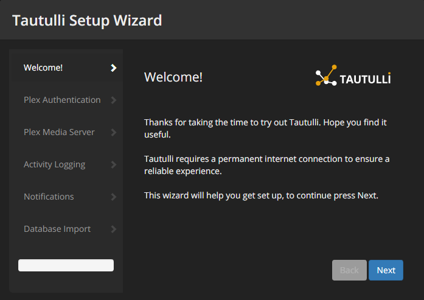
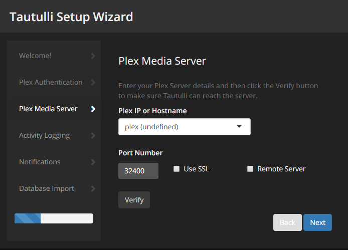
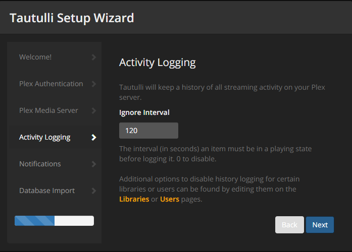
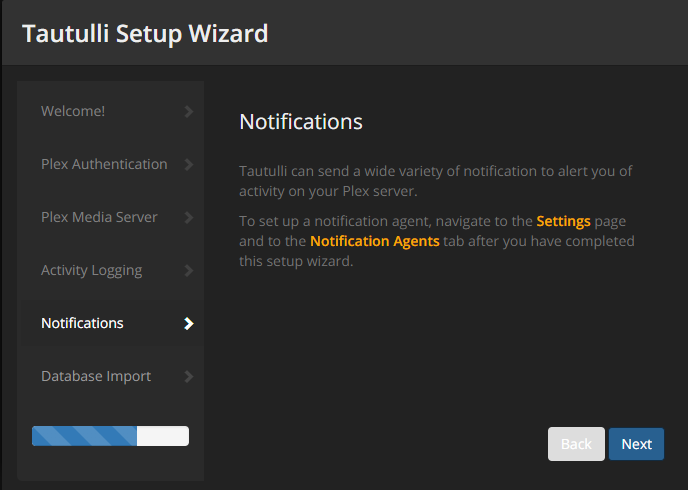
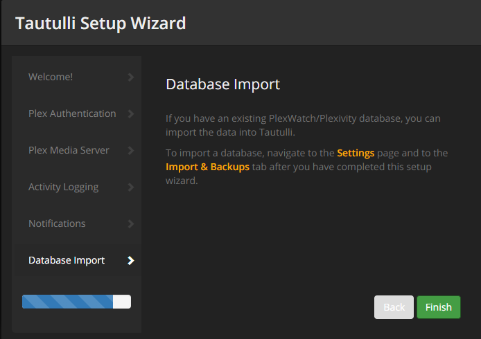
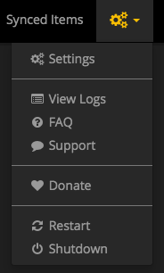
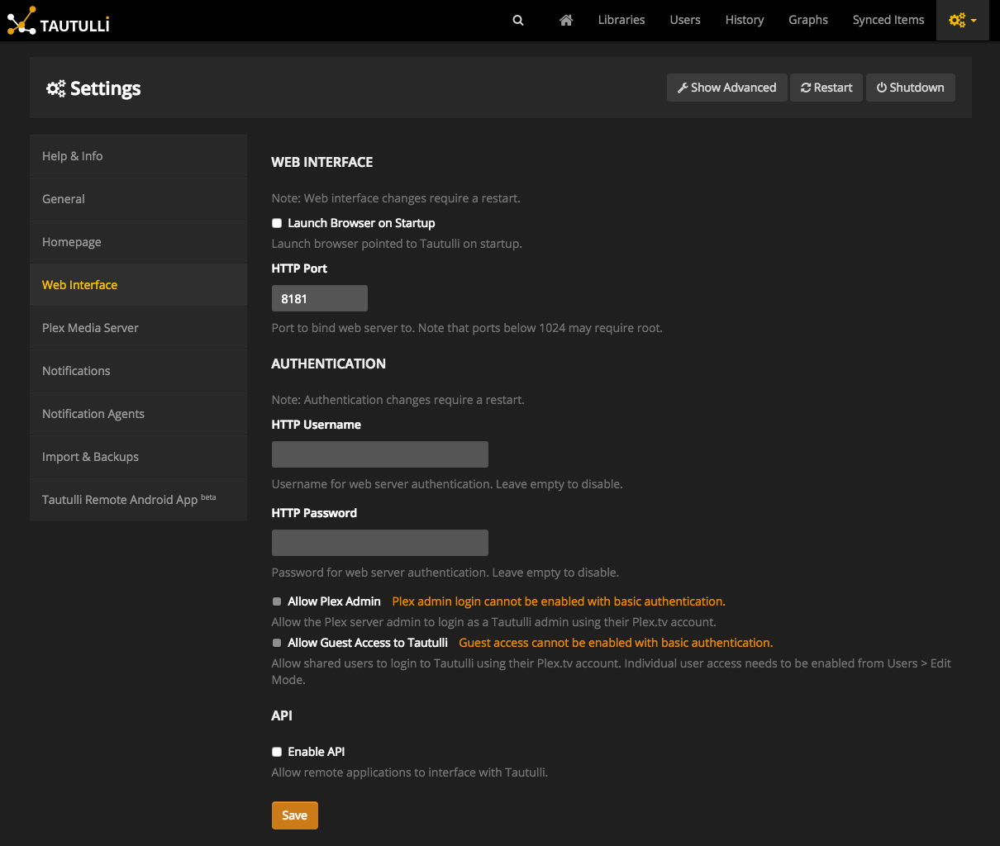
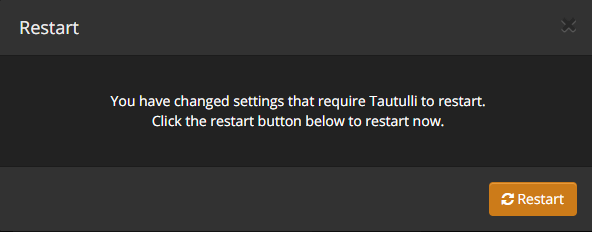

# What is it?

[Tautulli](http://tautulli.com/) (Tautulli), by JonnyWong16, is a web-based application runs alongside the Plex Media Server to monitor activity and track various statistics (eg most watched media).

| Details     |             |             |             |
|-------------|-------------|-------------|-------------|
| [:material-home: Project home](http://tautulli.com){: .header-icons target=_blank rel="noopener noreferrer" } | [:octicons-link-16: Docs](https://github.com/Tautulli/Tautulli/wiki){: .header-icons target=_blank rel="noopener noreferrer" } | [:octicons-mark-github-16: Github](https://github.com/Tautulli/Tautulli){: .header-icons target=_blank rel="noopener noreferrer" } | [:material-docker: Docker](https://hub.docker.com/r/hotio/tautulli){: .header-icons target=_blank rel="noopener noreferrer" }|

## 2. URL

To access Tautulli, visit `https://tautulli._yourdomain_.com`

## 3. Setup Wizard

1. First time you go to the Tautulli site, you will be presented with the "Tautulli Setup Wizard". Click `Next`.

    

2. On the "Plex Authentication" page, sign in with your Plex username and password, and click `Authenticate`. When you see the "Authentication successful." message, click `Next`.

    

3. On the "Plex Media Server" page, set the following:

    - "Plex IP or Hostname": `plex`
    - "Port Number": `32400`
    - "Use SSL": disabled
    - "Remote Server": disabled

     Click `Verify`. When you see the "Server found!" message, click `Next`.

     

4. On the "Activity Logging" page, select your preferences (default is OK) and click `Next`.

    

5. On the "Notifications" page, simply click `Next`.

    

6. On the "Database Import" page, click `Finish` to complete the setup.

    

## 4. Settings

1. Once the Tautulli page comes up, go to "Settings".

    

2. Click "Web Interface" on the left. Fill in "HTTP Username" and "HTTP Password (this will be the login for your Tautulli site), but don't click `Save` yet.

    

3. Click "Plex Media Server" on the left. Click "Show Advanced" at the top. Under "Logs Folder", type in `/logs`. Now you can click `Save`. Also verify 'Use SSL' and 'Remote Server` are unchecked.

    

4. On the "Restart" popup window, click `Restart`.

    

## 5. Next

Are you setting Saltbox up for the first time?  Continue to [Overseerr](overseerr.md).
