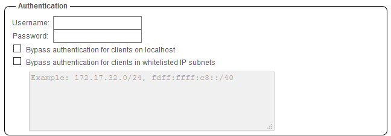
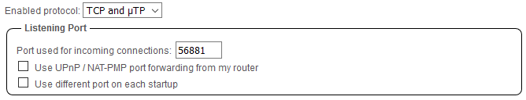
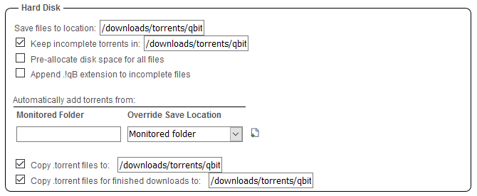

# qBittorrent

## What is it?

[qBittorrent](https://www.qbittorrent.org/){: target=_blank rel="noopener noreferrer" } is a bittorrent client programmed in C++ / Qt that uses libtorrent (sometimes called libtorrent-rasterbar) by Arvid Norberg.

It aims to be a good alternative to all other bittorrent clients out there. qBittorrent is fast, stable and provides unicode support as well as many features.

## Project Information

- [:material-home: qBittorrent ](https://www.qbittorrent.org/){: .header-icons target=_blank rel="noopener noreferrer" }
- [:octicons-link-16: Docs](https://github.com/qbittorrent/qBittorrent/wiki){: .header-icons target=_blank rel="noopener noreferrer" }
- [:octicons-mark-github-16: Github:](https://github.com/qbittorrent/qBittorrent){: .header-icons target=_blank rel="noopener noreferrer" }
- [:material-docker: Docker: ](https://hub.docker.com/r/saltydk/qbittorrent){: .header-icons target=_blank rel="noopener noreferrer" }

### 1. Installation

``` shell

sb install cm-qbittorrent

```

### 2. URL

- To access qBittorrent, visit `https://qbittorrent._yourdomain.com_`

### 3. Setup

- Access qbittorrent at `https://qbittorrent._yourdomain.com_`
    ``` { .yaml }
      username: `admin`
      password: `adminadmin`.
    ```

- **First** go to `Options` -> `Web UI` and set a new username and password.

    

- Under `Options` -> `Connection`, set the port to 56881.

    

- Under `Options` -> `Downloads`, set the following;

    - Save files to location: `/mnt/unionfs/downloads/torrents/qbittorrent/completed/`

    - Keep incomplete torrents in: `/mnt/unionfs/downloads/torrents/qbittorrent/incoming/`

    - Copy .torrent files to: `/mnt/unionfs/downloads/torrents/qbittorrent/torrents/`

    - Copy .torrent files for finished downloads to: `/mnt/unionfs/downloads/torrents/qbittorrent/torrents/`

    - Additionally you can set monitored folder to: `/mnt/unionfs/downloads/torrents/qbittorrent/watched/`

    - tick `Run external program on torrent completion` and paste this into the box: `/usr/bin/unrar x -r "%F/." "%F/"`

    

!!! Note
      if you're using private trackers be sure to go to `Options` -> `BittTorrent` and uncheck everything in Privacy section.

- [:octicons-link-16: Documentation](https://github.com/qbittorrent/qBittorrent/wiki){: .header-icons target=_blank rel="noopener noreferrer" }
