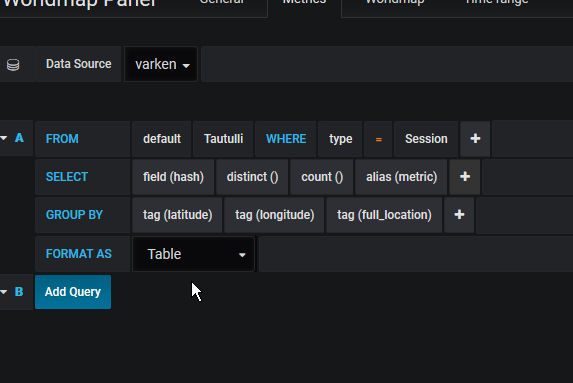
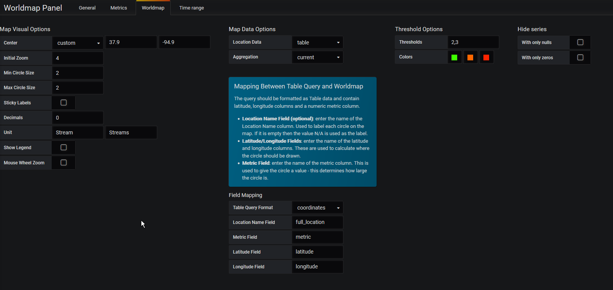
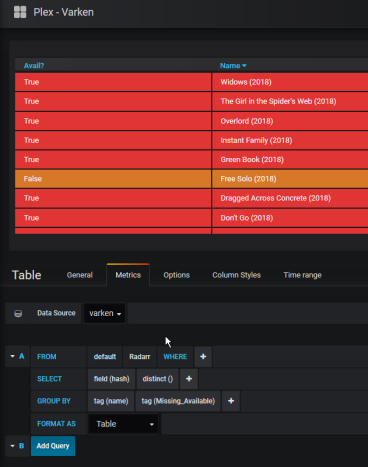

# Varken

## What is it?

[Varken](https://github.com/Boerderij/Varken){: target=_blank rel="noopener noreferrer" } is Dutch for **PIG**. PIG is an Acronym for **P**lex/**I**nfluxDB/**G**rafana

Varken is a standalone application to aggregate data from the Plex ecosystem into InfluxDB using Grafana for a frontend

## Project Information

- [:material-home: Varken ](https://github.com/Boerderij/Varken){: .header-icons target=_blank rel="noopener noreferrer" }
- [:octicons-link-16: Docs](https://wiki.cajun.pro/books/varken){: .header-icons target=_blank rel="noopener noreferrer" }
- [:octicons-mark-github-16: Github:](https://github.com/Boerderij/Varken){: .header-icons target=_blank rel="noopener noreferrer" }
- [:material-docker: Docker: ](https://hub.docker.com/r/boerderij/varken){: .header-icons target=_blank rel="noopener noreferrer" }

### 1. Installation

``` shell

sb install cm-varken

```

### 2. URL

- To access the Varken dashboard, visit `https://grafana._yourdomain.com_`

### 3. Setup

1. Run the Saltbox varken role to install varken/influxdb/telegraf/grafana:

    ``` { .shell }

        sb install cm-varken

    ```

2. Add your Maxmind API key to varken.ini:

    ``` { .shell }

        nano /opt/varken/varken.ini

    ```

3. Restart Varken:

    ``` { .shell }

        docker restart varken

    ```

4. Visit grafana `https://grafana._yourdomain.com_` <br />

      - The configured username/password are taken from your Saltbox [`accounts.yml`](../../../saltbox/install/install/#configuration) file located in `/srv/git/saltbox/accounts.yml`


5. Add data source InfluxDB named InfluxDB:

      1. **HTTP**: URL = http://influxdb:8086

      2. **InfluxDB Details**: Database = varken

      3. Save & Test


6. Add data source InfluxDB named Telegraf:

      1. **HTTP**: URL = http://influxdb:8086

      2. **InfluxDB Details**: Database = telegraf

      3. Save & Test


2. Grafana Example from Organizrr Discord  (imported via `Dashboards > Manage > Import`) :

      from: GilbN -- Plex dashboard for Grafana
      @Grafana-Group for anyone using [Varken](https://github.com/Boerderij/Varken){: target=_blank rel="noopener noreferrer" } Thought I'd share the [dashboard I made](https://grafana.com/dashboards/9558){: target=_blank rel="noopener noreferrer" }. (with the help of Rox and Tron)
      You will need to add the piechart and worldmap plugins for the dashboard to work. Use the variables to set the
      different data sources.

      To Install PieChart/WorldMap: <br />

      ``` { .shell }

          cd /opt/grafana/plugins && git clone https://github.com/grafana/piechart-panel.git && git clone
        https://github.com/grafana/worldmap-panel.git && docker restart grafana

      ```

      

3. Grafana Examples from Varken Discord:

      - [**Varken Official Supported Dashboards:** ](https://grafana.com/dashboards?search=varken%20%5Bofficial%5D){: target=_blank rel="noopener noreferrer" }

      - [**Online Users Table Example (Tautulli):**](https://gist.github.com/samwiseg0/91223c1e089d78a3ae6294c23d81e977){: target=_blank rel="noopener noreferrer" }

      - **World Map w/ geoIP**

      
      

      - [**Device Type Pie Chart:**](https://gist.github.com/samwiseg0/fab103fdf4b176a11517e478ce7c216f){: target=_blank rel="noopener noreferrer" }

      - **Basic Panel Structure**

      


- For app specific instructions refer to the grafana role,

     - [grafana](../../community/apps/grafana.md)<Br/>

     - and the upstream documentation <BR/>
       [:octicons-link-16: Documentation](https://wiki.cajun.pro/books/varken){: .header-icons target=_blank rel="noopener noreferrer" }
