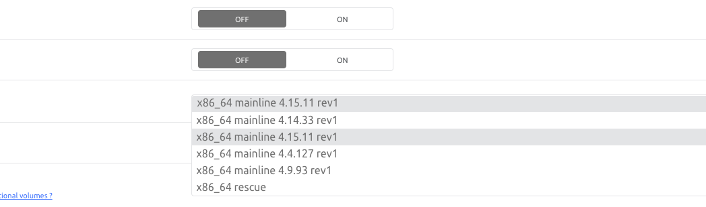

# System

IT IS QUITE PROBABLE THAT SOME INFORMATION HERE IS OUTDATED

[PLEASE OPEN ISSUES](https://github.com/saltyorg/docs/issues)

## Can I install this on an ARM machine?

ARM is not supported.

## If you are using a Scaleway server

1. Choose an X86 server (vs ARM).

2. Select "Ubuntu Xenial" as the distribution.

3. Click the server on the list.

4. Under "ADVANCED OPTIONS", click "SHOW".

5. Set "ENABLE LOCAL BOOT" to `off`.

   

6. Click the "BOOTSCRIPT" link and select one above > 4.10.

   

7. Start the server.

Reference: <https://www.scaleway.com/docs/bootscript-and-how-to-use-it/>

## If you are using an OVH server

If you are having issues upgrading the kernel on ovh, where the kernel upgrade is not taking effect..

 `uname -r` to see if you have `grs` in kernel version string...

 if so, see <https://pterodactyl.io/daemon/0.6/kernel_modifications.html> on how to update the kernel.

## Find your User ID (UID) and Group ID (GID)

Use the following commands to find out your account's user name and group info:

```shell
id
```

or

```shell
id `whoami`
```

You'll see a line like the following:

```text
uid=XXXX(yourusername) gid=XXXX(yourgroup) groups=XXXX(yourgroup)
```

## How to create a user account

- Run the following commands line by line:

   ```bash
   sudo useradd -m <username>
   sudo usermod -aG sudo <username>
   sudo passwd <username>
   sudo chsh -s /bin/bash <username>
   su <username>
   ```

## Change shell of user account to bash

How to check current shell:

```shell
echo $0
-sh
```

or

```shell
echo ${SHELL}
/bin/sh
```

Run this command to set bash as your shell (where `<user>` is replaced with your username):

```shell
sudo chsh -s /bin/bash <user>
sudo reboot
```

## How to fix permission issues

 /opt folder

1. Stop all docker containers

   ```shell
   docker stop $(docker ps -a -q)
   ```

2. Change ownership of /opt. Replace `user` and `group` to match yours' (see [here](System.md#find-your-user-id-uid-and-group-id-gid)).

   ```shell
   sudo chown -R user:group /opt
   ```

3. Change permission inheritance of /opt.

   ```shell
   sudo chmod -R ugo+X /opt
   ```

4. Start all docker containers

   ```shell
   docker start $(docker ps -a -q)
   ```

 /mnt folder

1. Run the `mounts` tag

   ```shell
   sb install mounts
   ```
