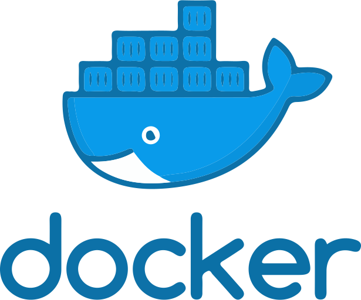

---
extra_stylesheets:
  - stylesheets/index.css
hide:
  - toc
  - navigation
---

<section markdown>

# Saltbox

[](https://github.com/saltyorg/Saltbox/stargazers)
[](https://github.com/saltyorg/saltbox/commits)
[](https://github.com/saltyorg/Saltbox/blob/master/LICENSE.md)
[](https://discord.gg/ugfKXpFND8)
{ style="text-align:center;" }

[Learn more](saltbox/basics/basics.md){ .md-button .md-button--primary }
[Install](saltbox/prerequisites/prerequisites.md){ .md-button .md-button--primary }
[Get help](community/support.md){ .md-button .md-button--primary }
[Help out](community/index.md){ .md-button .md-button--primary }

---
<!-- BEGIN SALTBOX MANAGED CLI SECTION -->
<!-- This section is managed by sb-docs - DO NOT EDIT MANUALLY -->
<!-- termynal -->

```console
$ sb --help
Saltbox CLI                                                                                                           
         
  USAGE  
         
    sb [command] [--flags]  
            
  COMMANDS  
            
    bench                             Runs bench.sh benchmark
    branch [branch_name]              Change the branch used by Saltbox
    branch-sandbox [branch_name]      Change the branch used by Sandbox
    diag                              Runs Saltbox diagnostics role
    docker [command]                  Manage Docker containers managed by Saltbox
    edit [command]                    Edit Saltbox configuration files
    fact [role] [instance] [--flags]  Manage Saltbox configuration facts
    install [tags] [--flags]          Runs Ansible playbooks with specified tags
    list [query] [--flags]            List available Saltbox, Sandbox or Saltbox-mod tags
    logs                              Display logs of managed systemd services
    motd [--flags]                    Display system information
    reinstall-facts [--flags]         Reinstall the Rust saltbox.fact file
    reinstall-python [--flags]        Reinstall the Python version used by Saltbox and related Ansible virtual environment using uv
    reinstall-venv [--flags]          Reinstall the Ansible virtual environment
    update [--flags]                  Update Saltbox & Sandbox
    validate-config [--flags]         Validate Saltbox configuration files
    version                           Print Saltbox CLI version
         
  FLAGS  
         
    -h --help                         Help for sb
```

<!-- END SALTBOX MANAGED CLI SECTION -->
### Powered by { style="text-align:center;" }

<div class="grid brands" markdown>

[](#powered-by)

[](#powered-by)

[](#powered-by)

[](#powered-by)

[](#powered-by)

[](#powered-by)

[](#powered-by)

[](#powered-by)

[](#powered-by)

</div>

</section>
