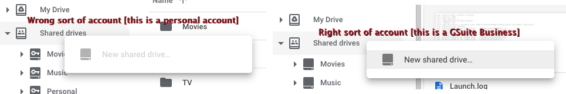

# Cloud Storage
## Provider

If you want to forego cloud storage and put your media on something like your own NAS, there are some notes [here](local-storage.md).

Saltbox can be set up to use any cloud storage provider that [Rclone](https://rclone.org/) supports. However, Google Drive via [G-Suite Business](https://gsuite.google.com/pricing.html) is the popular choice among users.  Some of the components are designed expressly for Google Drive, like the Google Drive monitoring in plex-autoscan and the service-account rotation in cloudplow.

It is advised that you do NOT use a educational GSuite account or any GSuite account or Shared Drive you may buy on the secondary market [eBay and the like], unless you are aware of and planning for the likelihood that it disappears one day.

Note that rclone offering support for a storage backend does not mean that backend is suitable for the Saltbox use case.  The only backend that sees any significant testing and use is Google Drive.

## Basics

Out of the box, Saltbox stores the media unencrypted in cloud storage utilizing an Rclone VFS mount to access it. If you prefer your data is stored encrypted, you will need to do some tweaking to the Rclone config. There are no plans to document these tweaks here.

Media will be stored in `Movies` and `TV` folders, all within a `Media` folder in root (i.e. `/Media`). <a href="#note1" id="note1ref"><sup>[1]</sup></a>

Saltbox is opinionated about this `/Media/<type>` file structure; changing it is not trivial.

## Setup

```
Media
├── Movies
├── Music
└── TV
```

- Example from Google Drive:

  

If you have media in other folders, you can simply move them into these folders via the Cloud Storage Provider's web site.

Note 1: For Google Drive, you can use the [Shift-Z trick](https://www.labnol.org/internet/add-files-multiple-drive-folders/28715/) to "symlink" folders here.

Note 2: All the paths/folders mentioned here, and elsewhere, are **CASE SENSITIVE** (see [Saltbox Paths](../saltbox/basics/paths.md)).

## Google "My Drive" vs. "Shared Drives"

Google provides two "types" of storage in  a GSuite account: "My Drive" and "Shared Drives".

Shared Drives provide advantages for our purposes over My Drive, while My Drive offers no advantages over Shared Drives.

The primary advantage of Shared Drives is that access to them can be controlled via Service accounts, which allows credential rotation to increase upload limits and reduce likelihood of usage-based server-side bans.

Some newer related utilities [like the Golang "Autoscan" replacement for plex-autoscan] have features that work exclusively with Shared Drives.

The primary disadvantage ot Shared Drives is that they have a fixed limit of 400,000 files.  For this reason one common strategy is to create separate Shared Drives for each media type.

For those reasons, this documentation will discuss ONLY Shared Drives.

However, if your data is currently on My Drive and you want to keep it there, Saltbox works fine with that as well.  Rather than littering the docs with "If you're using My Drive to this, Shared drives do that" decision points, we standardized on Shared Drives.  You'll just need to skip some stuff aht refers to shared drives.

As a note, if you are unable to create Shared Drives in the Google Drive Web UI, that's a sign that you have the wrong type of Google Drive account.

  

## Running Saltbox without cloud storage

While the typical use case for Saltbox includes cloud storage, nothing prevents using it without cloud storage.

If, in `settings.yml`, you leave the rclone remote name blank, neither `cloudplow` nor the rclone_vfs mount will be configured.  Your media will be imported to `/mnt/local` and stay there.  You can mount whatever storage you wish to use at `/mnt/local`.

Alternatively, you can configure an rclone remote pointing at your primary storage [named "google"], then install normally.  Everything would then work as it typically does, except that cloudplow would move media from the local system to your NAS or whatever.  Perhaps that would allow downloads and imports to go faster.

---
 <sub> <a id="note1" href="#note1ref"><sup>1</sup></a> If you would like to customize your Plex libraries beyond what is listed above, see [Customizing Plex Libraries](../reference/customizing-plex-libs.md).</sub>
