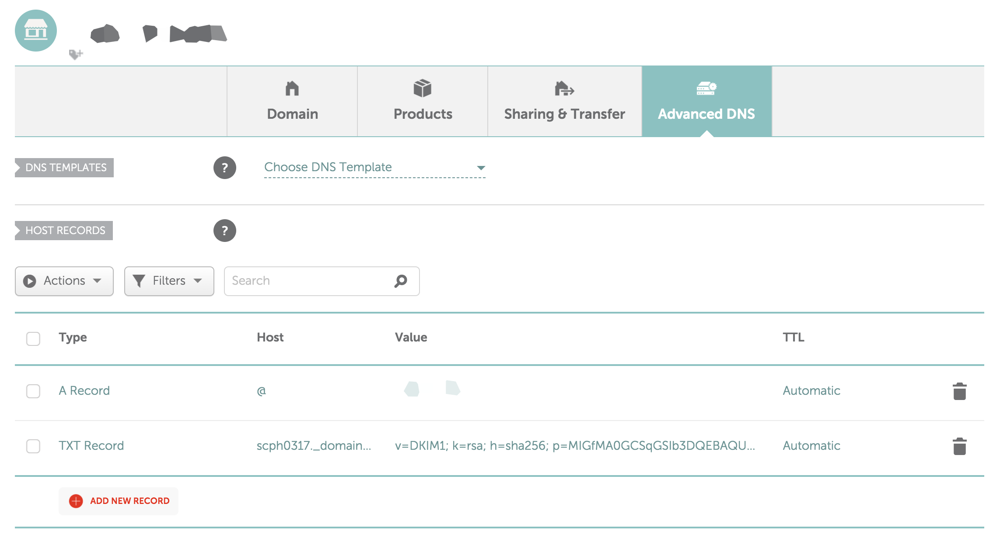
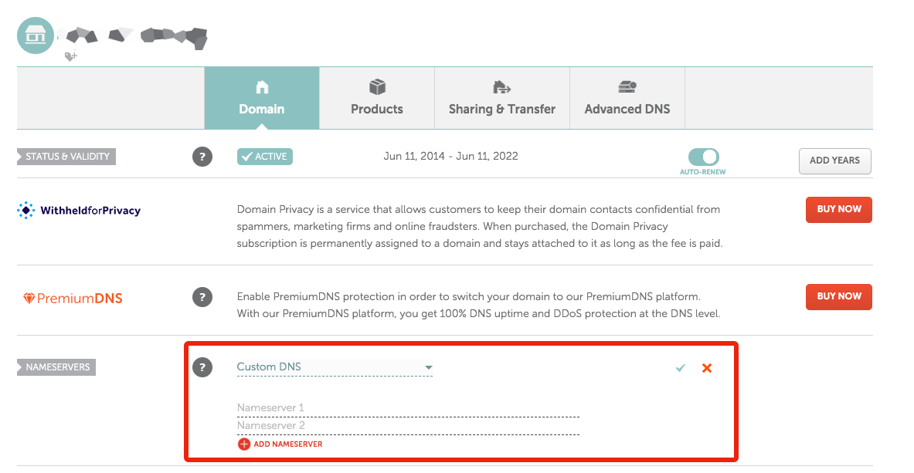
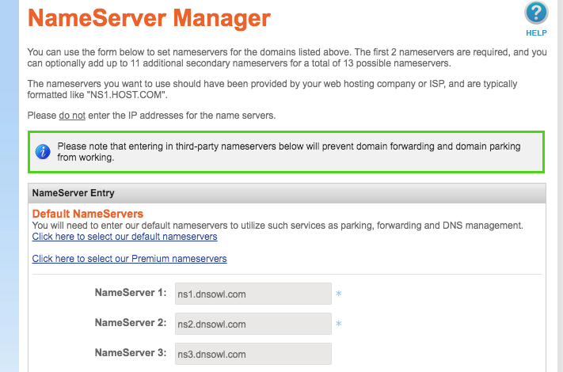
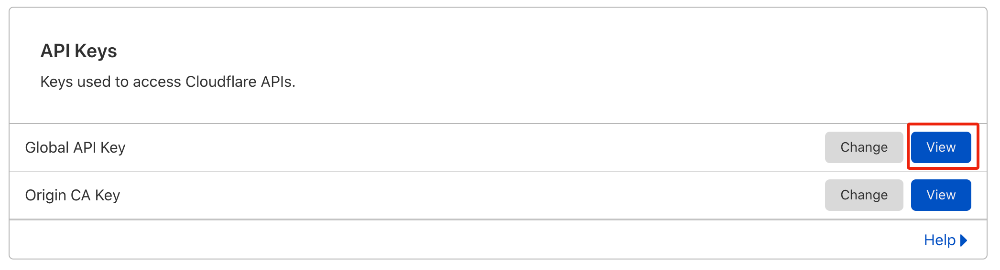
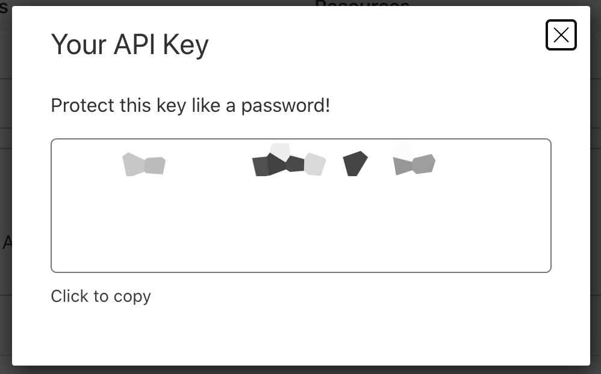
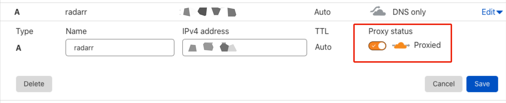

## Domain Name

**You will need a domain name** as Saltbox apps are only accessed via <https://appname>._yourdomain.com_ (see [Accessing Saltbox Apps](../saltbox/basics/accessing_apps.md)). The steps below will help you set up a domain and DNS settings for use with Saltbox.

Ports are [for the most part] bound only to the internal `saltbox` docker network, which means they are not visible on the host; you won't be able to connect externally to the apps using `IP:PORT`.

# 1. Domain Provider

Get a domain name from any domain name registry (e.g. [Namecheap](https://Namecheap.com), [Godaddy](https://Godaddy.com), [Namesilo](https://Namesilo.com), etc).

If you already have one, you may skip this step.

_Note: Free domain name providers, such as [Freenom](https://www.freenom.com/), do not support wildcard DNS settings, and paid domain names can be had for less than a dollar per year ([tld-list](https://tld-list.com/) is useful in this regard)._

If you are planning to use the automatic Cloudflare integration, there are some top-level domains [TLDs] that will not work with it.  Refer to [this page](https://support.cloudflare.com/hc/en-us/articles/360020296512-DNS-Troubleshooting-FAQ#h_84167303211544035341531).

As of 2023/01/20:  "The DNS API cannot be used for domains with .cf, .ga, .gq, .ml, or .tk TLDs."

# 2. DNS Setup

Pick one of the setups below. Your choice will depend on whether you meet certain criteria, as listed under the "Notes" section.

=== "Wildcard DNS"

    **Notes:**
   
    - For DNS providers that allow wildcards.
   
    - For [Saltbox install type](../saltbox/basics/install_types.md).
   
    **Steps:**
   
    Create an A Record for your subdomains with `*` for host and set the value to your server IP address.
   
    | **Type** | **Host** | **Value**           | **TTL**   |
    |:-------- |:-------- |:------------------- |:--------- |
    | A Record | *        | _Server IP Address_ | 300       |
   
    

Example

   
    Namecheap > Domain List > Manage > Advanced DNS > Add New Record > A Record > `*` for Host > Server IP for Value.
   
    
   
    

=== "Non-Wildcard DNS"

    **Notes:**
   
    - For DNS providers that do not allow wildcards (e.g. Freenom).
   
    - For [Mediabox / Feederbox  install types](../saltbox/basics/install_types.md).
   
    - For Cloudflare users.
   
        Note: if you provide a Cloudflare email and API Key in your settings, the Saltbox installer will set this up for you automatically.  See the tab to the right for details about this optional automation.
   
    === "Saltbox Install Type"
        You will need to create A Records for all Saltbox subdomains.
   
        | **Type** | **Host**     | **Value**               | **TTL**   |
        |:-------- |:------------ |:----------------------- |:--------- |
        | A Record | plex         | _Saltbox IP Address_   | 300 |
        | A Record | tautulli     | _Saltbox IP Address_   | 300 |
        | A Record | jackett      | _Saltbox IP Address_   | 300 |
        | A Record | radarr       | _Saltbox IP Address_   | 300 |
        | A Record | sonarr       | _Saltbox IP Address_   | 300 |
        | A Record | qbittorrent   | _Saltbox IP Address_   | 300 |
        | A Record | nzbget       | _Saltbox IP Address_   | 300 |
        | A Record | nzbhydra2    | _Saltbox IP Address_   | 300 |
        | A Record | organizr     | _Saltbox IP Address_   | 300 |
        | A Record | portainer    | _Saltbox IP Address_   | 300 |
        | A Record | login        | _Saltbox IP Address_   | 300 |
    
    === "Mediabox / Feederbox Install Type"
        You will need to create A Records for both IP addresses (Media and Feeder boxes) and set them to their respective subdomains.
   
        Mediabox
   
        | **Type** | **Host**     | **Value**               | **TTL**   |
        |:-------- |:------------ |:----------------------- |:--------- |
        | A Record | plex         | _Mediabox IP Address_  | 300 |
        | A Record | tautulli     | _Mediabox IP Address_  | 300 |
        | A Record | login        | _Mediabox IP Address_  | 300 |
    
        Feederbox
    
        | **Type** | **Host**     | **Value**               | **TTL**   |
        |:-------- |:------------ |:----------------------- |:--------- |
        | A Record | jackett      | _Feederbox IP Address_ | 300 |
        | A Record | radarr       | _Feederbox IP Address_ | 300 |
        | A Record | sonarr       | _Feederbox IP Address_ | 300 |
        | A Record | qbittorrent   | _Feederbox IP Address_ | 300 |
        | A Record | nzbget       | _Feederbox IP Address_ | 300 |
        | A Record | nzbhydra2    | _Feederbox IP Address_ | 300 |
        | A Record | organizr     | _Feederbox IP Address_ | 300 |
        | A Record | portainer    | _Feederbox IP Address_ | 300 | 

=== "Automatic Cloudflare DNS"

    if you provide a Cloudflare email and API Key in Saltbox settings, the Saltbox installer will set this stuff up for you automatically.
    
    **Notes:**
   
    - THIS IS OPTIONAL

    - THIS IS CLOUDFLARE-SPECIFIC

    ### What's happening here?

    If you want Saltbox to work with Cloudflare and automate setting up DNS, you need to:

    1. Set up Cloudflare as your DNS provider
    2. Get a [free] Cloudflare API Key
    3. Enter that API key into the Saltbox settings
    4. run the saltbox install, during which all the required subdomains will be created at Cloudflare for you
    5. do some optional post-install adjustments.

    ### Intro
   
    [Cloudflare](https://www.cloudflare.com) a service that, among other things, protects and accelerates a wide network of websites. By being the "man in the middle", it can act like a free DNS provider.
   
    Saltbox makes adding subdomains to Cloudflare's DNS settings a breeze via automation. All you need is the API key.
   
    Note that there are some top-level domains [TLDs] that will not work with this automation. Refer to [this page](https://support.cloudflare.com/hc/en-us/articles/360020296512-DNS-Troubleshooting-FAQ).
   
    As of 2020/07/26: "DNS API cannot be used for domains with .cf, .ga, .gq, .ml, or .tk TLDs."
   
    Although Cloudflare is not required for Saltbox, it is still recommended because:
   
    1. DNS changes propagate almost instantly (a lot faster than a domain provider's DNS service).
   
    1. Hide your server's IP behind Cloudflare's.
   
    1. Makes setting up Mediabox / Feederbox a lot quicker.
   
    1. Allows for automated setup of subdomains for Saltbox add-on apps.
   
    2. It's free.
   
    _Note: Saltbox does not enable CDN / Proxy by default, but you may do so yourself after installing Saltbox (see section [below](#post-setup)._
   
    #### Set up Cloudflare as your DNS provider
   
    1. Sign up for a free [Cloudflare](https://www.cloudflare.com/) account.
   
    2. On your Domain Registrar's website (e.g. GoDaddy, Namecheap, etc), set the Name Servers to what Cloudflare instructs you to.  Here are two examples; Saltbox does not require either of these registrars, and every registrar will, or should, allow you to change these same settings in some way.
   
    === "Namecheap.com"
   
        "Dashboard" -> _your domain.tld_ -> "Manage" -> "Name Servers" -> "Custom DNS" -> add the nameservers in.
   
        
   
    === "Namesilo.com"
   
        "Manage My Domains" -> _your domain.tld_ -> "NameServers" -> "Change" ->  add the nameservers in.
   
        
   
    #### Setup
   
    1. Go to [Cloudflare.com](https://www.cloudflare.com/).
   
    1. Here you will see that your domain will have an "Active" status. Click on your domain to continue.
   
       
   
    1. Click the **SSL/TLS** tab.
   
    1. Set **SSL** to `Full (strict)`.
   
       
   
    #### Get a [free] Cloudflare API Key
   
    1. Go to [Cloudflare.com](https://www.cloudflare.com/).
   
    1. Click the **Overview** tab.
   
    1. Click **Get your API token**.
   
       { width=60% }
   
    1. Under **API Keys** and then **Global API Key** click **View**.
   
       { width=60% }
   
    1. On the login popup, type in your **password** and click **View**.
   
       { width=50% }
   
    1. Save your API key.
   
       { width=50% }

    #### Add the Cloudflare API Key to the saltbox settings:
   
    See [here](accounts.md) for more information about these settings.
   
    #### After saltbox is installed
   
    After Saltbox has added in the subdomains, you may go back in and turn on CDN for for them if you like.  Note, however, that enabling proxying on your plex or emby subdomains [or more generally proxying large amounts of non-HTML content] is against Cloudflare TOS and may end up getting your Cloudflare account banned.
    
    Do this AFTER all your certs have been assigned and you have confirmed that all the Saltbox app sites are loading OK.
   
    This also applies to any app/subdomains you add in the future - wait till after you get certs before enabling CDN.
   
    _Note 1: Leave the subdomains `saltbox`, `mediabox`, and `feederbox` as `DNS Only`, as they were created to reach your servers directly and not behind a CDN proxy (i.e. they need to resolve to the server's IP and not Cloudflare's)._
   
    _Note 2: If you enable proxying on plex/emby subdomains despite it being against TOS, you may find that performance suffers badly._
   
    You can do this by:
   
    1. Going to [Cloudflare.com](https://www.cloudflare.com/).
   
    2. Clicking the **DNS** tab.
   
    3. Find the subdomain of interest.
   
    4. Under "Status", click the switch next to the gray cloud icon (i.e. `DNS Only`) to switch to an orange one (i.e. `DNS and HTTP proxy (CDN)`).
   
       { width=60% }

<!-- Temporarily removed from setup [last steps] - may not be needed..
   
    1. Set **Always Use HTTPS** to `off`.
   
    1. Set **HTTP Strict Transport Security (HSTS)** to `disabled`.
   
       
   
-->
