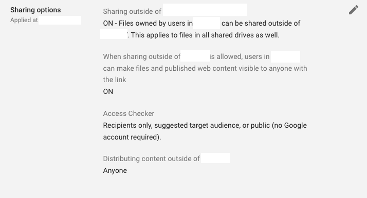
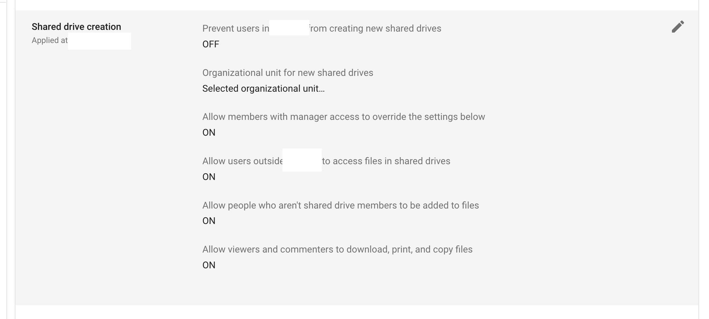

This guide will show you how to verify that your Google account has the correct permissions required for the shared drive creation.

It's assuming you're working through the steps from [here](rclone-manual.md).

NOTE: This guide is assuming a Google Gsuite Business/Workspace account.

1. Go to <https://admin.google.com>; from the left-hand menu select "Apps > Google Workspace > Drive and Docs":

    

2. Verify that Drive is turned on for your organization:

    

3. If it is not, click on the triangle on the right of that section and enable it if needed.  After clicking "SAVE" [if you changed the setting] click back to "Settings for Drive and Docs":

    

4. Back on the that screen, click on the "Sharing settings" section:

    

5. Scroll down and verify that your "Shared Drive Settings" match these.  Change them if required and save:

    

6. Scroll down to "Shared drive creation" and verify that your settings match these:

    

7. You're done.

If you are going through the manual rclone instructions, [continue with the next step](rclone-manual.md#step-2-create-a-new-project-and-generate-a-credential-file)
