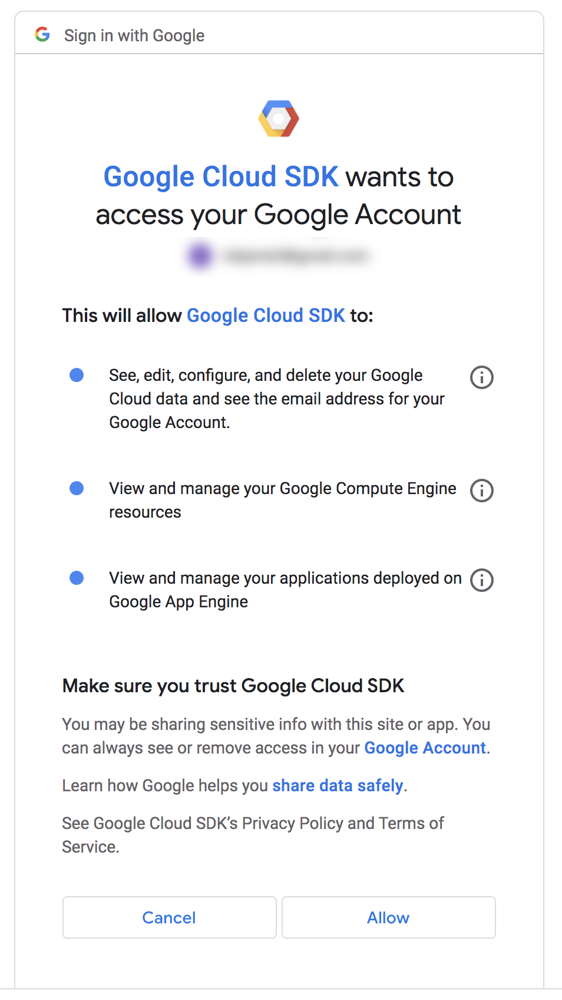

# Google GCloud Tools Installation

This guide will show you how to set up the Google SDK tools.

These tools are used by scripts in the next two steps that have to interact with google.

Unfortunately, these can't be installed in an automated fashion, so you will have to go through these manual steps, which are largely copy-paste.

It's assuming you're working through the steps from [here](rclone-manual.md) and have completed the following steps:

- verified [account drive permissions](google-account-perms.md)
- created the required [project](google-project-setup.md)
- created the required [group](google-group-setup.md)

---

1. Install the Google CLI tools.  Enter these commands in your terminal:

    ```shell
    echo "deb [signed-by=/usr/share/keyrings/cloud.google.gpg] https://packages.cloud.google.com/apt cloud-sdk main" | sudo tee -a /etc/apt/sources.list.d/google-cloud-sdk.list
    ```
       
    ```shell
    curl -fsSL https://packages.cloud.google.com/apt/doc/apt-key.gpg | sudo gpg --dearmor -o /usr/share/keyrings/cloud.google.gpg
    ```
       
    ```shell
    sudo apt-get update && sudo apt-get install google-cloud-cli
    ```

1. Run the following command:

    ```shell
    gcloud init --console-only
    ```

    Follow the prompts:

    ```text
    Welcome! This command will take you through the configuration of gcloud.

    ...

    You must log in to continue. Would you like to log in (Y/n)?  Y

    Go to the following link in your browser:

    https://accounts.google.com/o/oauth2/auth?response_type=code&client_id=32...X4&code_challenge_method=S256
    ```

2. Log into your Google account and approve the access request:

    

    Copy the verification code.

3. Continue in the terminal:

    ```text
    Enter verification code: 4/1AX4XfWjkg8C8r...ujs332G8
    You are logged in as: [YOUR_GOOGLE_ACCOUNT].
    ```

    You will now be asked to choose a default project.  Choose the one you created earlier.

    ```text
    Pick cloud project to use:
     [1] THE_PROJECT_YOUR_CREATED_FOR_SALTBOX
     [2] Create a new project
    Please enter numeric choice or text value (must exactly match list item):  1

    Your current project has been set to: [THE_PROJECT_YOUR_CREATED_FOR_SALTBOX].
    ```

    You may be asked to choose a default zone/region.  If so, you can choose the closest to you.

4. Run the following command:

    ```shell
    gcloud organizations list
    ```

    Your organization ID will be displayed in the table:

    ```text
    DISPLAY_NAME            ID  DIRECTORY_CUSTOMER_ID
    YOUR-DOMAIN   123456789098              XXXXXXXXX
                  ^^^ HERE ^^^
    ```

    Make a note of that ID; if you're going through the manual rclone instructions you'll need it in the next step.

5. Google SDK is installed and configured.

If you have problems with these steps, Google's own documentation is found [here](https://cloud.google.com/sdk/docs/install-sdk)

If you are going through the manual rclone instructions, [continue with the next step](rclone-manual.md#step-5-generate-a-random-prefix)
