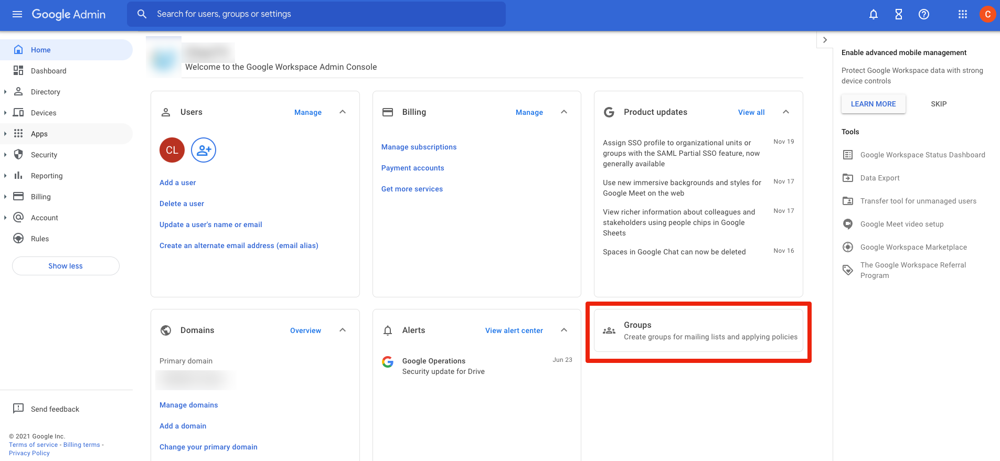
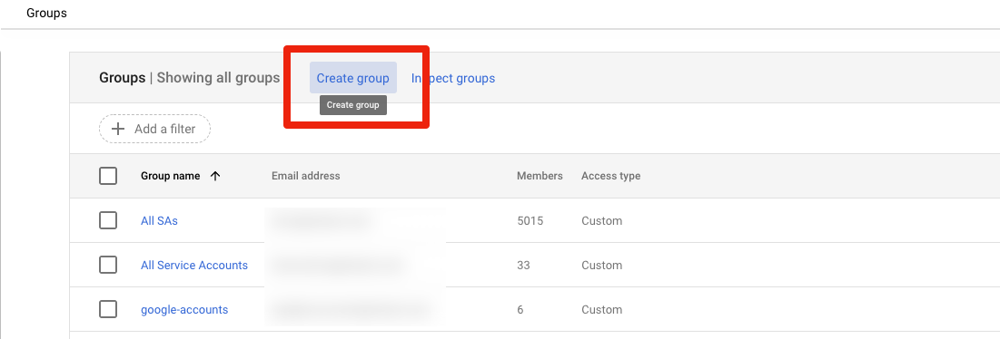
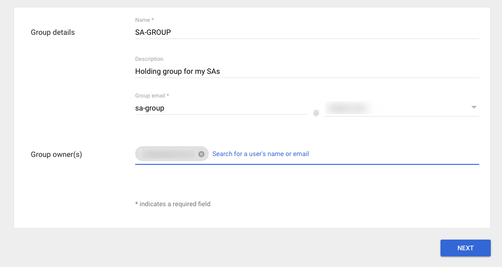
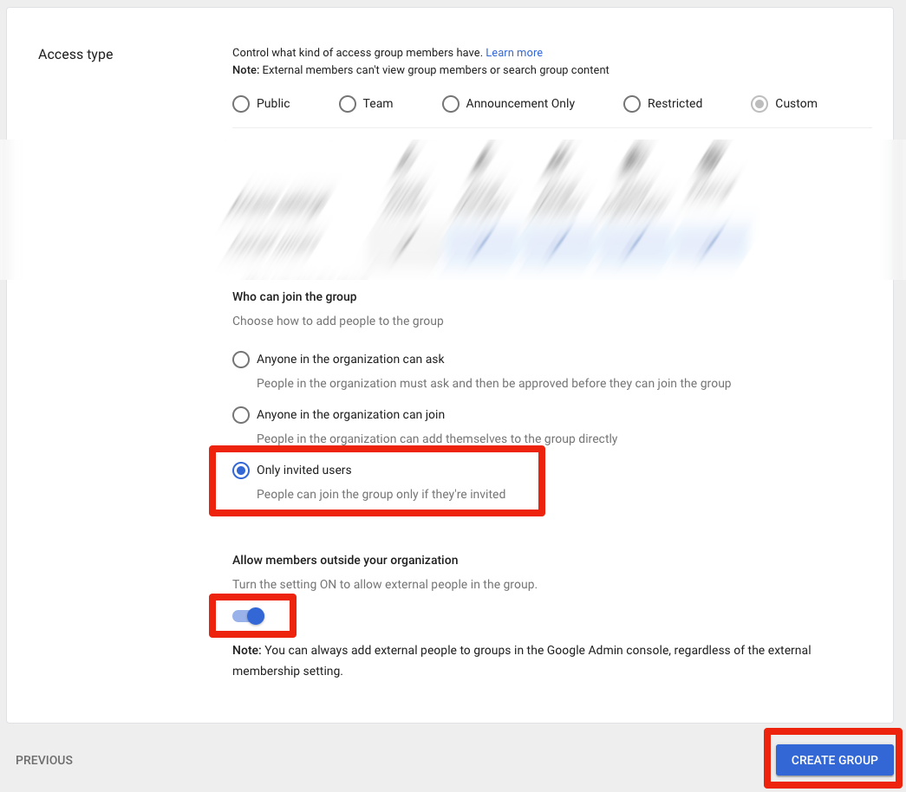
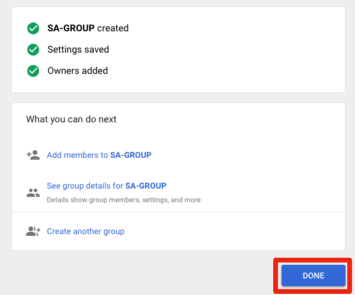

This guide will show you how to set up a Google Group for use with service accounts.

It's assuming you're working through the steps from [here](rclone-manual.md) and have completed the following steps:

- verified [account drive permissions](google-account-perms.md)
- created the required [project](google-project-setup.md)

NOTE: This guide is assuming a Google Gsuite Business/Workspace account.

1. Open the Google Admin site: <https://admin.google.com/> and login with your Google account.  Click on the groups heading:

   

2. You should now see a list of your groups [which may be empty].  Click on "Create Group":

   

3. Enter a name, description and email address for the group; choose an owner [this should be the account with which you just logged in]. Click "Next".

   

4. Scroll down, change "Who can join" to "Only invited users", and toggle "Allow members outside your organization". Click "Create Group".

   

5. Click "Done".

   

If you are going through the manual rclone instructions, [continue with the next step](rclone-manual.md#step-4-set-up-the-gcloud-sdk)
