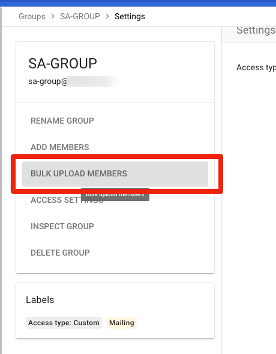
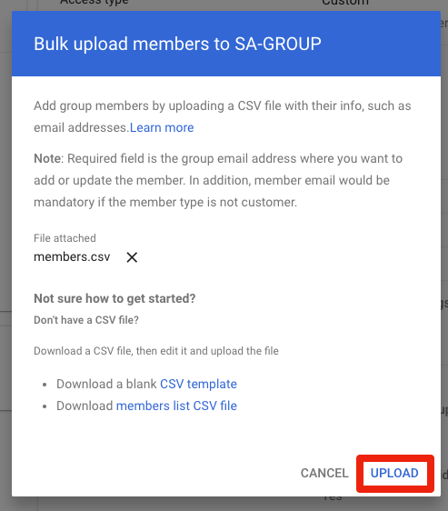

This guide will show you how to create projects and service accounts using `sa-gen` and add them to a Google Group.

It's assuming you're working through the steps from [here](rclone-manual.md) and have completed the following steps:

  - verified [account drive permissions](google-account-perms.md)
  - created the required [project](google-project-setup.md)
  - created the required [group](google-group-setup.md)
  - installed the [gcloud SDK tools](google-gcloud-tools-install.md)

NOTE: This guide is assuming a Google Gsuite Business/Workspace account.

1. Make sure /opt/sa is writable by you.

    ```
    sudo chown -R <user>:<group> /opt/sa
    ```

    Enter the user name that you entered in `accounts.yml`; group is the same as the user.

    ```
    ---
    user:
      name: seed #   <<< THIS VALUE
    ...
    ```

    You can also run `id` to get this information:

    ```
    ~ id
    uid=1000(marco) gid=1000(marco) groups=1000(marco),4(adm),24(cdrom),27(sudo),30(dip),44(video),46(plugdev),116(lxd),1001(docker)
             ^<user>         ^<group>
    ```

1. Create a dir within that:

    ```
    mkdir /opt/sa/all
    ```

    The scripts in this setup all use this location.  Don't change it if you are using these scripts.

1. Verify that the google project has the right APIs enabled:

    ```
    gcloud services list --enabled
    ```

    You should see:

    ```
    NAME                                 TITLE
    admin.googleapis.com                 Admin SDK API
    bigquery.googleapis.com              BigQuery API
    bigquerystorage.googleapis.com       BigQuery Storage API
    cloudapis.googleapis.com             Google Cloud APIs
    clouddebugger.googleapis.com         Cloud Debugger API
    cloudresourcemanager.googleapis.com  Cloud Resource Manager API
    cloudtrace.googleapis.com            Cloud Trace API
    datastore.googleapis.com             Cloud Datastore API
    drive.googleapis.com                 Google Drive API
    iam.googleapis.com                   Identity and Access Management (IAM) API
    iamcredentials.googleapis.com        IAM Service Account Credentials API
    logging.googleapis.com               Cloud Logging API
    monitoring.googleapis.com            Cloud Monitoring API
    servicemanagement.googleapis.com     Service Management API
    serviceusage.googleapis.com          Service Usage API
    sheets.googleapis.com                Google Sheets API
    sql-component.googleapis.com         Cloud SQL
    storage-api.googleapis.com           Google Cloud Storage JSON API
    storage-component.googleapis.com     Cloud Storage
    storage.googleapis.com               Cloud Storage API
    ```

    If any of these are missing from your list, go back to the [project setup](google-project-setup.md) and add all the APIs shown there to the project.

1. Retrieve the `sa-gen` code

    ```
    cd /opt && git clone https://github.com/88lex/sa-gen && cd sa-gen
    ```

3. Edit the `sa-gan` script:

    ```
    nano sa-gen
    ```

    Edit the beginning of the script as indicated by `<<<<` below:

    ```
    #!/bin/bash
    # Running this script requires gcloud command line tools. To install go to https://cloud.google.com/sdk/docs/quickstarts
    # See readme.md to understand the variables used in this script

    KEYS_DIR=/opt/sa/all               <<<< path where you want to store sa JSON files [you will need to add the /all here, most likely]
    ORGANIZATION_ID="123456789098"     <<<< organization ID from gcloud SDK step
    GROUP_NAME="mygroup@mydomain.com"  <<<< the group [full address as shown] you created previously
    PROJECT_BASE_NAME="mgbtbnfkkt"     <<<< the prefix you generated previously
    FIRST_PROJECT_NUM=1
    LAST_PROJECT_NUM=3
    SA_EMAIL_BASE_NAME="mgbtbnfkkt"    <<<< the prefix you generated previously
    FIRST_SA_NUM=1
    NUM_SAS_PER_PROJECT=100
    ...
    ```

4. Run the `sa-gan` script:

    ```
    ./sa-gen
    ```

    `sa-gen` will create three projects, 300 SAs, and download them to `/opt/sa/all`:


    ```
    Total SA json keys before running sa-gen = 0
    Creating project = mgbtbnfkkt1
    ++ gcloud projects create mgbtbnfkkt1 --organization=
    Create in progress for [https://cloudresourcemanager.googleapis.com/v1/projects/mgbtbnfkkt1].
    Waiting for [operations/cp.5950654100828535641] to finish...done.
    Enabling service [cloudapis.googleapis.com] on project [mgbtbnfkkt1]...
    Operation "operations/acf.p2-672393700722-9443eda2-69db-46a9-8952-5cdaa3b6ed2f" finished successfully.
    ++ set +x
    ...
    Total SA json keys BEFORE running sa-gen = 0
    Total SA json keys AFTER running sa-gen  = 300
    Total SA jsons CREATED                   = 300
    ```

1. Download the `members.csv` file that sa-gen created next to the service account files to your local computer using sftp or whatever other means.

    

6. Open the Google Admin site: https://admin.google.com/ and login with your Google account.  Click on the groups heading:

    

7. Click on your group:

    

1. Click on "BULK UPLOAD MEMBERS":

    

1. Click on "ATTACH CSV", and find the `members.csv` you downloaded a moment ago:

    

1. Click "UPLOAD".  Status will appear in the upper right:

    

1. You're done.

If you are going through the manual rclone instructions, [continue with the next step](../rclone-manual#new-rclone-setup)
