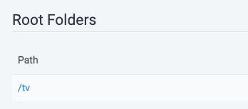
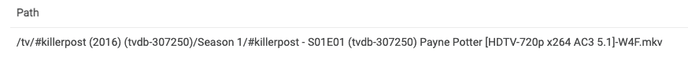
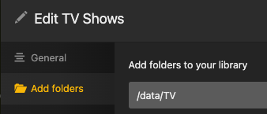
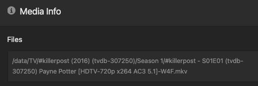

# Autoscan rewrites

These rewrites seem to cause a lot of consternation.

This article will attempt to clear them up.

Basically, autoscan rewrites are a way to convert a path as one thing [typically an app like Sonarr] sees it to a path where another thing [typically an app like Plex] sees it.

## Prerequisites

Sonarr has a root directory:



This directory might be internal to the container, as this one is.

Shows are stored in that root:


As are episodes, of course:



This episode path is what Sonarr is going to send to Autoscan.

Similarly, a Plex library has a root path:



And things in that library are relative to that root:



## What happens during a scan:

Sonarr tells Autoscan:

> "Here's a new thing at `/tv/#killerpost (2016) (tvdb-307250)/Season 1/#killerpost - S01E01 (tvdb-307250) Payne Potter [HDTV-720p x264 AC3 5.1]-W4F.mkv`, tell your friends."

Autoscan first needs to figure out which library to tell Plex about, since it's going to say:

> "Please scan this folder: `/tv/#killerpost (2016) (tvdb-307250)/Season 1/`; it's in library something-or-other."

So Autoscan looks for a Plex library that has `/tv/` as one of its root directories.  If it finds that to be library ID 12, it tells Plex:

> "Please scan this folder: `/tv/#killerpost (2016) (tvdb-307250)/Season 1/`; it's in library 12."

Howver, in our example above, the Plex library is pointed at `/data/TV`, so Autoscan won't be able to find the target library [there isn't one with `/tv/` as one of its root dirs], so Autoscan will report:

```
No target libraries found error="/tv/#killerpost (2016) (tvdb-307250)/Season 1/: failed determining libraries" target=plex url=https://plex.mydomain.tld/
```

This problem is what rewrites are used to solve.

## Do I always need rewrites?

No.

If Sonarr and Plex both see that episode at `/mnt/unionfs/Media/TV/#killerpost (2016) (tvdb-307250)/Season 1/#killerpost - S01E01 (tvdb-307250) Payne Potter [HDTV-720p x264 AC3 5.1]-W4F.mkv`, then no rewrite is needed, since Sonarr tells Autoscan about that path, Autoscan goes to find the Plex library, which it is able to do since the path is the same, and tells Plex to scan the directory.

Again, if Sonarr and the Plex TV library both point to the same path, whatever that path is, no rewrites are needed.

If you are setting up saltbox from scratch and use our recommended paths, your autoscan config needs no rewrites for these apps.

Rewrites are always needed when:
```
/the/path/where/the/trigger/sees/files
```
and 
```
/the/path/where/the/target/sees/files
```
are different.

So even in the default saltbox case, the `inotify` trigger will require a rewrite, since it's looking at `/mnt/local/Media/...` rather than `/mnt/unionfs/Media/...`

## Example:

Based on the Sonarr and PLex setups above, we need to change:
```
/tv/#killerpost (2016) (tvdb-307250)/Season 1/#killerpost - S01E01 (tvdb-307250) Payne Potter [HDTV-720p x264 AC3 5.1]-W4F.mkv
```
to
```
/data/TV/#killerpost (2016) (tvdb-307250)/Season 1/#killerpost - S01E01 (tvdb-307250) Payne Potter [HDTV-720p x264 AC3 5.1]-W4F.mkv
```
so Plex can see it.

One way to do this is shown in [Autoscan's README](https://github.com/Cloudbox/autoscan#full-config-file):

```
  sonarr:
    - name: sonarr
      priority: 2

      rewrite:
        - from: /tv/
          to: /mnt/unionfs/Media/TV/

targets:
  plex:
    - url: https://plex.domain.tld
      token: XXXX
      rewrite:
        - from: /mnt/unionfs/Media/
          to: /data/
```

Sonarr sends a path to Autoscan, which uses this rewrite:
```
      rewrite:
        - from: /tv/
          to: /mnt/unionfs/Media/TV/
```
to make this change:
```
                  /tv/#killerpost (2016) (tvdb-307250)/Season 1/#killerpost - S01E01 (tvdb-307250) Payne Potter [HDTV-720p x264 AC3 5.1]-W4F.mkv
|||||||||||||||||||||
/mnt/unionfs/Media/TV/#killerpost (2016) (tvdb-307250)/Season 1/#killerpost - S01E01 (tvdb-307250) Payne Potter [HDTV-720p x264 AC3 5.1]-W4F.mkv
```
then queues the scan.

Later, when Autoscan goes to send the scan to Plex, it uses this rewrite:
```
      rewrite:
        - from: /mnt/unionfs/Media/
          to: /data/
```
to make this change:
```
/mnt/unionfs/Media/TV/#killerpost (2016) (tvdb-307250)/Season 1/#killerpost - S01E01 (tvdb-307250) Payne Potter [HDTV-720p x264 AC3 5.1]-W4F.mkv
||||||||||||||||||
             /data/TV/#killerpost (2016) (tvdb-307250)/Season 1/#killerpost - S01E01 (tvdb-307250) Payne Potter [HDTV-720p x264 AC3 5.1]-W4F.mkv
```
so it matches what Plex expects.

Using this method might be useful if you have multiple targets:
```
targets:
  plex:
    - url: https://plex.domain.tld
      token: XXXX
      rewrite:
        - from: /mnt/unionfs/Media/
          to: /plex/sees/files/here/
  emby:
    - url: https://emby.domain.tld
      token: XXXX
      rewrite:
        - from: /mnt/unionfs/Media/
          to: /emby/sees/files/here/
```
so that the local `/mnt/unionfs/Media/` path is used as a common interchange.

You could also do this with a single rewrite as:
```
  sonarr:
    - name: sonarr
      priority: 2

      rewrite:
        - from: /tv/
          to: /data/TV/

targets:
  plex:
    - url: https://plex.domain.tld
      token: XXXX
```

The Sonarr rewrite goes straight to the final path required by Plex:
```
     /tv/#killerpost (2016) (tvdb-307250)/Season 1/#killerpost - S01E01 (tvdb-307250) Payne Potter [HDTV-720p x264 AC3 5.1]-W4F.mkv
||||||||
/data/TV/#killerpost (2016) (tvdb-307250)/Season 1/#killerpost - S01E01 (tvdb-307250) Payne Potter [HDTV-720p x264 AC3 5.1]-W4F.mkv
```
and Plex accepts the path as is.

Of course, that works best when there's only a single target. 

Hopefully this helps demystify Autoscan rewrites. 
