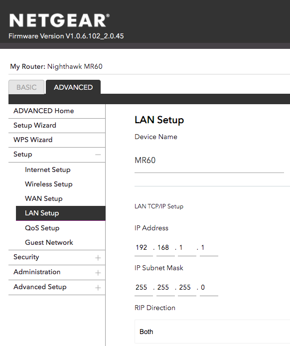
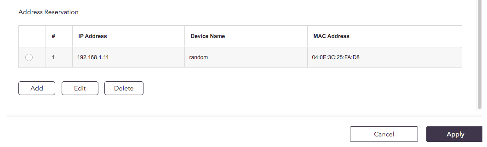
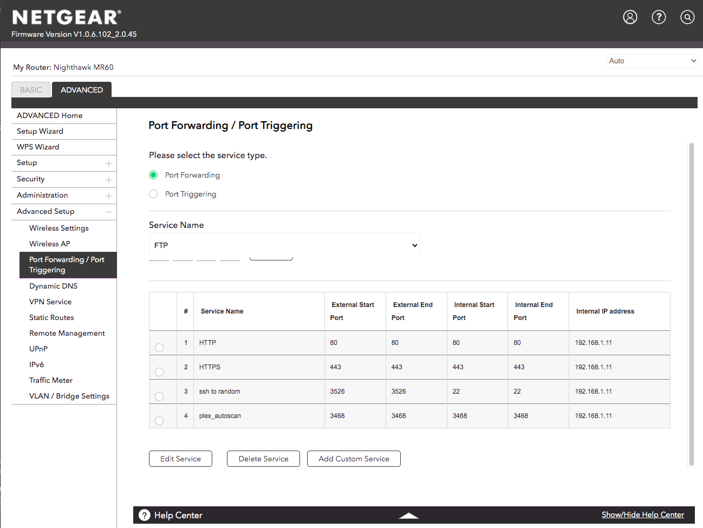
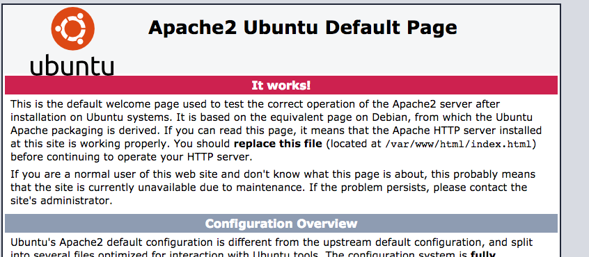

## Installing Saltbox on a home server

Prerequisites:

 - Domain

 - Static IP OR Dynamic DNS configured

 - Router supports port forwarding

 - ISP supports you running servers on ports 80 and 443.  Some ISPs don’t allow or actively block this.

 - Router supports hairpin NAT [or NAT loopback]
   Saltbox assumes that you are accessing apps via subdomains like “radarr.mydomain.com” rather than ip and port like 192.168.1.25:7878.
   Without “hairpin NAT”, a request to “radarr.mydomain.com” from inside the network will not find its way to the proxy which does that routing.

NOTE: None of this initial setup is Saltbox-specific. If you want to run a server on a machine behind your router and connect to it using a domain name, whether Saltbox sets it up or something else, you’ll need to do these very same things.

### Domain:

You need a domain.  They’re cheap or even free.

You can find cheap ones [here](https://tld-list.com/).

There are a variety of places that provide free domains.  Here’s one offered with no endorsement; [the first Google result for “free domain”](https://www.freenom.com/en/freeandpaiddomains.html).

Configure the DNS at your registrar to point your domain at your home external IP address.

You can find that using something like: [https://whatismyipaddress.com/](https://whatismyipaddress.com/)

You will need to configure “dynamic DNS” to make sure that domain keeps pointing to your home IP, which is subject to change, most likely.

Probably your router has this available.  If not, there’s a Dynamic DNS Client role available in saltbox you can install.  If you use Cloudflare for DNS, the ddns client configuration will be automatically done when you run the role.

The saltbox role is `ddclient`, and you run it like any other saltbox role:

```
sb install ddclient
```

You’ll do this AFTER you’ve installed saltbox.

### Machine:

I installed Ubuntu server 20.04 on the machine, accepting all defaults except:

  - I enabled OpenSSH and imported my SSH keys from github

That’s all.

Since I installed Ubuntu on my own hardware, the first user I created is a member of the sudoers group.  I’ll be running the install as that user from the start rather than starting as `root` like you would on a remote server.

## Router:

You need some ports forwarded to that machine on your router.  Explaining how to do that for any arbitrary router is out of scope, but I’ll show you where it is on my Netgear.

A remote server like one at Hetzner is just exposed to the open internet, so when you connect to that server on port 123, you’re connecting directly to that specific machine.  Your home network doesn’t work like that.  Your ISP gives you a single IP address, and your router translates all traffic in and out of your network to make sure it gets to the correct place.  Thas means that when a connection from the outside comes in, it is connecting to the router, not any individual machine.  You need to set up port forwarding so that when you try to connect to Radarr, for example, your router knows to send this request to the machine where you’ve installed Radarr.

There are two parts to what you need to do:

  - Give your server an unchanging local IP address

  - Forward requests from the outside on relevant ports to that IP address.

The first is required because typically your router will be able to configure port forwarding to an IP address, so you don’t want the IP of your server changing.  Typically, on your router, everything gets an IP assigned automaically by the router’s DHCP server, so the IP address of a specific thing might change.  Depending on how your network is set up, it may be unlikely, but it’s a possibility nonetheless, so we’re going to make sure it doesn’t happen by telling the router “Always give this machine the IP address 1.2.3.4”.

On my Netgear, they call this “Address Reservation” and it’s found under “LAN Setup”:

  

I scroll to the end of that list, click “Add”, then choose a device and type in the address I want that thing to have.

The server I’m installing Saltbox on is “random”, and I’ve assigned it 192.168.1.11.

  

Next, port forwarding:

  

You can see here that I’ve set it such that outside requests to port 80, 443, 2205, and 3468 get forwarded on to the IP we just assigned to the saltbox server.

Depending on the applications you end up installing, you may need to forward other ports.  That example covers the reverse proxy (80 $ 443), ssh (2207), and Plex-Autoscan (3468).

If your ISP does not allow you to do this, STOP NOW.  You won’t be able to run saltbox at home.

At this point, you should be able to SSH to that machine using your domain.

```
ssh YOU@YOUR_DOMAIN -p 2207
```

That should work just like:

```
ssh YOU@192.168.X.Y
```

If it doesn’t, verify all the port-forwarding details.

You should also be able to connect to a web server running on that machine.

Verify this part is working by installing apache on your server:

```
sudo apt install apache2
```

Then open a web browser and go to your domain [http://yourdomain.tld] . Maybe use your phone with wifi off to make sure the request is coming from outside your house.

If you see the default apache page, you’re set to go.

  

Once verified, remove apache:

```
sudo apt remove apache2
```

With that done, we can move on to the install.

IF THAT DOESN’T WORK, DON’T CONTINUE UNTIL IT DOES.  Verify your port forwarding setup and try again.  Verify that your ISP allows this.

From this point on there is nothing special about the install process on this home server as opposed to a remote server.  I’m just following the docs.

I ran the first dependency script on [this page](../../../saltbox/install/install.md):

That ran for a while and finished without errors.

In my `accounts.yml`, I’m entering an existing account on the ubuntu machine [this is the account I created when I installed Ubuntu]:

```
-
user:
  name: chaz
  pass: REDACTED
  domain: domain.tld
  email: chaz@chazlarson.com
plex:
  user: REDACTED
  pass: REDACTED
  tfa: no
cloudflare:
  email: REDACTED
  api: REDACTED
pushover:
  app_token:
  user_key:
  priority:
apprise:
dockerhub:
  user:
  token:
```

I entered my cloudflare credentials because DNS for the domain I’m using is set up there, so the saltbox install is going to create the subdomains for me.

I made no changes to `settings.yml`.

Run the preinstall:

```
sb install preinstall
```

In my case there were no kernel updates required, so the preinstall didn’t reboot.

I am already logged in as the user I specified in `accounts.yml`, so I didn’t have to log out of the `root` account and log back in as `chaz`.  If you specified a new account that the preinstall created, you need to log out and log in as that account.

I then set up the rclone remote as usual.

Next, I ran saltbox setup:

```
sb install saltbox
```

In my case the setup ran through without problems the first time:

```
PLAY RECAP ********************************************************************************************************
localhost                  : ok=787  changed=197  unreachable=0    failed=0    skipped=329  rescued=0    ignored=0

Friday 18 February 2022  15:15:15 -0600 (0:00:02.386)       0:33:08.898 *******
===============================================================================
user : User Account | Reset ownership of '/opt/' path ----------------------------------------------------- 651.36s
system : APT | APT full-upgrade --------------------------------------------------------------------------- 226.68s
docker : Binary | Get 'Docker CE CLI' version ------------------------------------------------------------- 121.57s
unionfs : Docker | Daemon | Restart docker service -------------------------------------------------------- 121.49s
unionfs : Docker | Containers Stop | Stop all running Docker containers ----------------------------------- 109.26s
docker : Wait for 60 seconds before commencing ------------------------------------------------------------ 60.49s
unionfs : Docker | Daemon | Wait for 30 seconds before commencing ----------------------------------------- 30.33s
iperf3 : Build and install iperf3 ------------------------------------------------------------------------- 19.05s
plex_extra_tasks : Stop Docker Container ------------------------------------------------------------------ 16.10s
docker : Re-start all previously running Docker containers ------------------------------------------------ 15.95s
system : APT | Remove dependencies that are no longer required -------------------------------------------- 15.61s
unionfs : Docker | Containers Start | Start all previously running Docker containers ---------------------- 15.58s
docker : Stop docker service ------------------------------------------------------------------------------ 14.77s
plex_extra_tasks : Post-Install Checks | Wait for Plex executable to be created --------------------------- 11.76s
remote : Rclone VFS | Start 'rclone_vfs.service' ---------------------------------------------------------- 11.41s
traefik : Resources | Tasks | Docker | Remove Docker Container | Remove Docker Container ------------------ 11.28s
nzbget : Post-Install | Wait for 10 seconds --------------------------------------------------------------- 10.25s
plex : Resources | Tasks | Docker | Remove Docker Container | Remove Docker Container --------------------- 10.05s
system : Populate Service Facts --------------------------------------------------------------------------- 9.70s
rutorrent : Resources | Tasks | Docker | Remove Docker Container | Remove Docker Container ---------------- 7.45s
```

Now I did one last log out and back in so I could access the `docker` command.

At this point, everything is running and I’m ready to go through the application setup.

