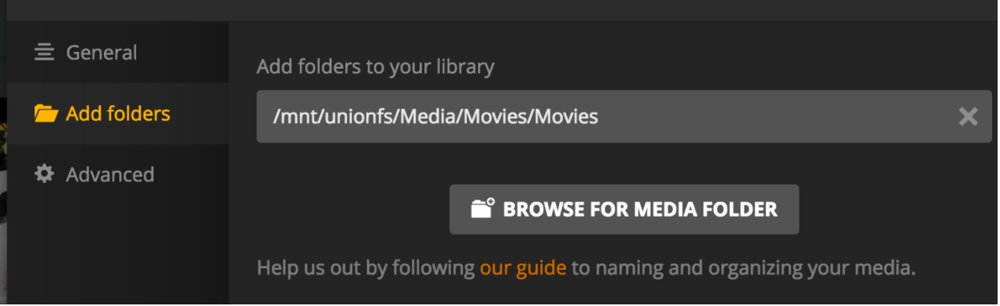
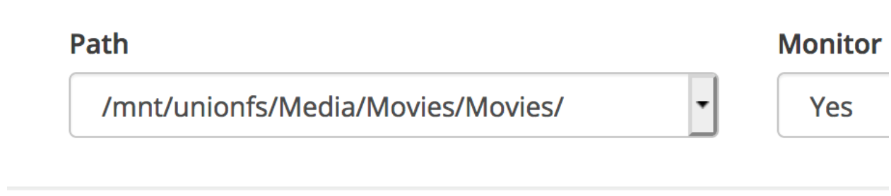

# Plex Autoscan Mappings; how do they work?

There are these things in the Plex Autoscan config, and they seem to cause a great deal of consternation.

## `SERVER_PATH_MAPPINGS`

Here is one of mine, for example:

```json
"SERVER_PATH_MAPPINGS": {
  "/mnt/unionfs/Media/Movies/": [
    "/movies/",
    "/mnt/unionfs/Media/Movies/",
    "Movies/Media/Movies/"
  ]
},
```

Plex Autoscan is going to use these “maps” to decide what path to tell Plex to scan.

Each one should be filled out like this:

```json
   "Plex sees files at this path": [
      "App #1 sees those same files at this path",
      "App #2 sees those same files at this path",
      "Google Drive #1 path to those files",
      ...etc
    ],
```

Case is significant.  “Movies” does not match “movies”, for example.

The JSON formatting is significant.  Those brackets and such matter.

The various paths are only required if you're using them.  For example, if you aren't using Google Drive Monitoring you don't have to include the Google Drive path.

### What does Plex Autoscan do with them?

Here's a generic setup just for this example:

```json
   "SERVER_PATH_MAPPINGS": {
     "/plex/Movie/path/": [
       "/radarr/movie/path/",
       "/google/drive/movie/path/"
     ],
     "/plex/TV/path/": [
       "/sonarr/tv/path/",
       "/google/drive/tv/path/"
     ]
   },
```

Plex Autoscan gets a request for a path like this:

```text
/radarr/movie/path/Big Space Movie (2022)/Big Space Movie (2022).mkv
```

It looks at the table above to find which one matches the path.  In this case it's:

```json
     "/plex/Movie/path/": [
       "/radarr/movie/path/",     <<<< THIS ONE RIGHT HERE
       "/google/drive/movie/path/"
     ],
```

PAS then changes "`/radarr/movie/path/`" to "`/plex/Movie/path/`" to make it into

```text
/plex/Movie/path/Big Space Movie (2022)/Big Space Movie (2022).mkv
```

Then tells Plex to scan that location.

Part of “tells Plex to scan” is finding out which library contains the thing.  To do this PAS gets a list of libraries from Plex, then loops through all of them comparing the root paths in the libraries to the path it's about to send. If there’s a match, PAS then issues the scan request to Plex.

If there is no Plex Library that matches the path, PAS will display an error in its log [“unable to map to a section ID”].

This can also happen if the Plex path is incorrectly entered [It’s not actually the folder configured in a library] or if one of the source paths is incorrect [Radarr isn’t set to save files in the path listed] or some combination of that sort of thing.

### Actual example from a working setup

Let’s look at one of my sections.

```json
  "/mnt/unionfs/Media/Movies/": [
    "/mnt/unionfs/Media/Movies/",
    "Movies/Media/Movies/"
  ],
```

#### Plex

One Plex Movie library is pointed at "/mnt/unionfs/Media/Movies/Movies":



So that’s the “heading” on this map:

```json
  "/mnt/unionfs/Media/Movies/": [  <<<  PLEX PATH RIGHT HERE
    "/mnt/unionfs/Media/Movies/",
    "Movies/Media/Movies/"
  ],
```

#### Radarr

Radarr is configured to send updates to Plex Autoscan, so let’s go take a look at it:

My root dir for movies in Radarr is "/mnt/unionfs/Media/Movies/":



For example:


So that’s an element of this map:

```json
  "/mnt/unionfs/Media/Movies/": [
    "/mnt/unionfs/Media/Movies/",  <<<  RADARR PATH RIGHT HERE
    "Movies/Media/Movies/"
  ],
```

#### Google Drive

Lastly, I have Google Drive monitoring enabled, and all my movies get uploaded to a Teamdrive:


So that’s the last element of this map:

```json
  "/mnt/unionfs/Media/Movies/": [
    "/mnt/unionfs/Media/Movies/",
    "Movies/Media/Movies/"         <<<  GOOGLE DRIVE PATH RIGHT HERE
  ],
```

Note: the first “Movies” is the name of the drive as it appears in the Google Drive web UI, not the name of your rclone remote.

If you had other teamdrives you were monitoring that were also merged into your unionfs, those could come next:

```json
  "/mnt/unionfs/Media/Movies/": [
    "/mnt/unionfs/Media/Movies/",
    "Movies/Media/Movies/",
    "TEAMDRIVE_01/OLD_MOVIES/"
  ],
```

### Multiple applications or sources

You need a mapping for each unique library path; for example:

```json
   "SERVER_PATH_MAPPINGS": {
     "plex/Movie/path/": [
       "/radarr/movie/path/",
       "/google/drive/movie/path/"
     ],
     "plex/TV/path/": [
       "/sonarr/tv/path/",
       "/google/drive/tv/path/"
     ]
   },
```

If there are common roots, they can be consolidated.  For example, this:

```json
   "SERVER_PATH_MAPPINGS": {
     "/mnt/unionfs/Media/Movies/": [
       "/incoming/Movies/",
       "/google_drive/Stuff/Movies/"
     ],
     "/mnt/unionfs/Media/TV/": [
       "/incoming/TV/",
       "/google_drive/Stuff/TV/"
     ]
   },
```

Could be reduced to:

```json
   "SERVER_PATH_MAPPINGS": {
     "/mnt/unionfs/Media/": [
       "/incoming/",
       "/google_drive/Stuff/"
     ]
   },
```

That’s possible since the TV and Movie folders are all the same until that bottom level.

This is just a string replacement.  You don’t need a map for every media type, necessarily.  You need a map for each unique set of answers to the question:

“When some app sees a file at location /what/ever/it/is, where does Plex sees it?”

### Generalized Process Flow

Now, what Plex Autoscan is going to do with that, in generic form:

Given this SERVER_PATH_MAPPING:

```json
"PATH_WHERE_PLEX_LOOKS":[
 "PATH_WHERE_RADARR_LOOKS",
 "PATH_WHERE_APP_TWO_LOOKS",
 "PATH_ON_GOOGLE_DRIVE"
],
```

#### Example 1

Plex Autoscan processes

```text
PATH_WHERE_RADARR_LOOKS/bing/bang/boing
```

based on a request from Radarr.

Plex Autoscan finds

```text
PATH_WHERE_RADARR_LOOKS
```

in the list, so it does a substitution based on the map and tells Plex to scan:

```text
PATH_WHERE_PLEX_LOOKS/bing/bang/boing
```

#### Example 2

Plex Autoscan processes

```text
PATH_WHERE_APP_TWO_LOOKS/bing/bang/boing
```

based on a request from a second application; maybe it's a second Radarr, or Couch Potato, or a custom script.  Whatever the source, this source sees those same files at `PATH_WHERE_APP_TWO_LOOKS`, so that’s what it sends to Plex Autoscan.

Plex Autoscan finds

```text
PATH_WHERE_APP_TWO_LOOKS
```

in the list, so it does a substitution based on the map and tells Plex to scan

```text
PATH_WHERE_PLEX_LOOKS/bing/bang/boing
```

#### Example 3

Plex Autoscan processes

```text
PATH_ON_GOOGLE_DRIVE/bing/bang/boing
```

based on Google Drive Monitoring.

Plex Autoscan finds

```text
PATH_ON_GOOGLE_DRIVE
```

in the list, so it does a substitution based on the map and tells Plex to scan

```text
PATH_WHERE_PLEX_LOOKS/bing/bang/boing
```

#### Example 4 [error case]

Plex Autoscan processes

```text
SOME_RANDOM_PATH/bing/bang/boing
```

based on some trigger, maybe a manual scan.

Plex Autoscan DOES NOT find `SOME_RANDOM_PATH` in the list, so no substitution is done and PAS tells Plex to scan

```text
SOME_RANDOM_PATH/bing/bang/boing
```

Plex Autoscan then logs: `“unable to map to a section ID”` since that path doesn't correspond to any library in Plex.

## `SERVER_FILE_EXIST_PATH_MAPPINGS`

PAS uses this map to alter path mappings before checking that the file exists.

```json
"SERVER_FILE_EXIST_PATH_MAPPINGS": {
    "Files are on host at this path": [
        "Plex sees files at this path"
    ]
},
```

Following the example above, my mappings here is:

```json
"SERVER_FILE_EXIST_PATH_MAPPINGS": {
  "/mnt/unionfs/Media/Movies/": [
    "/mnt/unionfs/Media/Movies/",
    ]
},
```

In the default case, it looks like this:

```json
"SERVER_FILE_EXIST_PATH_MAPPINGS": {
  "/mnt/unionfs/Media/": [
    "/data/",
    ]
},
```

Files are visible on the host at ‘/mnt/unionfs/Media/Movies/…’ and inside Plex at ‘/data/Movies/…’.

Same string substitution concepts as above apply here.
