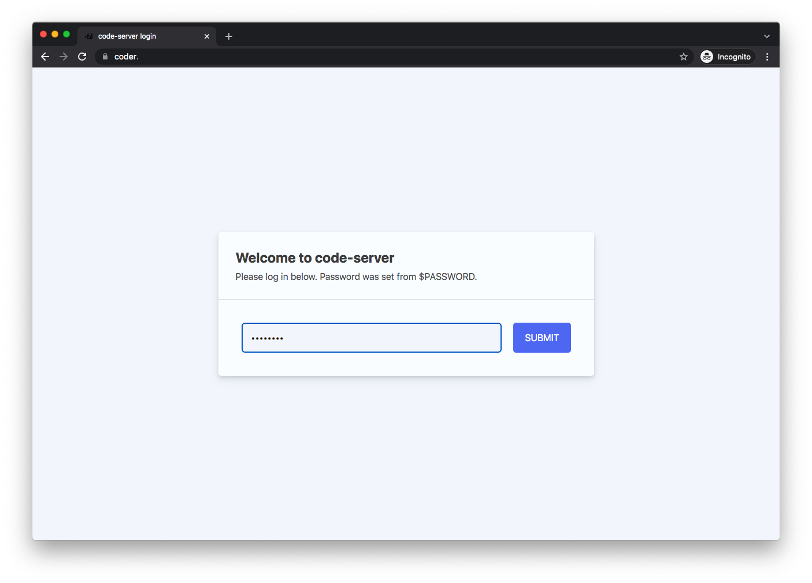
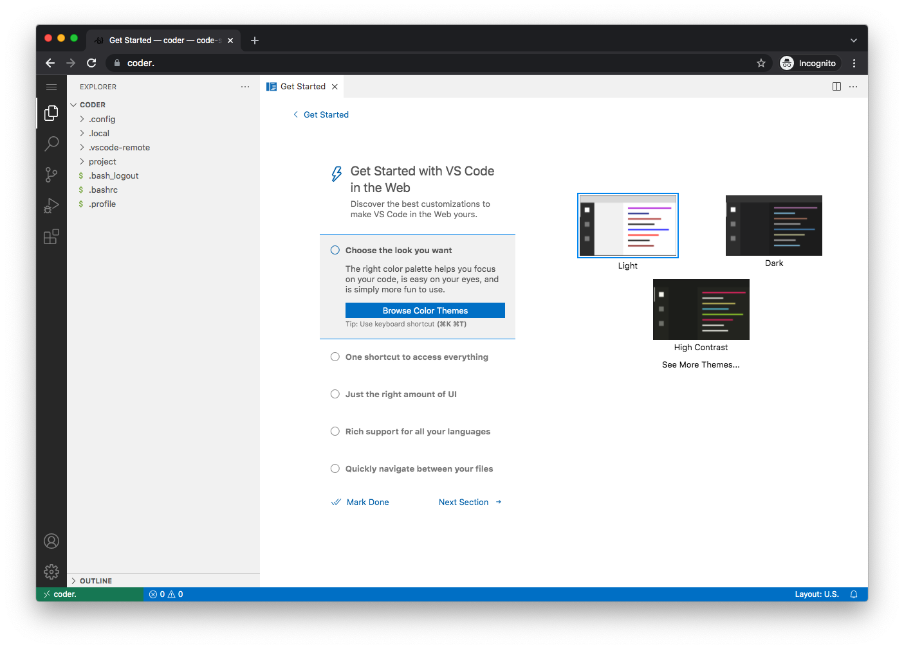
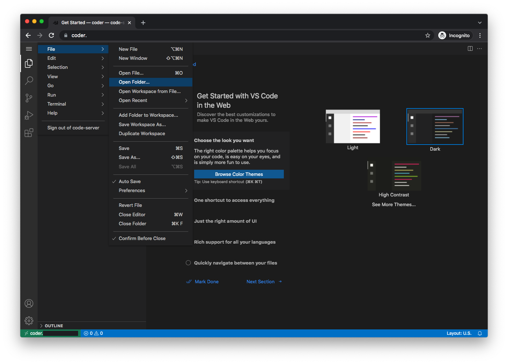
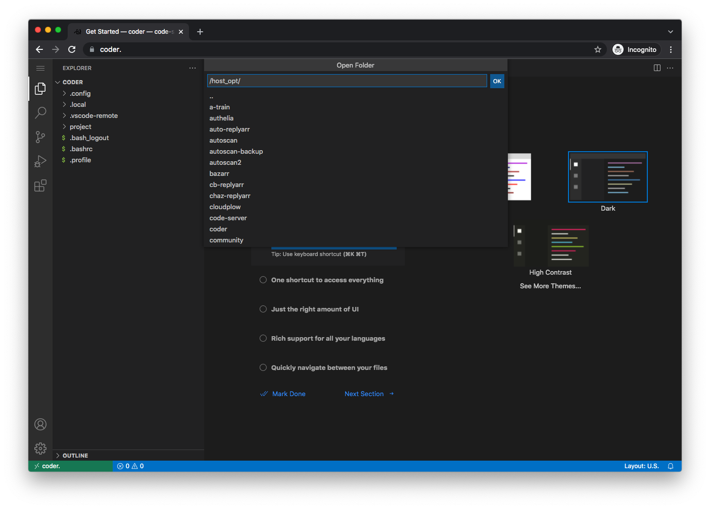
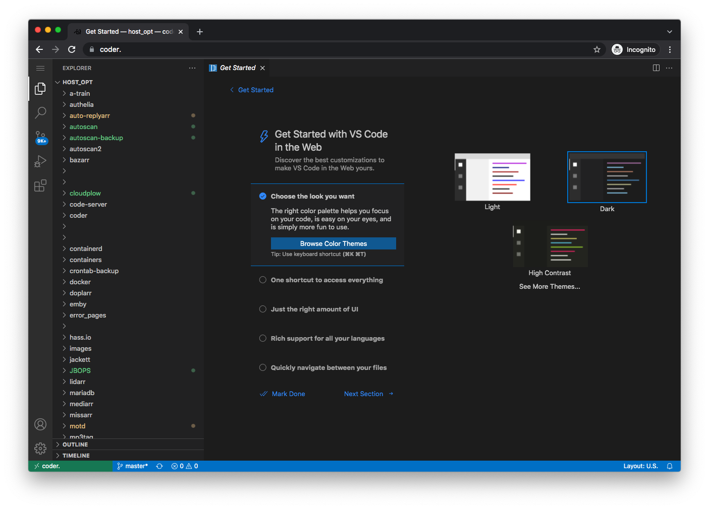
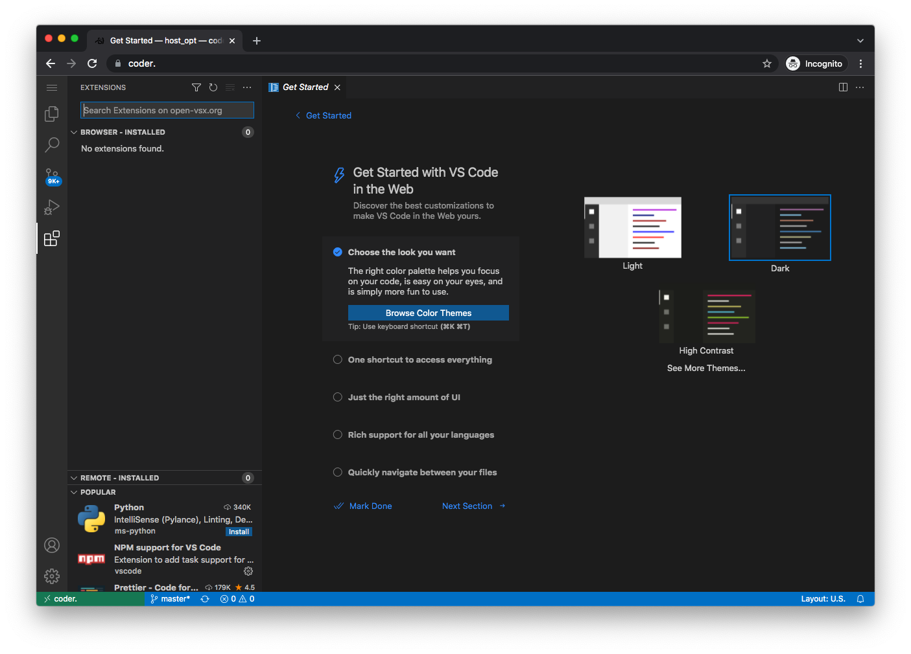
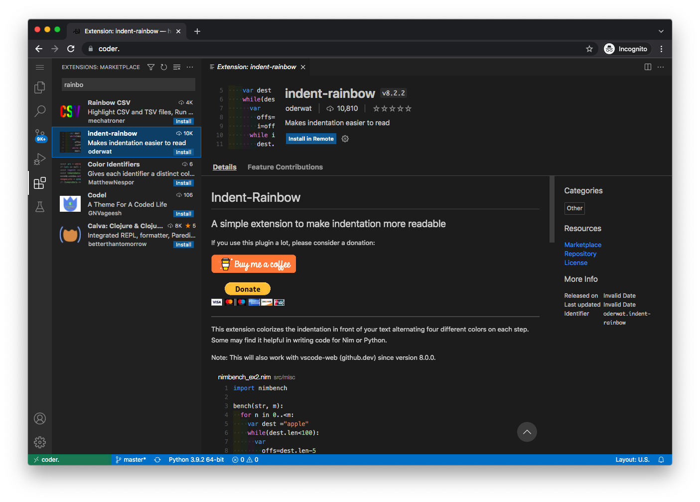

# Using code-server for editing

code-server is a version of VS Code that runs on your server.  It's friendlier than something like `nano`, and you can use it anywhere you can get at your domain.

## install code-server

```shell
sb install sandbox-code_server
```

## initial setup

By default, code-server will be available at [https://code-server.yourdomain.tld].

   

The password is the one you set in `accounts.yml`

   

VSCode will present with a checklist of "getting started" items.

If you've never used VSCode before, take a few minutes to go through the fundamentals tutorial.

You can change the default theme if you wish.  I'm going to choose the dark theme.

   

## point it at the host `/opt` dir

Probably, you want to edit config files for the apps, which are in `/opt`.

The host `/opt` dir is mounted into the container as `/host_opt/`.

Choose `File -> Open Folder...` from the hamburger menu on the upper left:

   

Navigate to `/host_opt/`, click the arrow:

   

and you should be presented with your `/opt` directory.  Most of the things you will want to edit are here.

   

This should stick the next time you load the app.

## install some extensions

I suggest you install a few extensions:

Click on the Extensions icon on the left, then type the name of the extension into the search box, and click the "install" button.

   

Python:

   

Rainbow-indent:

   

Redhat YAML:

   

Better TOML:

   

Those are just suggestions; install others if you prefer.

Now, with these extensions installed, you should have syntax highlighting and indentation coloring for:

TOML

   

YAML

   

JSON

   
