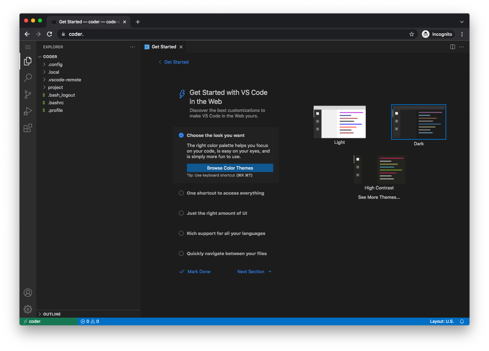
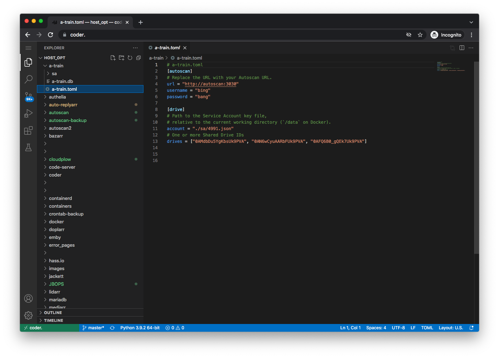
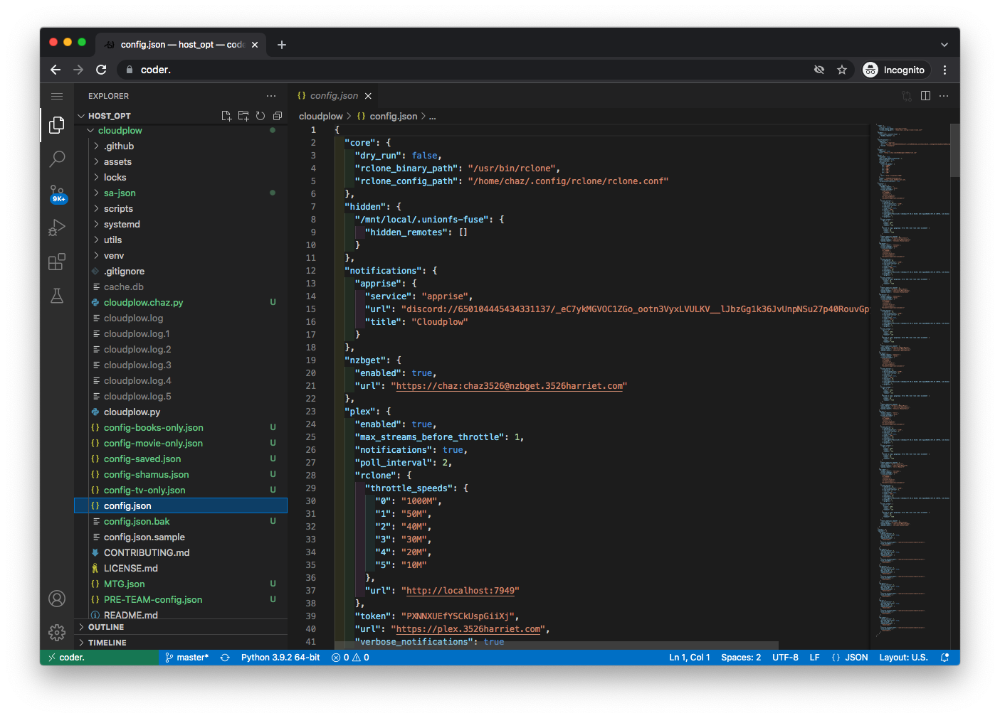

# Using code-server for Editing

code-server is a version of VS Code that runs on your server. Compared to text editors like `nano`, code-server provides a more user-friendly interface. Furthermore, its accessibility is not limited to your local machine, but extends to any location where your domain can be reached.

## Install code-server

```shell
sb install sandbox-code-server
```

## Initial Setup

By default, code-server will be available at [https://code-server.domain.tld].

   

The password is the one you set in `accounts.yml`.

   

code-server will present a checklist of "getting started" items.

If you've never used VSCode before, take a few minutes to go through the fundamentals tutorial.

You can change the default theme if you wish.  I'm going to choose the dark theme.

   

## Set your workspace to host `/opt` dir

You'll likely need to modify configuration files for your applications, which are generally located in the `/opt` directory.

In the container environment, the host's `/opt` directory is mounted as `/host_opt/` by default in saltbox.

To access this, click on the hamburger menu icon in the top left and select `File -> Open Folder...`

   

Next, navigate to the `/host_opt/` directory and click the arrow icon to expand it:

   

You should now see the contents of your /opt directory. Most of the configuration files you'll need to modify are located here.

   

These settings should persist and be present the next time you launch the code-server web page.

## Enhancing code-server with Extensions

We recommend that you install some extensions to enhance your code-server setup. These extensions will provide functionalities such as syntax highlighting and indentation coloring for different file formats.

To install an extension, click on the Extensions icon on the left, type the name of the extension into the search box, and click the "install" button.

   

### Recommended Extensions

#### Python:

   

#### Rainbow-indent:

   

#### Redhat YAML:

   

#### Even Better TOML:

   

These are just suggestions; feel free to install other extensions that suit your needs.

With these extensions installed, you should have syntax highlighting and indentation coloring for:

### Extension Examples

#### TOML

   

#### YAML

   

#### JSON

   
