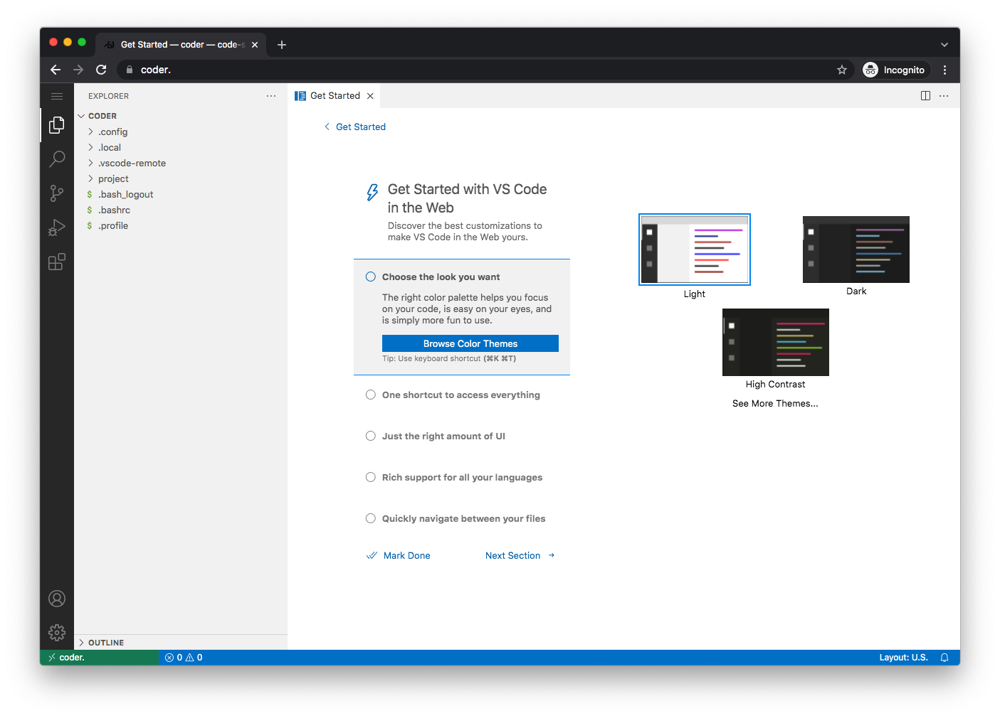
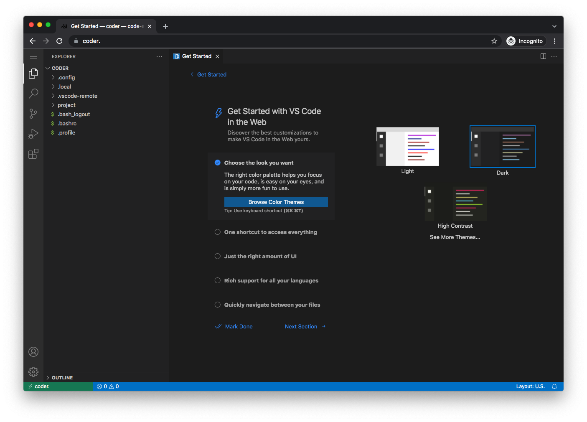
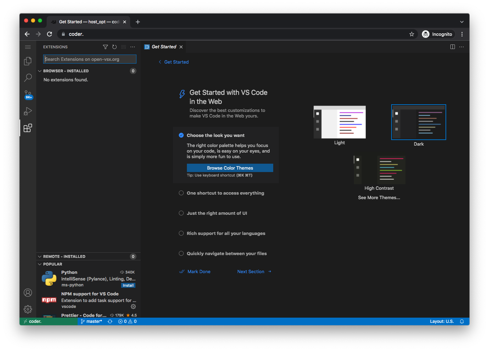
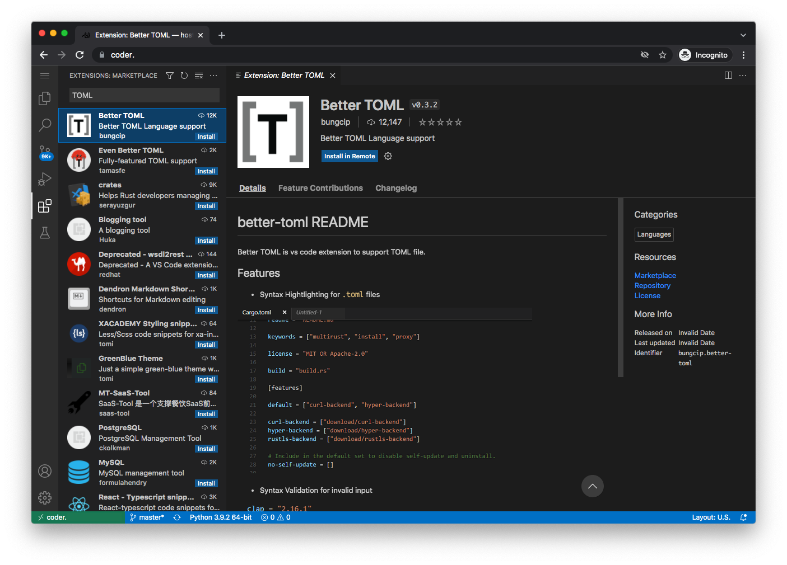

# Using coder for editing

Coder is a version of VS Code that runs on your server.  It's friendlier than something like `nano`, and you can use it anywhere you can get at your domain.

## install coder

```
sb install sandbox-coder
```

By default, coder will be available at [https://coder.yourdomain.tld].

   

The password is the one you set in `accounts.yml`

   

VSCode will by default be pointing to `/home/coder`, and on first startup you'll be presented with a checklist of "getting started" items.

If you've never used VSCode before, take a few minutes to go through the fundamentals tutorial.

You can change the default theme if you wish.  I'm going to choose the dark theme.

   

Probably, you want to edit config files for the apps, which are in `/opt`.

The host `/opt` dir is mounted into the container as `/host_opt/`.

Choose `File -> Open Folder...` from the hamburger menu on the upper left:

   

Navigate to `/host_opt/`, click the arrow:

   

and you should be presented with your `/opt` directory.  Most of the things you will want to edit are here.

   

I suggest you install a few extensions:

Click on the Extensions icon on the left, then type the name of the extension into the search box, and click the "install" button.

   

Python:

   

Rainbow-indent:

   

Redhat YAML:

   

Better TOML:

   

Those are just suggestions; install others if you prefer.

Now, with these extensions installed, you should have syntax highlighting and indentation coloring for:

TOML

   

YAML

   

JSON

   
