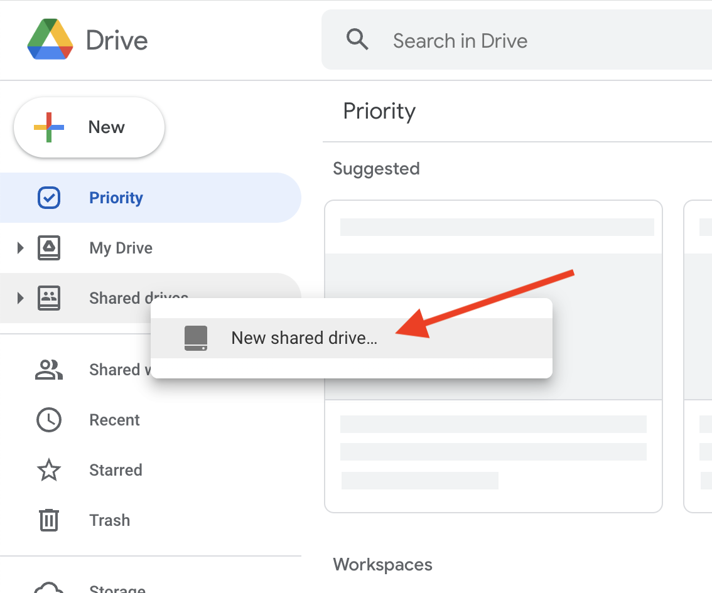
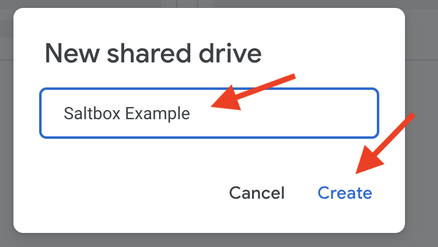
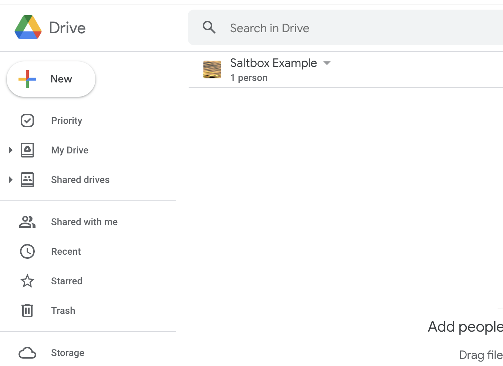
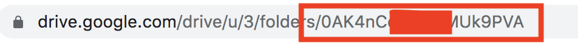
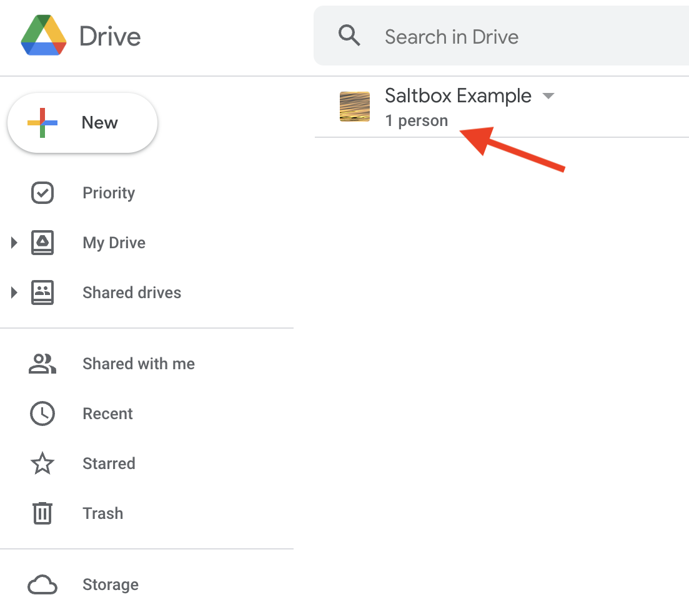
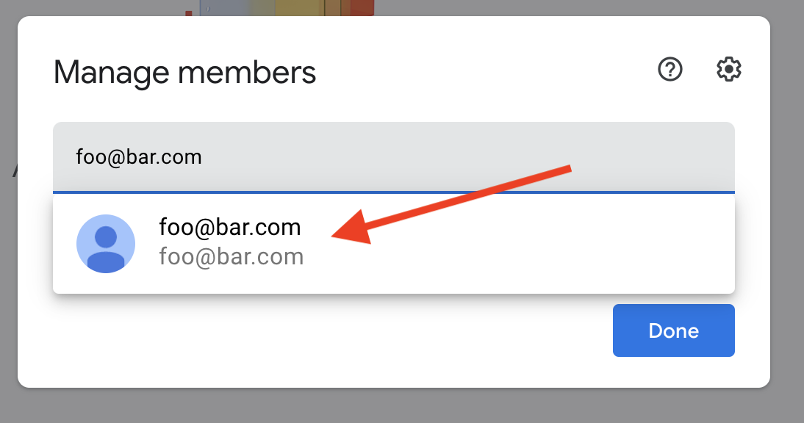
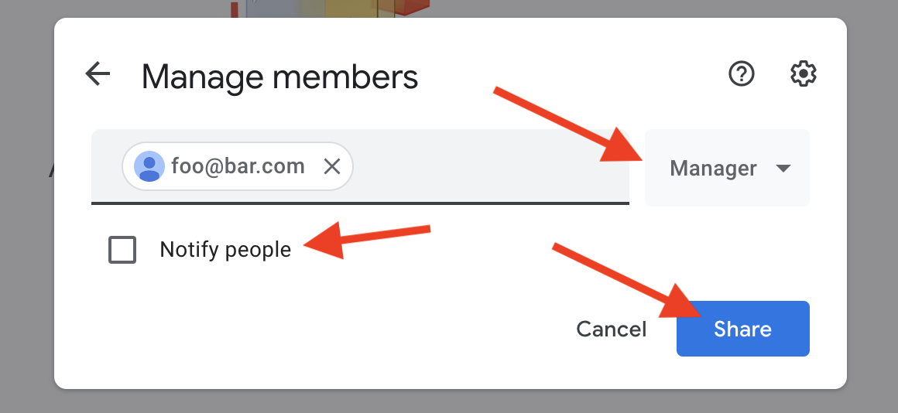

# Creating a Google Shared Drive

This article describes how to create a Google Shared Drive for use with Saltbox.

This is a general descrioption of the process. If you go through the documented Google Drive setup process you most likely don't have to do this.

## Prerequisites

To go through this process, you will need a Google account capable of creating shared drives.

## Walkthrough

1. Go to <https://drive.google.com> in a browser; log in with the relevant account.

2. Right-click on "Shared Drives" and choose "New shared drive..."

    

3. Give the drive a name and click "Create".

    

4. You're done.

    

5. You may need the ID of the Shared Drive for use with some tools; you can find it in the URL:

    

## Sharing the Shared Drive

Perhaps you want to give access to this shared drive to an individual, service account, or group.

1. Click on "1 person" below the Shared Drive name

    

2. Enter the email address of the individual, service account, or group, and click on the name in the menu that appears.

    

3. Choose "Manager" from the dropdown on the right, uncheck the "Notify people" box if you wish, and click "Share".

    
