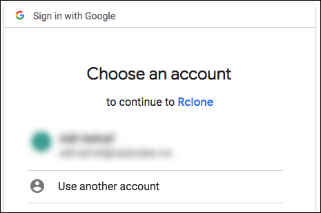
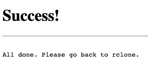

# Creating an rclone remote for Google Drive

This article describes how to create an rclone remote for Google Drive

This article walks through creating a Google Drive remote, but basically the same process is followed for any type of remote; dropbox, sftp, whatever.  Choose the desired type of remote in step 4 and follow the prompts.

## Prerequisites

To go through this process, you will need the following:

   1. either one of these for your Google account:

      a. ClientID/Secret

      b. Service Account JSON file(s)

   2. The project associated with these needs to be set to "external".  See step 9 on [this page](../google-project-setup.md).
   3. rclone installed on your saltbox machine [which means the preinstall has been run]
   4. rclone [same or higher version as on the saltbox machine] and a web browser installed on a machine local to you [this machine needs a GUI].  NOTE: this should be the same machine on which you are sshed to the saltbox server, as you will have to copy-paste a very long token a bit later.


## Walkthrough

1. Run the following command:

    ```shell
    rclone config
    ```

2. Type `n` for "New remote" and press <kbd class="platform-all">Enter</kbd>.

    ```shell
    $ rclone config
    2022/02/26 15:29:40 NOTICE: Config file "/Users/geezer/.config/rclone/rclone.conf" not found - using defaults
    No remotes found - make a new one
    n) New remote
    s) Set configuration password
    q) Quit config
    n/s/q> n
    ```

3. For "name", type in the name of your choice and and press <kbd class="platform-all">Enter</kbd>. [This name is arbitrary, aside from rclone's limitations on name; we're using `google` in this example]

    ```shell
    n/s/q> n
    name> google
    ```

4. For "Type of storage", type in `drive`, or the corresponding number, and press <kbd class="platform-all">Enter</kbd>.  Note that this list is constantly changing, will be much longer, and the numbers won't match what's shown here.  **Read what's on the screen.**

    ```shell
    Option Storage.
    Type of storage to configure.
    Enter a string value. Press Enter for the default ("").
    Choose a number from below, or type in your own value.
    1 / 1Fichier
      \ "fichier"
     ...
    15 / Google Cloud Storage (this is not Google Drive)
       \ "google cloud storage"
    16 / Google Drive
       \ "drive"
    17 / Google Photos
       \ "google photos"
    ...
    45 / seafile
       \ "seafile"
    Storage> drive
    ```

5. Client ID and Secret:

    === "Using a Client ID and secret to connect"

        Enter the Client ID and Client Secret when prompted

        ```shell
        Storage> drive
        Option client_id.
        Google Application Client Id
        Setting your own is recommended.
        See `https://rclone.org/drive/#making-your-own-client-id` for how to create your own.
        If you leave this blank, it will use an internal key which is low performance.
        Enter a string value. Press Enter for the default ("").
        client_id> JOHNNYJOEYDEEDEE
        Option client_secret.
        OAuth Client Secret.
        Leave blank normally.
        Enter a string value. Press Enter for the default ("").
        client_secret> OZZYTONYGEEZERBILL
        ```

    === "Using a service account to connect"

        Leave the Client ID and Client Secret blank when prompted

        ```shell
        Storage> drive
        Option client_id.
        Google Application Client Id
        Setting your own is recommended.
        See https://rclone.org/drive/#making-your-own-client-id for how to create your own.
        If you leave this blank, it will use an internal key which is low performance.
        Enter a string value. Press Enter for the default ("").
        client_id>
        Option client_secret.
        OAuth Client Secret.
        Leave blank normally.
        Enter a string value. Press Enter for the default ("").
        client_secret>
        ```

6. For the "Scope that rclone should use when requesting access from drive", type in `drive`, or the corresponding number (i.e. `1`), to select "Full access all files, excluding Application Data Folder", and press <kbd class="platform-all">Enter</kbd>.

    ```shell
    Option scope.
    Scope that rclone should use when requesting access from drive.
    Enter a string value. Press Enter for the default ("").
    Choose a number from below, or type in your own value.
     1 / Full access all files, excluding Application Data Folder.
       \ "drive"
     2 / Read-only access to file metadata and file contents.
       \ "drive.readonly"
       / Access to files created by rclone only.
     3 | These are visible in the drive website.
       | File authorization is revoked when the user deauthorizes the app.
       \ "drive.file"
       / Allows read and write access to the Application Data folder.
     4 | This is not visible in the drive website.
       \ "drive.appfolder"
       / Allows read-only access to file metadata but
     5 | does not allow any access to read or download file content.
       \ "drive.metadata.readonly"
    scope> 1
    ```

7. For "ID of the root folder", leave blank and press <kbd class="platform-all">Enter</kbd>.

    ```shell
    Option root_folder_id.
    ID of the root folder.
    Leave blank normally.
    Fill in to access "Computers" folders (see docs), or for rclone to use
    a non root folder as its starting point.
    Enter a string value. Press Enter for the default ("").
    root_folder_id>
    ```

8. For "Service Account Credentials JSON file path":

    === "Using a Client ID and secret to connect"

        leave blank and press <kbd class="platform-all">Enter</kbd>

        ```shell
        Option service_account_file.
        Service Account Credentials JSON file path.
        Leave blank normally.
        Needed only if you want use SA instead of interactive login.
        Leading `~` will be expanded in the file name as will environment variables such as `${RCLONE_CONFIG_DIR}`.
        Enter a string value. Press Enter for the default ("").
        service_account_file>
        ```

    === "Using a service account to connect"

        Enter the path to a service account JSON file and press <kbd class="platform-all">Enter</kbd>

        ```shell
        Option service_account_file.
        Service Account Credentials JSON file path.
        Leave blank normally.
        Needed only if you want use SA instead of interactive login.
        Leading `~` will be expanded in the file name as will environment variables such as `${RCLONE_CONFIG_DIR}`.
        Enter a string value. Press Enter for the default ("").
        service_account_file> /path/to/service-account.json
        ```

9. For "Edit advanced config", type `n` and press <kbd class="platform-all">Enter</kbd>.

    ```shell
    Edit advanced config?
    y) Yes
    n) No (default)
    y/n> n
    ```

10. For "Use auto config?", type `n` for "...remote or headless machine" and press <kbd class="platform-all">Enter</kbd>.

    If you entered a service account above, skip to step 17.

    ```shell
    Use auto config?
     * Say Y if not sure
     * Say N if you are working on a remote or headless machine

    y) Yes (default)
    n) No
    y/n> n
    ```

11. In the next section, follow the instructions on your local machine.

    ```shell
    Option config_token.
    For this to work, you will need rclone available on a machine that has
    a web browser available.
    For more help and alternate methods see: https://rclone.org/remote_setup/
    Execute the following on the machine with the web browser (same rclone
    version recommended):
     rclone authorize "drive" "eyJjbGllbnRfaWQiOiI2OTUxMzMzNjg1ODMtcmU5MmE3Y3F0cGdqc2JvOGlscGwxamIzN2draXRibmwuYXBwcy5nb29nbGV1c2VyY29udGVudC5jb20iLCJjbGllbnRfc2VjcmV0IjoiOVRCQ2p2WHBlNlhxaFlPUG5JUGpRTkdIIiwic2NvcGUiOiJkcml2ZSJ9"
    Then paste the result.
    Enter a value.
    config_token>
    ```

12. If asked to login, use the Google Drive account you want to store your data in.

    

13. Give access by clicking "Allow".

    

14. The browser should report success.

    

15. And a token should show up in the terminal on your local computer:

    ```text
    2022/05/09 22:56:09 NOTICE: Log in and authorize rclone for access
    2022/05/09 22:56:09 NOTICE: Waiting for code...
    2022/05/09 22:56:16 NOTICE: Got code
    Paste the following into your remote machine --->
    ROGERPETEJOHNKEITH
    <---End paste
    ```

16. Paste the token at the rclone prompt and press Enter.

    ```text
    Enter a value.
    config_token>  ROGERPETEJOHNKEITH
    ```

17. For "Configure this as a team drive?":

    === "Using My Drive"

        Type `n` and press <kbd class="platform-all">Enter</kbd>.

        ```shell
        Configure this as a Shared Drive (Team Drive)?

        y) Yes
        n) No (default)
        y/n> n
        ```

    === "Using a shared drive"

        Type `y` and press <kbd class="platform-all">Enter</kbd>.

        ```shell
        Configure this as a Shared Drive (Team Drive)?

        y) Yes
        n) No (default)
        y/n> y
        ```
        You'll be presented with a list of shared drives you have access to.  Enter a number and press <kbd class="platform-all">Enter</kbd>.

        ```shell
        Option config_team_drive.
        Shared Drive
        Enter a string value. Press Enter for the default ("0AF3NBtE4KF_iUk9PVA").
        Choose a number from below, or type in an existing value.
         1 / 4k
           \ "BINGBANGBOING"
         2 / 1080p
           \ "BANGBOINGBING"
        ...
        122 / ubrujjpeni-TV
           \ "BOINGBINGBANG"
        123 / Video
           \ "BANGBINGBOING"
        config_team_drive> 6
        ```

18. Confirm that the remote details look OK, type `y` and press <kbd class="platform-all">Enter</kbd>.

    ```shell
    --------------------
    [google]
    type = drive
    client_id = JOHNNYJOEYDEEDEE
    client_secret = OZZYTONYGEEZERBILL
    scope = drive
    token = {"access_token":"...","token_type":"Bearer","refresh_token":"...","expiry":"2022-02-26T17:56:24.53802-06:00"}
    team_drive = BINGBANGBOING
    root_folder_id =
    --------------------
    y) Yes this is OK (default)
    e) Edit this remote
    d) Delete this remote
    y/e/d> y
    ```

19. To exit, type `q` and press <kbd class="platform-all">Enter</kbd>.

    ```shell
    Current remotes:

    Name                 Type
    ====                 ====
    google               drive

    e) Edit existing remote
    n) New remote
    d) Delete remote
    r) Rename remote
    c) Copy remote
    s) Set configuration password
    q) Quit config
    e/n/d/r/c/s/q> q
    ```

The name of this remote [`google` in this case] is what you should enter in the rclone settings as you proceed with the install.

If you wish to encrypt this remote, proceed with [creating a crypt remote](rclone-remote-encrypted.md)

## Existing Rclone Setup

The default remote specified in [[settings.yml|Install: settings.yml]] is `google` for Google Drive. If the Rclone remote in your config has the same name, then you are OK to skip this page and go on to the next.

If you are using Google Drive and the Rclone remote in your config has a different name, then you will need to either:

- Rename your current Rclone remote to the default one (i.e. `google`). Instructions for this are below.

OR

- Edit the Rclone remote entry in [settings.yml](../accounts.md) with yours.
