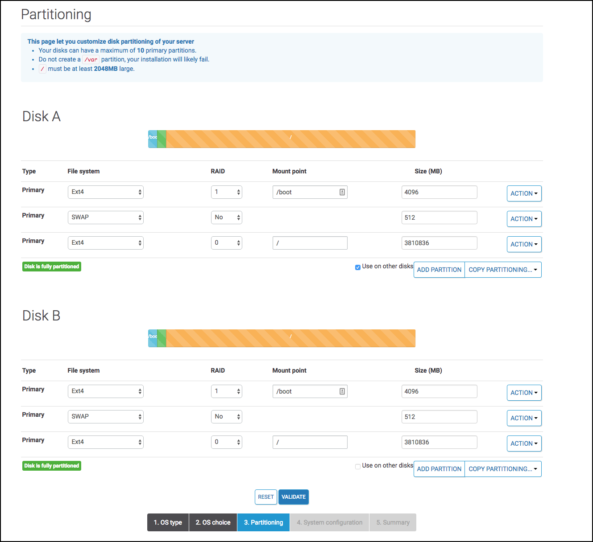
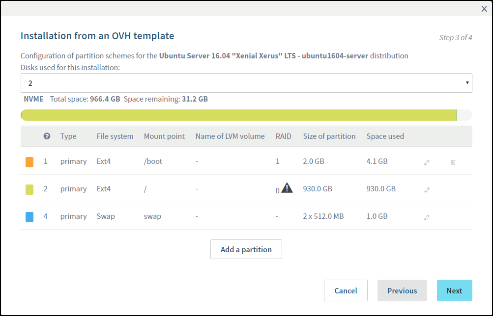

## Server

### Getting a Server

About the requirements:

You will need a dedicated server, from a server provider (e.g. Hetzner, kimsufi, OVH, etc), installed with Ubuntu Server [20.04](https://releases.ubuntu.com/20.04/) or [22.04](https://releases.ubuntu.com/22.04/).

The install assumes that this is a fresh setup without anything else installed.  If your server has things like Docker preinstalled, chances are the installer will fail with a non-obvious error.

Typically this server is remote to you; you can install on a home server, keeping in mind some [home server considerations](#home-server-considerations)

Best results are seen with an actual dedicated server, not a VPS like those available from Linode, Vultr, or the like or a virtualized setup like proxmox.  Linodes, Vultr "Cloud Compute", Hetzner "Cloud Servers", and probably others like them, in particular, are known to _not_ work in at least one significant way; NZBGet reports 0 available disk space while Sonarr, Radarr, and tools like `df` and `du` report disk space as expected.

A commonly-asked question is ["can I run saltbox on this server?"](guides/chazguides/server.md)

You will need root access to install Saltbox.

The server should be a completely fresh OS install. Do not try to install any dependencies on your own, Saltbox will do that for you.

Saltbox only supports x64 (i.e. Intel or AMD 64) machines. ARM based hardware [such as the Raspberry Pi] is not supported.

Get a server with at least 100GB+ of hard disk space. Even though media is uploaded to the cloud, there is still a need local storage for things like app data and backups.

Practically, you should have more like 500GB of space available _at a minimum_.

Cloudplow's default folder size threshold, to upload media to the cloud, is set at 200GB. If you want to lower that, you can find details [here](../apps/cloudplow.md){target=_blank}

If you are planning to use Usenet, SSD should be considered required, and NVME highly recommended.  Usenet is extremely disk I/O intensive.

If you are planning to use torrents, you should have much more disk space than that available for seeding.  Your seeding torrents will not be moved to your cloud storage; they will consume local disk space as long as they are seeding.

If you are installing as a Feederbox/Mediabox setup rather than the all-in-one Saltbox, the disk requirements change a bit. Downloading drives the disk requirements on the Feederbox [as discussed above] and primarily the Plex/Emby metadata drives the disk requirements on the Mediabox.  Depending on the size of your library, that metadata can be quite large.

### Home Server considerations

If you are setting this up on a home server, verify, **before installing Saltbox**:

  1. Make sure your ISP doesn't block ports 80 and 443 [if your ISP blocks these ports, it won't work.]
  2. Make sure that your router supports hairpin NAT [if this isn't supported, you won't be able to access apps via subdomain from inside your network or you will have to do manual setup to allow it]
  3. Open the relevant [ports](ports.md){target=_blank} (eg `80`, `443`, etc) in your [router](https://portforward.com/router.htm)/firewall and forward them to the IP of the box on which you want to install Saltbox, **before installing Saltbox**.
  4. Point your domain at your home IP and configure some dynamic DNS software to keep it updated.  Saltbox has a dynamic dns client available [it's not installed by default], but there are many ways to set this up.  Make sure that DNS has propagated and your domain returns your home IP via `ping` or something like it, **before installing Saltbox**.
  5. Review the notes about [local storage](local-storage.md) if you're not planning to use cloud storage.

### Tips

#### Ubuntu 20.04

- If you get an option like below, select choose `ubuntu-2004-focal-64-minimal`.

  

- Install OpenSSH server if asked.

#### Partitioning

- If you have multiple hard drives on the server (eg. 2 x 4 TB), put them in RAID 0 to maximize space and speed (you don't need redundancy as you can schedule backups of Saltbox).

- Set all available space to `/` (remove `/home` and `/data` partitions).

- Leave ample space in `/boot` (e.g. 2+ GB).

- putting the `/opt` directory on a `btrfs` partition can dramatically reduce the amount of time your containers are down during [backup](../saltbox/backup/backup.md).  A reasonable starting size for `/opt` is 250G.

- You can use a single partition formatted as BTRFS, but if you do so *make sure* you install the `btrfsmaintenance` tag after setup.

Examples:

**IMPORTANT**: Note that these examples are just that, _examples_, and may not reflect currently-available OS versions or the current state of the UI.  They were accurate at the time of capture, but things change that are outside saltbox' control.  You will need to review for accuracy and possibly adapt them to your specific situation.  You're partitioning the disk of your remote server; you generally shouldn't trust that to copy-pasting some text from a web page.

=== "Online.net"
    

=== "OVH"
    

    

=== "Hetzner"

    [What to do with this "installimage"](https://docs.hetzner.com/robot/dedicated-server/operating-systems/installimage/)

     - Hetzner installimage

         ``` bash
         # Hetzner Online GmbH - installimage
         #
         # This file contains the configuration used to install this
         # system via installimage script. Comments have been removed.
         #
         # More information about the installimage script and
         # automatic installations can be found in our wiki:
         #
         # http://wiki.hetzner.de/index.php/Installimage
         #

         DRIVE1 /dev/nvme0n1
         DRIVE2 /dev/nvme1n1
         SWRAID 1
         SWRAIDLEVEL 0
         HOSTNAME sb.domain.com
         PART /boot  ext4     2G
         PART lvm    vg0       all
         LV vg0   swap   swap      swap         8G
         LV vg0   root    /     ext4      all
         IMAGE /root/.oldroot/nfs/install/../images/Ubuntu-2004-focal-64-minimal.tar.gz
         ```

     - Hetzner installimage (with a separate 250G partition for `/opt` utilizing BTRFS for snapshot backups)

         ``` bash
         # Hetzner Online GmbH - installimage
         #
         # This file contains the configuration used to install this
         # system via installimage script. Comments have been removed.
         #
         # More information about the installimage script and
         # automatic installations can be found in our wiki:
         #
         # http://wiki.hetzner.de/index.php/Installimage
         #

         DRIVE1 /dev/nvme0n1
         DRIVE2 /dev/nvme1n1
         SWRAID 1
         SWRAIDLEVEL 0
         HOSTNAME sb.domain.com
         PART /boot  ext4     2G
         PART lvm    vg0       all
         LV vg0   swap   swap      swap         8G
         LV vg0   opt   /opt     btrfs         250G
         LV vg0   root    /     ext4      all
         IMAGE /root/.oldroot/nfs/install/../images/Ubuntu-2004-focal-64-minimal.tar.gz
         ```
