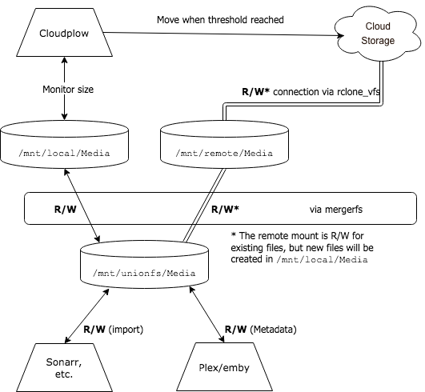

---
hide:
  - tags
tags:
  - saltbox
  - basics
  - features
  - how
  - operation
---

# Basics

## What is Saltbox?

- [Saltbox](https://github.com/saltyorg/Saltbox) is an [Ansible](https://www.ansible.com/how-ansible-works) and [Docker](https://www.docker.com/what-container) based solution for rapidly deploying a cloud media server using LTS releases of Ubuntu Server 20.04, 22.04 or 24.04, running on AMD64.  Non-LTS releases of Ubuntu or Desktop installs are not supported.  Linux distributions other than Ubuntu are not supported.  ARM processors, Raspberry Pi notably, are not supported.

- Primary functions are: the automatic acquisition of media, being able to  play it back from anywhere and from any device, and to a lesser extent storing that media on the cloud.

- NOTE: Saltbox does not have a dashboard or GUI of its own. All Saltbox-specific setup and commands are done on the linux command-line.

## Why use Saltbox?

### Custom Domains

- Have your server setup behind your own domain, securely (e.g. <https://apps.yourdomain.com>).

### Fast Deployment

- Have a system running in minutes with minimal input.

### Docker-Based Applications

- Docker containers keep your apps isolated from each other - no more conflicts between apps.

- Docker containers keep your system tidy since none of the apps' files (executables and dependencies) are stored outside of the container.

- Quickly install and uninstall apps.

- Built-in config-driven method to deploy multiple instances of many apps [multiple radarr, sonarr, plex, etc]

### Cloud Storage

- Store media on cloud storage to save on local drive space.

- As cloud storage providers tighten up their offerings in terms of available space, this aspect is getting less important.

### Can Choose Your Preferred Media Server Application

- You can decide whether to use Plex, Emby or Jellyfin.

### Custom Server Deployment

- You can deploy Saltbox on an all-in-one server, for downloading and streaming.

  or

- You can deploy Saltbox between two servers: a Mediabox, as streaming server, and a Feederbox, as a downloading server.

### Secure

- Saltbox uses secure HTTPS backed by [Let's Encrypt](https://letsencrypt.org/) or [ZeroSSL](https://zerossl.com/) certificates.

### Single-sign-on

- Saltbox can put all your media apps behind Authelia security rather than relying on individual app logins.

### Easy Backup and Restore

- Configuration and data files for all key applications are conveniently stored in /opt, which makes backup so easy. Easily pack up your server and move to another one with Saltbox's built-in Backup.

## How does Saltbox function ?

[Sonarr](https://sonarr.tv/) manages downloading your favorite TV shows and [Radarr](https://radarr.video/) manages downloading your favorite movies. Both use Usenet (via [NZBGet](https://nzbget.net/)) and/or Torrents (via [qBittorrent](https://github.com/qbittorrent/qBittorrent)) to do this.[\[1\]](#f1) [\[2\]](#f2)

Once the downloads are complete, Sonarr & Radarr will move [or copy/link in the case of torrents] these downloads to your server's `/mnt/local/Media/` folder[\[3\]](#f3)  and send a notification to _Autoscan_.

The original seeding torrents will remain in the download directory [they never leave the local machine] until they are deleted by you or some form of automation.

[AutoScan](https://github.com/cloudbox/autoscan/) will, in turn, tell Plex to scan for the newly downloaded show or movie, by only scanning the specific season or movie folder. This will

- Make the media appear in Plex sooner than what a full library scan would have been able to do, and
- Reduce the chances of Cloud Storage API bans for excessive activity.

In the default config, this scan occurs **ten minutes**[\[4\]](#f4)  after Radarr/Sonarr sent the notification.

[Cloudplow](https://github.com/Saltbox/Saltbox/wiki/Cloudplow) will eventually[\[5\]](#f5)  move everything[\[6\]](#f6)  from `/mnt/local/Media/` to a folder named `Media` on the remote cloud storage, thereby reducing the storage used on the (local) server.

During this migration, the media files will continue to be accessible to Media Servers (e.g. Plex) because the remote cloud storage (e.g. Google Drive) will be mounted on to the server as if it were a local drive. This is accomplished with an [Rclone](https://rclone.org/) VFS mount pointing to the cloud storage, and a union of that mount with the server’s own local storage (accomplished via [`mergerfs`](https://github.com/trapexit/mergerfs)).

***

<b name="f1">[1](#a1)</b> Some of the applications above can be replaced with similar apps. 

<b name="f2">[2](#a2)</b> If you want to use Torrents, it is recommended to be a member of a private tracker as opposed to using public ones. If you want to to use Usenet, you will need to purchase Usenet provider service (or multiple services) and also be a member of one or more Usenet indexers. 

<b name="f3">[3](#a3)</b> The move to `/mnt/local/Media` is indirect; Radarr/Sonarr are using `/mnt/unionfs/Media`, and they move the file _there_, however,  `/mnt/local` is the only _writeable_ part of the Mergerfs [for the purpose of  creating new files], so the newly-written files will be placed in `/mnt/local`. 

<b name="f4">[4](#a4)</b> This ten-minute delay can be changed in the Autoscan config file.  It's here for two reasons; it ensures that the file is completely copied into the media directory before Plex scans it, and it allows a season of TV to be collected and send to Plex as a single scan. In the TV case, each new episode in a given season resets the timer, so the scan request would go to Plex ten minutes after the last episode completed downloading.

<b name="f5">[5](#a5)</b> By default, Cloudplow will check every half hour to see if there is 200GB of data staged in `/mnt/local` and if there is, all that data is pushed to your Google Drive.  This threshold can be adjusted as needed in the Cloudplow config. 

<b name="f6">[6](#a6)</b> There is presently a 750GB/day upload limitation on Google accounts.  The standard Saltbox setup will create a set of shared drives and service accounts. The service accounts can be enabled in cloudplow to exceed this limit on uploads [750 GB/day/service account]. 

Next, let's discuss the [Prerequisites](../prerequisites/prerequisites.md) for Saltbox installation.
