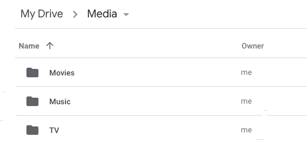

# Saltbox Paths

## General Info

It is recommended to assign all your disk space to `/`, as all of your imported media and app data will be saved to `/mnt/local/` and `/opt/`,  respectively.  This allows your application metadata and your staged media to  make the most use of your available disk space without worrying about partitioning.

Note 1: **ALL** folders/paths mentioned below, and elsewhere on the wiki, are **CASE SENSITIVE** (e.g. Google Drive: `Media` not `media`, `Movies` not `movies`, `TV` not `tv`; Plex Requests: `/logs` not `/Logs`, etc). This is important, or else apps like Plex, Sonarr, and Radarr will not be able find your media.

Note 2: This wiki uses `~/` interchangeably with `/home/<username>/`, which is defined as `/home/{{user}}/` in Ansible syntax (as used in [settings.yml](../../reference/accounts.md#options-in-settingsyml)). So if your user name was `seed`, your `~/` path would be `/home/seed/`.

For this reason it is important that you run commands as the appropriate user as you go through the wiki.

## Google Drive Paths

```text
Media
├── Movies
├── Music
└── TV
```

  

There may be other mediatype directories here depending on your specific setup.  The current automated rclone setup creates several more [Movies-4K, Books, Anime, and so forth].

| Path  <pre>                 </pre>                 | Description  <pre>                                                                                              </pre>                                                                                                                                                          |
|:---------------------- |:------------------------------------------------------------------------------------------------------------------------------------------------------------------ |
| `/Media/`     | Location of all your media folders.                                                                                                                         |
| `/Media/Movies/` | Location of all your movies (folder format: `/Media/Movies/Movie Name (year)/movie file.ext`).                                                                                                  |
| `/Media/Music/` | Location of all your music.                                 |
| `/Media/TV/`   | Location of all your TV shows (folder format: `/Media/TV/TV Show Name/Season 00/episode file.ext`). |

_Note: If you would like to customize your Plex libraries differently, see [Customizing Plex Libraries](../../reference/customizing-plex-libs.md)._

## Local Paths

```text
mnt
├──local
|  └── Media
├──remote
|  └── Media
└──unionfs
   └── Media
```

### Media

| <pre>                 </pre> Path                   | <pre>                                                                                                 </pre> Description                                                                                                                                                            |
|:---------------------- |:------------------------------------------------------------------------------------------------------------------------------------------------------------------ |
| `/mnt/local/Media/`     | Location of media stored on the server.  <br /><br />This is the local part of `/mnt/unionfs/Media/`.                                                                                                                        |
| `/mnt/remote/Media/` | Location of media stored on Google Drive (mounted by rclone).                                                                                                  |
| `/mnt/unionfs/Media/`   | Combined folder of local media (`/mnt/local/Media/`) and online media (`/mnt/remote/Media/`). <br /><br /> This is the folder that Plex, Sonarr, and Radarr read when scanning for media.|

_Note: Make sure `/mnt/local/` has enough space to store the imported media (before cloudplow is able to move it to Google Drive)._

### Cloudplow

| Path<pre>                 </pre>               | Description <pre>                 </pre>                                                                                                                                                                                      |
|:------------------ |:--------------------------------------------------------------------------------------------------------------------------------------------------------------------------------------------- |
| `/mnt/local/Media/` | Location of media stored on the server. <br /><br /> Size of this path is checked periodically (default 30 min). When the folder size reaches its target (default 200GB), media files are moved off/uploaded to the cloud, freeing up local disk space. |

_Note: For more info, see the [Cloudplow](../../reference/cloudplow.md) page._

## Docker Paths

The Dockerized app (e.g. Plex) will "see" the **Docker Path**, but that path will actually be the **Host Path** on the server.

By default, NZB and Torrent downloads are stored in `/mnt/local/downloads/nzbs/` and `/mnt/local/downloads/torrents/`, respectively. However, this can be changed to point elsewhere (e.g. a second hard drive) by editing the [settings.yml](../../reference/accounts.md#options-in-settingsyml) file. But regardless of the download location chosen, the **Docker Path** will always be the same.

_Note: It is advised to leave at least 100GB free on `/opt` for the storage of Docker data_.

### Any container that requires disk access

| Docker Path <pre>                 </pre>   | Host Path <pre>                 </pre>                  | Description <pre>                 </pre>                     |
|:-------------- |:--------------------------- |:---------------------------- |
| `/mnt` | `/mnt` | Provides access to all standard mounted storage.   |

Every container sees any path inside `/mnt` the same as the host and same as any other container.

That means that no path translation is required from context to context.  If nzbget reports a download at `/mnt/unionfs/downloads/...` then Radarr will see it in the same place; when Radarr tells Plex-Autoscan [PAS] about it, PAS sees it in that same place; when PAS tells Plex about it, Plex sees it in that same place.

### Plex

| Docker Path <pre>                 </pre>   | Host Path <pre>                 </pre>                  | Description <pre>                 </pre>                     |
|:-------------- |:--------------------------- |:---------------------------- |
| `/mnt/unionfs/Media/Movies/` | `/mnt/unionfs/Media/Movies/` | Plex reads this for Movies.   |
| `/mnt/unionfs/Media/TV/`     | `/mnt/unionfs/Media/TV/`    | Plex reads this for TV Shows. |
| `/mnt/unionfs/Media/Music/`   | `/mnt/unionfs/Media/Music/`     | Plex reads this for Music. |

### Sonarr

| Docker Path  <pre>                 </pre>          | Host Path <pre>                                     </pre>                        | Description <pre>                                                                                                                                                             </pre>                                                                |
|:---------------------- |:--------------------------------- |:--------------------------------------------------------------------------- |
| `/mnt/unionfs/Media/TV/`              | `/mnt/unionfs/Media/TV/`       | Sonarr will import to `/mnt/unionfs/Media/TV/`. |
| `/mnt/unionfs/downloads/nzbs/`    | `/mnt/local/downloads/nzbs/` (default) | NZB downloads folder as set in [settings.yml](../../reference/accounts.md#options-in-settingsyml)).  <br /> <br /> For example, when using NZBGet, Sonarr will import from `/mnt/unionfs/downloads/nzbs/nzbget/`, which is ultimately `/mnt/local/downloads/nzbs/nzbget/` on host system.                          |
| `/mnt/unionfs/downloads/torrents/` | `/mnt/local/downloads/torrents/` (default) | Torrent downloads folder as set in [settings.yml](../../reference/accounts.md#options-in-settingsyml)).  <br /> <br /> For example, when using qBittorrent, Sonarr will import from `/mnt/unionfs/downloads/torrents/qbittorrent/`, which is ultimately `/mnt/local/downloads/torrents/qbittorrent/` on host system.                     |

### Radarr

| Docker Path  <pre>                 </pre>          | Host Path <pre>                                     </pre>                        | Description <pre>                                                                                                                                                             </pre>                                                                |
|:---------------------- |:--------------------------------- |:--------------------------------------------------------------------------- |
| `/mnt/unionfs/Media/movies/`              | `/mnt/unionfs/Media/Movies/`       | Radarr will import to `/mnt/unionfs/Media/Movies/`. |
| `/mnt/unionfs/downloads/nzbs/`    | `/mnt/local/downloads/nzbs/` (default) | NZB downloads folder as set in [settings.yml](../../reference/accounts.md#options-in-settingsyml)).  <br /> <br /> For example, when using NZBGet, Radarr will import from `/mnt/unionfs/downloads/nzbs/nzbget/`, which is ultimately `/mnt/local/downloads/nzbs/nzbget/` on host system.                          |
| `/mnt/unionfs/downloads/torrents/` | `/mnt/local/downloads/torrents/` (default) | Torrent downloads folder as set in [settings.yml](../../reference/accounts.md#options-in-settingsyml)).  <br /> <br /> For example, when using qBittorrent, Radarr will import from `/mnt/unionfs/downloads/torrents/qbittorrent/`, which is ultimately `/mnt/local/downloads/torrents/qbittorrent/` on host system.                     |

### Lidarr

| Docker Path  <pre>                 </pre>          | Host Path <pre>                                     </pre>                        | Description <pre>                                                                                                                                                             </pre>                                                                |
|:---------------------- |:--------------------------------- |:--------------------------------------------------------------------------- |
| `/mnt/unionfs/Media/Music/`              | `/mnt/unionfs/Media/Music/`       | Lidarr will import to `/mnt/unionfs/Media/Music/`. |
| `/mnt/unionfs/downloads/nzbs/`    | `/mnt/local/downloads/nzbs/` (default) | NZB downloads folder as set in [settings.yml](../../reference/accounts.md#options-in-settingsyml)).  <br /> <br /> For example, when using NZBGet, Lidarr will import from `/mnt/unionfs/downloads/nzbs/nzbget/`, which is ultimately `/mnt/local/downloads/nzbs/nzbget/` on host system.                          |
| `/mnt/unionfs/downloads/torrents/` | `/mnt/local/downloads/torrents/` (default) | Torrent downloads folder as set in [settings.yml](../../reference/accounts.md#options-in-settingsyml)).  <br /> <br /> For example, when using qBittorrent, Lidarr will import from `/mnt/unionfs/downloads/torrents/qbittorrent/`, which is ultimately `/mnt/local/downloads/torrents/qbittorrent/` on host system.                     |

---

Next, let's discuss the [inventory](../inventory/index.md) system for customization.
