# code-server

## Overview

[code-server](https://github.com/coder/code-server) is an open-source platform that enables developers to run Microsoft Visual Studio Code (VS Code) on a remote server and access it through a web browser, transforming VS Code into a cloud-based integrated development environment (IDE).

<div class="grid grid--buttons" markdown data-search-exclude>

[:material-bookshelf:**Manual**](https://code.visualstudio.com/docs){ .md-button .md-button--stretch }

[:fontawesome-brands-docker:**Releases**](https://hub.docker.com/r/codercom/code-server/tags){ .md-button .md-button--stretch }

[:fontawesome-solid-people-group:**Community**](){ .md-button .md-button--stretch }

</div>

---

## Deployment

```shell
sb install sandbox-code-server
```

## Usage

Visit <https://code-server.iYOUR_DOMAIN_NAMEi>.

## Migration from the old `coder` role

The old `coder` role was renamed to `code-server` on Dec 19th 2022.
In order to migrate to the new role, if you aren't using a custom folder for `coder`, rename the inventory variables if you have any, then run:

```shell
sb install sandbox-code-server -e 'code_server_migrate_coder=true'
```

The `coder` role is currently deprecated and won't receive any updates, so please run the migration to the new role as soon as possible.

## Basics

??? abstract "Guide (possibly outdated)"

    ### Initial setup

    By default, code-server will be available at <https://code-server.iYOUR_DOMAIN_NAMEi>.

    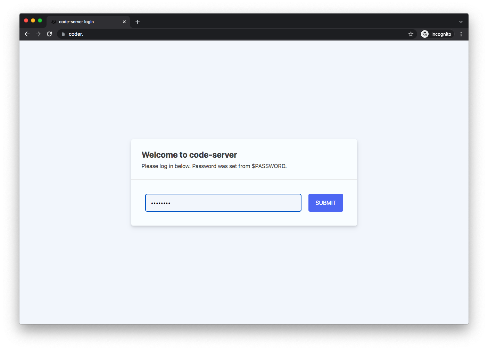
    
    The password is the one you set in `accounts.yml`
    
    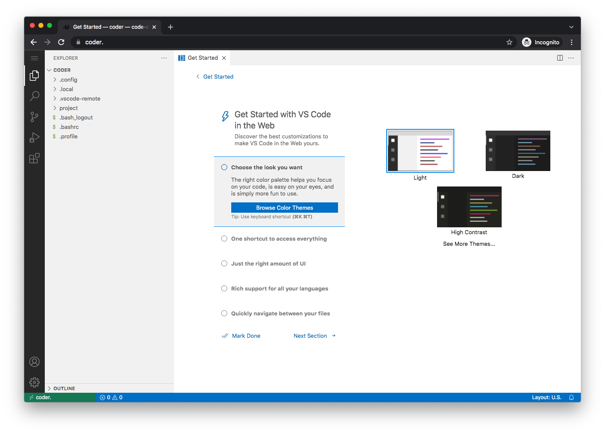
    
    VSCode will present with a checklist of "getting started" items.
    
    If you've never used VSCode before, take a few minutes to go through the fundamentals tutorial.
    
    You can change the default theme if you wish. I'm going to choose the dark theme.
    
    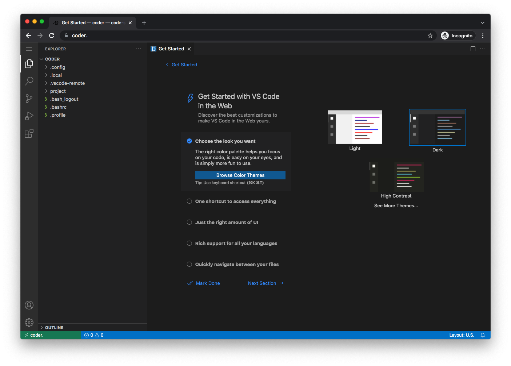
    
    ## point it at the host `/opt` dir
    
    Probably, you want to edit config files for the apps, which are in `/opt`.
    
    The host `/opt` dir is mounted into the container as `/host_opt/`.
    
    Choose `File -> Open Folder...` from the hamburger menu on the upper left:
    
    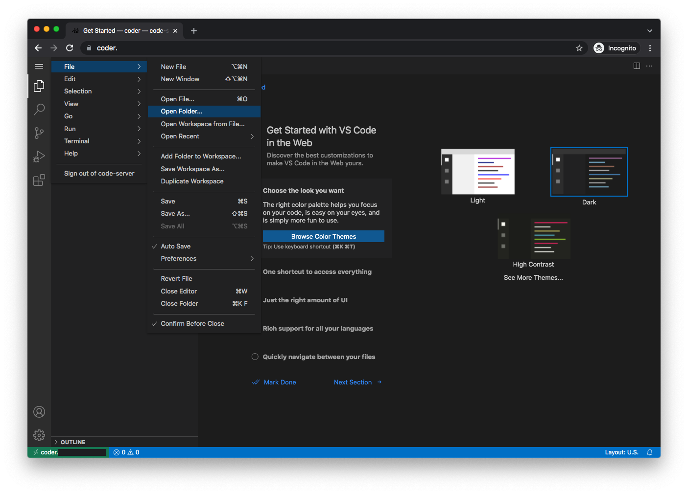
    
    Navigate to `/host_opt/`, click the arrow:
    
    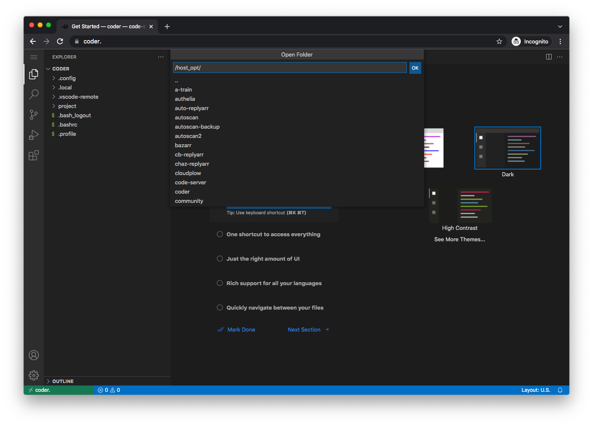
    
    and you should be presented with your `/opt` directory. Most of the things you will want to edit are here.
    
    
    
    This should stick the next time you load the app.
    
    ### install some extensions
    
    I suggest you install a few extensions:
    
    Click on the Extensions icon on the left, then type the name of the extension into the search box, and click the "install" button.
    
    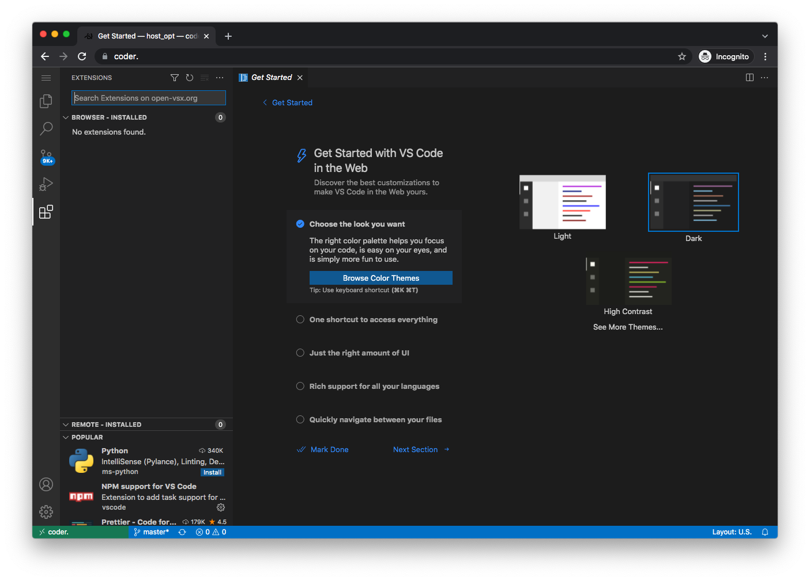
    
    Python:
    
    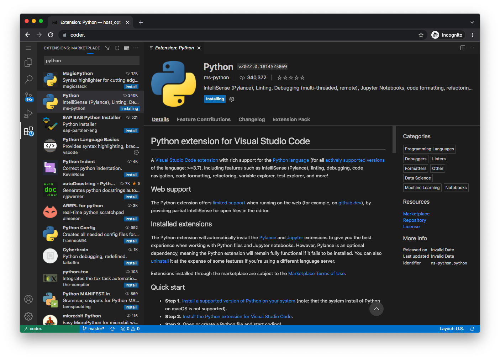
    
    Rainbow-indent:
    
    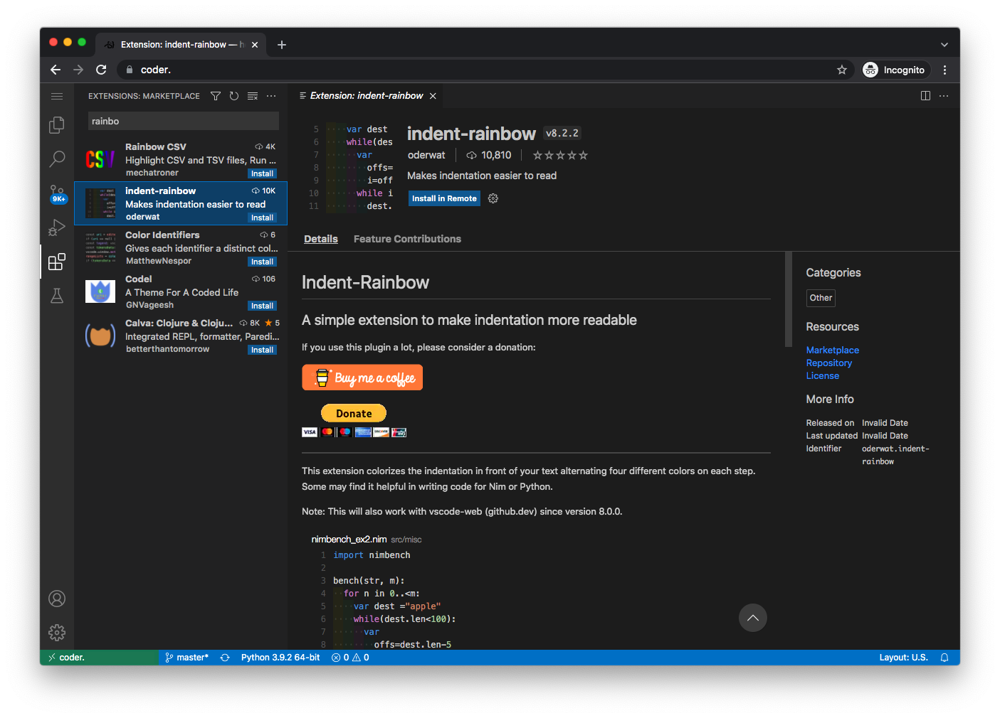
    
    Redhat YAML:
    
    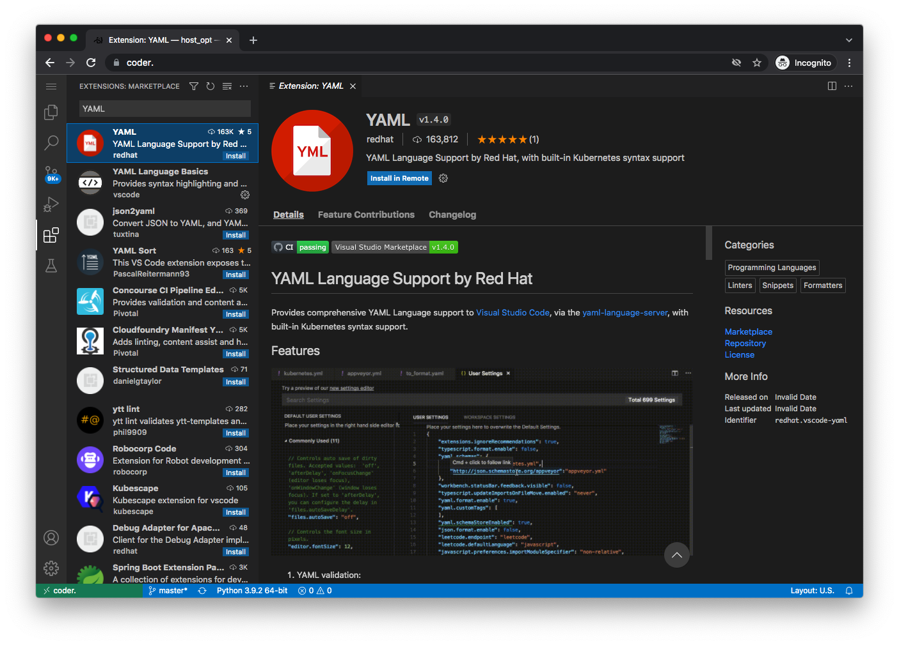
    
    Better TOML:
    
    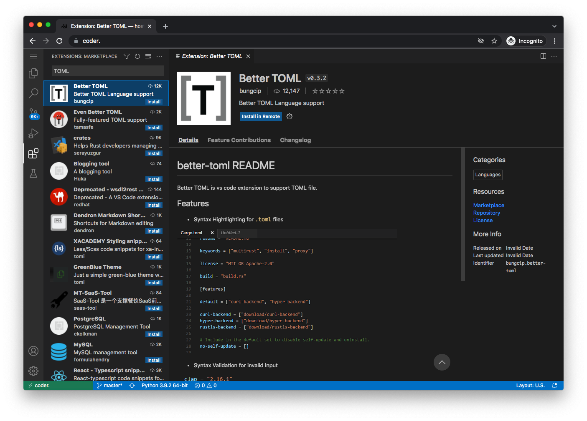
    
    Those are just suggestions; install others if you prefer.
    
    Now, with these extensions installed, you should have syntax highlighting and indentation coloring for:
    
    TOML
    
    
    
    YAML
    
    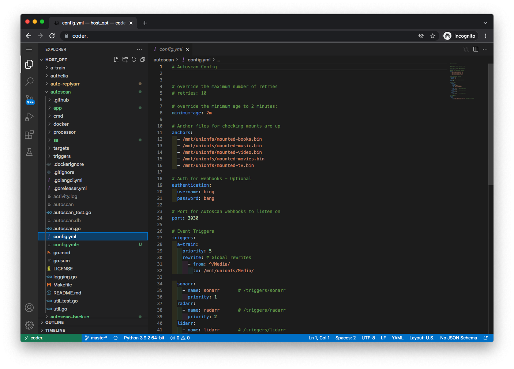
    
    JSON
    
    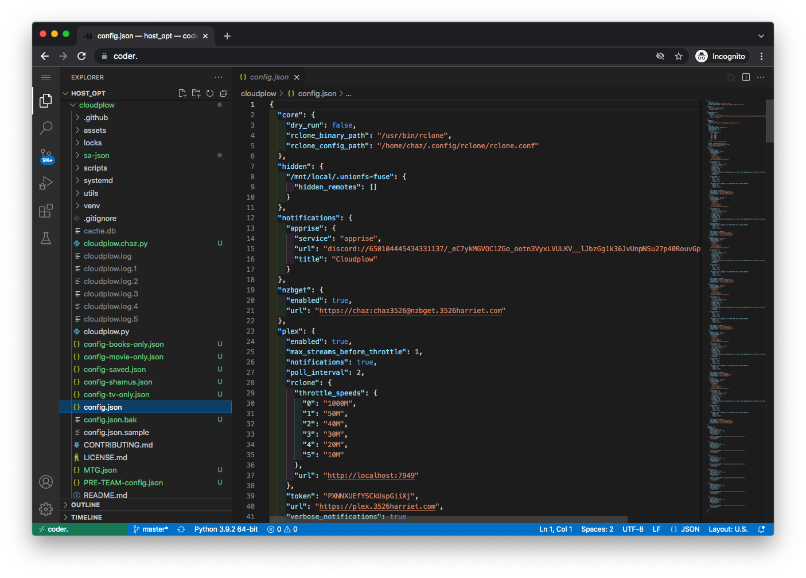

<!-- BEGIN SALTBOX MANAGED VARIABLES SECTION -->
<!-- This section is managed by sb-docs - DO NOT EDIT MANUALLY -->
## Role Defaults

Use the [Inventory](/saltbox/inventory/index.md#overriding-variables){ data-preview } to customize variables. <span title="View override specifics for this role" markdown>(1)</span>
{ .annotate .sb-annotated }

1.  !!! example "Example override"

        ```yaml
        code_server_name: "custom_value"
        ```

    !!! warning "Avoid overriding variables ending in `_default`"

        When overriding variables that end in `_default` (like `code_server_docker_envs_default`), you replace the entire default configuration. Future updates that add new default values will not be applied to your setup, potentially breaking functionality.

        Instead, use the corresponding `_custom` variable (like `code_server_docker_envs_custom`) to add your changes. Custom values are merged with defaults, ensuring you receive updates.

=== "Basics"

    ??? variable string "`code_server_name`"

        ```yaml
        # Type: string
        code_server_name: code-server
        ```

=== "Web"

    ??? variable string "`code_server_role_web_subdomain`"

        ```yaml
        # Type: string
        code_server_role_web_subdomain: "{{ code_server_name }}"
        ```

    ??? variable string "`code_server_role_web_domain`"

        ```yaml
        # Type: string
        code_server_role_web_domain: "{{ user.domain }}"
        ```

    ??? variable string "`code_server_role_web_port`"

        ```yaml
        # Type: string
        code_server_role_web_port: "8080"
        ```

    ??? variable string "`code_server_role_web_url`"

        ```yaml
        # Type: string
        code_server_role_web_url: "{{ 'https://' + (lookup('role_var', '_web_subdomain', role='code_server') + '.' + lookup('role_var', '_web_domain', role='code_server')
                                   if (lookup('role_var', '_web_subdomain', role='code_server') | length > 0)
                                   else lookup('role_var', '_web_domain', role='code_server')) }}"
        ```

=== "DNS"

    ??? variable string "`code_server_role_dns_record`"

        ```yaml
        # Type: string
        code_server_role_dns_record: "{{ lookup('role_var', '_web_subdomain', role='code_server') }}"
        ```

    ??? variable string "`code_server_role_dns_zone`"

        ```yaml
        # Type: string
        code_server_role_dns_zone: "{{ lookup('role_var', '_web_domain', role='code_server') }}"
        ```

    ??? variable bool "`code_server_role_dns_proxy`"

        ```yaml
        # Type: bool (true/false)
        code_server_role_dns_proxy: "{{ dns_proxied }}"
        ```

=== "Traefik"

    ??? variable string "`code_server_role_traefik_sso_middleware`"

        ```yaml
        # Type: string
        code_server_role_traefik_sso_middleware: "{{ traefik_default_sso_middleware }}"
        ```

    ??? variable string "`code_server_role_traefik_middleware_default`"

        ```yaml
        # Type: string
        code_server_role_traefik_middleware_default: "{{ traefik_default_middleware }}"
        ```

    ??? variable string "`code_server_role_traefik_middleware_custom`"

        ```yaml
        # Type: string
        code_server_role_traefik_middleware_custom: ""
        ```

    ??? variable string "`code_server_role_traefik_certresolver`"

        ```yaml
        # Type: string
        code_server_role_traefik_certresolver: "{{ traefik_default_certresolver }}"
        ```

    ??? variable bool "`code_server_role_traefik_enabled`"

        ```yaml
        # Type: bool (true/false)
        code_server_role_traefik_enabled: true
        ```

=== "Docker"

    <h5>Container</h5>

    ??? variable string "`code_server_role_docker_container`"

        ```yaml
        # Type: string
        code_server_role_docker_container: "{{ code_server_name }}"
        ```

    <h5>Image</h5>

    ??? variable bool "`code_server_role_docker_image_pull`"

        ```yaml
        # Type: bool (true/false)
        code_server_role_docker_image_pull: true
        ```

    ??? variable string "`code_server_role_docker_image_repo`"

        ```yaml
        # Type: string
        code_server_role_docker_image_repo: "codercom/code-server"
        ```

    ??? variable string "`code_server_role_docker_image_tag`"

        ```yaml
        # Type: string
        code_server_role_docker_image_tag: "latest"
        ```

    ??? variable string "`code_server_role_docker_image`"

        ```yaml
        # Type: string
        code_server_role_docker_image: "{{ lookup('role_var', '_docker_image_repo', role='code_server') }}:{{ lookup('role_var', '_docker_image_tag', role='code_server') }}"
        ```

    <h5>Envs</h5>

    ??? variable dict "`code_server_role_docker_envs_default`"

        ```yaml
        # Type: dict
        code_server_role_docker_envs_default:
          UMASK: "002"
          TZ: "{{ tz }}"
          PASSWORD: "{{ user.pass }}"
          DOCKER_USER: "{{ user.name }}"
        ```

    ??? variable dict "`code_server_role_docker_envs_custom`"

        ```yaml
        # Type: dict
        code_server_role_docker_envs_custom: {}
        ```

    <h5>Volumes</h5>

    ??? variable list "`code_server_role_docker_volumes_default`"

        ```yaml
        # Type: list
        code_server_role_docker_volumes_default:
          - "{{ lookup('role_var', '_paths_location', role='code_server') }}/project:/home/coder/project"
          - "{{ lookup('role_var', '_paths_location', role='code_server') }}/.config:/home/coder/.config"
          - "{{ lookup('role_var', '_paths_location', role='code_server') }}/.local:/home/coder/.local"
          - "{{ server_appdata_path }}:/host_opt"
        ```

    ??? variable list "`code_server_role_docker_volumes_custom`"

        ```yaml
        # Type: list
        code_server_role_docker_volumes_custom: []
        ```

    <h5>Hostname</h5>

    ??? variable string "`code_server_role_docker_hostname`"

        ```yaml
        # Type: string
        code_server_role_docker_hostname: "{{ code_server_name }}"
        ```

    <h5>Networks</h5>

    ??? variable string "`code_server_role_docker_networks_alias`"

        ```yaml
        # Type: string
        code_server_role_docker_networks_alias: "{{ code_server_name }}"
        ```

    ??? variable list "`code_server_role_docker_networks_default`"

        ```yaml
        # Type: list
        code_server_role_docker_networks_default: []
        ```

    ??? variable list "`code_server_role_docker_networks_custom`"

        ```yaml
        # Type: list
        code_server_role_docker_networks_custom: []
        ```

    <h5>Restart Policy</h5>

    ??? variable string "`code_server_role_docker_restart_policy`"

        ```yaml
        # Type: string
        code_server_role_docker_restart_policy: unless-stopped
        ```

    <h5>State</h5>

    ??? variable string "`code_server_role_docker_state`"

        ```yaml
        # Type: string
        code_server_role_docker_state: started
        ```

    <h5>User</h5>

    ??? variable string "`code_server_role_docker_user`"

        ```yaml
        # Type: string
        code_server_role_docker_user: "{{ uid }}:{{ gid }}"
        ```

=== "Docker+"

    The following advanced options are available via create_docker_container but are not defined in the role. See: [docker_container module](https://docs.ansible.com/ansible/latest/collections/community/docker/docker_container_module.html)

    <h5>Resource Limits</h5>

    ??? variable int "`code_server_role_docker_blkio_weight`"

        ```yaml
        # Type: int
        code_server_role_docker_blkio_weight:
        ```

    ??? variable int "`code_server_role_docker_cpu_period`"

        ```yaml
        # Type: int
        code_server_role_docker_cpu_period:
        ```

    ??? variable int "`code_server_role_docker_cpu_quota`"

        ```yaml
        # Type: int
        code_server_role_docker_cpu_quota:
        ```

    ??? variable int "`code_server_role_docker_cpu_shares`"

        ```yaml
        # Type: int
        code_server_role_docker_cpu_shares:
        ```

    ??? variable string "`code_server_role_docker_cpus`"

        ```yaml
        # Type: string
        code_server_role_docker_cpus:
        ```

    ??? variable string "`code_server_role_docker_cpuset_cpus`"

        ```yaml
        # Type: string
        code_server_role_docker_cpuset_cpus:
        ```

    ??? variable string "`code_server_role_docker_cpuset_mems`"

        ```yaml
        # Type: string
        code_server_role_docker_cpuset_mems:
        ```

    ??? variable string "`code_server_role_docker_kernel_memory`"

        ```yaml
        # Type: string
        code_server_role_docker_kernel_memory:
        ```

    ??? variable string "`code_server_role_docker_memory`"

        ```yaml
        # Type: string
        code_server_role_docker_memory:
        ```

    ??? variable string "`code_server_role_docker_memory_reservation`"

        ```yaml
        # Type: string
        code_server_role_docker_memory_reservation:
        ```

    ??? variable string "`code_server_role_docker_memory_swap`"

        ```yaml
        # Type: string
        code_server_role_docker_memory_swap:
        ```

    ??? variable int "`code_server_role_docker_memory_swappiness`"

        ```yaml
        # Type: int
        code_server_role_docker_memory_swappiness:
        ```

    ??? variable string "`code_server_role_docker_shm_size`"

        ```yaml
        # Type: string
        code_server_role_docker_shm_size:
        ```

    <h5>Security & Devices</h5>

    ??? variable list "`code_server_role_docker_cap_drop`"

        ```yaml
        # Type: list
        code_server_role_docker_cap_drop:
        ```

    ??? variable string "`code_server_role_docker_cgroupns_mode`"

        ```yaml
        # Type: string
        code_server_role_docker_cgroupns_mode:
        ```

    ??? variable list "`code_server_role_docker_device_cgroup_rules`"

        ```yaml
        # Type: list
        code_server_role_docker_device_cgroup_rules:
        ```

    ??? variable list "`code_server_role_docker_device_read_bps`"

        ```yaml
        # Type: list
        code_server_role_docker_device_read_bps:
        ```

    ??? variable list "`code_server_role_docker_device_read_iops`"

        ```yaml
        # Type: list
        code_server_role_docker_device_read_iops:
        ```

    ??? variable list "`code_server_role_docker_device_requests`"

        ```yaml
        # Type: list
        code_server_role_docker_device_requests:
        ```

    ??? variable list "`code_server_role_docker_device_write_bps`"

        ```yaml
        # Type: list
        code_server_role_docker_device_write_bps:
        ```

    ??? variable list "`code_server_role_docker_device_write_iops`"

        ```yaml
        # Type: list
        code_server_role_docker_device_write_iops:
        ```

    ??? variable list "`code_server_role_docker_devices`"

        ```yaml
        # Type: list
        code_server_role_docker_devices:
        ```

    ??? variable string "`code_server_role_docker_devices_default`"

        ```yaml
        # Type: string
        code_server_role_docker_devices_default:
        ```

    ??? variable list "`code_server_role_docker_groups`"

        ```yaml
        # Type: list
        code_server_role_docker_groups:
        ```

    ??? variable bool "`code_server_role_docker_privileged`"

        ```yaml
        # Type: bool (true/false)
        code_server_role_docker_privileged:
        ```

    ??? variable list "`code_server_role_docker_security_opts`"

        ```yaml
        # Type: list
        code_server_role_docker_security_opts:
        ```

    ??? variable string "`code_server_role_docker_userns_mode`"

        ```yaml
        # Type: string
        code_server_role_docker_userns_mode:
        ```

    <h5>Networking</h5>

    ??? variable list "`code_server_role_docker_dns_opts`"

        ```yaml
        # Type: list
        code_server_role_docker_dns_opts:
        ```

    ??? variable list "`code_server_role_docker_dns_search_domains`"

        ```yaml
        # Type: list
        code_server_role_docker_dns_search_domains:
        ```

    ??? variable list "`code_server_role_docker_dns_servers`"

        ```yaml
        # Type: list
        code_server_role_docker_dns_servers:
        ```

    ??? variable string "`code_server_role_docker_domainname`"

        ```yaml
        # Type: string
        code_server_role_docker_domainname:
        ```

    ??? variable list "`code_server_role_docker_exposed_ports`"

        ```yaml
        # Type: list
        code_server_role_docker_exposed_ports:
        ```

    ??? variable dict "`code_server_role_docker_hosts`"

        ```yaml
        # Type: dict
        code_server_role_docker_hosts:
        ```

    ??? variable bool "`code_server_role_docker_hosts_use_common`"

        ```yaml
        # Type: bool (true/false)
        code_server_role_docker_hosts_use_common:
        ```

    ??? variable string "`code_server_role_docker_ipc_mode`"

        ```yaml
        # Type: string
        code_server_role_docker_ipc_mode:
        ```

    ??? variable list "`code_server_role_docker_links`"

        ```yaml
        # Type: list
        code_server_role_docker_links:
        ```

    ??? variable string "`code_server_role_docker_network_mode`"

        ```yaml
        # Type: string
        code_server_role_docker_network_mode:
        ```

    ??? variable string "`code_server_role_docker_pid_mode`"

        ```yaml
        # Type: string
        code_server_role_docker_pid_mode:
        ```

    ??? variable list "`code_server_role_docker_ports`"

        ```yaml
        # Type: list
        code_server_role_docker_ports:
        ```

    ??? variable string "`code_server_role_docker_uts`"

        ```yaml
        # Type: string
        code_server_role_docker_uts:
        ```

    <h5>Storage</h5>

    ??? variable bool "`code_server_role_docker_keep_volumes`"

        ```yaml
        # Type: bool (true/false)
        code_server_role_docker_keep_volumes:
        ```

    ??? variable list "`code_server_role_docker_mounts`"

        ```yaml
        # Type: list
        code_server_role_docker_mounts:
        ```

    ??? variable dict "`code_server_role_docker_storage_opts`"

        ```yaml
        # Type: dict
        code_server_role_docker_storage_opts:
        ```

    ??? variable list "`code_server_role_docker_tmpfs`"

        ```yaml
        # Type: list
        code_server_role_docker_tmpfs:
        ```

    ??? variable string "`code_server_role_docker_volume_driver`"

        ```yaml
        # Type: string
        code_server_role_docker_volume_driver:
        ```

    ??? variable list "`code_server_role_docker_volumes_from`"

        ```yaml
        # Type: list
        code_server_role_docker_volumes_from:
        ```

    ??? variable bool "`code_server_role_docker_volumes_global`"

        ```yaml
        # Type: bool (true/false)
        code_server_role_docker_volumes_global:
        ```

    ??? variable string "`code_server_role_docker_working_dir`"

        ```yaml
        # Type: string
        code_server_role_docker_working_dir:
        ```

    <h5>Monitoring & Lifecycle</h5>

    ??? variable bool "`code_server_role_docker_auto_remove`"

        ```yaml
        # Type: bool (true/false)
        code_server_role_docker_auto_remove:
        ```

    ??? variable bool "`code_server_role_docker_cleanup`"

        ```yaml
        # Type: bool (true/false)
        code_server_role_docker_cleanup:
        ```

    ??? variable string "`code_server_role_docker_force_kill`"

        ```yaml
        # Type: string
        code_server_role_docker_force_kill:
        ```

    ??? variable dict "`code_server_role_docker_healthcheck`"

        ```yaml
        # Type: dict
        code_server_role_docker_healthcheck:
        ```

    ??? variable int "`code_server_role_docker_healthy_wait_timeout`"

        ```yaml
        # Type: int
        code_server_role_docker_healthy_wait_timeout:
        ```

    ??? variable bool "`code_server_role_docker_init`"

        ```yaml
        # Type: bool (true/false)
        code_server_role_docker_init:
        ```

    ??? variable string "`code_server_role_docker_kill_signal`"

        ```yaml
        # Type: string
        code_server_role_docker_kill_signal:
        ```

    ??? variable string "`code_server_role_docker_log_driver`"

        ```yaml
        # Type: string
        code_server_role_docker_log_driver:
        ```

    ??? variable dict "`code_server_role_docker_log_options`"

        ```yaml
        # Type: dict
        code_server_role_docker_log_options:
        ```

    ??? variable bool "`code_server_role_docker_oom_killer`"

        ```yaml
        # Type: bool (true/false)
        code_server_role_docker_oom_killer:
        ```

    ??? variable int "`code_server_role_docker_oom_score_adj`"

        ```yaml
        # Type: int
        code_server_role_docker_oom_score_adj:
        ```

    ??? variable bool "`code_server_role_docker_output_logs`"

        ```yaml
        # Type: bool (true/false)
        code_server_role_docker_output_logs:
        ```

    ??? variable bool "`code_server_role_docker_paused`"

        ```yaml
        # Type: bool (true/false)
        code_server_role_docker_paused:
        ```

    ??? variable bool "`code_server_role_docker_recreate`"

        ```yaml
        # Type: bool (true/false)
        code_server_role_docker_recreate:
        ```

    ??? variable int "`code_server_role_docker_restart_retries`"

        ```yaml
        # Type: int
        code_server_role_docker_restart_retries:
        ```

    ??? variable int "`code_server_role_docker_stop_timeout`"

        ```yaml
        # Type: int
        code_server_role_docker_stop_timeout:
        ```

    <h5>Other Options</h5>

    ??? variable list "`code_server_role_docker_capabilities`"

        ```yaml
        # Type: list
        code_server_role_docker_capabilities:
        ```

    ??? variable string "`code_server_role_docker_cgroup_parent`"

        ```yaml
        # Type: string
        code_server_role_docker_cgroup_parent:
        ```

    ??? variable list "`code_server_role_docker_commands`"

        ```yaml
        # Type: list
        code_server_role_docker_commands:
        ```

    ??? variable int "`code_server_role_docker_create_timeout`"

        ```yaml
        # Type: int
        code_server_role_docker_create_timeout:
        ```

    ??? variable string "`code_server_role_docker_entrypoint`"

        ```yaml
        # Type: string
        code_server_role_docker_entrypoint:
        ```

    ??? variable string "`code_server_role_docker_env_file`"

        ```yaml
        # Type: string
        code_server_role_docker_env_file:
        ```

    ??? variable dict "`code_server_role_docker_labels`"

        ```yaml
        # Type: dict
        code_server_role_docker_labels:
        ```

    ??? variable bool "`code_server_role_docker_labels_use_common`"

        ```yaml
        # Type: bool (true/false)
        code_server_role_docker_labels_use_common:
        ```

    ??? variable bool "`code_server_role_docker_read_only`"

        ```yaml
        # Type: bool (true/false)
        code_server_role_docker_read_only:
        ```

    ??? variable string "`code_server_role_docker_runtime`"

        ```yaml
        # Type: string
        code_server_role_docker_runtime:
        ```

    ??? variable list "`code_server_role_docker_sysctls`"

        ```yaml
        # Type: list
        code_server_role_docker_sysctls:
        ```

    ??? variable list "`code_server_role_docker_ulimits`"

        ```yaml
        # Type: list
        code_server_role_docker_ulimits:
        ```

=== "Global Override Options"

    ??? variable bool "`code_server_role_autoheal_enabled`"

        ```yaml
        # Enable or disable Autoheal monitoring for the container created when deploying
        # Type: bool (true/false)
        code_server_role_autoheal_enabled: true
        ```

    ??? variable string "`code_server_role_depends_on`"

        ```yaml
        # List of container dependencies that must be running before the container start
        # Type: string
        code_server_role_depends_on: ""
        ```

    ??? variable string "`code_server_role_depends_on_delay`"

        ```yaml
        # Delay in seconds before starting the container after dependencies are ready
        # Type: string (quoted number)
        code_server_role_depends_on_delay: "0"
        ```

    ??? variable string "`code_server_role_depends_on_healthchecks`"

        ```yaml
        # Enable healthcheck waiting for container dependencies
        # Type: string ("true"/"false")
        code_server_role_depends_on_healthchecks:
        ```

    ??? variable bool "`code_server_role_diun_enabled`"

        ```yaml
        # Enable or disable Diun update notifications for the container created when deploying
        # Type: bool (true/false)
        code_server_role_diun_enabled: true
        ```

    ??? variable bool "`code_server_role_dns_enabled`"

        ```yaml
        # Enable or disable automatic DNS record creation for the container
        # Type: bool (true/false)
        code_server_role_dns_enabled: true
        ```

    ??? variable bool "`code_server_role_docker_controller`"

        ```yaml
        # Enable or disable Saltbox Docker Controller management for the container
        # Type: bool (true/false)
        code_server_role_docker_controller: true
        ```

    ??? variable string "`code_server_role_docker_image_repo`"

        ```yaml
        # Type: string
        code_server_role_docker_image_repo:
        ```

    ??? variable string "`code_server_role_docker_image_tag`"

        ```yaml
        # Type: string
        code_server_role_docker_image_tag:
        ```

    ??? variable bool "`code_server_role_docker_volumes_download`"

        ```yaml
        # Type: bool (true/false)
        code_server_role_docker_volumes_download:
        ```

    ??? variable string "`code_server_role_paths_location`"

        ```yaml
        # Type: string
        code_server_role_paths_location:
        ```

    ??? variable string "`code_server_role_themepark_addons`"

        ```yaml
        # Type: string
        code_server_role_themepark_addons:
        ```

    ??? variable string "`code_server_role_themepark_app`"

        ```yaml
        # Type: string
        code_server_role_themepark_app:
        ```

    ??? variable string "`code_server_role_themepark_theme`"

        ```yaml
        # Type: string
        code_server_role_themepark_theme:
        ```

    ??? variable dict "`code_server_role_traefik_api_endpoint`"

        ```yaml
        # Type: dict/omit
        code_server_role_traefik_api_endpoint:
        ```

    ??? variable string "`code_server_role_traefik_api_middleware`"

        ```yaml
        # Type: string
        code_server_role_traefik_api_middleware:
        ```

    ??? variable string "`code_server_role_traefik_api_middleware_http`"

        ```yaml
        # Type: string
        code_server_role_traefik_api_middleware_http:
        ```

    ??? variable bool "`code_server_role_traefik_autodetect_enabled`"

        ```yaml
        # Enable Traefik autodetect middleware for the container
        # Type: bool (true/false)
        code_server_role_traefik_autodetect_enabled: false
        ```

    ??? variable string "`code_server_role_traefik_certresolver`"

        ```yaml
        # Type: string
        code_server_role_traefik_certresolver:
        ```

    ??? variable bool "`code_server_role_traefik_crowdsec_enabled`"

        ```yaml
        # Enable CrowdSec middleware for the container
        # Type: bool (true/false)
        code_server_role_traefik_crowdsec_enabled: false
        ```

    ??? variable bool "`code_server_role_traefik_error_pages_enabled`"

        ```yaml
        # Enable custom error pages middleware for the container
        # Type: bool (true/false)
        code_server_role_traefik_error_pages_enabled: false
        ```

    ??? variable bool "`code_server_role_traefik_gzip_enabled`"

        ```yaml
        # Enable gzip compression middleware for the container
        # Type: bool (true/false)
        code_server_role_traefik_gzip_enabled: false
        ```

    ??? variable string "`code_server_role_traefik_middleware_http`"

        ```yaml
        # Type: string
        code_server_role_traefik_middleware_http:
        ```

    ??? variable bool "`code_server_role_traefik_middleware_http_api_insecure`"

        ```yaml
        # Type: bool (true/false)
        code_server_role_traefik_middleware_http_api_insecure:
        ```

    ??? variable bool "`code_server_role_traefik_middleware_http_insecure`"

        ```yaml
        # Type: bool (true/false)
        code_server_role_traefik_middleware_http_insecure:
        ```

    ??? variable string "`code_server_role_traefik_priority`"

        ```yaml
        # Type: string
        code_server_role_traefik_priority:
        ```

    ??? variable bool "`code_server_role_traefik_robot_enabled`"

        ```yaml
        # Enable robots.txt middleware for the container
        # Type: bool (true/false)
        code_server_role_traefik_robot_enabled: true
        ```

    ??? variable bool "`code_server_role_traefik_tailscale_enabled`"

        ```yaml
        # Enable Tailscale-specific Traefik configuration for the container
        # Type: bool (true/false)
        code_server_role_traefik_tailscale_enabled: false
        ```

    ??? variable bool "`code_server_role_traefik_wildcard_enabled`"

        ```yaml
        # Enable wildcard certificate for the container
        # Type: bool (true/false)
        code_server_role_traefik_wildcard_enabled: true
        ```

    ??? variable string "`code_server_role_web_domain`"

        ```yaml
        # Type: string
        code_server_role_web_domain:
        ```

    ??? variable list "`code_server_role_web_fqdn_override`"

        ```yaml
        # Override the Traefik fully qualified domain name (FQDN) for the container
        # Type: list
        code_server_role_web_fqdn_override:
        ```

        !!! example "Example Override"

            ```yaml
            code_server_role_web_fqdn_override:
              - "{{ traefik_host }}"
              - "code_server2.{{ user.domain }}"
              - "code_server.otherdomain.tld"
            ```

            Note: Include `{{ traefik_host }}` to preserve the default FQDN alongside your custom entries


    ??? variable string "`code_server_role_web_host_override`"

        ```yaml
        # Override the Traefik web host configuration for the container
        # Type: string
        code_server_role_web_host_override:
        ```

        !!! example "Example Override"

            ```yaml
            code_server_role_web_host_override: "Host(`{{ traefik_host }}`) || Host(`{{ 'code_server2.' + user.domain }}`)"
            ```

            Note: Use `{{ traefik_host }}` to include the default host configuration in your custom rule


    ??? variable string "`code_server_role_web_http_port`"

        ```yaml
        # Type: string (quoted number)
        code_server_role_web_http_port:
        ```

    ??? variable string "`code_server_role_web_http_scheme`"

        ```yaml
        # Type: string ("http"/"https")
        code_server_role_web_http_scheme:
        ```

    ??? variable dict "`code_server_role_web_http_serverstransport`"

        ```yaml
        # Type: dict/omit
        code_server_role_web_http_serverstransport:
        ```

    ??? variable string "`code_server_role_web_scheme`"

        ```yaml
        # URL scheme to use for web access to the container
        # Type: string ("http"/"https")
        code_server_role_web_scheme:
        ```

    ??? variable dict "`code_server_role_web_serverstransport`"

        ```yaml
        # Type: dict/omit
        code_server_role_web_serverstransport:
        ```

    ??? variable string "`code_server_role_web_subdomain`"

        ```yaml
        # Type: string
        code_server_role_web_subdomain:
        ```
<!-- END SALTBOX MANAGED VARIABLES SECTION -->