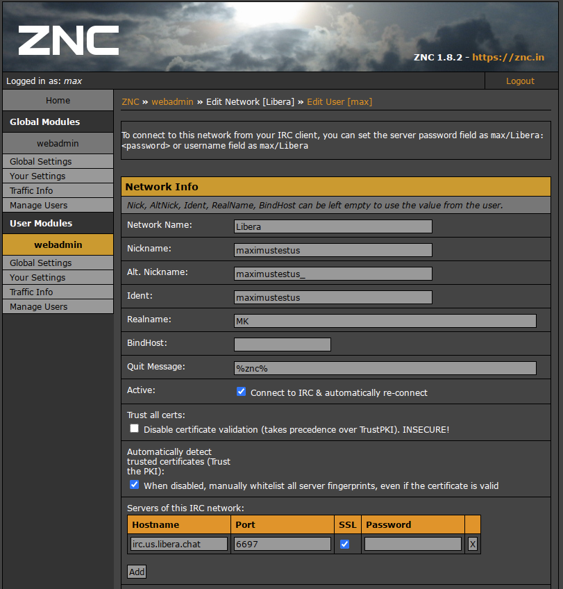
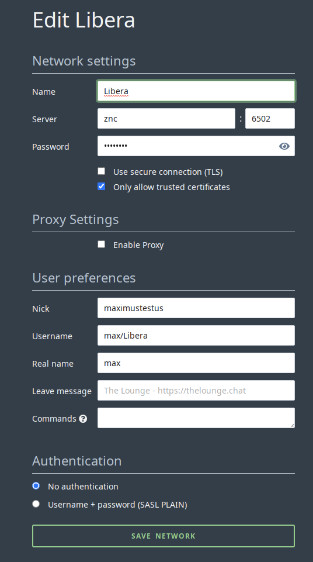

---
hide:
  - tags
tags:
  - thelounge
  - irc
  - chat
---

# The Lounge

## Overview

[The Lounge](https://thelounge.chat/) is a self hosted web IRC client. In private mode, The Lounge acts like a bouncer and a client combined, in order to offer an experience similar to other modern chat applications outside the IRC world. Users can then access and resume their session without being disconnected from their channels.

| Details     |             |             |             |
|-------------|-------------|-------------|-------------|
| [:material-home: The Lounge](https://thelounge.chat/){: .header-icons } | [:octicons-link-16: Docs](https://thelounge.chat/docs){: .header-icons } | [:octicons-mark-github-16: Github](https://github.com/thelounge/thelounge ){: .header-icons } | [:material-docker: Docker:](https://docs.linuxserver.io/images/docker-thelounge){: .header-icons } |

### 1. Installation

``` shell

sb install sandbox-thelounge

```

### 2. URL

- To access The Lounge, visit <https://thelounge.iYOUR_DOMAIN_NAMEi>

### 3. Setup

- When the application first runs, it will populate its /config
- Stop the container
- Now from the host, edit /config/config.js, wherever you've mapped it
- In most cases you want the value public: false to allow named users only
- Setting the two prefetch values to true improves usability, but uses more storage
- Once you have the configuration you want, save it and start the container again
- For each user, run the command

      ``` shell
        docker exec -it thelounge s6-setuidgid abc thelounge add <user>
      ```
  - You will be prompted to enter a password that will not be echoed.
  - Saving logs to disk is the default, this consumes more space but allows scrollback.
- To log in to the application, browse to <https://thelounge.iYOUR_DOMAIN_NAMEi>
- You should now be prompted for a username and password on the webinterface.
- Once logged in, you can add an IRC network. Some defaults are preset for Freenode.

### ZNC

To connect to **[znc](../../sandbox/apps/znc.md)**, you need to have a **[znc](../../sandbox/apps/znc.md)** server running. A guide to using The Lounge with ZNC can be found [here](https://thelounge.chat/docs/guides/znc)

- In this image we have a ZNC network defined.



- To add this network to The Lounge, give it a Name, it does not have to match the ZNC network settings.
- For the Server, use `znc` and set the port to `6502`
- For the Password, enter your `ZNC user password`
- Uncheck `Use secure connection (TLS)
- In the User Preferences section enter your Nick - I would recommend the same Nick as that set in ZNC.
- For the user name enter the `<ZNC username>/<ZNC_Network_Name>`.
- For Real Name, enter your desired `<real_name>` it does not need to match ZNC
- Save the network, and it should connect to ZNC.



<!-- BEGIN SALTBOX MANAGED VARIABLES SECTION -->
<!-- This section is managed by saltbox/test.py - DO NOT EDIT MANUALLY -->
## Role Defaults

!!! info
    Variables can be overridden in `/srv/git/saltbox/inventories/host_vars/localhost.yml`.

    ```yaml title="Example Override"
    thelounge_name: "custom_value"
    ```

??? warning "Avoid overriding variables ending in `_default`"

    When overriding variables that end in `_default` (like `thelounge_docker_envs_default`), you replace the entire default configuration. Future updates that add new default values will not be applied to your setup, potentially breaking functionality.

    Instead, use the corresponding `_custom` variable (like `thelounge_docker_envs_custom`) to add your changes. Custom values are merged with defaults, ensuring you receive updates.

=== "Basics"

    ??? variable string "`thelounge_name`"

        ```yaml
        # Type: string
        thelounge_name: thelounge
        ```

=== "Paths"

    ??? variable string "`thelounge_role_paths_folder`"

        ```yaml
        # Type: string
        thelounge_role_paths_folder: "{{ thelounge_name }}"
        ```

    ??? variable string "`thelounge_role_paths_location`"

        ```yaml
        # Type: string
        thelounge_role_paths_location: "{{ server_appdata_path }}/{{ thelounge_role_paths_folder }}"
        ```

=== "Web"

    ??? variable string "`thelounge_role_web_subdomain`"

        ```yaml
        # Type: string
        thelounge_role_web_subdomain: "{{ thelounge_name }}"
        ```

    ??? variable string "`thelounge_role_web_domain`"

        ```yaml
        # Type: string
        thelounge_role_web_domain: "{{ user.domain }}"
        ```

    ??? variable string "`thelounge_role_web_port`"

        ```yaml
        # Type: string
        thelounge_role_web_port: "9000"
        ```

    ??? variable string "`thelounge_role_web_url`"

        ```yaml
        # Type: string
        thelounge_role_web_url: "{{ 'https://' + (lookup('role_var', '_web_subdomain', role='thelounge') + '.' + lookup('role_var', '_web_domain', role='thelounge')
                                 if (lookup('role_var', '_web_subdomain', role='thelounge') | length > 0)
                                 else lookup('role_var', '_web_domain', role='thelounge')) }}"
        ```

=== "DNS"

    ??? variable string "`thelounge_role_dns_record`"

        ```yaml
        # Type: string
        thelounge_role_dns_record: "{{ lookup('role_var', '_web_subdomain', role='thelounge') }}"
        ```

    ??? variable string "`thelounge_role_dns_zone`"

        ```yaml
        # Type: string
        thelounge_role_dns_zone: "{{ lookup('role_var', '_web_domain', role='thelounge') }}"
        ```

    ??? variable bool "`thelounge_role_dns_proxy`"

        ```yaml
        # Type: bool (true/false)
        thelounge_role_dns_proxy: "{{ dns_proxied }}"
        ```

=== "Traefik"

    ??? variable string "`thelounge_role_traefik_sso_middleware`"

        ```yaml
        # Type: string
        thelounge_role_traefik_sso_middleware: "{{ traefik_default_sso_middleware }}"
        ```

    ??? variable string "`thelounge_role_traefik_middleware_default`"

        ```yaml
        # Type: string
        thelounge_role_traefik_middleware_default: "{{ traefik_default_middleware }}"
        ```

    ??? variable string "`thelounge_role_traefik_middleware_custom`"

        ```yaml
        # Type: string
        thelounge_role_traefik_middleware_custom: ""
        ```

    ??? variable string "`thelounge_role_traefik_certresolver`"

        ```yaml
        # Type: string
        thelounge_role_traefik_certresolver: "{{ traefik_default_certresolver }}"
        ```

    ??? variable bool "`thelounge_role_traefik_enabled`"

        ```yaml
        # Type: bool (true/false)
        thelounge_role_traefik_enabled: true
        ```

    ??? variable bool "`thelounge_role_traefik_api_enabled`"

        ```yaml
        # Type: bool (true/false)
        thelounge_role_traefik_api_enabled: true
        ```

    ??? variable string "`thelounge_role_traefik_api_endpoint`"

        ```yaml
        # Type: string
        thelounge_role_traefik_api_endpoint: "PathPrefix(`/uploads`)"
        ```

=== "Docker"

    <h5>Container</h5>

    ??? variable string "`thelounge_role_docker_container`"

        ```yaml
        # Type: string
        thelounge_role_docker_container: "{{ thelounge_name }}"
        ```

    <h5>Image</h5>

    ??? variable bool "`thelounge_role_docker_image_pull`"

        ```yaml
        # Type: bool (true/false)
        thelounge_role_docker_image_pull: true
        ```

    ??? variable string "`thelounge_role_docker_image_repo`"

        ```yaml
        # Type: string
        thelounge_role_docker_image_repo: "lscr.io/linuxserver/thelounge"
        ```

    ??? variable string "`thelounge_role_docker_image_tag`"

        ```yaml
        # Type: string
        thelounge_role_docker_image_tag: "latest"
        ```

    ??? variable string "`thelounge_role_docker_image`"

        ```yaml
        # Type: string
        thelounge_role_docker_image: "{{ lookup('role_var', '_docker_image_repo', role='thelounge') }}:{{ lookup('role_var', '_docker_image_tag', role='thelounge') }}"
        ```

    <h5>Envs</h5>

    ??? variable dict "`thelounge_role_docker_envs_default`"

        ```yaml
        # Type: dict
        thelounge_role_docker_envs_default: 
          PUID: "{{ uid }}"
          PGID: "{{ gid }}"
          TZ: "{{ tz }}"
        ```

    ??? variable dict "`thelounge_role_docker_envs_custom`"

        ```yaml
        # Type: dict
        thelounge_role_docker_envs_custom: {}
        ```

    <h5>Volumes</h5>

    ??? variable list "`thelounge_role_docker_volumes_default`"

        ```yaml
        # Type: list
        thelounge_role_docker_volumes_default: 
          - "{{ lookup('role_var', '_paths_location', role='thelounge') }}:/config"
        ```

    ??? variable list "`thelounge_role_docker_volumes_custom`"

        ```yaml
        # Type: list
        thelounge_role_docker_volumes_custom: []
        ```

    <h5>Hostname</h5>

    ??? variable string "`thelounge_role_docker_hostname`"

        ```yaml
        # Type: string
        thelounge_role_docker_hostname: "{{ thelounge_name }}"
        ```

    <h5>Networks</h5>

    ??? variable string "`thelounge_role_docker_networks_alias`"

        ```yaml
        # Type: string
        thelounge_role_docker_networks_alias: "{{ thelounge_name }}"
        ```

    ??? variable list "`thelounge_role_docker_networks_default`"

        ```yaml
        # Type: list
        thelounge_role_docker_networks_default: []
        ```

    ??? variable list "`thelounge_role_docker_networks_custom`"

        ```yaml
        # Type: list
        thelounge_role_docker_networks_custom: []
        ```

    <h5>Restart Policy</h5>

    ??? variable string "`thelounge_role_docker_restart_policy`"

        ```yaml
        # Type: string
        thelounge_role_docker_restart_policy: unless-stopped
        ```

    <h5>State</h5>

    ??? variable string "`thelounge_role_docker_state`"

        ```yaml
        # Type: string
        thelounge_role_docker_state: started
        ```

=== "Global Override Options"

    ??? variable bool "`thelounge_role_autoheal_enabled`"

        ```yaml
        # Enable or disable Autoheal monitoring for the container created when deploying
        # Type: bool (true/false)
        thelounge_role_autoheal_enabled: true
        ```

    ??? variable string "`thelounge_role_depends_on`"

        ```yaml
        # List of container dependencies that must be running before the container start
        # Type: string
        thelounge_role_depends_on: ""
        ```

    ??? variable string "`thelounge_role_depends_on_delay`"

        ```yaml
        # Delay in seconds before starting the container after dependencies are ready
        # Type: string (quoted number)
        thelounge_role_depends_on_delay: "0"
        ```

    ??? variable string "`thelounge_role_depends_on_healthchecks`"

        ```yaml
        # Enable healthcheck waiting for container dependencies
        # Type: string ("true"/"false")
        thelounge_role_depends_on_healthchecks:
        ```

    ??? variable bool "`thelounge_role_diun_enabled`"

        ```yaml
        # Enable or disable Diun update notifications for the container created when deploying
        # Type: bool (true/false)
        thelounge_role_diun_enabled: true
        ```

    ??? variable bool "`thelounge_role_dns_enabled`"

        ```yaml
        # Enable or disable automatic DNS record creation for the container
        # Type: bool (true/false)
        thelounge_role_dns_enabled: true
        ```

    ??? variable bool "`thelounge_role_docker_controller`"

        ```yaml
        # Enable or disable Saltbox Docker Controller management for the container
        # Type: bool (true/false)
        thelounge_role_docker_controller: true
        ```

    ??? variable bool "`thelounge_role_traefik_autodetect_enabled`"

        ```yaml
        # Enable Traefik autodetect middleware for the container
        # Type: bool (true/false)
        thelounge_role_traefik_autodetect_enabled: false
        ```

    ??? variable bool "`thelounge_role_traefik_crowdsec_enabled`"

        ```yaml
        # Enable CrowdSec middleware for the container
        # Type: bool (true/false)
        thelounge_role_traefik_crowdsec_enabled: false
        ```

    ??? variable bool "`thelounge_role_traefik_error_pages_enabled`"

        ```yaml
        # Enable custom error pages middleware for the container
        # Type: bool (true/false)
        thelounge_role_traefik_error_pages_enabled: false
        ```

    ??? variable bool "`thelounge_role_traefik_gzip_enabled`"

        ```yaml
        # Enable gzip compression middleware for the container
        # Type: bool (true/false)
        thelounge_role_traefik_gzip_enabled: false
        ```

    ??? variable bool "`thelounge_role_traefik_middleware_http_api_insecure`"

        ```yaml
        # Type: bool (true/false)
        thelounge_role_traefik_middleware_http_api_insecure:
        ```

    ??? variable bool "`thelounge_role_traefik_middleware_http_insecure`"

        ```yaml
        # Type: bool (true/false)
        thelounge_role_traefik_middleware_http_insecure:
        ```

    ??? variable bool "`thelounge_role_traefik_robot_enabled`"

        ```yaml
        # Enable robots.txt middleware for the container
        # Type: bool (true/false)
        thelounge_role_traefik_robot_enabled: true
        ```

    ??? variable bool "`thelounge_role_traefik_tailscale_enabled`"

        ```yaml
        # Enable Tailscale-specific Traefik configuration for the container
        # Type: bool (true/false)
        thelounge_role_traefik_tailscale_enabled: false
        ```

    ??? variable bool "`thelounge_role_traefik_wildcard_enabled`"

        ```yaml
        # Enable wildcard certificate for the container
        # Type: bool (true/false)
        thelounge_role_traefik_wildcard_enabled: true
        ```

    ??? variable list "`thelounge_role_web_fqdn_override`"

        ```yaml
        # Override the Traefik fully qualified domain name (FQDN) for the container
        # Type: list
        thelounge_role_web_fqdn_override:
        ```

        !!! example "Example Override"

            ```yaml
            thelounge_role_web_fqdn_override:
              - "{{ traefik_host }}"
              - "thelounge2.{{ user.domain }}"
              - "thelounge.otherdomain.tld"
            ```

            Note: Include `{{ traefik_host }}` to preserve the default FQDN alongside your custom entries

    ??? variable string "`thelounge_role_web_host_override`"

        ```yaml
        # Override the Traefik web host configuration for the container
        # Type: string
        thelounge_role_web_host_override:
        ```

        !!! example "Example Override"

            ```yaml
            thelounge_role_web_host_override: "Host(`{{ traefik_host }}`) || Host(`{{ 'thelounge2.' + user.domain }}`)"
            ```

            Note: Use `{{ traefik_host }}` to include the default host configuration in your custom rule

    ??? variable string "`thelounge_role_web_scheme`"

        ```yaml
        # URL scheme to use for web access to the container
        # Type: string ("http"/"https")
        thelounge_role_web_scheme:
        ```

<!-- END SALTBOX MANAGED VARIABLES SECTION -->